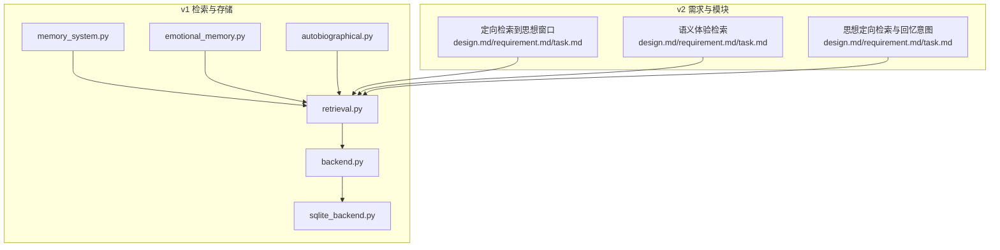
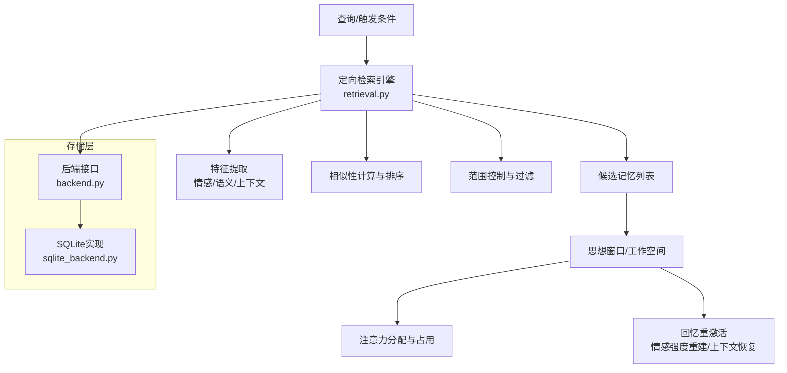
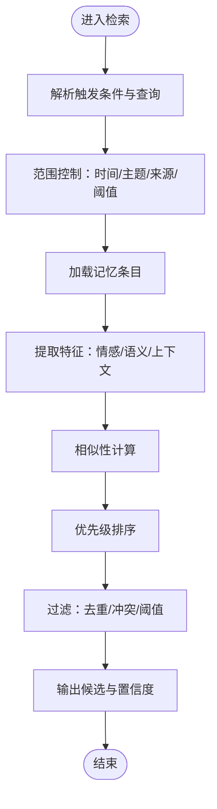
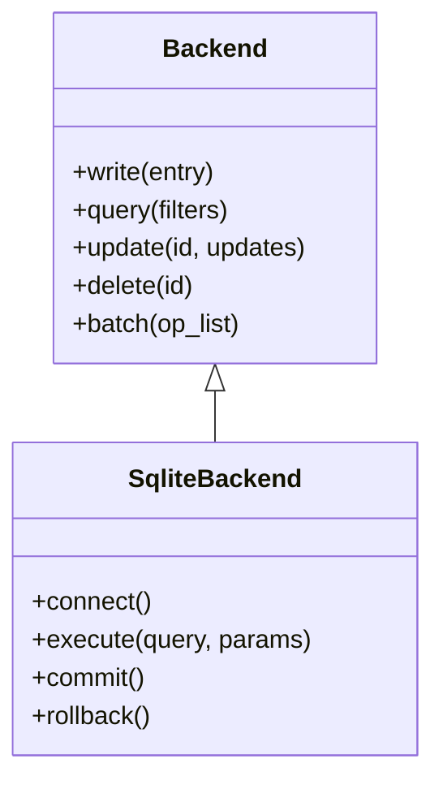
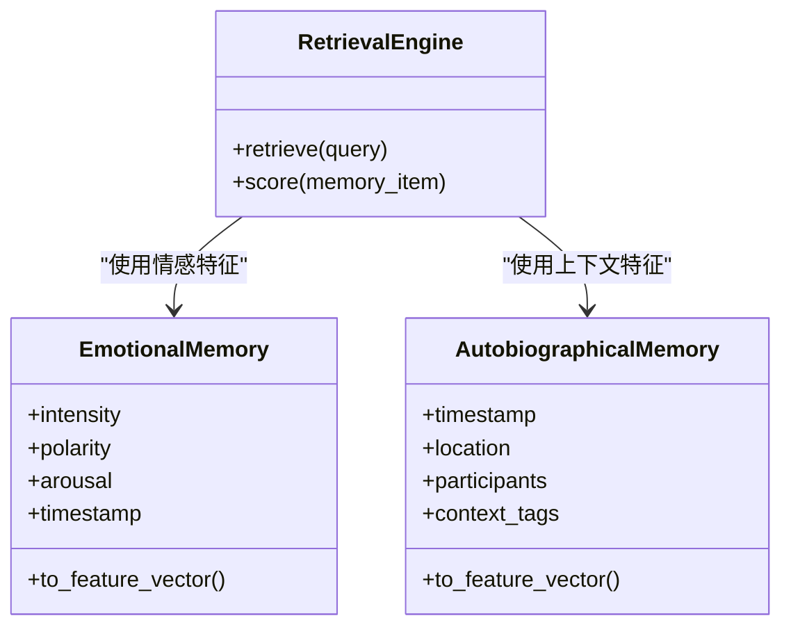
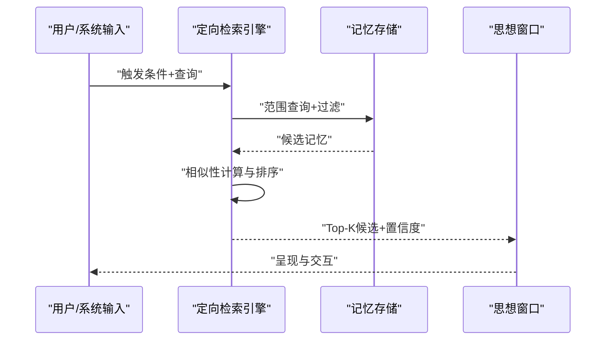
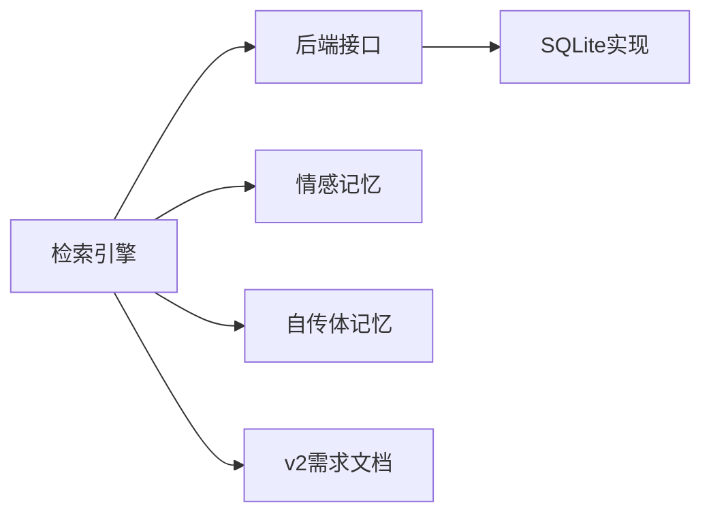
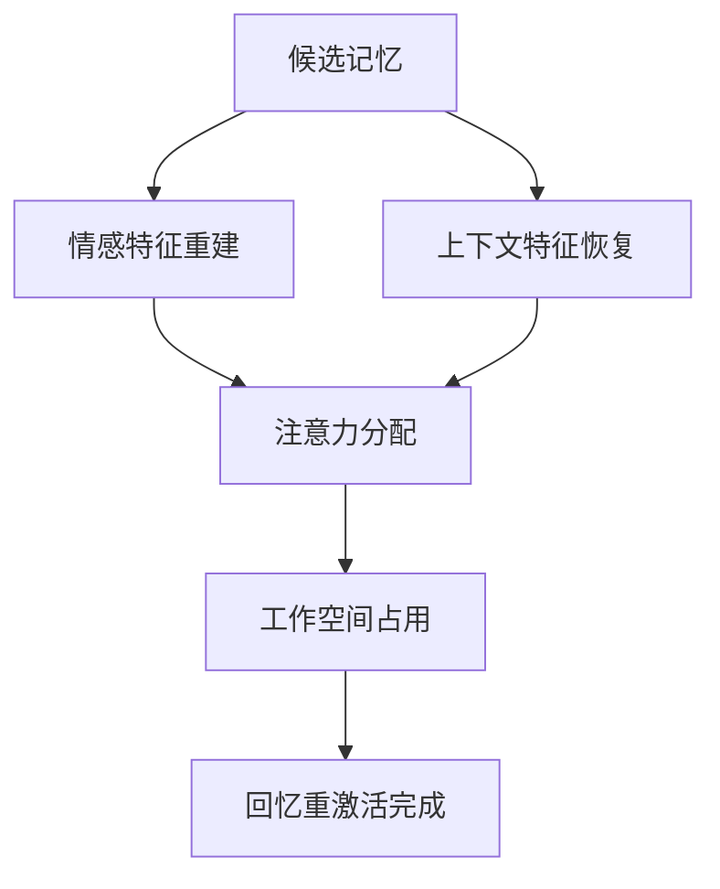

# 记忆检索

<cite>
**本文引用的文件**
- [retrieval.py](file://archive/helios_v1/memory/retrieval.py)
- [backend.py](file://archive/helios_v1/memory/backend.py)
- [sqlite_backend.py](file://archive/helios_v1/memory/sqlite_backend.py)
- [memory_system.py](file://archive/helios_v1/memory/memory_system.py)
- [emotional_memory.py](file://archive/helios_v1/memory/emotional_memory.py)
- [autobiographical.py](file://archive/helios_v1/memory/autobiographical.py)
- [test_memory_retrieval_contract.py](file://archive/helios_v1/tests/test_memory_retrieval_contract.py)
- [test_memory_backend.py](file://archive/helios_v1/tests/test_memory_backend.py)
- [test_memory_sqlite_backend.py](file://archive/helios_v1/tests/test_memory_sqlite_backend.py)
- [design.md（定向检索需求）](file://archive/helios_v1/docs/requirements/11-memory-tiering-and-directed-retrieval/design.md)
- [requirement.md（定向检索需求）](file://archive/helios_v1/docs/requirements/11-memory-tiering-and-directed-retrieval/requirement.md)
- [task.md（定向检索需求）](file://archive/helios_v1/docs/requirements/11-memory-tiering-and-directed-retrieval/task.md)
- [design.md（思想窗口内的定向检索）](file://helios_v2/docs/requirements/10-directed-retrieval-into-thought-window/design.md)
- [requirement.md（思想窗口内的定向检索）](file://helios_v2/docs/requirements/10-directed-retrieval-into-thought-window/requirement.md)
- [task.md（思想窗口内的定向检索）](file://helios_v2/docs/requirements/10-directed-retrieval-into-thought-window/task.md)
- [design.md（语义体验检索）](file://helios_v2/docs/requirements/34-semantic-experience-retrieval/design.md)
- [requirement.md（语义体验检索）](file://helios_v2/docs/requirements/34-semantic-experience-retrieval/requirement.md)
- [task.md（语义体验检索）](file://helios_v2/docs/requirements/34-semantic-experience-retrieval/task.md)
- [design.md（思想定向检索与回忆意图）](file://helios_v2/docs/requirements/49-thought-directed-retrieval-recall-intent/design.md)
- [requirement.md（思想定向检索与回忆意图）](file://helios_v2/docs/requirements/49-thought-directed-retrieval-recall-intent/requirement.md)
- [task.md（思想定向检索与回忆意图）](file://helios_v2/docs/requirements/49-thought-directed-retrieval-recall-intent/task.md)
</cite>

## 目录
1. [引言](#引言)
2. [项目结构](#项目结构)
3. [核心组件](#核心组件)
4. [架构总览](#架构总览)
5. [详细组件分析](#详细组件分析)
6. [依赖关系分析](#依赖关系分析)
7. [性能考虑](#性能考虑)
8. [故障排查指南](#故障排查指南)
9. [结论](#结论)
10. [附录](#附录)

## 引言
本技术文档围绕Helios记忆检索系统展开，聚焦于“定向检索”、“相似性计算”、“优先级排序”、“触发条件与范围控制”、“结果过滤”、“回忆重激活（情感强度重建与上下文恢复）”以及“注意力分配与工作空间占用”。文档同时给出基于情感、语义与混合的检索策略示例，并总结检索性能优化、缓存策略与并发访问控制要点，最后提供检索质量评估与置信度计算方法。

## 项目结构
Helios记忆检索体系由两代实现构成：v1（archive/helios_v1）与v2（helios_v2）。v1侧重基础检索与后端存储；v2在v1基础上扩展了“思想窗口内定向检索”“语义体验检索”“思想定向检索与回忆意图”等模块化能力。检索相关的关键文件如下：
- v1检索与存储：retrieval.py、backend.py、sqlite_backend.py、memory_system.py、emotional_memory.py、autobiographical.py
- v2检索相关需求文档：定向检索到思想窗口、语义体验检索、思想定向检索与回忆意图
- 测试用例：test_memory_retrieval_contract.py、test_memory_backend.py、test_memory_sqlite_backend.py

**图表来源**
- [retrieval.py](file://archive/helios_v1/memory/retrieval.py)
- [backend.py](file://archive/helios_v1/memory/backend.py)
- [sqlite_backend.py](file://archive/helios_v1/memory/sqlite_backend.py)
- [memory_system.py](file://archive/helios_v1/memory/memory_system.py)
- [emotional_memory.py](file://archive/helios_v1/memory/emotional_memory.py)
- [autobiographical.py](file://archive/helios_v1/memory/autobiographical.py)
- [design.md（定向检索需求）](file://archive/helios_v1/docs/requirements/11-memory-tiering-and-directed-retrieval/design.md)
- [design.md（思想窗口内的定向检索）](file://helios_v2/docs/requirements/10-directed-retrieval-into-thought-window/design.md)
- [design.md（语义体验检索）](file://helios_v2/docs/requirements/34-semantic-experience-retrieval/design.md)
- [design.md（思想定向检索与回忆意图）](file://helios_v2/docs/requirements/49-thought-directed-retrieval-recall-intent/design.md)

**章节来源**
- [retrieval.py](file://archive/helios_v1/memory/retrieval.py)
- [backend.py](file://archive/helios_v1/memory/backend.py)
- [sqlite_backend.py](file://archive/helios_v1/memory/sqlite_backend.py)
- [memory_system.py](file://archive/helios_v1/memory/memory_system.py)
- [emotional_memory.py](file://archive/helios_v1/memory/emotional_memory.py)
- [autobiographical.py](file://archive/helios_v1/memory/autobiographical.py)
- [design.md（定向检索需求）](file://archive/helios_v1/docs/requirements/11-memory-tiering-and-directed-retrieval/design.md)
- [design.md（思想窗口内的定向检索）](file://helios_v2/docs/requirements/10-directed-retrieval-into-thought-window/design.md)
- [design.md（语义体验检索）](file://helios_v2/docs/requirements/34-semantic-experience-retrieval/design.md)
- [design.md（思想定向检索与回忆意图）](file://helios_v2/docs/requirements/49-thought-directed-retrieval-recall-intent/design.md)

## 核心组件
- 检索引擎（v1）：负责相似性匹配、优先级排序、范围控制与过滤，输出候选记忆列表与置信度。
- 存储后端：抽象接口与SQLite实现，支撑持久化与快速查询。
- 情感记忆与自传体记忆：提供情感强度、上下文特征与时间维度信息，用于回忆重激活。
- v2需求文档：定义“定向检索到思想窗口”“语义体验检索”“思想定向检索与回忆意图”的目标与约束，指导检索策略设计。

**章节来源**
- [retrieval.py](file://archive/helios_v1/memory/retrieval.py)
- [backend.py](file://archive/helios_v1/memory/backend.py)
- [sqlite_backend.py](file://archive/helios_v1/memory/sqlite_backend.py)
- [memory_system.py](file://archive/helios_v1/memory/memory_system.py)
- [emotional_memory.py](file://archive/helios_v1/memory/emotional_memory.py)
- [autobiographical.py](file://archive/helios_v1/memory/autobiographical.py)
- [design.md（思想窗口内的定向检索）](file://helios_v2/docs/requirements/10-directed-retrieval-into-thought-window/design.md)
- [design.md（语义体验检索）](file://helios_v2/docs/requirements/34-semantic-experience-retrieval/design.md)
- [design.md（思想定向检索与回忆意图）](file://helios_v2/docs/requirements/49-thought-directed-retrieval-recall-intent/design.md)

## 架构总览
下图展示v1检索与v2需求对齐的整体架构：检索引擎从存储后端加载记忆，结合情感与自传体特征进行相似性计算与排序，最终将候选记忆送入思想窗口或工作空间，供后续认知处理使用。

**图表来源**
- [retrieval.py](file://archive/helios_v1/memory/retrieval.py)
- [backend.py](file://archive/helios_v1/memory/backend.py)
- [sqlite_backend.py](file://archive/helios_v1/memory/sqlite_backend.py)
- [design.md（定向检索需求）](file://archive/helios_v1/docs/requirements/11-memory-tiering-and-directed-retrieval/design.md)
- [design.md（思想窗口内的定向检索）](file://helios_v2/docs/requirements/10-directed-retrieval-into-thought-window/design.md)
- [design.md（语义体验检索）](file://helios_v2/docs/requirements/34-semantic-experience-retrieval/design.md)
- [design.md（思想定向检索与回忆意图）](file://helios_v2/docs/requirements/49-thought-directed-retrieval-recall-intent/design.md)

## 详细组件分析

### 组件A：检索引擎（v1）
- 职责
  - 接收查询与触发条件，确定检索范围与过滤规则
  - 从存储后端加载记忆条目，提取情感、语义与上下文特征
  - 执行相似性计算与优先级排序，生成候选集
  - 输出带置信度的候选记忆列表
- 关键流程
  - 触发条件解析：如情绪状态、任务目标、时间窗、来源通道等
  - 范围控制：按时间、主题、来源、强度阈值等限定搜索域
  - 过滤：去重、时效性、情感极性/强度阈值、冲突消除
  - 排序：加权融合相似性分数与情感强度、时间衰减因子、上下文契合度
  - 结果：返回Top-K候选及置信度

**图表来源**
- [retrieval.py](file://archive/helios_v1/memory/retrieval.py)

**章节来源**
- [retrieval.py](file://archive/helios_v1/memory/retrieval.py)

### 组件B：存储后端与SQLite实现
- 后端接口（backend.py）
  - 定义统一的存储契约：写入、查询、更新、删除、批量操作
  - 支持索引字段与元数据管理
- SQLite实现（sqlite_backend.py）
  - 基于SQLite的持久化与查询加速
  - 提供事务、并发控制与一致性保障
- 与检索的关系
  - 检索引擎通过后端接口访问底层存储，执行范围查询与特征提取

**图表来源**
- [backend.py](file://archive/helios_v1/memory/backend.py)
- [sqlite_backend.py](file://archive/helios_v1/memory/sqlite_backend.py)

**章节来源**
- [backend.py](file://archive/helios_v1/memory/backend.py)
- [sqlite_backend.py](file://archive/helios_v1/memory/sqlite_backend.py)

### 组件C：情感记忆与自传体记忆
- 情感记忆（emotional_memory.py）
  - 记录情感强度、极性、唤醒度等特征
  - 用于回忆时的情感强度重建与情绪一致性校验
- 自传体记忆（autobiographical.py）
  - 记录时间、地点、人物、事件、情境等上下文
  - 用于回忆时的上下文恢复与场景还原
- 与检索的关系
  - 检索引擎在相似性计算与排序中融合情感与上下文权重

**图表来源**
- [emotional_memory.py](file://archive/helios_v1/memory/emotional_memory.py)
- [autobiographical.py](file://archive/helios_v1/memory/autobiographical.py)
- [retrieval.py](file://archive/helios_v1/memory/retrieval.py)

**章节来源**
- [emotional_memory.py](file://archive/helios_v1/memory/emotional_memory.py)
- [autobiographical.py](file://archive/helios_v1/memory/autobiographical.py)
- [retrieval.py](file://archive/helios_v1/memory/retrieval.py)

### 组件D：v2需求驱动的检索策略
- 思想窗口内的定向检索（design.md/requirement.md/task.md）
  - 目标：将最相关的记忆引导至思想窗口，支持持续思考与决策
  - 约束：低延迟、高相关性、避免认知过载
- 语义体验检索（design.md/requirement.md/task.md）
  - 目标：从语义层面抽取经验模式与概念关联
  - 约束：语义一致性、跨模态整合、可解释性
- 思想定向检索与回忆意图（design.md/requirement.md/task.md）
  - 目标：根据当前意图与目标，主动召回相关记忆
  - 约束：意图对齐、情感适配、上下文连贯

**图表来源**
- [design.md（思想窗口内的定向检索）](file://helios_v2/docs/requirements/10-directed-retrieval-into-thought-window/design.md)
- [design.md（语义体验检索）](file://helios_v2/docs/requirements/34-semantic-experience-retrieval/design.md)
- [design.md（思想定向检索与回忆意图）](file://helios_v2/docs/requirements/49-thought-directed-retrieval-recall-intent/design.md)

**章节来源**
- [design.md（思想窗口内的定向检索）](file://helios_v2/docs/requirements/10-directed-retrieval-into-thought-window/design.md)
- [requirement.md（思想窗口内的定向检索）](file://helios_v2/docs/requirements/10-directed-retrieval-into-thought-window/requirement.md)
- [task.md（思想窗口内的定向检索）](file://helios_v2/docs/requirements/10-directed-retrieval-into-thought-window/task.md)
- [design.md（语义体验检索）](file://helios_v2/docs/requirements/34-semantic-experience-retrieval/design.md)
- [requirement.md（语义体验检索）](file://helios_v2/docs/requirements/34-semantic-experience-retrieval/requirement.md)
- [task.md（语义体验检索）](file://helios_v2/docs/requirements/34-semantic-experience-retrieval/task.md)
- [design.md（思想定向检索与回忆意图）](file://helios_v2/docs/requirements/49-thought-directed-retrieval-recall-intent/design.md)
- [requirement.md（思想定向检索与回忆意图）](file://helios_v2/docs/requirements/49-thought-directed-retrieval-recall-intent/requirement.md)
- [task.md（思想定向检索与回忆意图）](file://helios_v2/docs/requirements/49-thought-directed-retrieval-recall-intent/task.md)

## 依赖关系分析
- 检索引擎依赖存储后端接口，具体实现可替换为不同数据库
- 情感与自传体模块为检索提供特征向量，影响相似性与排序
- v2需求文档为检索策略提供目标与约束，指导参数配置与流程调整

**图表来源**
- [retrieval.py](file://archive/helios_v1/memory/retrieval.py)
- [backend.py](file://archive/helios_v1/memory/backend.py)
- [sqlite_backend.py](file://archive/helios_v1/memory/sqlite_backend.py)
- [emotional_memory.py](file://archive/helios_v1/memory/emotional_memory.py)
- [autobiographical.py](file://archive/helios_v1/memory/autobiographical.py)
- [design.md（思想窗口内的定向检索）](file://helios_v2/docs/requirements/10-directed-retrieval-into-thought-window/design.md)

**章节来源**
- [retrieval.py](file://archive/helios_v1/memory/retrieval.py)
- [backend.py](file://archive/helios_v1/memory/backend.py)
- [sqlite_backend.py](file://archive/helios_v1/memory/sqlite_backend.py)
- [emotional_memory.py](file://archive/helios_v1/memory/emotional_memory.py)
- [autobiographical.py](file://archive/helios_v1/memory/autobiographical.py)
- [design.md（思想窗口内的定向检索）](file://helios_v2/docs/requirements/10-directed-retrieval-into-thought-window/design.md)

## 性能考虑
- 相似性计算
  - 使用向量化特征与高效距离度量（如余弦距离），减少O(n^2)复杂度
  - 对候选集进行分桶/索引预筛选，缩小搜索空间
- 排序与过滤
  - 采用多路归并与堆排序，控制Top-K成本
  - 过滤阶段尽早剪枝，避免无效计算
- 缓存策略
  - 查询热点与候选集缓存，降低重复检索开销
  - 特征向量缓存与增量更新，减少特征提取频率
- 并发访问控制
  - 读写分离与乐观锁，保证高并发下的数据一致性
  - 分区/分片存储，提升吞吐与可扩展性
- 工作空间占用
  - 限制思想窗口/工作空间容量，按LFU/LRU淘汰策略释放资源
  - 注意力分配采用加权轮询或贪心选择，确保高价值记忆优先驻留

[本节为通用性能建议，不直接分析具体文件]

## 故障排查指南
- 测试覆盖点
  - 记忆检索契约测试：验证检索行为与期望一致
  - 存储后端测试：验证写入、查询、更新、删除的正确性
  - SQLite后端专项测试：验证事务、并发与一致性
- 常见问题定位
  - 候选集为空：检查触发条件、范围控制与过滤阈值
  - 相似性异常：核对特征提取逻辑与权重配置
  - 性能瓶颈：关注索引缺失、缓存未命中与排序算法复杂度
- 回归与验证
  - 使用测试用例驱动回归，确保变更不影响检索质量与稳定性

**章节来源**
- [test_memory_retrieval_contract.py](file://archive/helios_v1/tests/test_memory_retrieval_contract.py)
- [test_memory_backend.py](file://archive/helios_v1/tests/test_memory_backend.py)
- [test_memory_sqlite_backend.py](file://archive/helios_v1/tests/test_memory_sqlite_backend.py)

## 结论
Helios记忆检索系统以v1的检索引擎为核心，结合情感与自传体特征，实现了面向思想窗口的定向检索与回忆重激活。v2的需求文档进一步明确了检索策略目标与约束，指导在情感一致性、语义连贯性与意图对齐方面的优化方向。通过合理的相似性计算、优先级排序、范围控制与过滤机制，配合缓存与并发控制，系统可在保证质量的同时提升响应速度与稳定性。

[本节为总结性内容，不直接分析具体文件]

## 附录

### 检索策略示例
- 基于情感的检索
  - 触发条件：情绪波动阈值、唤醒度升高
  - 范围控制：近期时间窗、相似情绪极性的记忆
  - 过滤：去除与当前情境冲突的记忆
  - 排序：情感强度与时间衰减加权
- 基于语义的检索
  - 触发条件：任务目标关键词、概念关联
  - 范围控制：主题相关标签、来源渠道
  - 过滤：去重与时效性
  - 排序：语义相似度与上下文契合度
- 混合检索
  - 触发条件：综合情感与语义信号
  - 范围控制：双通道交叉限定
  - 过滤：冲突与噪声过滤
  - 排序：情感权重×语义权重的加权融合

[本节为策略示例，不直接分析具体文件]

### 回忆重激活流程
- 情感强度重建
  - 依据情感记忆模块的强度与极性，重建回忆时的情绪强度曲线
- 上下文恢复
  - 依据自传体记忆的时间、地点、人物与情境标签，拼接回忆场景
- 注意力分配与工作空间占用
  - 将高置信度候选引入思想窗口，按重要性与新颖性分配注意力份额

[本图为概念流程，不直接映射具体源码文件]