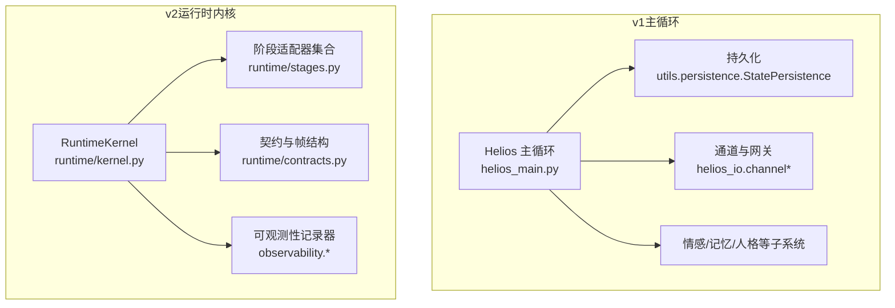
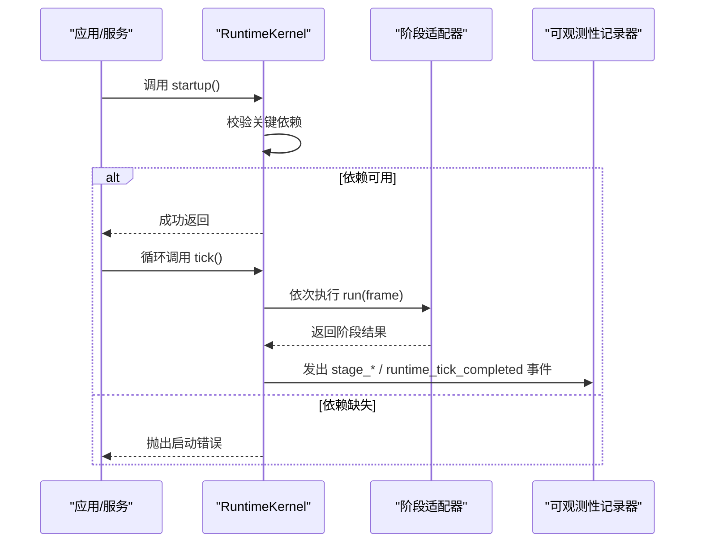
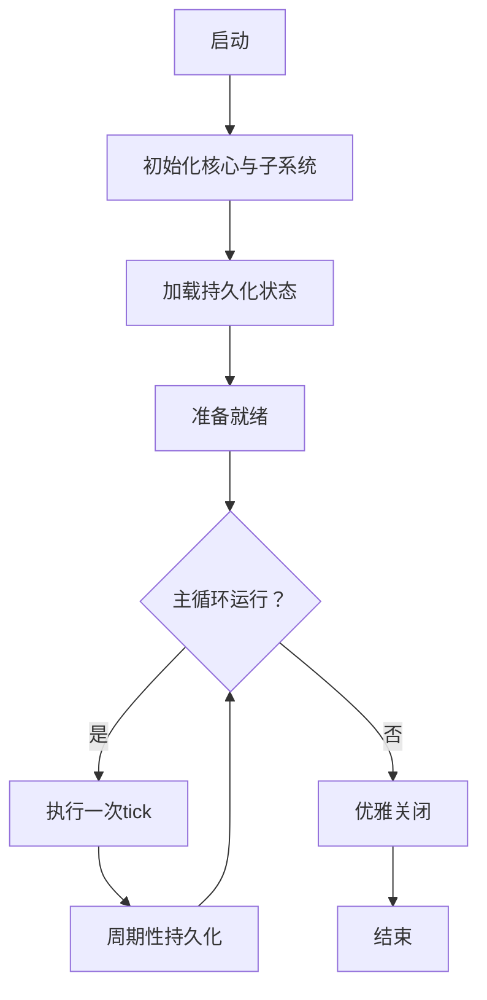
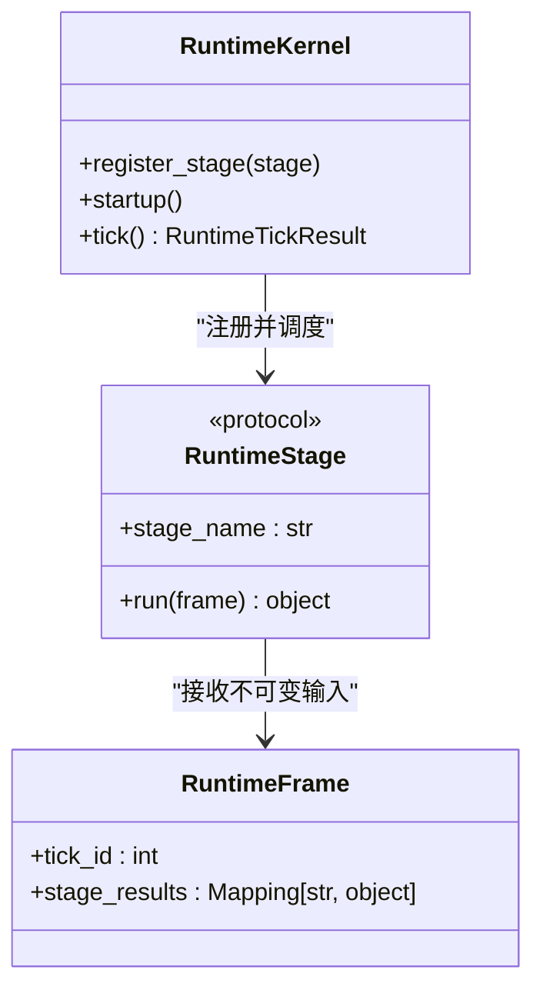
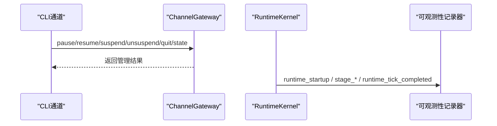
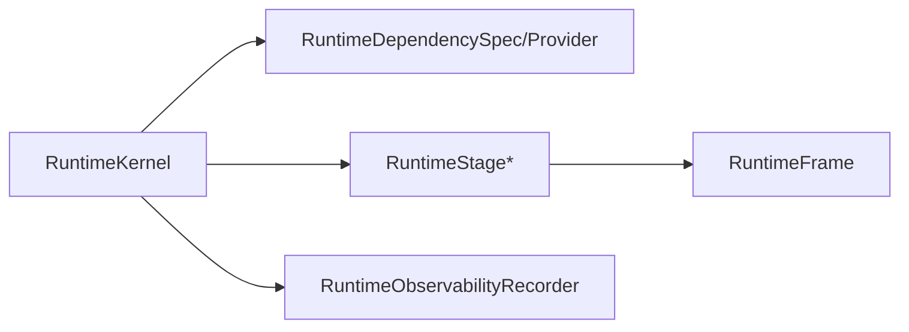

# 生命周期管理

<cite>
**本文引用的文件**
- [helios_main.py](file://archive/helios_v1/helios_main.py)
- [kernel.py](file://helios_v2/src/helios_v2/runtime/kernel.py)
- [stages.py](file://helios_v2/src/helios_v2/runtime/stages.py)
- [contracts.py](file://helios_v2/src/helios_v2/runtime/contracts.py)
- [requirement.md](file://helios_v2/docs/requirements/01-runtime-kernel/requirement.md)
- [design.md](file://helios_v2/docs/requirements/21-unified-runtime-observability-and-logging/design.md)
- [requirement.md](file://helios_v2/docs/requirements/21-unified-runtime-observability-and-logging/requirement.md)
- [test_runtime_kernel_observability.py](file://helios_v2/tests/test_runtime_kernel_observability.py)
- [cli_channel.py](file://archive/helios_v1/helios_io/channels/cli_channel.py)
- [channel.py](file://archive/helios_v1/helios_io/channel.py)
</cite>

## 目录
1. [引言](#引言)
2. [项目结构](#项目结构)
3. [核心组件](#核心组件)
4. [架构总览](#架构总览)
5. [详细组件分析](#详细组件分析)
6. [依赖分析](#依赖分析)
7. [性能考虑](#性能考虑)
8. [故障排查指南](#故障排查指南)
9. [结论](#结论)
10. [附录](#附录)

## 引言
本文件面向Helios生命周期管理系统，系统性阐述v1主循环与v2内核在启动、运行、暂停、恢复、终止等全生命周期阶段的行为与机制。重点覆盖：
- 生命周期事件处理机制与状态转换逻辑
- 启动参数配置与运行时监控
- 异常处理与优雅关闭机制
- 持久化策略与最佳实践
- 自定义生命周期钩子与故障恢复方法
- 与持久化系统的集成方式

## 项目结构
Helios分为v1与v2两个版本：
- v1（archive/helios_v1）：以“主循环”为核心，包含情感引擎、记忆系统、通道网关、行为执行器等模块，通过Helios类统一编排；支持CLI命令控制（pause/resume/suspend/unsuspend/quit/state），并内置StatePersistence进行周期性持久化。
- v2（helios_v2）：引入“运行时内核”（RuntimeKernel）作为生命周期编排中心，强调“启动依赖门禁”“有序阶段调度”“不可降级执行”，并通过可选的可观测性记录器输出结构化事件。

图表来源
- [helios_main.py:192-448](file://archive/helios_v1/helios_main.py#L192-L448)
- [kernel.py:28-145](file://helios_v2/src/helios_v2/runtime/kernel.py#L28-L145)
- [stages.py:1-200](file://helios_v2/src/helios_v2/runtime/stages.py#L1-L200)
- [contracts.py:8-50](file://helios_v2/src/helios_v2/runtime/contracts.py#L8-L50)

章节来源
- [helios_main.py:123-448](file://archive/helios_v1/helios_main.py#L123-L448)
- [kernel.py:28-145](file://helios_v2/src/helios_v2/runtime/kernel.py#L28-L145)
- [stages.py:1-200](file://helios_v2/src/helios_v2/runtime/stages.py#L1-L200)
- [contracts.py:8-50](file://helios_v2/src/helios_v2/runtime/contracts.py#L8-L50)

## 核心组件
- v1主循环（Helios）
  - 负责系统初始化、依赖注入、事件源注册、通道与网关装配、行为执行与反馈记录、周期性持久化等。
  - 支持CLI命令：pause/resume/suspend/unsuspend/quit/state，用于运行时控制。
  - 提供StatePersistence进行身份、人格、allostasis与记忆系统的周期性保存。
- v2运行时内核（RuntimeKernel）
  - 启动前执行“关键依赖门禁”，失败即显式中止。
  - 顺序调度已注册阶段，产出每tick的结构化结果，并通过可观测性记录器发出事件。
  - 阶段适配器封装各owner的生命周期契约，确保单一职责与边界清晰。
- 契约与帧（RuntimeFrame/RuntimeStage）
  - RuntimeFrame提供不可变输入上下文（tick_id、上一阶段结果映射）。
  - RuntimeStage定义阶段契约：稳定名称与run方法，内核按序调用。

章节来源
- [helios_main.py:192-448](file://archive/helios_v1/helios_main.py#L192-L448)
- [kernel.py:28-145](file://helios_v2/src/helios_v2/runtime/kernel.py#L28-L145)
- [contracts.py:30-50](file://helios_v2/src/helios_v2/runtime/contracts.py#L30-L50)

## 架构总览
v1采用“主循环+子系统”的集中式编排；v2采用“内核+阶段适配器”的分层编排，内核仅负责生命周期与依赖门禁，其余功能由各owner实现。

图表来源
- [kernel.py:46-145](file://helios_v2/src/helios_v2/runtime/kernel.py#L46-L145)
- [stages.py:1-200](file://helios_v2/src/helios_v2/runtime/stages.py#L1-L200)

章节来源
- [kernel.py:46-145](file://helios_v2/src/helios_v2/runtime/kernel.py#L46-L145)
- [stages.py:1-200](file://helios_v2/src/helios_v2/runtime/stages.py#L1-L200)

## 详细组件分析

### v1 生命周期：启动、运行、暂停/恢复、终止
- 启动
  - 初始化日志、核心引擎、可选模块、记忆系统、通道与网关、行为执行器与规划器等。
  - 从持久化加载身份、人格、allostasis与记忆状态；导入种子记忆清单。
- 运行
  - 主循环按tick推进，驱动情感引擎、意识测量、心境/人格/异稳态更新、内部思考、记忆巩固与表达意愿检查。
  - 通过TickGuard保护单tick异常，避免崩溃。
- 暂停/恢复
  - CLI通道支持pause/resume操作，切换内部状态并在连接状态与暂停状态间流转。
- 终止
  - CLI命令quit触发关闭请求，结合信号处理与优雅关闭流程（见后文“优雅关闭机制”）。

图表来源
- [helios_main.py:192-448](file://archive/helios_v1/helios_main.py#L192-L448)
- [cli_channel.py:312-332](file://archive/helios_v1/helios_io/channels/cli_channel.py#L312-L332)
- [cli_channel.py:378-415](file://archive/helios_v1/helios_io/channels/cli_channel.py#L378-L415)

章节来源
- [helios_main.py:192-448](file://archive/helios_v1/helios_main.py#L192-L448)
- [cli_channel.py:312-332](file://archive/helios_v1/helios_io/channels/cli_channel.py#L312-L332)
- [cli_channel.py:378-415](file://archive/helios_v1/helios_io/channels/cli_channel.py#L378-L415)

### v2 生命周期：内核与阶段
- 启动依赖门禁
  - 在startup中校验所有声明的关键依赖，若缺失则记录“runtime_startup_failed”事件并抛出错误。
- 阶段调度
  - tick按注册顺序执行各阶段，为每个阶段发出“stage_started/failed/completed”事件，最后发出“runtime_tick_completed”事件。
- 不可降级执行
  - v2需求明确要求不嵌入降级路径或替代策略，任何关键阶段不变量破坏均中止执行。

图表来源
- [kernel.py:28-145](file://helios_v2/src/helios_v2/runtime/kernel.py#L28-L145)
- [contracts.py:30-50](file://helios_v2/src/helios_v2/runtime/contracts.py#L30-L50)

章节来源
- [kernel.py:46-145](file://helios_v2/src/helios_v2/runtime/kernel.py#L46-L145)
- [requirement.md:15-27](file://helios_v2/docs/requirements/01-runtime-kernel/requirement.md#L15-L27)

### 生命周期事件处理机制与状态转换
- v1（CLI命令）
  - pause/resume：切换内部_paused标志与状态枚举；CONNECTED与PAUSED之间互转。
  - suspend/unsuspend：记录前置状态，进入SUSPENDED；恢复时依据前置状态与可用性回退到CONNECTED/INITIALIZED。
  - quit：请求关闭，触发退出流程。
- v2（可观测性）
  - 内核在startup/tick/阶段执行期间发出结构化事件，包括严重级别、事件类型、tick_id、阶段名、耗时与错误信息等，便于统一观测与回放。

图表来源
- [cli_channel.py:268-285](file://archive/helios_v1/helios_io/channels/cli_channel.py#L268-L285)
- [cli_channel.py:312-332](file://archive/helios_v1/helios_io/channels/cli_channel.py#L312-L332)
- [kernel.py:46-145](file://helios_v2/src/helios_v2/runtime/kernel.py#L46-L145)
- [design.md:1-22](file://helios_v2/docs/requirements/21-unified-runtime-observability-and-logging/design.md#L1-L22)

章节来源
- [cli_channel.py:268-285](file://archive/helios_v1/helios_io/channels/cli_channel.py#L268-L285)
- [cli_channel.py:312-332](file://archive/helios_v1/helios_io/channels/cli_channel.py#L312-L332)
- [kernel.py:46-145](file://helios_v2/src/helios_v2/runtime/kernel.py#L46-L145)
- [design.md:1-22](file://helios_v2/docs/requirements/21-unified-runtime-observability-and-logging/design.md#L1-L22)

### 启动参数配置
- v1（环境变量）
  - 运行参数：HELIOS_TICK_INTERVAL、HELIOS_SUMMARY_INTERVAL、HELIOS_LOG_LEVEL、HELIOS_LOG_DIR、HELIOS_DATA_DIR、HELIOS_LLM_*、HELIOS_QQ_*、HELIOS_CLI_*、HELIOS_TTS_ENABLED、HELIOS_STT_ENABLED、HELIOS_VISION_ENABLED、HELIOS_OPTIONAL_CHANNEL_BOOTSTRAP_IDS等。
  - 内部思考相关：HELIOS_INTERNAL_THINK_*（启用、阈值、间隔、资源上限）。
- v2（契约式依赖声明）
  - 通过RuntimeDependencySpec/RuntimeDependencyProvider声明关键依赖与可用性检查接口，内核在startup阶段统一校验。

章节来源
- [helios_main.py:123-186](file://archive/helios_v1/helios_main.py#L123-L186)
- [contracts.py:17-23](file://helios_v2/src/helios_v2/runtime/contracts.py#L17-L23)

### 运行时监控
- v1
  - 日志：文件与控制台双通道，安全编码处理；周期性持久化日志。
  - 持久化：StatePersistence定期保存身份、人格、allostasis与记忆系统状态。
- v2
  - 观测性：RuntimeObservabilityRecorder统一发出结构化事件，支持内存与流式JSON Sink，事件包含严重级别、事件类型、tick_id、阶段名、耗时、错误类型等，保证多阶段时序可重建。

章节来源
- [helios_main.py:528-581](file://archive/helios_v1/helios_main.py#L528-L581)
- [helios_main.py:643-663](file://archive/helios_v1/helios_main.py#L643-L663)
- [requirement.md:86-98](file://helios_v2/docs/requirements/21-unified-runtime-observability-and-logging/requirement.md#L86-L98)

### 异常处理与优雅关闭机制
- v1
  - TickGuard保护单tick异常，避免崩溃；日志记录警告并继续运行。
  - CLI quit命令触发关闭请求；结合信号处理与清理流程实现优雅关闭。
- v2
  - 阶段run异常直接记录“stage_failed”事件并抛出，内核不吞异常；启动阶段缺失关键依赖直接抛出启动错误。
  - 通过可观测性事件可定位失败阶段与耗时，便于快速诊断与恢复。

章节来源
- [helios_main.py:430-432](file://archive/helios_v1/helios_main.py#L430-L432)
- [cli_channel.py:397-406](file://archive/helios_v1/helios_io/channels/cli_channel.py#L397-L406)
- [kernel.py:102-118](file://helios_v2/src/helios_v2/runtime/kernel.py#L102-L118)

### 持久化策略与最佳实践
- v1
  - 启动时从磁盘加载身份、人格、allostasis与记忆系统状态；周期性保存上述状态。
  - 种子记忆导入与去重：基于清单指纹避免重复导入。
- v2
  - 通过RuntimeKernel与阶段适配器的有序执行，结合可观测性事件，建议在关键阶段（如体验写回、身份治理、计划桥接）完成后进行持久化，确保一致性与可恢复性。

章节来源
- [helios_main.py:586-635](file://archive/helios_v1/helios_main.py#L586-L635)
- [helios_main.py:686-771](file://archive/helios_v1/helios_main.py#L686-L771)
- [stages.py:495-502](file://helios_v2/src/helios_v2/runtime/stages.py#L495-L502)

### 自定义生命周期钩子与故障恢复
- 自定义生命周期钩子（v2）
  - 通过实现RuntimeStage协议的run方法，将自定义逻辑封装为阶段，注册到RuntimeKernel。
  - 使用RuntimeFrame获取tick_id与上一阶段结果，实现跨阶段数据传递。
- 故障恢复
  - v1：CLI命令（pause/resume/suspend/unsuspend）用于运行时控制；持久化保障重启后状态恢复。
  - v2：通过可观测性事件定位失败阶段与耗时，结合阶段适配器的“无降级”设计，修复问题后重新启动内核。

章节来源
- [contracts.py:41-50](file://helios_v2/src/helios_v2/runtime/contracts.py#L41-L50)
- [kernel.py:38-44](file://helios_v2/src/helios_v2/runtime/kernel.py#L38-L44)
- [cli_channel.py:312-332](file://archive/helios_v1/helios_io/channels/cli_channel.py#L312-L332)

## 依赖分析
- v1
  - Helios类依赖情感引擎、记忆系统、通道网关、行为执行器、规划器、反馈记录器等；持久化贯穿启动加载与周期保存。
- v2
  - RuntimeKernel依赖RuntimeDependencySpec/RuntimeDependencyProvider进行启动门禁；依赖RuntimeStage列表进行有序调度；可选依赖RuntimeObservabilityRecorder进行事件记录。

图表来源
- [kernel.py:32-36](file://helios_v2/src/helios_v2/runtime/kernel.py#L32-L36)
- [contracts.py:17-23](file://helios_v2/src/helios_v2/runtime/contracts.py#L17-L23)
- [contracts.py:41-50](file://helios_v2/src/helios_v2/runtime/contracts.py#L41-L50)

章节来源
- [kernel.py:32-36](file://helios_v2/src/helios_v2/runtime/kernel.py#L32-L36)
- [contracts.py:17-23](file://helios_v2/src/helios_v2/runtime/contracts.py#L17-L23)
- [contracts.py:41-50](file://helios_v2/src/helios_v2/runtime/contracts.py#L41-L50)

## 性能考虑
- v1
  - 单tick异常保护（TickGuard）避免崩溃；日志输出需注意编码兼容与频率控制。
  - 周期性持久化应避开高峰时段，减少对主循环的影响。
- v2
  - 通过可观测性事件统计阶段耗时，识别瓶颈；阶段顺序固定，避免动态路由带来的额外开销。
  - 关键依赖门禁在startup阶段一次性完成，避免运行时反复检查。

## 故障排查指南
- 启动失败
  - v2：查看“runtime_startup_failed”事件，确认缺失的关键依赖列表。
  - v1：检查环境变量与外部服务可用性，关注日志中的警告与异常堆栈。
- 运行时异常
  - v2：定位“stage_failed”事件，获取阶段名、错误类型与耗时，针对性修复。
  - v1：利用日志与持久化状态，结合CLI命令（pause/resume/suspend/unsuspend）进行临时隔离与恢复。
- 优雅关闭
  - v1：通过CLI quit或信号处理触发；确保在退出前完成必要的持久化与资源释放。
  - v2：内核不吞异常，建议在上层捕获并记录后进行资源回收与退出。

章节来源
- [kernel.py:56-65](file://helios_v2/src/helios_v2/runtime/kernel.py#L56-L65)
- [kernel.py:102-118](file://helios_v2/src/helios_v2/runtime/kernel.py#L102-L118)
- [cli_channel.py:397-406](file://archive/helios_v1/helios_io/channels/cli_channel.py#L397-L406)

## 结论
- v1提供了完整的主循环生命周期与运行时控制能力，适合快速迭代与调试；v2通过内核与阶段解耦，强化了启动门禁与可观测性，更适合长期演进与生产部署。
- 建议在v2中优先采用阶段化扩展与可观测性事件进行故障定位与恢复，同时结合持久化策略确保状态一致性与可恢复性。

## 附录
- 测试参考
  - v2可观测性测试：验证内核在不同阶段与失败场景下的事件发射行为，确保最小严重级别阈值与事件序列正确性。

章节来源
- [test_runtime_kernel_observability.py:1-49](file://helios_v2/tests/test_runtime_kernel_observability.py#L1-L49)