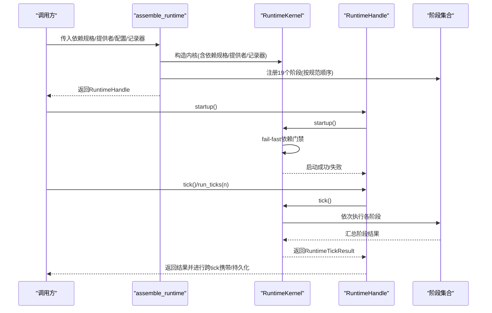
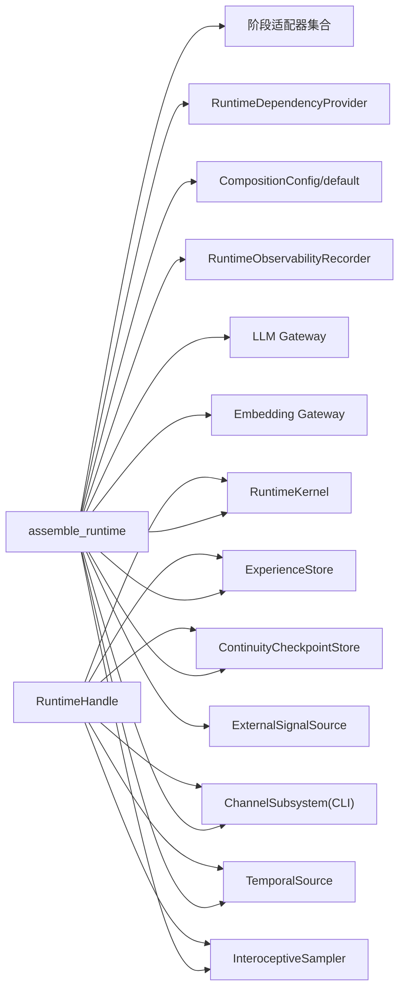

# 运行时API

<cite>
**本文引用的文件**
- [runtime_assembly.py](file://helios_v2/src/helios_v2/composition/runtime_assembly.py)
- [contracts.py](file://helios_v2/src/helios_v2/runtime/contracts.py)
- [kernel.py](file://helios_v2/src/helios_v2/runtime/kernel.py)
- [stages.py](file://helios_v2/src/helios_v2/runtime/stages.py)
- [design.md](file://helios_v2/docs/requirements/22-runtime-composition-root-and-runnable-runtime/design.md)
- [requirement.md](file://helios_v2/docs/requirements/22-runtime-composition-root-and-runnable-runtime/requirement.md)
- [task.md](file://helios_v2/docs/requirements/22-runtime-composition-root-and-runnable-runtime/task.md)
- [requirement.md](file://helios_v2/docs/requirements/01-runtime-kernel/requirement.md)
- [requirement.md](file://helios_v2/docs/requirements/58-runtime-profile-capability-bundle/requirement.md)
- [contracts.py](file://helios_v2/src/helios_v2/interoception/contracts.py)
- [design.md](file://helios_v2/docs/requirements/50-runtime-interoceptive-source/design.md)
- [__init__.py](file://helios_v2/src/helios_v2/__init__.py)
</cite>

## 目录
1. [简介](#简介)
2. [项目结构](#项目结构)
3. [核心组件](#核心组件)
4. [架构总览](#架构总览)
5. [详细组件分析](#详细组件分析)
6. [依赖分析](#依赖分析)
7. [性能考量](#性能考量)
8. [故障排查指南](#故障排查指南)
9. [结论](#结论)
10. [附录：API参考与示例](#附录api参考与示例)

## 简介
本文件为 Helios v2 运行时API的权威参考，聚焦以下目标：
- 全面说明 RuntimeHandle 接口的所有公共方法、参数规范与返回值格式
- 详解 assemble_runtime() 的装配流程、配置项与最佳实践
- 解释 tick()、run_ticks() 等核心方法的调用方式、行为与性能要点
- 提供错误码与异常类型清单、异常处理机制与调试技巧
- 给出常见使用场景与高级配置示例，涵盖集成模式与可观察性
- 说明API版本兼容性与迁移路径

## 项目结构
Helios v2 将运行时内核与装配逻辑解耦，形成“内核 + 装配器 + 句柄”的清晰分层：
- 内核（RuntimeKernel）：负责启动门禁、阶段注册与有序调度
- 装配器（assemble_runtime）：构建所有子系统、桥接与内核，并校验阶段顺序
- 句柄（RuntimeHandle）：对外暴露生命周期控制与跨tick状态携带能力

```mermaid
graph TB
subgraph "运行时内核"
K["RuntimeKernel<br/>启动门禁/阶段调度"]
end
subgraph "装配器"
A["assemble_runtime<br/>装配与校验"]
end
subgraph "句柄"
H["RuntimeHandle<br/>startup/tick/run_ticks"]
end
subgraph "阶段适配器"
S1["SensoryIngress"]
S2["RapidSalienceAppraisal"]
S3["NeuromodulatorSystem"]
S4["InteroceptiveFeelingLayer"]
S5["MemoryAffectReplay"]
S6["WorkspaceCompetition"]
S7["ReportableConsciousContent"]
S8["ThoughtGating"]
S9["DirectedRetrieval"]
S10["EmbodiedPrompt"]
S11["OutwardExpression"]
S12["OutwardExpressionExternalization"]
S13["InternalThought"]
S14["ActionExternalization"]
S15["PlannerBridge"]
S16["IdentityGovernance"]
S17["ExperienceWriteback"]
S18["Autonomy"]
S19["Evaluation"]
end
A --> K
A --> S1
A --> S2
A --> S3
A --> S4
A --> S5
A --> S6
A --> S7
A --> S8
A --> S9
A --> S10
A --> S11
A --> S12
A --> S13
A --> S14
A --> S15
A --> S16
A --> S17
A --> S18
A --> S19
H --> K
K --> S1
K --> S2
K --> S3
K --> S4
K --> S5
K --> S6
K --> S7
K --> S8
K --> S9
K --> S10
K --> S11
K --> S12
K --> S13
K --> S14
K --> S15
K --> S16
K --> S17
K --> S18
K --> S19
```

图表来源
- [runtime_assembly.py:222-273](file://helios_v2/src/helios_v2/composition/runtime_assembly.py#L222-L273)
- [kernel.py:28-45](file://helios_v2/src/helios_v2/runtime/kernel.py#L28-L45)

章节来源
- [design.md:133-211](file://helios_v2/docs/requirements/22-runtime-composition-root-and-runnable-runtime/design.md#L133-L211)
- [requirement.md:34-43](file://helios_v2/docs/requirements/22-runtime-composition-root-and-runnable-runtime/requirement.md#L34-L43)

## 核心组件
- RuntimeKernel：负责启动门禁、阶段注册、逐阶段执行与可观测性事件记录
- RuntimeHandle：封装内核与入口边界，提供 startup、tick、run_ticks；并负责跨tick状态携带与持久化
- assemble_runtime：装配入口，接受依赖规格、提供者、配置与可选记录器，构建完整运行时并进行阶段顺序校验
- RuntimeTickResult：单次tick的不可变结果快照，包含 tick_id 与各阶段输出映射
- RuntimeFrame：传递给每个阶段的只读输入契约，包含当前 tick_id 与上一阶段结果映射
- RuntimeStage：阶段生命周期契约，要求稳定 stage_name 与 run(frame) 方法
- RuntimeDependencyProvider/RuntimeDependencyStatus：关键依赖可用性检查与报告
- RuntimeProfile：能力束与跨能力规则验证，导出派生能力标志（如语义记忆是否启用）

章节来源
- [kernel.py:17-144](file://helios_v2/src/helios_v2/runtime/kernel.py#L17-L144)
- [contracts.py:8-50](file://helios_v2/src/helios_v2/runtime/contracts.py#L8-L50)
- [runtime_assembly.py:556-860](file://helios_v2/src/helios_v2/composition/runtime_assembly.py#L556-L860)
- [runtime_assembly.py:889-956](file://helios_v2/src/helios_v2/composition/runtime_assembly.py#L889-L956)
- [requirement.md:13-27](file://helios_v2/docs/requirements/01-runtime-kernel/requirement.md#L13-L27)

## 架构总览
下图展示从装配到执行的关键交互：

图表来源
- [runtime_assembly.py:997-1054](file://helios_v2/src/helios_v2/composition/runtime_assembly.py#L997-L1054)
- [kernel.py:46-144](file://helios_v2/src/helios_v2/runtime/kernel.py#L46-L144)
- [design.md:133-211](file://helios_v2/docs/requirements/22-runtime-composition-root-and-r runnable-runtime/design.md#L133-L211)

## 详细组件分析

### RuntimeHandle 接口
- startup() -> None
  - 行为：先执行 fail-fast 启动门禁，再从检查点恢复连续性（若启用）
  - 异常：当关键依赖缺失时抛出启动错误；记录器存在时会发出相应事件
- tick() -> RuntimeTickResult
  - 行为：执行一次完整tick，收集各阶段输出，进行跨tick状态携带与持久化
  - 返回：包含 tick_id 与阶段结果映射的不可变对象
- run_ticks(n: int) -> tuple[RuntimeTickResult, ...]
  - 行为：顺序执行 n 次 tick 并返回有序结果
  - 参数：n 必须为正整数，否则抛出参数错误
  - 返回：长度为 n 的元组
- ingress：暴露感输入边界，驱动仅能通过该入口注入每tick原始信号
- 其他可选能力持有器（在启用对应功能时可用）：时间源、通道子系统、经验存储、记忆桥接、前序思考召回持有器、驱动紧迫度持有器、嵌入回调、检查点与桥接器等

章节来源
- [runtime_assembly.py:594-651](file://helios_v2/src/helios_v2/composition/runtime_assembly.py#L594-L651)
- [runtime_assembly.py:842-860](file://helios_v2/src/helios_v2/composition/runtime_assembly.py#L842-L860)
- [design.md:133-139](file://helios_v2/docs/requirements/22-runtime-composition-root-and-runnable-runtime/design.md#L133-L139)

### RuntimeKernel 执行模型
- register_stage(stage: RuntimeStage)：按 stage_name 去重注册，重复则抛出值错误
- startup()：执行 fail-fast 依赖门禁；成功/失败分别记录生命周期事件
- tick()：按注册顺序执行各阶段，记录每个阶段开始/完成/失败事件，最后记录本次tick完成事件；返回 RuntimeTickResult

章节来源
- [kernel.py:38-144](file://helios_v2/src/helios_v2/runtime/kernel.py#L38-L144)

### RuntimeTickResult 与 RuntimeFrame
- RuntimeTickResult：包含 tick_id 与阶段结果映射（冻结视图），用于下游阶段读取
- RuntimeFrame：包含当前 tick_id 与上一阶段结果映射（冻结视图），作为阶段输入

章节来源
- [kernel.py:17-26](file://helios_v2/src/helios_v2/runtime/kernel.py#L17-L26)
- [contracts.py:30-39](file://helios_v2/src/helios_v2/runtime/contracts.py#L30-L39)

### 阶段契约与阶段结果
- RuntimeStage：要求提供稳定 stage_name 与 run(frame: RuntimeFrame) -> object
- 十九个阶段适配器各自定义阶段结果数据类，统一由 RuntimeHandle 在 tick 后进行跨tick携带与持久化

章节来源
- [contracts.py:41-50](file://helios_v2/src/helios_v2/runtime/contracts.py#L41-L50)
- [stages.py:172-523](file://helios_v2/src/helios_v2/runtime/stages.py#L172-L523)

### assemble_runtime() 函数
- 输入参数（支持两种传参方式）：
  - 显式 RuntimeProfile 或若干松散关键字参数（二者不可同时使用）
  - 关键字参数包括：dependency_specs、dependency_provider、config、recorder、gateway、deterministic_thought、channel_cli、cli_output_sink、experience_store、embedding_gateway、embedding_profile_name、continuity_checkpoint、interoceptive_sampler、temporal_source、external_signal_source
- 行为：
  - 解析 RuntimeProfile，合并松散参数并进行交叉能力规则校验
  - 构建 SensoryIngress、各子系统引擎与桥接、内核与阶段
  - 注册19个阶段并校验顺序一致性，不一致则抛出组合错误
  - 返回 RuntimeHandle
- 关键能力开关：
  - 语义记忆：需同时具备经验存储与嵌入网关，否则组合错误
  - 外部信号源与CLI通道互斥
  - 离线确定性思维：关闭LLM依赖，适合离线测试

章节来源
- [runtime_assembly.py:997-1054](file://helios_v2/src/helios_v2/composition/runtime_assembly.py#L997-L1054)
- [runtime_assembly.py:958-994](file://helios_v2/src/helios_v2/composition/runtime_assembly.py#L958-L994)
- [runtime_assembly.py:1197-1198](file://helios_v2/src/helios_v2/composition/runtime_assembly.py#L1197-L1198)
- [requirement.md:32-39](file://helios_v2/docs/requirements/58-runtime-profile-capability-bundle/requirement.md#L32-L39)

### 跨tick状态携带与持久化
- 时间线视图携带：当启用记录器且可读内存sink存在时，tick后重建上一tick时间线视图并携带至下一tick
- 结论声明携带：从评估阶段提取长程诊断中的“后果声明”并携带
- 思维回溯指令携带：从内部思维阶段提取记忆交接并在下一tick定向检索
- 时间源推进：根据思考闸决策推进“已休息时间”
- 驱动紧迫度携带：从自主性阶段投影“外向驱动”并携带
- 经验与记忆持久化：写回体验记录与影响记忆候选，支持嵌入写入
- 连续性检查点：保存最新跨tick连续性快照

章节来源
- [runtime_assembly.py:653-841](file://helios_v2/src/helios_v2/composition/runtime_assembly.py#L653-L841)

### 可观察性与日志
- 默认情况下不注入记录器时，运行时行为与裸内核一致
- 注入记录器后，内核与阶段发出生命周期与阶段事件，支持JSON-line输出
- 设计要求中强调“仅通过21号可观测性拥有者发出日志”，避免任意位置的临时日志

章节来源
- [design.md:133-139](file://helios_v2/docs/requirements/22-runtime-composition-root-and-runnable-runtime/design.md#L133-L139)
- [task.md:97-102](file://helios_v2/docs/requirements/22-runtime-composition-root-and-runnable-runtime/task.md#L97-L102)

## 依赖分析
- 组件耦合
  - RuntimeHandle 对 RuntimeKernel 有强依赖，对阶段结果进行跨tick携带与持久化
  - assemble_runtime 对各子系统引擎、桥接与内核有装配耦合，但通过契约隔离了具体实现
- 外部依赖
  - LLM 网关与嵌入网关（可选）
  - 经验存储与检查点存储（可选）
  - 通道子系统与CLI驱动（可选）
- 规则约束
  - 语义记忆启用需同时满足经验存储与嵌入网关
  - 外部信号源与CLI通道不能同时启用
  - 组合错误在装配期一次性抛出，不允许降级

图表来源
- [runtime_assembly.py:1078-1100](file://helios_v2/src/helios_v2/composition/runtime_assembly.py#L1078-L1100)
- [runtime_assembly.py:1200-1237](file://helios_v2/src/helios_v2/composition/runtime_assembly.py#L1200-L1237)

章节来源
- [runtime_assembly.py:930-944](file://helios_v2/src/helios_v2/composition/runtime_assembly.py#L930-L944)

## 性能考量
- 顺序执行：内核按固定顺序执行阶段，避免并行化以保证确定性
- 记录器开销：启用记录器会增加事件记录与重建成本，建议在生产环境按需开启
- 嵌入与持久化：语义记忆启用时，嵌入与持久化为硬停策略，避免静默降级
- 时间源与闸决策：时间源推进与闸决策影响后续阶段输入，应确保其正确性

[本节为通用指导，无需特定文件引用]

## 故障排查指南
- 启动失败（RuntimeStartupError）
  - 原因：关键依赖缺失或不满足静态就绪条件
  - 处理：检查依赖规格与提供者，确认外部服务可用
- 组装错误（CompositionError）
  - 原因：阶段数量/顺序不匹配、语义记忆与存储/网关不一致、外部信号源与CLI通道同时启用
  - 处理：修正 RuntimeProfile 或松散参数，确保交叉能力规则满足
- 阶段执行错误（RuntimeStageExecutionError）
  - 原因：上游契约未满足或桥接产物不一致
  - 处理：检查桥接提供者与上游阶段输出一致性
- tick 中异常
  - 内核在阶段异常时会记录详细事件并重新抛出，便于定位
- 日志与可观测性
  - 使用记录器捕获事件流，结合驱动脚本输出JSON-line事件流进行分析

章节来源
- [kernel.py:54-65](file://helios_v2/src/helios_v2/runtime/kernel.py#L54-L65)
- [kernel.py:102-118](file://helios_v2/src/helios_v2/runtime/kernel.py#L102-L118)
- [runtime_assembly.py:276-278](file://helios_v2/src/helios_v2/composition/runtime_assembly.py#L276-L278)
- [runtime_assembly.py:930-944](file://helios_v2/src/helios_v2/composition/runtime_assembly.py#L930-L944)

## 结论
Helios v2 运行时API通过内核、装配器与句柄的清晰分层，提供了确定性、可观察、可扩展的运行时装配与执行框架。通过 RuntimeProfile 能力束与 fail-fast 组装校验，确保装配期即发现配置问题；通过 RuntimeHandle 的跨tick携带与持久化，支撑语义记忆与连续性需求。遵循本文档的参数规范、异常处理与调试建议，可在不同集成场景中安全地使用与演进。

[本节为总结性内容，无需特定文件引用]

## 附录：API参考与示例

### RuntimeHandle 方法参考
- startup() -> None
  - 功能：执行启动门禁并恢复连续性（若启用）
  - 异常：依赖缺失时抛出启动错误
- tick() -> RuntimeTickResult
  - 功能：执行一次完整tick，返回阶段结果映射
  - 返回：包含 tick_id 与阶段结果映射
- run_ticks(n: int) -> tuple[RuntimeTickResult, ...]
  - 功能：顺序执行 n 次 tick
  - 参数：n 为正整数
  - 返回：长度为 n 的元组
- ingress：感输入边界，仅通过该入口注入原始信号

章节来源
- [design.md:133-139](file://helios_v2/docs/requirements/22-runtime-composition-root-and-runnable-runtime/design.md#L133-L139)
- [runtime_assembly.py:594-651](file://helios_v2/src/helios_v2/composition/runtime_assembly.py#L594-L651)
- [runtime_assembly.py:842-860](file://helios_v2/src/helios_v2/composition/runtime_assembly.py#L842-L860)

### assemble_runtime() 参数与配置
- 关键参数（二选一）：
  - profile: RuntimeProfile（推荐）
  - 或若干松散关键字参数（向后兼容）
- 松散参数（仅在未提供显式 profile 时生效）：
  - dependency_specs、dependency_provider、config、recorder、gateway、deterministic_thought、channel_cli、cli_output_sink、experience_store、embedding_gateway、embedding_profile_name、continuity_checkpoint、interoceptive_sampler、temporal_source、external_signal_source
- 组合规则：
  - 语义记忆：经验存储与嵌入网关必须同时提供
  - 外部信号源与 CLI 通道互斥
  - 显式 profile 与重叠松散参数冲突时抛出组合错误

章节来源
- [runtime_assembly.py:997-1054](file://helios_v2/src/helios_v2/composition/runtime_assembly.py#L997-L1054)
- [runtime_assembly.py:958-994](file://helios_v2/src/helios_v2/composition/runtime_assembly.py#L958-L994)
- [runtime_assembly.py:930-944](file://helios_v2/src/helios_v2/composition/runtime_assembly.py#L930-L944)

### 常见使用场景与最佳实践
- 最小化运行（无记录器）
  - 不注入记录器，运行时行为与裸内核一致
- 语义记忆装配
  - 同时提供经验存储与嵌入网关，启用语义检索与记忆增强
- 离线确定性思维
  - 开启 deterministic_thought，禁用 LLM 依赖，适合离线测试
- 通道绑定装配
  - 启用 channel_cli，注入 CLI 驱动并通过通道子系统进行输入/输出
- 外部信号源
  - 注入外部感输入源替代默认占位，确保与通道绑定装配互斥

章节来源
- [task.md:97-102](file://helios_v2/docs/requirements/22-runtime-composition-root-and-runnable-runtime/task.md#L97-L102)
- [runtime_assembly.py:1120-1157](file://helios_v2/src/helios_v2/composition/runtime_assembly.py#L1120-L1157)
- [runtime_assembly.py:1161-1191](file://helios_v2/src/helios_v2/composition/runtime_assembly.py#L1161-L1191)
- [runtime_assembly.py:1184-1191](file://helios_v2/src/helios_v2/composition/runtime_assembly.py#L1184-L1191)

### 错误与异常清单
- RuntimeStartupError：启动门禁失败（依赖缺失）
- CompositionError：装配期组合规则/顺序/参数冲突
- RuntimeStageExecutionError：阶段契约不满足或桥接产物不一致
- InteroceptionError：内感受采样值越界

章节来源
- [kernel.py:54-65](file://helios_v2/src/helios_v2/runtime/kernel.py#L54-L65)
- [runtime_assembly.py:276-278](file://helios_v2/src/helios_v2/composition/runtime_assembly.py#L276-L278)
- [stages.py:168-169](file://helios_v2/src/helios_v2/runtime/stages.py#L168-L169)
- [contracts.py:46-46](file://helios_v2/src/helios_v2/interoception/contracts.py#L46-L46)

### 调试技巧
- 使用记录器捕获事件流，结合驱动脚本输出 JSON-line 事件流
- 通过 RuntimeHandle 的跨tick携带能力，串联上一tick时间线视图与下一tick证据组装
- 在离线场景启用 deterministic_thought，减少网络依赖
- 利用 interoceptive_sampler 注入真实运行时压力信号，辅助定位性能瓶颈

章节来源
- [design.md:133-139](file://helios_v2/docs/requirements/22-runtime-composition-root-and-runnable-runtime/design.md#L133-L139)
- [design.md:26-66](file://helios_v2/docs/requirements/50-runtime-interoceptive-source/design.md#L26-L66)
- [runtime_assembly.py:653-664](file://helios_v2/src/helios_v2/composition/runtime_assembly.py#L653-L664)

### 版本兼容性与迁移指南
- 向后兼容：新增 profile 参数为可选，不影响既有调用
- 默认滚动：默认装配保持不变，记录器默认关闭
- 渐进替换：通过 RuntimeProfile 能力束与派生能力标志，逐步替换注入的首版本能力
- 不降级：任何关键依赖缺失或契约不满足均直接失败，不提供降级路径

章节来源
- [requirement.md:32-39](file://helios_v2/docs/requirements/58-runtime-profile-capability-bundle/requirement.md#L32-L39)
- [task.md:97-102](file://helios_v2/docs/requirements/22-runtime-composition-root-and-runnable-runtime/task.md#L97-L102)
- [requirement.md:45-53](file://helios_v2/docs/requirements/22-runtime-composition-root-and-runnable-runtime/requirement.md#L45-L53)