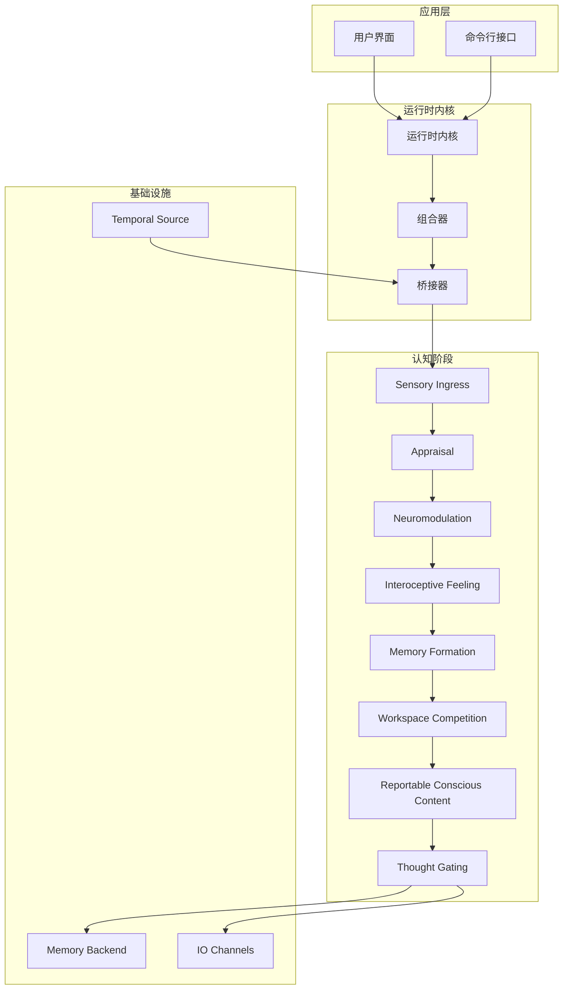
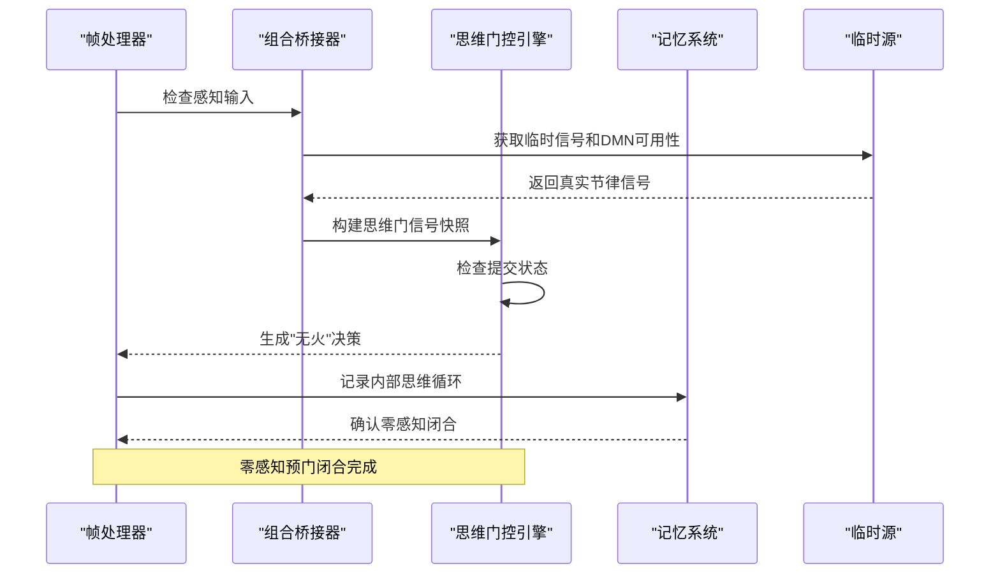
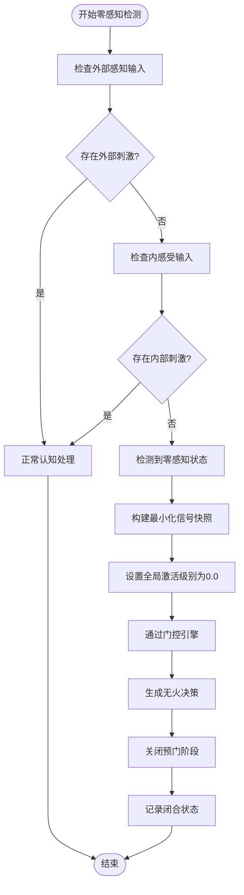
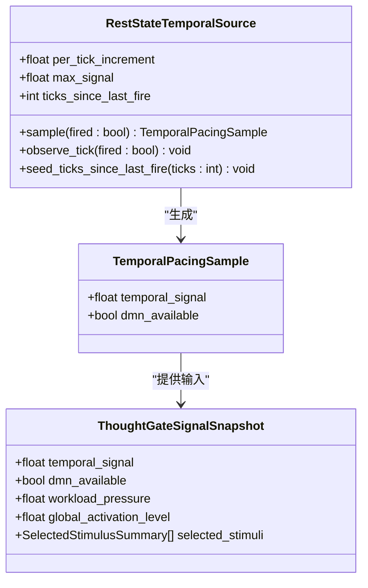
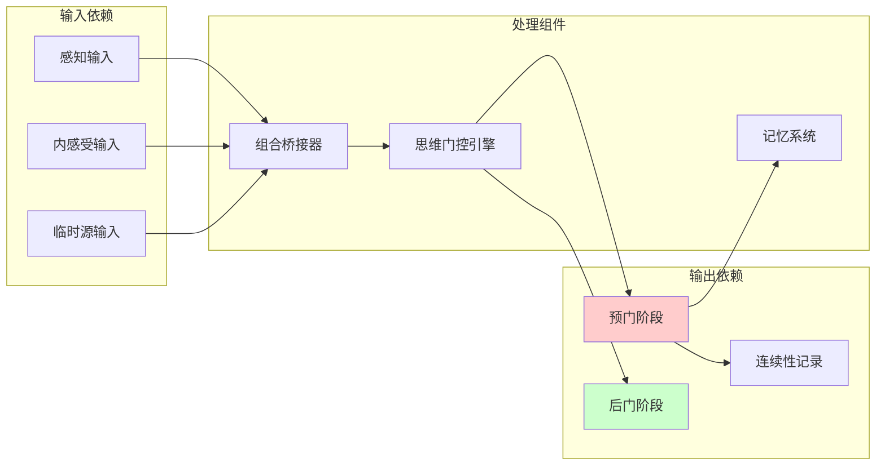

# 零感知预门闭合

<cite>
**本文档引用的文件**
- [task.md](file://helios_v2/docs/requirements/65-zero-percept-pregate-closure/task.md)
- [requirement.md](file://helios_v2/docs/requirements/55-temporal-pacing-and-dmn-gate-inputs/requirement.md)
- [bridges.py](file://helios_v2/src/helios_v2/composition/bridges.py)
- [PROGRESS_FLOW.en.md](file://helios_v2/docs/PROGRESS_FLOW.en.md)
- [test_zero_percept_pregate_closure.py](file://helios_v2/tests/test_zero_percept_pregate_closure.py)
- [test_temporal_engine.py](file://helios_v2/tests/test_temporal_engine.py)
- [__init__.py](file://helios_v2/src/helios_v2/temporal/__init__.py)
</cite>

## 目录
1. [引言](#引言)
2. [项目结构](#项目结构)
3. [核心组件](#核心组件)
4. [架构概览](#架构概览)
5. [详细组件分析](#详细组件分析)
6. [依赖关系分析](#依赖关系分析)
7. [性能考虑](#性能考虑)
8. [故障排除指南](#故障排除指南)
9. [结论](#结论)

## 引言

零感知预门闭合是Helios项目中一个重要的架构特性，它确保了在完全无感知状态下（即没有任何外部或内部刺激）的思维循环能够正确地关闭。这个机制对于维护系统的稳定性和避免不必要的认知活动至关重要。

在Helios v2架构中，零感知预门闭合通过以下方式实现：
- 在没有感知输入的情况下，系统自动激活预门闭合机制
- 确保所有相关的认知阶段（06、07、08）都处于非激活状态
- 通过思维门控引擎产生"无火"决策，防止不必要的认知处理

## 项目结构

Helios项目采用模块化的分层架构设计，主要包含以下层次：

**图表来源**
- [PROGRESS_FLOW.en.md: 114-616:114-616](file://helios_v2/docs/PROGRESS_FLOW.en.md#L114-L616)

**章节来源**
- [PROGRESS_FLOW.en.md: 114-616:114-616](file://helios_v2/docs/PROGRESS_FLOW.en.md#L114-L616)

## 核心组件

### 思维门控引擎

思维门控引擎是实现零感知预门闭合的核心组件，负责：

1. **信号快照构建**：当意识结果未激活时，构建最小化的思维门信号快照
2. **决策生成**：通过检查提交状态来生成"无火"决策
3. **因果链路**：建立从感知缺失到思维闭合的自然因果链

### 组合桥接器

组合桥接器负责在不同认知阶段之间传递信息，特别是在零感知情况下：

1. **临时信号输入**：从临时源获取真实的节律信号和DMN可用性
2. **工作负载压力**：计算来自内感受器的实时工作负载压力
3. **驱动紧迫性**：传递来自自主权阶段的驱动紧迫性信号

### 临时源

临时源提供真实的时间节律信息，支持零感知情况下的思维闭合：

1. **休息状态检测**：基于当前时刻是否存在外部刺激来判断是否处于休息状态
2. **时间节律积累**：在连续的无思维触发时刻累积时间节律信号
3. **跨时刻状态管理**：通过明确的所有者中立后时刻携带接缝推进跨时刻状态

**章节来源**
- [task.md: 24-52:24-52](file://helios_v2/docs/requirements/65-zero-percept-pregate-closure/task.md#L24-L52)
- [requirement.md: 11-31:11-31](file://helios_v2/docs/requirements/55-temporal-pacing-and-dmn-gate-inputs/requirement.md#L11-L31)

## 架构概览

零感知预门闭合的完整架构流程如下：

**图表来源**
- [bridges.py: 1361-1394:1361-1394](file://helios_v2/src/helios_v2/composition/bridges.py#L1361-L1394)
- [task.md: 24-28:24-28](file://helios_v2/docs/requirements/65-zero-percept-pregate-closure/task.md#L24-L28)

## 详细组件分析

### 零感知检测机制

零感知检测是整个闭合过程的第一步，通过以下方式实现：

**图表来源**
- [task.md: 24-28:24-28](file://helios_v2/docs/requirements/65-zero-percept-pregate-closure/task.md#L24-L28)

### 思维门控决策流程

当检测到零感知状态时，思维门控引擎执行以下决策流程：

1. **信号快照构建**：创建包含空刺激选择器的最小化思维门信号快照
2. **提交状态检查**：验证引擎的提交状态不等于"已提交"
3. **无火决策生成**：基于原因"意识内容不具备资格"生成无火决策
4. **阶段关闭**：确保所有相关的认知阶段（06、07、08）都处于非激活状态

### 临时源集成

临时源的集成确保了零感知情况下的时间节律一致性：

**图表来源**
- [test_temporal_engine.py: 34-66:34-66](file://helios_v2/tests/test_temporal_engine.py#L34-L66)
- [__init__.py: 1-21:1-21](file://helios_v2/src/helios_v2/temporal/__init__.py#L1-L21)

**章节来源**
- [requirement.md: 17-26:17-26](file://helios_v2/docs/requirements/55-temporal-pacing-and-dmn-gate-inputs/requirement.md#L17-L26)

### 测试验证机制

系统包含全面的测试来验证零感知预门闭合的正确性：

| 测试用例 | 验证内容 | 预期行为 |
|---------|---------|---------|
| 测试1 | 零感知时刻 → 06/07/08 全部激活=False | 所有阶段保持非激活状态 |
| 测试2 | 零感知时刻通过门 → 无火 | 生成无火决策而非思维触发 |
| 测试3 | 默认装配保持不变 | 占位感知 → 所有预门阶段激活 |
| 测试4 | 语义装配与真实感知 | 保持原有行为不变 |
| 测试5 | 源耗尽 → 后续时刻进入非激活 | 正确处理资源耗尽情况 |
| 测试6 | 内感受仅时刻仍形成记忆 | 确保记忆形成机制不受影响 |

**章节来源**
- [task.md: 35-44:35-44](file://helios_v2/docs/requirements/65-zero-percept-pregate-closure/task.md#L35-L44)

## 依赖关系分析

零感知预门闭合涉及多个组件之间的复杂依赖关系：

**图表来源**
- [bridges.py: 1361-1394:1361-1394](file://helios_v2/src/helios_v2/composition/bridges.py#L1361-L1394)

**章节来源**
- [PROGRESS_FLOW.en.md: 454-473:454-473](file://helios_v2/docs/PROGRESS_FLOW.en.md#L454-L473)

## 性能考虑

零感知预门闭合在设计时充分考虑了性能优化：

### 时间复杂度
- **检测阶段**：O(1) - 基于简单布尔检查
- **决策阶段**：O(1) - 基于预定义的状态检查
- **内存访问**：O(1) - 最小化的数据结构访问

### 空间复杂度
- **信号快照**：O(1) - 最小化对象结构
- **临时状态**：O(1) - 固定大小的状态变量
- **历史记录**：O(n) - 可选的历史追踪（默认禁用）

### 优化策略
1. **延迟初始化**：只有在需要时才创建信号快照
2. **缓存机制**：复用已计算的临时状态
3. **条件执行**：仅在零感知情况下执行完整的闭合流程
4. **内存池**：重用信号快照对象以减少垃圾回收

## 故障排除指南

### 常见问题及解决方案

| 问题类型 | 症状描述 | 可能原因 | 解决方案 |
|---------|---------|---------|---------|
| 误触发 | 零感知情况下仍产生思维 | 感知检测错误 | 检查感知输入过滤逻辑 |
| 未触发 | 零感知情况下未关闭 | 临时源配置错误 | 验证临时源参数设置 |
| 内存泄漏 | 长时间运行后内存增长 | 对象未正确释放 | 检查信号快照生命周期管理 |
| 性能下降 | 零感知检测变慢 | 缓存失效 | 实施更有效的缓存策略 |

### 调试技巧

1. **日志记录**：启用详细的零感知检测日志
2. **状态监控**：监控临时源的状态变化
3. **性能分析**：使用性能分析工具识别瓶颈
4. **单元测试**：运行专门的零感知测试套件

**章节来源**
- [test_zero_percept_pregate_closure.py](file://helios_v2/tests/test_zero_percept_pregate_closure.py)

## 结论

零感知预门闭合是Helios架构中的一个关键特性，它确保了系统在完全无感知状态下的正确行为。通过精心设计的检测机制、决策流程和测试验证，该功能实现了：

1. **可靠性**：在零感知情况下保证系统的稳定运行
2. **效率**：最小化的性能开销和内存使用
3. **可维护性**：清晰的代码结构和完善的测试覆盖
4. **扩展性**：为未来的功能增强提供了良好的基础

这一机制的成功实现展示了Helios项目在复杂认知系统设计方面的技术实力，为后续的功能开发奠定了坚实的基础。