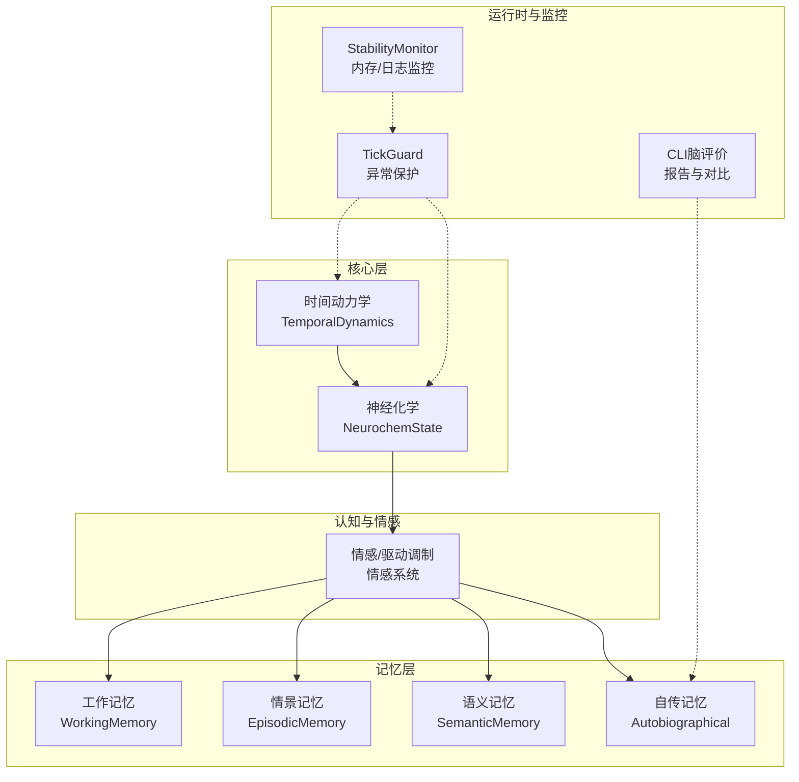
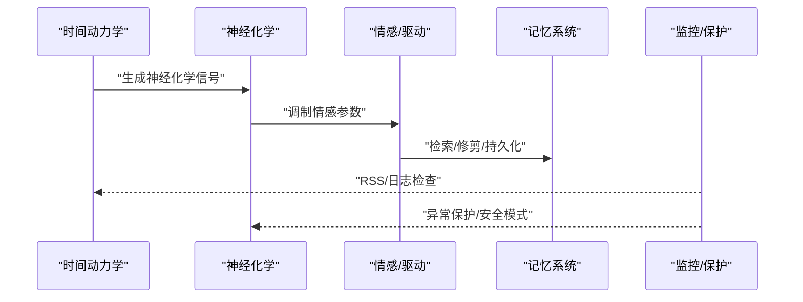
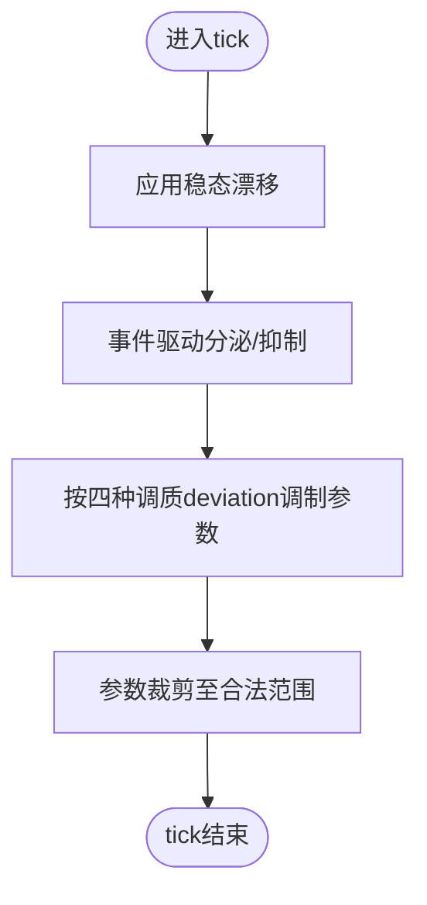
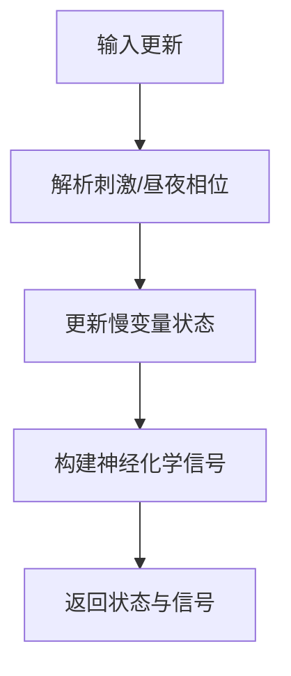
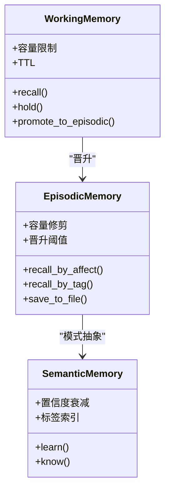
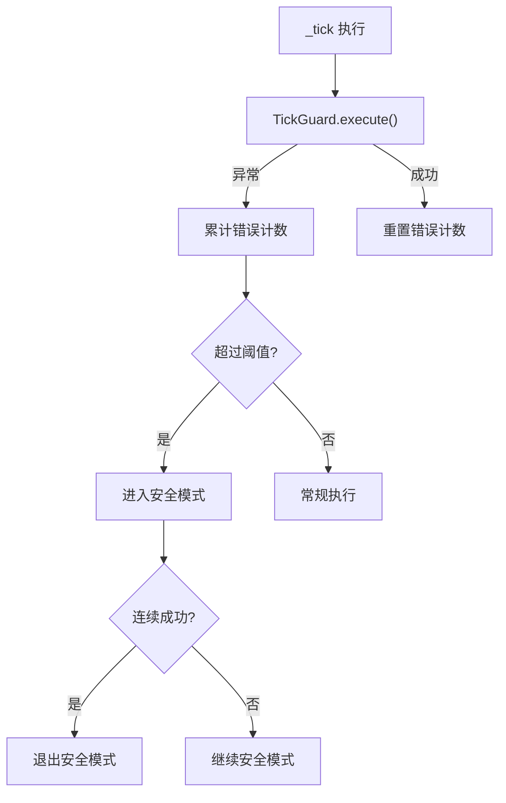
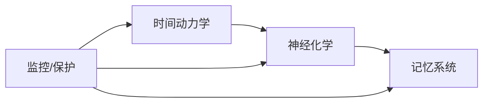

# 性能优化

<cite>
**本文引用的文件**
- [neurochem.py](file://archive/helios_v1/neurochem.py)
- [temporal_dynamics.py](file://archive/helios_v1/core/temporal_dynamics.py)
- [memory_system.py](file://archive/helios_v1/memory/memory_system.py)
- [stability_monitor.py](file://archive/helios_v1/utils/stability_monitor.py)
- [test_memory_usage_monitoring.py](file://archive/helios_v1/tests/test_memory_usage_monitoring.py)
- [tick_guard.py](file://archive/helios_v1/core/tick_guard.py)
- [helios_main.py](file://archive/helios_v1/helios_main.py)
- [cli_brain_like_evaluation.py](file://archive/helios_v1/helios_evaluation/cli_brain_like_evaluation.py)
- [test_temporal_neurochem_integration.py](file://archive/helios_v1/tests/test_temporal_neurochem_integration.py)
- [daisy_emotion.py](file://archive/helios_v1/daisy_emotion.py)
- [test_neuromodulator_contracts.py](file://helios_v2/tests/test_neuromodulator_contracts.py)
</cite>

## 目录
1. [简介](#简介)
2. [项目结构](#项目结构)
3. [核心组件](#核心组件)
4. [架构总览](#架构总览)
5. [详细组件分析](#详细组件分析)
6. [依赖分析](#依赖分析)
7. [性能考量](#性能考量)
8. [故障排查指南](#故障排查指南)
9. [结论](#结论)
10. [附录](#附录)

## 简介
本指南面向Helios项目的性能优化实践，聚焦系统在内存使用、CPU资源管理、I/O性能等方面的调优策略。文档结合神经递质系统、情感调节、记忆处理等关键模块，给出可操作的参数调整建议、监控指标、缓存与并发策略、资源池化方案，以及基准测试与效果评估方法。目标是在保证行为一致性与稳定性的同时，最大化吞吐与响应能力。

## 项目结构
Helios v1采用分层模块化设计：
- 核心时间动力学层：维护慢变量（如恢复、无聊、情感衰减因子），为神经化学建模提供输入信号。
- 神经化学层：模拟多巴胺、内源性阿片类、催产素、皮质醇四大系统，驱动情感参数调制。
- 记忆系统：工作记忆、情景记忆、语义记忆、自传记忆四层，配套检索与持久化。
- 运行时稳定性与监控：进程内存、日志轮转、错误保护与安全模式切换。
- 评估与对比：CLI脑评价报告与对比工具，支撑优化前后效果验证。

**图表来源**
- [temporal_dynamics.py:60-174](file://archive/helios_v1/core/temporal_dynamics.py#L60-L174)
- [neurochem.py:281-420](file://archive/helios_v1/neurochem.py#L281-L420)
- [memory_system.py:183-320](file://archive/helios_v1/memory/memory_system.py#L183-L320)
- [stability_monitor.py:24-77](file://archive/helios_v1/utils/stability_monitor.py#L24-L77)
- [tick_guard.py:14-87](file://archive/helios_v1/core/tick_guard.py#L14-L87)
- [cli_brain_like_evaluation.py:2023-2050](file://archive/helios_v1/helios_evaluation/cli_brain_like_evaluation.py#L2023-L2050)

**章节来源**
- [temporal_dynamics.py:1-247](file://archive/helios_v1/core/temporal_dynamics.py#L1-L247)
- [neurochem.py:1-620](file://archive/helios_v1/neurochem.py#L1-L620)
- [memory_system.py:1-800](file://archive/helios_v1/memory/memory_system.py#L1-L800)
- [stability_monitor.py:1-77](file://archive/helios_v1/utils/stability_monitor.py#L1-L77)
- [tick_guard.py:1-87](file://archive/helios_v1/core/tick_guard.py#L1-L87)
- [cli_brain_like_evaluation.py:2023-2050](file://archive/helios_v1/helios_evaluation/cli_brain_like_evaluation.py#L2023-L2050)

## 核心组件
- 时间动力学层：通过输入事件、消息、唤醒、情感等构建慢变量状态，输出神经化学信号，用于驱动神经递质动态。
- 神经化学层：四大系统各自具备上升/下降半衰期、长期平均漂移、事件触发分泌/抑制机制；提供参数调制接口，将神经递质水平映射到情感参数。
- 记忆系统：工作记忆环形缓冲+TTL；情景记忆重要性修剪与自传记忆晋升；语义记忆置信度衰减与标签索引；提供持久化与加载。
- 运行时监控：RSS内存阈值、日志大小轮转；TickGuard异常保护与安全模式；Helios主循环定期检查与压力触发。

**章节来源**
- [temporal_dynamics.py:60-174](file://archive/helios_v1/core/temporal_dynamics.py#L60-L174)
- [neurochem.py:281-420](file://archive/helios_v1/neurochem.py#L281-L420)
- [memory_system.py:183-320](file://archive/helios_v1/memory/memory_system.py#L183-L320)
- [stability_monitor.py:24-77](file://archive/helios_v1/utils/stability_monitor.py#L24-L77)
- [tick_guard.py:14-87](file://archive/helios_v1/core/tick_guard.py#L14-L87)

## 架构总览
下图展示一次tick内的关键调用链：时间动力学产生信号，神经化学层据此更新各系统，情感/驱动模块据此调制参数，记忆系统进行检索/修剪/持久化，监控与保护模块贯穿全程。

**图表来源**
- [temporal_dynamics.py:84-174](file://archive/helios_v1/core/temporal_dynamics.py#L84-L174)
- [neurochem.py:303-360](file://archive/helios_v1/neurochem.py#L303-L360)
- [memory_system.py:395-432](file://archive/helios_v1/memory/memory_system.py#L395-L432)
- [stability_monitor.py:50-77](file://archive/helios_v1/utils/stability_monitor.py#L50-L77)
- [tick_guard.py:39-74](file://archive/helios_v1/core/tick_guard.py#L39-L74)

## 详细组件分析

### 神经递质系统与情感参数调制
- 动态模型：每个系统含基线、上升/下降半衰期、长期平均漂移、事件记录；tick执行自然衰减与基线回归。
- 事件驱动：预测误差、新奇、PLAY、社交互动、威胁、过载、安全环境等事件触发分泌或抑制。
- 参数调制：基于多巴胺/阿片类/催产素/皮质醇的deviation，对点火阈值、探索权重、恢复速度、社交驱动力等进行加权调制。
- 性能要点：
  - 控制事件频率与幅度，避免过度分泌导致系统震荡。
  - 调整半衰期参数以平衡快速响应与稳定维持。
  - 在高负载tick中减少非必要事件，降低调制开销。

**图表来源**
- [neurochem.py:292-302](file://archive/helios_v1/neurochem.py#L292-L302)
- [neurochem.py:303-360](file://archive/helios_v1/neurochem.py#L303-L360)
- [neurochem.py:541-574](file://archive/helios_v1/neurochem.py#L541-L574)

**章节来源**
- [neurochem.py:25-420](file://archive/helios_v1/neurochem.py#L25-L420)
- [neurochem.py:541-574](file://archive/helios_v1/neurochem.py#L541-L574)
- [test_temporal_neurochem_integration.py:15-44](file://archive/helios_v1/tests/test_temporal_neurochem_integration.py#L15-L44)
- [daisy_emotion.py:474-490](file://archive/helios_v1/daisy_emotion.py#L474-L490)

### 时间动力学与神经化学信号耦合
- 输入：事件计数、消息计数、外部输入强度、唤醒、情感、过载、疲劳状态、行为/思考标志。
- 输出：慢变量（无聊、疲劳压力、恢复水平、新奇饥饿、情感衰减因子）与神经化学信号（刺激驱动、新奇驱动、社交驱动、压力负荷、恢复偏向、孤立压力、安全信号）。
- 性能要点：
  - 合理设置时间窗口参数（如无聊/恢复时间窗），避免振荡。
  - 在低输入tick中降低信号权重，减少神经化学波动。

**图表来源**
- [temporal_dynamics.py:84-174](file://archive/helios_v1/core/temporal_dynamics.py#L84-L174)
- [temporal_dynamics.py:176-233](file://archive/helios_v1/core/temporal_dynamics.py#L176-L233)
- [temporal_dynamics.py:235-247](file://archive/helios_v1/core/temporal_dynamics.py#L235-L247)

**章节来源**
- [temporal_dynamics.py:1-247](file://archive/helios_v1/core/temporal_dynamics.py#L1-L247)
- [test_temporal_neurochem_integration.py:15-44](file://archive/helios_v1/tests/test_temporal_neurochem_integration.py#L15-L44)

### 记忆系统：层次化检索与修剪
- 工作记忆：环形缓冲+TTL，容量限制，重要性阈值晋升；recall按重要性+最近访问排序。
- 情景记忆：容量修剪，高重要性晋升至自传记忆；按情感相似度检索，支持标签过滤与模式统计。
- 语义记忆：键值存储+标签索引，置信度随时间衰减，超过阈值移除。
- 性能要点：
  - 严格控制工作记忆容量与TTL，避免过期项清理成本。
  - 情景记忆修剪阈值与晋升阈值需平衡保留质量与存储占用。
  - 语义记忆衰减率与宽限期参数影响长期存储成本。

**图表来源**
- [memory_system.py:183-320](file://archive/helios_v1/memory/memory_system.py#L183-L320)
- [memory_system.py:326-488](file://archive/helios_v1/memory/memory_system.py#L326-L488)
- [memory_system.py:656-769](file://archive/helios_v1/memory/memory_system.py#L656-L769)

**章节来源**
- [memory_system.py:183-320](file://archive/helios_v1/memory/memory_system.py#L183-L320)
- [memory_system.py:326-488](file://archive/helios_v1/memory/memory_system.py#L326-L488)
- [memory_system.py:656-769](file://archive/helios_v1/memory/memory_system.py#L656-L769)

### 运行时稳定性与保护
- TickGuard：异常保护与安全模式切换，连续失败阈值与恢复tick数可调。
- StabilityMonitor：RSS内存与日志大小监控，超限发出警告。
- 主循环集成：定期检查RSS与内存压力，必要时触发记忆巩固。

**图表来源**
- [tick_guard.py:39-74](file://archive/helios_v1/core/tick_guard.py#L39-L74)
- [stability_monitor.py:50-77](file://archive/helios_v1/utils/stability_monitor.py#L50-L77)
- [helios_main.py:1682-1712](file://archive/helios_v1/helios_main.py#L1682-L1712)

**章节来源**
- [tick_guard.py:14-87](file://archive/helios_v1/core/tick_guard.py#L14-L87)
- [stability_monitor.py:24-77](file://archive/helios_v1/utils/stability_monitor.py#L24-L77)
- [helios_main.py:1682-1712](file://archive/helios_v1/helios_main.py#L1682-L1712)

## 依赖分析
- 时间动力学依赖输入状态与信号，输出供神经化学层使用。
- 神经化学层依赖时间信号与情感调制函数，输出影响记忆与行为。
- 记忆系统依赖检索与修剪策略，受工作记忆容量与语义衰减影响。
- 监控与保护贯穿主循环，保障稳定性与可恢复性。

**图表来源**
- [temporal_dynamics.py:84-174](file://archive/helios_v1/core/temporal_dynamics.py#L84-L174)
- [neurochem.py:303-360](file://archive/helios_v1/neurochem.py#L303-L360)
- [memory_system.py:395-432](file://archive/helios_v1/memory/memory_system.py#L395-L432)
- [stability_monitor.py:50-77](file://archive/helios_v1/utils/stability_monitor.py#L50-L77)
- [tick_guard.py:39-74](file://archive/helios_v1/core/tick_guard.py#L39-L74)

**章节来源**
- [temporal_dynamics.py:60-174](file://archive/helios_v1/core/temporal_dynamics.py#L60-L174)
- [neurochem.py:281-420](file://archive/helios_v1/neurochem.py#L281-L420)
- [memory_system.py:183-320](file://archive/helios_v1/memory/memory_system.py#L183-L320)
- [stability_monitor.py:24-77](file://archive/helios_v1/utils/stability_monitor.py#L24-L77)
- [tick_guard.py:14-87](file://archive/helios_v1/core/tick_guard.py#L14-L87)

## 性能考量

### 内存使用优化
- 工作记忆容量与TTL
  - 降低容量与TTL可显著减少过期清理与晋升成本，建议在高并发场景下调小容量与TTL。
  - 重要性阈值晋升需与容量匹配，避免频繁晋升导致的额外写入。
- 情景记忆修剪与晋升
  - 提升晋升阈值可减少晋升次数，但可能损失部分高质量片段；降低修剪阈值可压缩存储，但可能丢失有用信息。
  - 建议根据历史检索命中率与自传记忆晋升比例动态调整。
- 语义记忆置信度衰减
  - 衰减率与宽限期影响长期存储规模；在资源受限场景可适度提高衰减率或缩短宽限期。
- 日志与持久化
  - 使用原子写入与轮转策略，避免大文件带来的IO阻塞；监控日志大小，及时轮转。

**章节来源**
- [memory_system.py:183-320](file://archive/helios_v1/memory/memory_system.py#L183-L320)
- [memory_system.py:326-488](file://archive/helios_v1/memory/memory_system.py#L326-L488)
- [memory_system.py:656-769](file://archive/helios_v1/memory/memory_system.py#L656-L769)
- [stability_monitor.py:62-77](file://archive/helios_v1/utils/stability_monitor.py#L62-L77)

### CPU资源管理
- 神经递质动态
  - 事件频率与幅度直接影响tick内计算量；在高负载tick中减少非关键事件，或延迟非紧急事件。
  - 调整半衰期参数以平衡响应速度与稳定性，避免高频振荡。
- 时间动力学
  - 合理设置时间窗参数，减少不必要的信号权重变化；在低输入tick中降低信号强度。
- 记忆检索
  - 情感相似度与标签过滤的成本较高；建议在高负载时限制召回数量或关闭非必要检索路径。

**章节来源**
- [neurochem.py:113-140](file://archive/helios_v1/neurochem.py#L113-L140)
- [neurochem.py:239-274](file://archive/helios_v1/neurochem.py#L239-L274)
- [temporal_dynamics.py:84-174](file://archive/helios_v1/core/temporal_dynamics.py#L84-L174)

### I/O性能提升
- 持久化策略
  - 使用原子写入与临时文件替换，减少部分写失败风险；批量保存时合并写入，降低fsync频率。
  - 仅保存高重要性/高置信度条目，减少磁盘占用与IO时间。
- 日志轮转
  - 设定合理阈值，避免日志过大影响系统性能；在高流量场景下缩短轮转周期。
- 记忆压力触发
  - 当总条目超过阈值时立即触发巩固，避免后续检索与修剪的连锁开销。

**章节来源**
- [memory_system.py:564-632](file://archive/helios_v1/memory/memory_system.py#L564-L632)
- [stability_monitor.py:62-77](file://archive/helios_v1/utils/stability_monitor.py#L62-L77)
- [test_memory_usage_monitoring.py:166-212](file://archive/helios_v1/tests/test_memory_usage_monitoring.py#L166-L212)

### 缓存策略
- 工作记忆缓存
  - 利用有序字典实现LRU风格的最近访问优先保留；在recall中按重要性+最近访问排序，减少无效扫描。
- 情感检索缓存
  - 情感相似度计算可引入轻量缓存（如近期查询指纹），在短时间内重复查询时直接命中。
- 语义标签索引
  - 标签到键的倒排索引可加速标签过滤；注意标签分布不均时的热点问题。

**章节来源**
- [memory_system.py:227-262](file://archive/helios_v1/memory/memory_system.py#L227-L262)
- [memory_system.py:696-702](file://archive/helios_v1/memory/memory_system.py#L696-L702)

### 并发处理与资源池化
- 并发建议
  - 将事件注入与tick执行解耦，使用队列缓冲事件，避免主线程阻塞。
  - 对昂贵的检索/持久化操作异步化，使用线程池或进程池分担CPU与IO压力。
- 资源池化
  - LLM推理网关、嵌入服务等外部依赖建议启用连接池与请求池，避免频繁创建销毁带来的开销。
  - 在v2中，神经调质配置与参数类别明确，便于集中管理与池化复用。

**章节来源**
- [test_neuromodulator_contracts.py:70-81](file://helios_v2/tests/test_neuromodulator_contracts.py#L70-L81)

### 配置参数调整建议
- 神经递质系统
  - 半衰期：在高负载场景适当增大上升/下降半衰期，减少波动；在需要快速响应场景减小半衰期。
  - 事件权重：降低非关键事件的分泌幅度，或在低输入tick中禁用部分事件。
- 时间动力学
  - 时间窗参数：根据实际tick间隔调整无聊/恢复时间窗，避免振荡。
  - 信号权重：在低输入tick中降低刺激/新奇/社交驱动权重。
- 记忆系统
  - 工作记忆：容量15、TTL300s为基准；在高并发场景可考虑降低容量与TTL。
  - 情景记忆：修剪阈值与晋升阈值按检索命中率与晋升比例微调。
  - 语义记忆：衰减率与宽限期按知识更新频率与存储预算调整。

**章节来源**
- [neurochem.py:113-140](file://archive/helios_v1/neurochem.py#L113-L140)
- [neurochem.py:239-274](file://archive/helios_v1/neurochem.py#L239-L274)
- [temporal_dynamics.py:63-74](file://archive/helios_v1/core/temporal_dynamics.py#L63-L74)
- [memory_system.py:196-201](file://archive/helios_v1/memory/memory_system.py#L196-L201)

### 性能监控指标
- 内存
  - RSS（MB）、日志大小（MB）、工作/情景/语义/自传条目数、容量利用率。
- CPU
  - tick耗时分布、事件处理耗时、检索耗时、持久化耗时。
- I/O
  - 文件写入次数与大小、fsync频率、日志轮转次数。
- 稳定性
  - 连续错误计数、安全模式进入/退出次数、恢复tick数。

**章节来源**
- [stability_monitor.py:24-77](file://archive/helios_v1/utils/stability_monitor.py#L24-L77)
- [test_memory_usage_monitoring.py:28-95](file://archive/helios_v1/tests/test_memory_usage_monitoring.py#L28-L95)

### 基准测试与优化效果评估
- 基准测试
  - 使用CLI脑评价工具运行固定时长的live评估，记录报告与对比结果。
  - 对比不同配置下的总分、维度得分与长程诊断差异，确保优化不牺牲行为质量。
- 评估标准
  - 优化前后报告的一致性与可重复性；forced fallback、normal SEC与mixed fallback的语义边界清晰。
  - 结构化artifact与日志路径保持一致，避免二次推断与责任归因偏差。

**章节来源**
- [cli_brain_like_evaluation.py:2023-2050](file://archive/helios_v1/helios_evaluation/cli_brain_like_evaluation.py#L2023-L2050)
- [docs/requirements/17-evaluation-fidelity-and-diagnostic-provenance/requirement.md:52-68](file://archive/helios_v1/docs/requirements/17-evaluation-fidelity-and-diagnostic-provenance/requirement.md#L52-L68)

## 故障排查指南
- RSS过高
  - 检查内存使用监控日志，确认是否超过阈值；审查持久化策略与日志轮转配置。
- 日志过大
  - 启用轮转并缩短轮转周期；在高流量场景下降低日志级别或减少冗余输出。
- 连续错误与安全模式
  - 查看TickGuard错误计数与安全模式切换日志；定位异常模块并修复；确保恢复tick阈值合理。
- 记忆压力
  - 监控总条目数与压力触发日志；调整修剪/晋升阈值或容量参数；必要时提前触发巩固。

**章节来源**
- [stability_monitor.py:50-77](file://archive/helios_v1/utils/stability_monitor.py#L50-L77)
- [tick_guard.py:62-74](file://archive/helios_v1/core/tick_guard.py#L62-L74)
- [test_memory_usage_monitoring.py:166-212](file://archive/helios_v1/tests/test_memory_usage_monitoring.py#L166-L212)

## 结论
通过在神经递质动态、时间动力学、记忆系统与运行时监控四个层面实施针对性优化，Helios可在保证行为一致性的同时显著提升性能。建议以监控指标为依据，逐步调整参数与策略，并以CLI脑评价工具进行对比验证，确保优化收益可量化、可追溯。

## 附录
- 关键流程图与类图已在相应章节中给出，便于理解代码结构与调用关系。
- 评估与对比工具为优化效果提供了标准化的验证手段，建议纳入CI/CD流程。