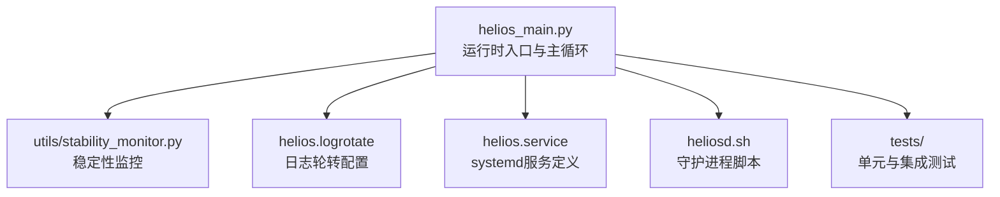
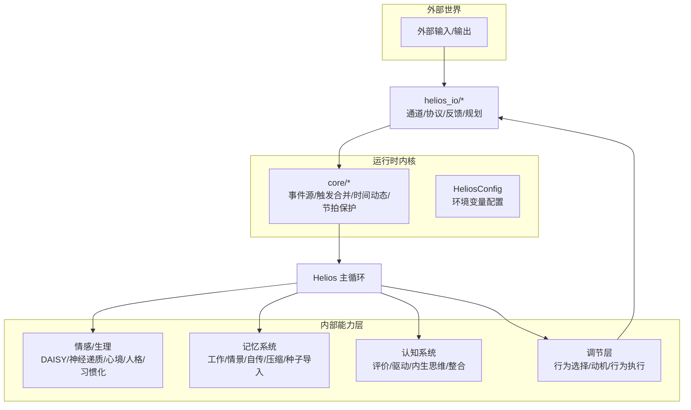
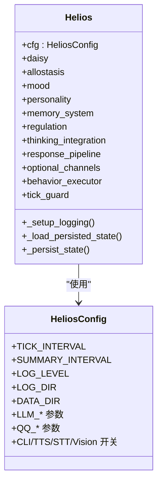
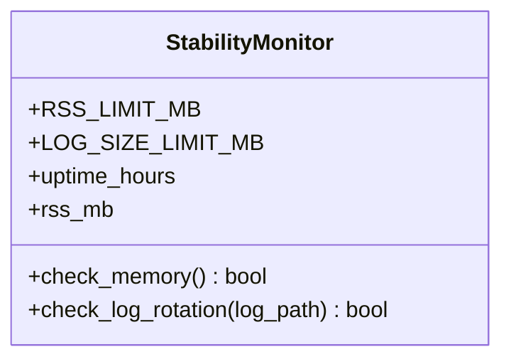
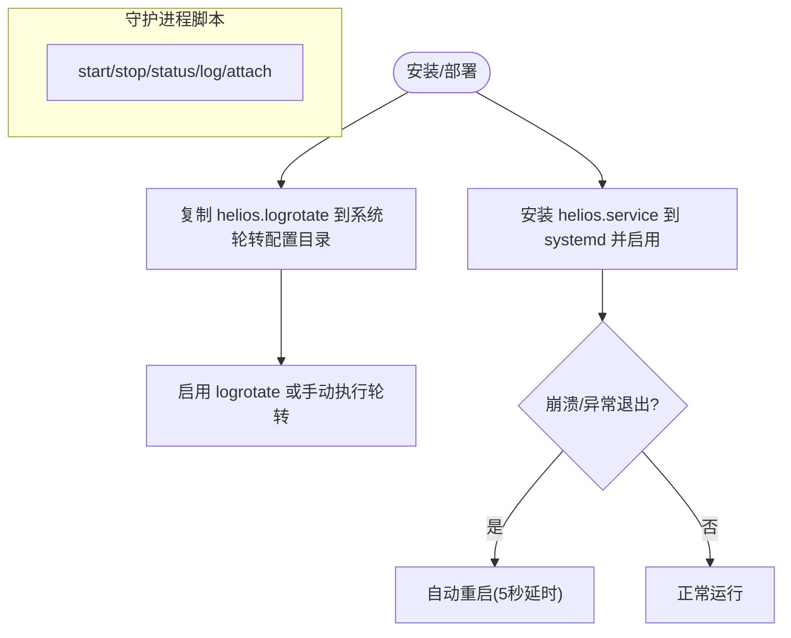
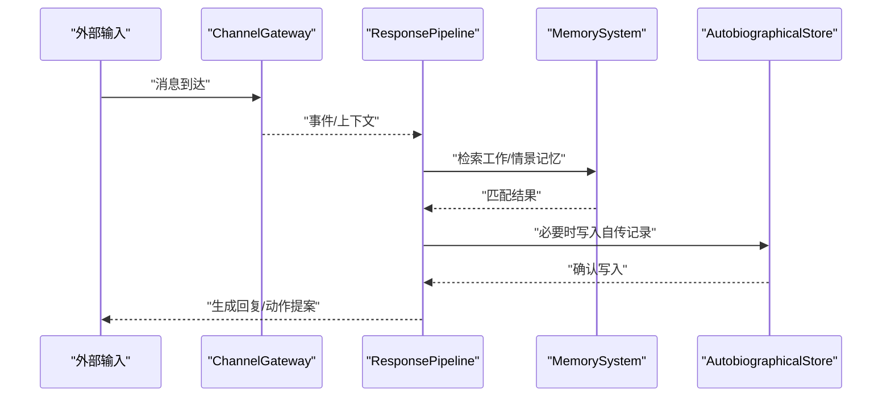
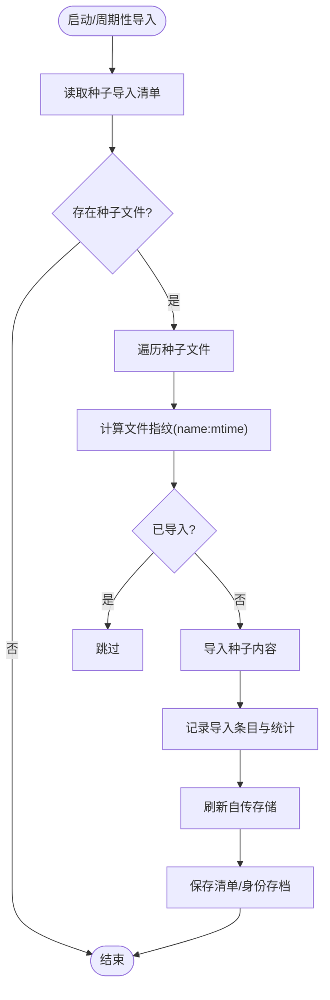
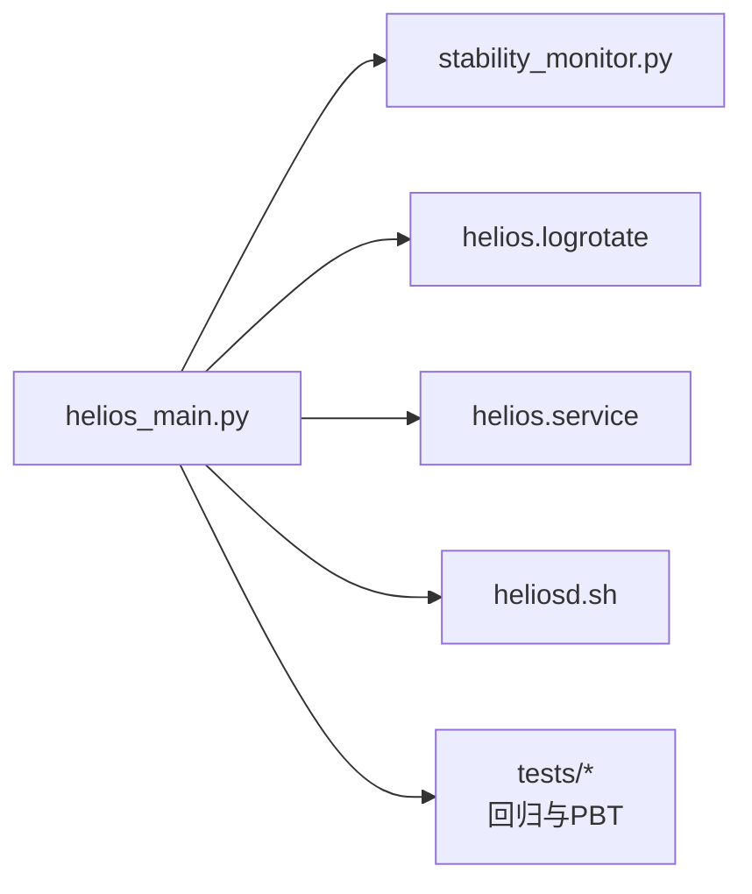

# 故障排除

<cite>
**本文引用的文件**
- [helios_main.py](file://archive/helios_v1/helios_main.py)
- [stability_monitor.py](file://archive/helios_v1/utils/stability_monitor.py)
- [helios.logrotate](file://archive/helios_v1/helios.logrotate)
- [helios.service](file://archive/helios_v1/helios.service)
- [heliosd.sh](file://archive/helios_v1/heliosd.sh)
- [README.md](file://archive/helios_v1/README.md)
- [test_stability_monitor.py](file://archive/helios_v1/tests/test_stability_monitor.py)
- [test_memory_usage_monitoring.py](file://archive/helios_v1/tests/test_memory_usage_monitoring.py)
- [test_helios_main.py](file://archive/helios_v1/tests/test_helios_main.py)
- [test_tick_guard.py](file://archive/helios_v1/tests/test_tick_guard.py)
- [test_tick_guard_pbt.py](file://archive/helios_v1/tests/test_tick_guard_pbt.py)
- [test_runtime_behavior_catalog.py](file://archive/helios_v1/tests/test_runtime_behavior_catalog.py)
- [test_channel_gateway.py](file://archive/helios_v1/tests/test_channel_gateway.py)
- [test_cli_channel.py](file://archive/helios_v1/tests/test_cli_channel.py)
- [test_qq_channel.py](file://archive/helios_v1/tests/test_qq_channel.py)
- [test_memory_backend.py](file://archive/helios_v1/tests/test_memory_backend.py)
- [test_memory_sqlite_backend.py](file://archive/helios_v1/tests/test_memory_sqlite_backend.py)
- [test_memory_compression.py](file://archive/helios_v1/tests/test_memory_compression.py)
- [test_memory_persistence.py](file://archive/helios_v1/tests/test_memory_persistence.py)
- [test_persistence.py](file://archive/helios_v1/tests/test_persistence.py)
- [test_persistence_integration.py](file://archive/helios_v1/tests/test_persistence_integration.py)
- [test_autobiographical_store.py](file://archive/helios_v1/tests/test_autobiographical_store.py)
- [test_autobiographical_store_pbt.py](file://archive/helios_v1/tests/test_autobiographical_store_pbt.py)
- [test_seed_memory_importer.py](file://archive/helios_v1/tests/test_seed_memory_importer.py)
- [test_seed_memory_importer_pbt.py](file://archive/helios_v1/tests/test_seed_memory_importer_pbt.py)
- [test_consolidation_pbt.py](file://archive/helios_v1/tests/test_consolidation_pbt.py)
- [test_consolidation_scheduling.py](file://archive/helios_v1/tests/test_consolidation_scheduling.py)
- [test_execution_planning.py](file://archive/helios_v1/tests/test_execution_planning.py)
- [test_response_pipeline.py](file://archive/helios_v1/tests/test_response_pipeline.py)
- [test_llm_sec_evaluator.py](file://archive/helios_v1/tests/test_llm_sec_evaluator.py)
- [test_prompt_contract.py](file://archive/helios_v1/tests/test_prompt_contract.py)
- [test_interaction_policy.py](file://archive/helios_v1/tests/test_interaction_policy.py)
- [test_regulation_policy.py](file://archive/helios_v1/tests/test_regulation_policy.py)
- [test_habituation_integration.py](file://archive/helios_v1/tests/test_habituation_integration.py)
- [test_neurochem_daisy_integration.py](file://archive/helios_v1/tests/test_neurochem_daisy_integration.py)
- [test_neurochem_gate.py](file://archive/helios_v1/tests/test_neurochem_gate.py)
- [test_icri_temperature_pbt.py](file://archive/helios_v1/tests/test_icri_temperature_pbt.py)
- [test_thinking_integration_pbt.py](file://archive/helios_v1/tests/test_thinking_integration_pbt.py)
- [test_unified_feedback_integration.py](file://archive/helios_v1/tests/test_unified_feedback_integration.py)
- [test_monitoring_pbt.py](file://archive/helios_v1/tests/test_monitoring_pbt.py)
- [test_temporal_dynamics.py](file://archive/helios_v1/tests/test_temporal_dynamics.py)
- [test_temporal_gate.py](file://archive/helios_v1/tests/test_temporal_gate.py)
- [test_temporal_neurochem_integration.py](file://archive/helios_v1/tests/test_temporal_neurochem_integration.py)
- [test_tick_response_wiring.py](file://archive/helios_v1/tests/test_tick_response_wiring.py)
- [test_trigger_merge_pbt.py](file://archive/helios_v1/tests/test_trigger_merge_pbt.py)
- [test_user_scoped_memory_context.py](file://archive/helios_v1/tests/test_user_scoped_memory_context.py)
- [test_working_memory.py](file://archive/helios_v1/tests/test_working_memory.py)
- [test_working_memory_pbt.py](file://archive/helios_v1/tests/test_working_memory_pbt.py)
- [test_significant_event_recording.py](file://archive/helios_v1/tests/test_significant_event_recording.py)
- [test_significant_event_recording_pbt.py](file://archive/helios_v1/tests/test_significant_event_recording_pbt.py)
- [test_personality_cross_policy_consistency.py](file://archive/helios_v1/tests/test_personality_cross_policy_consistency.py)
- [test_personality_projection.py](file://archive/helios_v1/tests/test_personality_projection.py)
- [test_phi_pbt.py](file://archive/helios_v1/tests/test_phi_pbt.py)
- [test_preconscious_policy.py](file://archive/helios_v1/tests/test_preconscious_policy.py)
- [test_drive_integration.py](file://archive/helios_v1/tests/test_drive_integration.py)
- [test_drive_regulation_scoring.py](file://archive/helios_v1/tests/test_drive_regulation_scoring.py)
- [test_drive_regulation_scoring_pbt.py](file://archive/helios_v1/tests/test_drive_regulation_scoring_pbt.py)
- [test_conversation_history.py](file://archive/helios_v1/tests/test_conversation_history.py)
- [test_conversation_history_pbt.py](file://archive/helios_v1/tests/test_conversation_history_pbt.py)
- [test_action_models.py](file://archive/helios_v1/tests/test_action_models.py)
- [test_action_proposal_adapters.py](file://archive/helios_v1/tests/test_action_proposal_adapters.py)
- [test_behavior_executor_pbt.py](file://archive/helios_v1/tests/test_behavior_executor_pbt.py)
- [test_cli_brain_like_evaluation.py](file://archive/helios_v1/tests/test_cli_brain_like_evaluation.py)
- [test_helios_state_pipeline_pbt.py](file://archive/helios_v1/tests/test_helios_state_pipeline_pbt.py)
- [test_lifecycle_integration.py](file://archive/helios_v1/tests/test_lifecycle_integration.py)
- [test_neurochem.py](file://archive/helios_v1/tests/test_neurochem.py)
- [test_mood_tracker.py](file://archive/helios_v1/tests/test_mood_tracker.py)
- [test_personality.py](file://archive/helios_v1/tests/test_personality.py)
- [test_daisy_emotion.py](file://archive/helios_v1/tests/test_daisy_emotion.py)
- [test_habituation.py](file://archive/helios_v1/tests/test_habituation.py)
- [test_identity_governance.py](file://archive/helios_v1/tests/test_identity_governance.py)
- [test_allostasis.py](file://archive/helios_v1/tests/test_allostasis.py)
- [test_memory_in_llm_context.py](file://archive/helios_v1/tests/test_memory_in_llm_context.py)
- [test_semantic_memory_decay.py](file://archive/helios_v1/tests/test_semantic_memory_decay.py)
- [test_semantic_memory_decay_pbt.py](file://archive/helios_v1/tests/test_semantic_memory_decay_pbt.py)
- [test_separation_anxiety_pbt.py](file://archive/helios_v1/tests/test_separation_anxiety_pbt.py)
- [test_import_compatibility.py](file://archive/helios_v1/tests/test_import_compatibility.py)
- [test_neurochem_daisy_integration.py](file://archive/helios_v1/tests/test_neurochem_daisy_integration.py)
- [test_neurochem_gate.py](file://archive/helios_v1/tests/test_neurochem_gate.py)
- [test_icri_temperature_pbt.py](file://archive/helios_v1/tests/test_icri_temperature_pbt.py)
- [test_thinking_integration_pbt.py](file://archive/helios_v1/tests/test_thinking_integration_pbt.py)
- [test_unified_feedback_integration.py](file://archive/helios_v1/tests/test_unified_feedback_integration.py)
- [test_monitoring_pbt.py](file://archive/helios_v1/tests/test_monitoring_pbt.py)
- [test_temporal_dynamics.py](file://archive/helios_v1/tests/test_temporal_dynamics.py)
- [test_temporal_gate.py](file://archive/helios_v1/tests/test_temporal_gate.py)
- [test_temporal_neurochem_integration.py](file://archive/helios_v1/tests/test_temporal_neurochem_integration.py)
- [test_tick_response_wiring.py](file://archive/helios_v1/tests/test_tick_response_wiring.py)
- [test_trigger_merge_pbt.py](file://archive/helios_v1/tests/test_trigger_merge_pbt.py)
- [test_user_scoped_memory_context.py](file://archive/helios_v1/tests/test_user_scoped_memory_context.py)
- [test_working_memory.py](file://archive/helios_v1/tests/test_working_memory.py)
- [test_working_memory_pbt.py](file://archive/helios_v1/tests/test_working_memory_pbt.py)
- [test_significant_event_recording.py](file://archive/helios_v1/tests/test_significant_event_recoring.py)
- [test_significant_event_recording_pbt.py](file://archive/helios_v1/tests/test_significant_event_recording_pbt.py)
- [test_personality_cross_policy_consistency.py](file://archive/helios_v1/tests/test_personality_cross_policy_consistency.py)
- [test_personality_projection.py](file://archive/helios_v1/tests/test_personality_projection.py)
- [test_phi_pbt.py](file://archive/helios_v1/tests/test_phi_pbt.py)
- [test_preconscious_policy.py](file://archive/helios_v1/tests/test_preconscious_policy.py)
- [test_drive_integration.py](file://archive/helios_v1/tests/test_drive_integration.py)
- [test_drive_regulation_scoring.py](file://archive/helios_v1/tests/test_drive_regulation_scoring.py)
- [test_drive_regulation_scoring_pbt.py](file://archive/helios_v1/tests/test_drive_regulation_scoring_pbt.py)
- [test_conversation_history.py](file://archive/helios_v1/tests/test_conversation_history.py)
- [test_conversation_history_pbt.py](file://archive/helios_v1/tests/test_conversation_history_pbt.py)
- [test_action_models.py](file://archive/helios_v1/tests/test_action_models.py)
- [test_action_proposal_adapters.py](file://archive/helios_v1/tests/test_action_proposal_adapters.py)
- [test_behavior_executor_pbt.py](file://archive/helios_v1/tests/test_behavior_executor_pbt.py)
- [test_cli_brain_like_evaluation.py](file://archive/helios_v1/tests/test_cli_brain_like_evaluation.py)
- [test_helios_state_pipeline_pbt.py](file://archive/helios_v1/tests/test_helios_state_pipeline_pbt.py)
- [test_lifecycle_integration.py](file://archive/helios_v1/tests/test_lifecycle_integration.py)
- [test_neurochem.py](file://archive/helios_v1/tests/test_neurochem.py)
- [test_mood_tracker.py](file://archive/helios_v1/tests/test_mood_tracker.py)
- [test_personality.py](file://archive/helios_v1/tests/test_personality.py)
- [test_daisy_emotion.py](file://archive/helios_v1/tests/test_daisy_emotion.py)
- [test_habituation.py](file://archive/helios_v1/tests/test_habituation.py)
- [test_identity_governance.py](file://archive/helios_v1/tests/test_identity_governance.py)
- [test_allostasis.py](file://archive/helios_v1/tests/test_allostasis.py)
- [test_memory_in_llm_context.py](file://archive/helios_v1/tests/test_memory_in_llm_context.py)
- [test_semantic_memory_decay.py](file://archive/helios_v1/tests/test_semantic_memory_decay.py)
- [test_semantic_memory_decay_pbt.py](file://archive/helios_v1/tests/test_semantic_memory_decay_pbt.py)
- [test_separation_anxiety_pbt.py](file://archive/helios_v1/tests/test_separation_anxiety_pbt.py)
- [test_import_compatibility.py](file://archive/helios_v1/tests/test_import_compatibility.py)
</cite>

## 目录
1. [简介](#简介)
2. [项目结构](#项目结构)
3. [核心组件](#核心组件)
4. [架构总览](#架构总览)
5. [详细组件分析](#详细组件分析)
6. [依赖关系分析](#依赖关系分析)
7. [性能考量](#性能考量)
8. [故障排除指南](#故障排除指南)
9. [结论](#结论)
10. [附录](#附录)

## 简介
本手册面向Helios项目的运维与开发人员，提供系统运行过程中的常见问题诊断方法与解决方案，覆盖启动失败、内存泄漏、性能下降、模块异常等场景；解释稳定性监测器的使用方法、日志轮转配置、错误分析技巧；给出调试工具使用指南、问题定位方法与修复策略；包含紧急情况处理流程、数据恢复方案、系统重启与重置操作；最后提供问题报告模板与社区支持渠道。

## 项目结构
Helios v1采用“入口主循环 + 子系统分层”的组织方式：
- 运行时入口：helios_main.py
- 稳定性监控：utils/stability_monitor.py
- 日志轮转：helios.logrotate
- systemd服务：helios.service
- 守护进程脚本：heliosd.sh
- 测试套件：tests/ 下覆盖各子系统与集成测试

图表来源
- [helios_main.py](file://archive/helios_v1/helios_main.py)
- [stability_monitor.py](file://archive/helios_v1/utils/stability_monitor.py)
- [helios.logrotate](file://archive/helios_v1/helios.logrotate)
- [helios.service](file://archive/helios_v1/helios.service)
- [heliosd.sh](file://archive/helios_v1/heliosd.sh)

章节来源
- [README.md](file://archive/helios_v1/README.md)
- [helios_main.py](file://archive/helios_v1/helios_main.py)

## 核心组件
- 运行时主循环与配置：Helios类负责初始化各子系统（情感、记忆、认知、调节、通道等），并以固定节拍推进。
- 稳定性监控：StabilityMonitor用于检测RSS内存占用与日志文件大小，辅助长期运行稳定性评估。
- 日志与轮转：主循环按日期生成日志文件，配合系统自带的日志轮转配置实现自动轮转。
- 服务与守护：helios.service与heliosd.sh分别提供systemd托管与手动守护两种运行方式，具备优雅停止与崩溃重启能力。

章节来源
- [helios_main.py](file://archive/helios_v1/helios_main.py)
- [stability_monitor.py](file://archive/helios_v1/utils/stability_monitor.py)
- [helios.logrotate](file://archive/helios_v1/helios.logrotate)
- [helios.service](file://archive/helios_v1/helios.service)
- [heliosd.sh](file://archive/helios_v1/heliosd.sh)

## 架构总览
Helios主循环围绕“输入-情感-记忆-认知-调节-输出”闭环展开，各子系统通过事件源与网关连接，形成可插拔的模块化结构。

图表来源
- [helios_main.py](file://archive/helios_v1/helios_main.py)
- [README.md](file://archive/helios_v1/README.md)

## 详细组件分析

### 组件A：Helios主循环与配置
- 初始化顺序与依赖注入：情感引擎、异稳态、记忆系统、行为目录、调节引擎、内生思维集成、通道网关、响应管线、LLM语音生成等。
- 日志系统：按日期生成日志文件，控制台处理器针对不同编码环境调整级别，避免刷屏。
- 环境变量：通过HeliosConfig集中管理节拍间隔、日志级别、数据目录、LLM参数、QQ机器人、多模态通道等。
- 节拍保护：TickGuard包裹每轮tick，防止异常扩散至主循环。

图表来源
- [helios_main.py](file://archive/helios_v1/helios_main.py)

章节来源
- [helios_main.py](file://archive/helios_v1/helios_main.py)

### 组件B：稳定性监控器
- 功能：检测当前进程RSS内存占用与日志文件大小，超过阈值发出警告。
- 阈值：默认RSS上限与日志文件大小上限均为100MB。
- 依赖：可选psutil库，缺失时不进行内存检测。

图表来源
- [stability_monitor.py](file://archive/helios_v1/utils/stability_monitor.py)

章节来源
- [stability_monitor.py](file://archive/helios_v1/utils/stability_monitor.py)

### 组件C：日志轮转与服务
- 日志轮转：helios.logrotate定义按日轮转、保留7份、压缩、延迟压缩、copytruncate等策略。
- systemd服务：helios.service定义用户/组、工作目录、环境文件、ExecStartPre、崩溃自动重启、标准输出/错误重定向到独立日志文件。
- 守护进程脚本：heliosd.sh提供start/stop/status/log/attach命令，支持前台/后台模式切换与优雅停止。

图表来源
- [helios.logrotate](file://archive/helios_v1/helios.logrotate)
- [helios.service](file://archive/helios_v1/helios.service)
- [heliosd.sh](file://archive/helios_v1/heliosd.sh)

章节来源
- [helios.logrotate](file://archive/helios_v1/helios.logrotate)
- [helios.service](file://archive/helios_v1/helios.service)
- [heliosd.sh](file://archive/helios_v1/heliosd.sh)

### 组件D：API/服务组件调用序列（示例：响应管线）
以下序列图展示从通道输入到响应生成的关键调用链，便于定位模块异常：

图表来源
- [helios_main.py](file://archive/helios_v1/helios_main.py)

章节来源
- [helios_main.py](file://archive/helios_v1/helios_main.py)

### 组件E：复杂逻辑组件（内存导入与去重）
种子记忆导入流程涉及指纹校验与去重，若出现重复导入或导入失败，应检查种子清单与文件变更。

图表来源
- [helios_main.py](file://archive/helios_v1/helios_main.py)

章节来源
- [helios_main.py](file://archive/helios_v1/helios_main.py)

## 依赖关系分析
- 运行时入口对各子系统存在强耦合初始化依赖，需确保依赖注入顺序正确。
- 稳定性监控器对psutil为可选依赖，缺失不影响主功能但会降低可观测性。
- 日志轮转与systemd服务共同保障长期运行稳定性与可维护性。

图表来源
- [helios_main.py](file://archive/helios_v1/helios_main.py)
- [stability_monitor.py](file://archive/helios_v1/utils/stability_monitor.py)
- [helios.logrotate](file://archive/helios_v1/helios.logrotate)
- [helios.service](file://archive/helios_v1/helios.service)
- [heliosd.sh](file://archive/helios_v1/heliosd.sh)

章节来源
- [helios_main.py](file://archive/helios_v1/helios_main.py)

## 性能考量
- 内存压力：通过StabilityMonitor的RSS阈值预警，结合系统监控工具观察峰值与增长趋势。
- 日志膨胀：合理设置日志轮转与保留策略，避免磁盘空间被日志占满。
- LLM调用：通过HeliosConfig中的超时与模型参数控制资源消耗，避免阻塞主循环。
- Tick节拍：根据硬件与负载调整TICK_INTERVAL，平衡实时性与CPU占用。

## 故障排除指南

### 启动失败
- 症状
  - systemd服务无法启动或立即退出
  - 守护脚本报错“启动失败”
  - 控制台无输出或报错
- 排查步骤
  - 检查helios.service的工作目录、用户/组、环境文件路径是否正确
  - 使用heliosd.sh status查看进程状态，使用heliosd.sh log实时跟踪当日日志
  - 查看systemd日志：journalctl -u helios.service -n 100
  - 确认环境变量文件(.env)是否存在且格式正确
  - 检查HeliosConfig相关环境变量是否缺失或拼写错误
- 修复策略
  - 修正helios.service中的路径与权限
  - 在heliosd.sh中手动执行python3 helios_main.py验证最小化启动
  - 临时降低日志级别以减少控制台刷屏干扰

章节来源
- [helios.service](file://archive/helios_v1/helios.service)
- [heliosd.sh](file://archive/helios_v1/heliosd.sh)
- [helios_main.py](file://archive/helios_v1/helios_main.py)

### 内存泄漏/内存占用持续上升
- 症状
  - RSS持续增长，超过100MB阈值触发StabilityMonitor告警
  - 系统出现卡顿或OOM风险
- 排查步骤
  - 使用StabilityMonitor.check_memory()与process.memory_info().rss对比
  - 结合操作系统工具（如top/htop）观察RSS曲线
  - 检查日志文件大小是否异常增长（StabilityMonitor.check_log_rotation）
  - 关注大对象缓存、未释放的队列、长生命周期的上下文
- 修复策略
  - 优化大对象生命周期，及时清理缓存
  - 限制日志量，启用轮转
  - 将耗时操作移出主循环tick，使用异步或批处理

章节来源
- [stability_monitor.py](file://archive/helios_v1/utils/stability_monitor.py)
- [helios_main.py](file://archive/helios_v1/helios_main.py)

### 性能下降/卡顿
- 症状
  - tick节拍明显变慢，响应延迟增加
  - LLM调用超时或阻塞
- 排查步骤
  - 检查HeliosConfig中的TICK_INTERVAL与LLM超时设置
  - 观察日志中是否有大量警告或错误导致额外开销
  - 使用测试套件运行关键模块回归测试，定位瓶颈
- 修复策略
  - 提升硬件资源或降低并发
  - 调整内部思维生成频率与资源压力阈值
  - 优化响应管线与记忆检索路径

章节来源
- [helios_main.py](file://archive/helios_v1/helios_main.py)
- [test_response_pipeline.py](file://archive/helios_v1/tests/test_response_pipeline.py)

### 模块异常（通道/记忆/行为）
- 症状
  - QQ/CLI/TTS/STT/视觉通道无响应或报错
  - 记忆写入失败或读取异常
  - 行为执行失败或拒绝
- 排查步骤
  - 使用heliosd.sh status确认通道是否注册与连接
  - 查看helios_main.py中通道网关与行为执行器的初始化日志
  - 运行对应模块测试：test_channel_gateway.py、test_cli_channel.py、test_qq_channel.py、test_memory_backend.py、test_behavior_executor_pbt.py
- 修复策略
  - 重新注册通道或修复协议实现
  - 清理损坏的记忆后端文件并重建索引
  - 回滚最近变更或回放历史行为以复现问题

章节来源
- [helios_main.py](file://archive/helios_v1/helios_main.py)
- [test_channel_gateway.py](file://archive/helios_v1/tests/test_channel_gateway.py)
- [test_cli_channel.py](file://archive/helios_v1/tests/test_cli_channel.py)
- [test_qq_channel.py](file://archive/helios_v1/tests/test_qq_channel.py)
- [test_memory_backend.py](file://archive/helios_v1/tests/test_memory_backend.py)
- [test_behavior_executor_pbt.py](file://archive/helios_v1/tests/test_behavior_executor_pbt.py)

### 日志与轮转问题
- 症状
  - 日志文件过大，磁盘空间不足
  - 日志轮转未生效或丢失
- 排查步骤
  - 检查helios.logrotate配置是否安装到系统轮转配置目录
  - 手动执行logrotate -f /etc/logrotate.d/helios 或对应路径
  - 使用StabilityMonitor.check_log_rotation()验证当前文件大小
- 修复策略
  - 正确安装helios.logrotate并赋予执行权限
  - 调整轮转策略（保留份数、压缩策略）

章节来源
- [helios.logrotate](file://archive/helios_v1/helios.logrotate)
- [stability_monitor.py](file://archive/helios_v1/utils/stability_monitor.py)

### 紧急情况处理流程
- 立即措施
  - 使用heliosd.sh stop优雅停止，等待最多10秒；若超时则强制终止
  - 使用systemctl stop helios.service停止systemd托管实例
- 数据保护
  - 确认StatePersistence保存成功，检查data目录完整性
  - 备份logs目录与data目录
- 恢复步骤
  - 修复问题后，优先使用heliosd.sh start启动；若仍失败，使用heliosd.sh attach前台模式定位
  - 若systemd服务异常，使用journalctl -u helios.service -n 200查看最近错误

章节来源
- [heliosd.sh](file://archive/helios_v1/heliosd.sh)
- [helios.service](file://archive/helios_v1/helios.service)
- [helios_main.py](file://archive/helios_v1/helios_main.py)

### 数据恢复方案
- 记忆系统
  - 检查AutobiographicalStore与MemorySystem的持久化目录
  - 若文件损坏，尝试基于备份恢复；必要时重建索引
- 身份与人格
  - IdentityStore与PersonalityProfile由StatePersistence管理，确保保存成功后再关闭
- 种子记忆
  - 通过种子导入清单识别已导入项，避免重复导入

章节来源
- [helios_main.py](file://archive/helios_v1/helios_main.py)

### 系统重启与重置操作
- 重启
  - 使用heliosd.sh restart或systemctl restart helios.service
- 重置
  - 删除data目录中的持久化文件（谨慎操作，建议先备份）
  - 重新引导系统，Helios会在启动时重新初始化并导入种子记忆

章节来源
- [heliosd.sh](file://archive/helios_v1/heliosd.sh)
- [helios.service](file://archive/helios_v1/helios.service)
- [helios_main.py](file://archive/helios_v1/helios_main.py)

### 调试工具与错误分析技巧
- 日志级别
  - 通过HeliosConfig.LOG_LEVEL调整，生产环境建议INFO以上
  - 控制台处理器在GBK环境下自动提升级别，避免刷屏
- 稳定性监控
  - 使用StabilityMonitor.check_memory()与check_log_rotation()作为长期运行哨兵
- 测试驱动
  - 使用pytest运行单模块测试快速定位问题
  - 使用PBT（基于属性的测试）验证边界条件与一致性

章节来源
- [helios_main.py](file://archive/helios_v1/helios_main.py)
- [stability_monitor.py](file://archive/helios_v1/utils/stability_monitor.py)
- [test_stability_monitor.py](file://archive/helios_v1/tests/test_stability_monitor.py)
- [test_memory_usage_monitoring.py](file://archive/helios_v1/tests/test_memory_usage_monitoring.py)

### 问题报告模板
- 基本信息
  - Helios版本/分支、Python版本、操作系统
  - 部署方式（systemd/守护脚本/本地）
- 复现步骤
  - 精确描述如何复现问题
  - 最小化复现命令或脚本
- 日志与证据
  - 当日日志片段（含时间戳）
  - 系统资源快照（CPU/内存/磁盘）
- 期望与实际
  - 期望行为 vs 实际行为
- 附加信息
  - 最近变更、环境变量、第三方依赖版本

## 结论
通过规范化的启动与监控、完善的日志轮转与服务托管、以及系统化的测试与调试流程，Helios可在长期运行中保持稳定。遇到问题时，建议优先使用heliosd.sh与systemd日志定位，再结合StabilityMonitor与测试套件深入分析，最终以最小改动修复并验证。

## 附录

### 常用命令速查
- 启动/停止/重启/状态/日志/前台
  - ./heliosd.sh start|stop|restart|status|log|attach
- systemd服务
  - systemctl start/stop/restart/status helios.service
  - journalctl -u helios.service -n 200
- 日志轮转
  - logrotate -f /etc/logrotate.d/helios

### 社区支持渠道
- 文档门户与架构概览
  - docs/docs_home.html
  - docs/architecture_overview.html
- 仓库首页与快速入口
  - README.md

章节来源
- [README.md](file://archive/helios_v1/README.md)