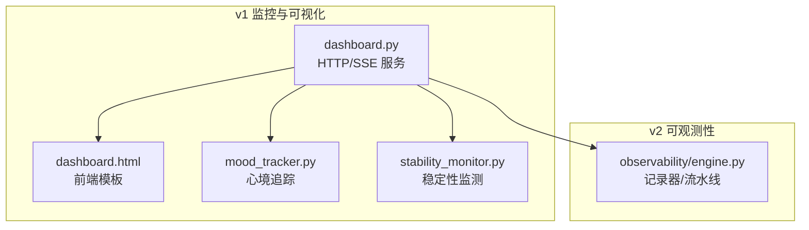
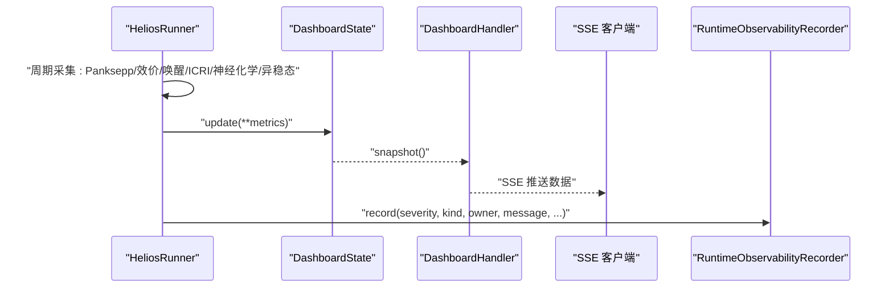
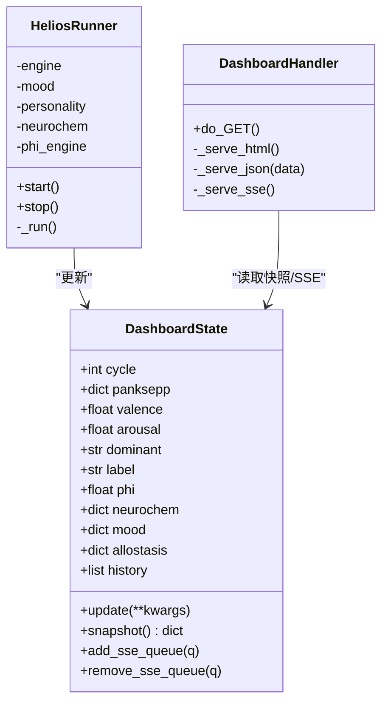
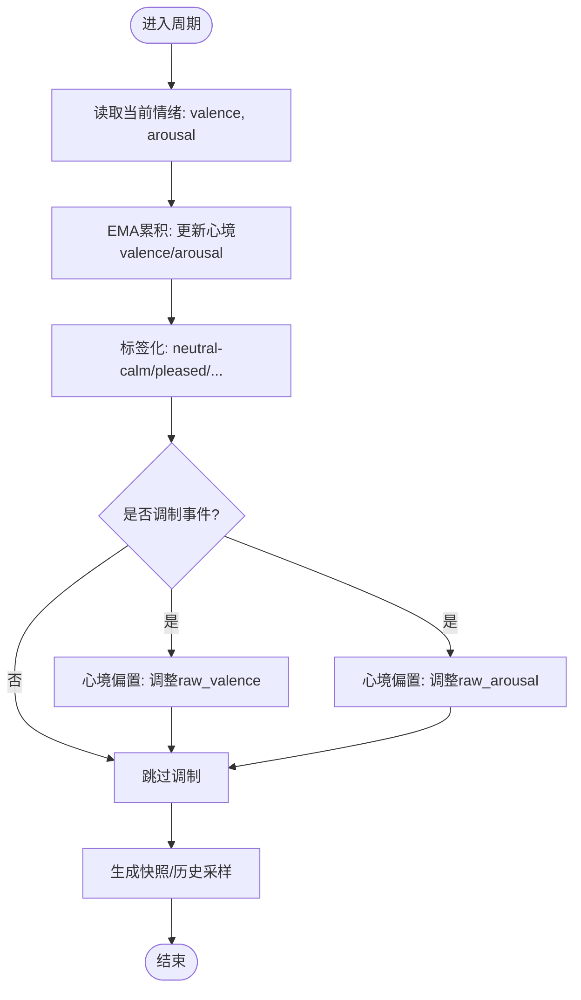
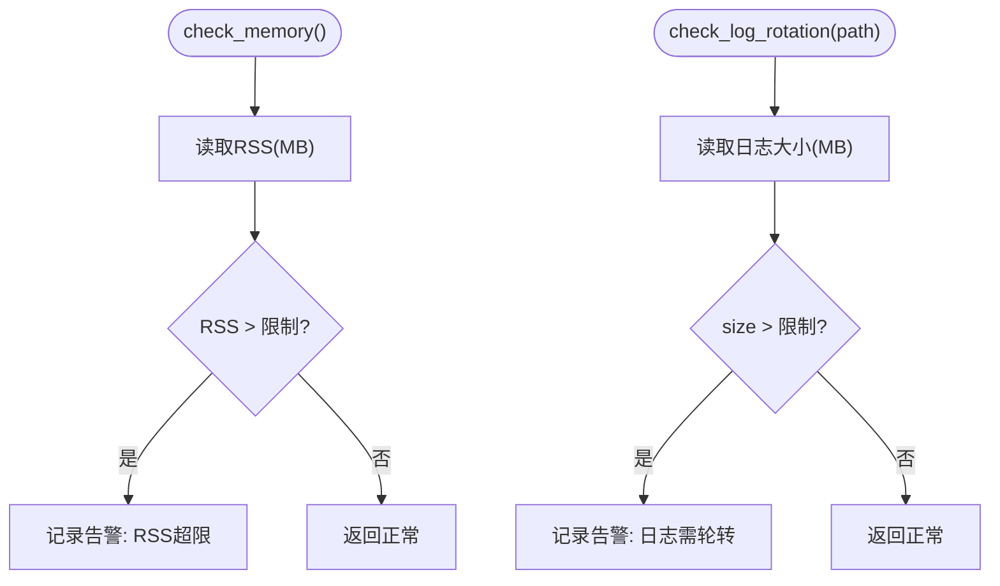
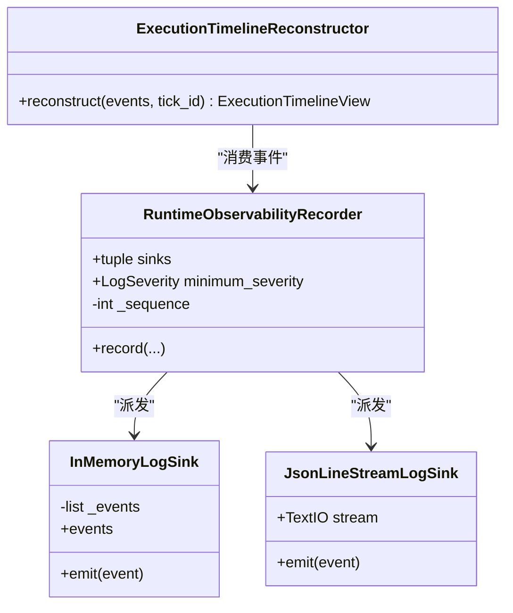
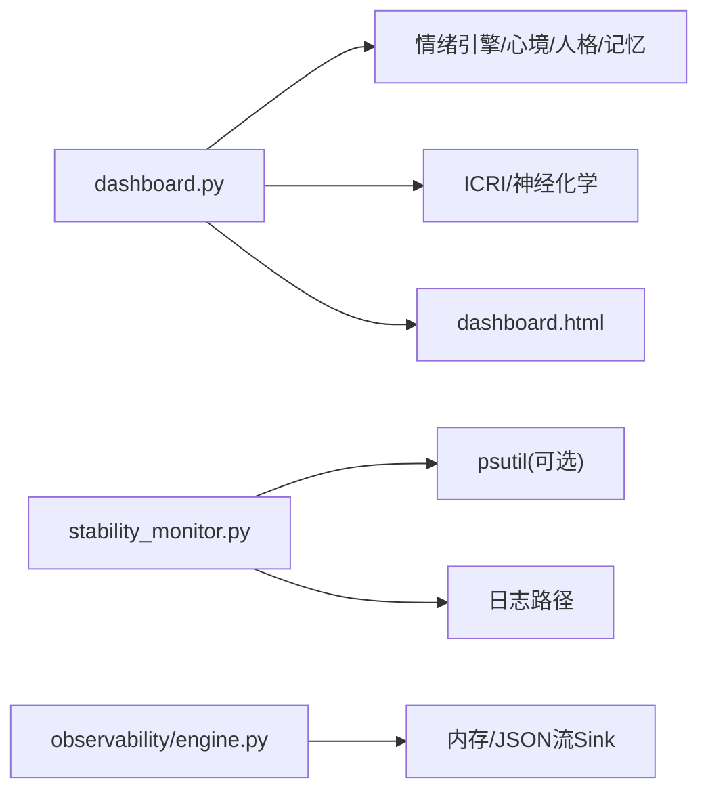

# 监控告警

<cite>
**本文引用的文件**
- [dashboard.py](file://archive/helios_v1/dashboard.py)
- [dashboard.html](file://archive/helios_v1/dashboard.html)
- [mood_tracker.py](file://archive/helios_v1/mood_tracker.py)
- [stability_monitor.py](file://archive/helios_v1/utils/stability_monitor.py)
- [engine.py](file://helios_v2/src/helios_v2/observability/engine.py)
- [test_stability_monitor.py](file://archive/helios_v1/tests/test_stability_monitor.py)
</cite>

## 目录
1. [简介](#简介)
2. [项目结构](#项目结构)
3. [核心组件](#核心组件)
4. [架构总览](#架构总览)
5. [详细组件分析](#详细组件分析)
6. [依赖关系分析](#依赖关系分析)
7. [性能考量](#性能考量)
8. [故障排查指南](#故障排查指南)
9. [结论](#结论)
10. [附录](#附录)

## 简介
本指南面向Helios项目的监控与告警体系，覆盖系统运行状态监控、性能指标采集、异常告警机制、仪表板使用、情绪追踪器监控、稳定性监测器工作原理、日志收集与分析、错误追踪与性能瓶颈识别，并提供监控工具集成与自定义告警配置的实践建议。文档以代码为依据，结合图表与流程说明，帮助技术与非技术读者快速上手并深入理解。

## 项目结构
Helios监控相关能力主要分布在以下模块：
- v1仪表板与情绪可视化：dashboard.py（HTTP + SSE）、dashboard.html（前端）
- 情绪与心境追踪：mood_tracker.py
- 稳定性监测：utils/stability_monitor.py
- v2可观测性记录器：helios_v2/src/helios_v2/observability/engine.py
- 测试与验证：tests/test_stability_monitor.py

**图表来源**
- [dashboard.py:1-742](file://archive/helios_v1/dashboard.py#L1-L742)
- [dashboard.html:1-259](file://archive/helios_v1/dashboard.html#L1-L259)
- [mood_tracker.py:1-239](file://archive/helios_v1/mood_tracker.py#L1-L239)
- [stability_monitor.py:1-77](file://archive/helios_v1/utils/stability_monitor.py#L1-L77)
- [engine.py:1-333](file://helios_v2/src/helios_v2/observability/engine.py#L1-L333)

**章节来源**
- [dashboard.py:1-742](file://archive/helios_v1/dashboard.py#L1-L742)
- [dashboard.html:1-259](file://archive/helios_v1/dashboard.html#L1-L259)
- [mood_tracker.py:1-239](file://archive/helios_v1/mood_tracker.py#L1-L239)
- [stability_monitor.py:1-77](file://archive/helios_v1/utils/stability_monitor.py#L1-L77)
- [engine.py:1-333](file://helios_v2/src/helios_v2/observability/engine.py#L1-L333)

## 核心组件
- 仪表板与实时推送：dashboard.py提供HTTP服务与SSE推送，dashboard.html渲染7系统雷达、情感时序、效价/唤醒/ICRI、神经化学、异稳态、人格演化等图表。
- 情绪与心境追踪：mood_tracker.py实现心境EMA累积、心境对事件与触发器的调制、标签化与快照导出。
- 稳定性监测：stability_monitor.py基于psutil与日志大小检测内存与日志增长，发出告警。
- v2可观测性：engine.py提供统一记录器、内存与JSON流式sink、执行时间线重建器，支持结构化日志与阶段级生命周期事件。

**章节来源**
- [dashboard.py:66-193](file://archive/helios_v1/dashboard.py#L66-L193)
- [dashboard.html:35-51](file://archive/helios_v1/dashboard.html#L35-L51)
- [mood_tracker.py:106-239](file://archive/helios_v1/mood_tracker.py#L106-L239)
- [stability_monitor.py:24-77](file://archive/helios_v1/utils/stability_monitor.py#L24-L77)
- [engine.py:135-333](file://helios_v2/src/helios_v2/observability/engine.py#L135-L333)

## 架构总览
Helios监控由“数据采集-状态聚合-可视化/日志-告警”四层构成：
- 数据采集：情绪引擎输出Panksepp激活、效价/唤醒、ICRI；心境追踪器输出心境；神经化学/异稳态模块输出对应指标；稳定性监测器输出RSS/日志大小。
- 状态聚合：dashboard.py的DashboardState集中管理并按周期生成快照，通过SSE推送到前端。
- 可视化/日志：dashboard.html渲染图表；v2记录器将事件写入内存或JSON流sink，支持执行时间线重建。
- 告警：稳定性监测器在越限时记录警告；仪表板可作为“软告警”（视觉异常）入口；v2记录器可配合外部告警系统按严重级别派发。

**图表来源**
- [dashboard.py:199-353](file://archive/helios_v1/dashboard.py#L199-L353)
- [dashboard.py:66-193](file://archive/helios_v1/dashboard.py#L66-L193)
- [dashboard.py:361-436](file://archive/helios_v1/dashboard.py#L361-L436)
- [engine.py:135-211](file://helios_v2/src/helios_v2/observability/engine.py#L135-L211)

## 详细组件分析

### 仪表板与DashboardState
- DashboardState负责线程安全的状态存储、历史窗口维护、SSE队列管理与快照导出。
- HeliosRunner驱动引擎循环，按周期填充metrics并更新DashboardState。
- DashboardHandler提供HTML、JSON快照与SSE接口，前端通过EventSource订阅实时数据。

**图表来源**
- [dashboard.py:66-193](file://archive/helios_v1/dashboard.py#L66-L193)
- [dashboard.py:199-353](file://archive/helios_v1/dashboard.py#L199-L353)
- [dashboard.py:361-436](file://archive/helios_v1/dashboard.py#L361-L436)

**章节来源**
- [dashboard.py:66-193](file://archive/helios_v1/dashboard.py#L66-L193)
- [dashboard.py:199-353](file://archive/helios_v1/dashboard.py#L199-L353)
- [dashboard.py:361-436](file://archive/helios_v1/dashboard.py#L361-L436)
- [dashboard.html:35-51](file://archive/helios_v1/dashboard.html#L35-L51)

### 情绪与心境追踪器（MoodTracker）
- 心境EMA：以不同β值分别累积效价与唤醒，形成较稳定的心境状态。
- 标签化：根据Russell环状模型将心境映射为标签，便于语义化展示与告警。
- 事件与触发器调制：心境对原始效价/唤醒进行偏置，对Panksepp触发器按正负向系统进行放大/抑制。
- 快照导出：提供JSON兼容的快照，便于持久化与跨模块共享。

**图表来源**
- [mood_tracker.py:135-191](file://archive/helios_v1/mood_tracker.py#L135-L191)
- [mood_tracker.py:50-99](file://archive/helios_v1/mood_tracker.py#L50-L99)

**章节来源**
- [mood_tracker.py:106-239](file://archive/helios_v1/mood_tracker.py#L106-L239)

### 稳定性监测器（StabilityMonitor）
- 功能：监控进程RSS与日志文件大小，超过阈值时记录警告日志。
- 阈值：RSS上限、日志大小上限（单位MB），默认均为100MB。
- 适用场景：长时运行稳定性保障、资源回收与容量规划。

**图表来源**
- [stability_monitor.py:50-77](file://archive/helios_v1/utils/stability_monitor.py#L50-L77)

**章节来源**
- [stability_monitor.py:24-77](file://archive/helios_v1/utils/stability_monitor.py#L24-L77)
- [test_stability_monitor.py:15-60](file://archive/helios_v1/tests/test_stability_monitor.py#L15-L60)

### v2可观测性记录器（RuntimeObservabilityRecorder）
- 统一记录器：为每个事件分配严格单调递增序列号与稳定ID，按最小严重级别派发至各sink。
- Sink类型：内存捕获（InMemoryLogSink）、JSON行流（JsonLineStreamLogSink）。
- 执行时间线重建：从生命周期事件中重构单tick执行时间线视图，支持完成/失败与错误类型。

**图表来源**
- [engine.py:25-73](file://helios_v2/src/helios_v2/observability/engine.py#L25-L73)
- [engine.py:76-109](file://helios_v2/src/helios_v2/observability/engine.py#L76-L109)
- [engine.py:135-211](file://helios_v2/src/helios_v2/observability/engine.py#L135-L211)
- [engine.py:213-333](file://helios_v2/src/helios_v2/observability/engine.py#L213-L333)

**章节来源**
- [engine.py:1-333](file://helios_v2/src/helios_v2/observability/engine.py#L1-L333)

## 依赖关系分析
- dashboard.py依赖情绪引擎、心境追踪、人格、自传记忆、神经化学与ICRI模块（可选），并通过SSE向dashboard.html推送数据。
- stability_monitor.py依赖psutil（可选），用于RSS读取；日志大小依赖os.path.getsize。
- v2 observability独立于具体业务模块，通过标准化事件契约与sink扩展接入任意日志平台或告警系统。

**图表来源**
- [dashboard.py:31-59](file://archive/helios_v1/dashboard.py#L31-L59)
- [stability_monitor.py:10-13](file://archive/helios_v1/utils/stability_monitor.py#L10-L13)
- [engine.py:13-22](file://helios_v2/src/helios_v2/observability/engine.py#L13-L22)

**章节来源**
- [dashboard.py:31-59](file://archive/helios_v1/dashboard.py#L31-L59)
- [stability_monitor.py:10-13](file://archive/helios_v1/utils/stability_monitor.py#L10-L13)
- [engine.py:13-22](file://helios_v2/src/helios_v2/observability/engine.py#L13-L22)

## 性能考量
- 仪表板渲染：前端Chart.js在浏览器端渲染，建议控制历史长度与刷新频率，避免DOM压力。
- SSE推送：队列满时清理死连接，心跳保活，避免阻塞主线程。
- 心境EMA：β值影响响应速度与平滑度，需在“即时反馈”与“稳定性”间权衡。
- 稳定性监测：RSS与日志大小检查开销低，但应避免过于频繁的轮询。
- v2记录器：内存sink不丢弃事件，适合调试；生产环境建议使用JSON行流sink并对接外部日志系统。

[本节为通用指导，无需特定文件引用]

## 故障排查指南
- 仪表板无法加载或SSE断连
  - 检查HTTP端口占用与防火墙；确认SSE连接是否被中间件中断。
  - 查看后端日志中的请求处理信息与SSE队列状态。
- 心境标签异常或波动过大
  - 检查β与调制增益参数；确认输入情绪值范围与归一化。
- RSS持续升高或日志暴涨
  - 使用StabilityMonitor检查阈值触发；必要时启用日志轮转策略。
- v2记录器未输出日志
  - 确认至少配置一个sink；检查最小严重级别阈值；核对事件字段合法性。

**章节来源**
- [dashboard.py:361-436](file://archive/helios_v1/dashboard.py#L361-L436)
- [stability_monitor.py:50-77](file://archive/helios_v1/utils/stability_monitor.py#L50-L77)
- [engine.py:152-158](file://helios_v2/src/helios_v2/observability/engine.py#L152-L158)

## 结论
Helios提供了从情绪/心境到ICRI/神经化学/异稳态的全链路监控能力，并通过仪表板实现可视化；同时具备v2可观测性记录器与稳定性监测器，可作为生产级监控与告警的基础。建议结合仪表板“软告警”与v2记录器的结构化日志，接入外部告警平台，形成闭环的运行保障体系。

[本节为总结，无需特定文件引用]

## 附录

### 关键监控指标与阈值建议
- 情绪与心境
  - Panksepp系统激活：单系统>0.8视为显著激活；7系统共振（SEEKING/PLAY/CARE同时高）可作为正向激励信号。
  - 效价/唤醒：效价绝对值>0.5或唤醒>0.7视为强效价/高唤醒事件。
  - 心境标签：持续出现“焦虑/紧张/悲伤/抑郁”标签需关注。
- ICRI（意识整合）
  - ICRI>0.5可视为“意识闪耀时刻”，ICRI>0.3可作为有意义时刻的阈值。
- 神经化学
  - 多种神经递质同时升高/降低可能指示异常状态；建议设定相对比例阈值。
- 异稳态
  - 负荷>0.7且持续上升提示疲劳/失衡风险。
- 稳定性
  - RSS>100MB或日志>100MB触发告警；建议结合uptime小时数评估增长趋势。

[本节为通用指导，无需特定文件引用]

### 告警规则配置示例
- 仪表板软告警
  - 效价/唤醒异常：连续5个周期内效价绝对值>0.6或唤醒>0.8。
  - 心境标签异常：连续3个周期出现“焦虑/紧张/悲伤/抑郁”。
  - ICRI峰值：单周期ICRI>0.5。
- 稳定性告警
  - RSS>100MB或日志>100MB持续2分钟。
- v2结构化日志告警
  - 严重级别：error及以上自动告警。
  - 阶段失败：某阶段失败次数/周期>阈值。
  - 执行时间：阶段耗时>阈值（结合时间线重建器）。

[本节为通用指导，无需特定文件引用]

### 日志收集与分析
- v2记录器
  - 使用InMemoryLogSink进行本地调试；使用JsonLineStreamLogSink输出到标准输出或文件，便于外部日志系统采集。
  - 利用ExecutionTimelineReconstructor将生命周期事件转换为结构化时间线，辅助根因分析。
- 仪表板
  - 通过/api/state与/api/stream获取快照与增量数据，结合前端图表进行趋势分析。

**章节来源**
- [engine.py:25-73](file://helios_v2/src/helios_v2/observability/engine.py#L25-L73)
- [engine.py:76-109](file://helios_v2/src/helios_v2/observability/engine.py#L76-L109)
- [engine.py:213-333](file://helios_v2/src/helios_v2/observability/engine.py#L213-L333)
- [dashboard.py:374-436](file://archive/helios_v1/dashboard.py#L374-L436)

### 错误追踪与性能瓶颈识别
- 错误追踪
  - 在v2记录器中为关键路径打点，记录阶段名称、耗时、错误类型；利用时间线视图定位失败阶段。
- 性能瓶颈
  - 仪表板侧：减少历史长度、降低刷新频率；避免重复渲染。
  - 引擎侧：调整周期间隔与EMA参数；对热点模块进行采样与剖析。

**章节来源**
- [engine.py:231-333](file://helios_v2/src/helios_v2/observability/engine.py#L231-L333)
- [dashboard.py:224-353](file://archive/helios_v1/dashboard.py#L224-L353)