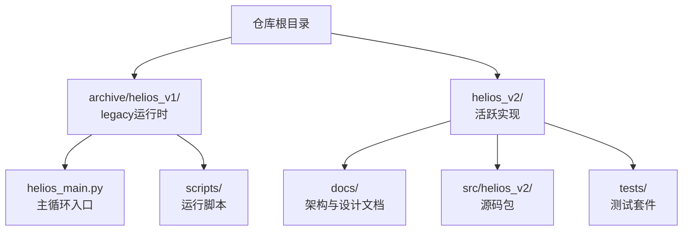
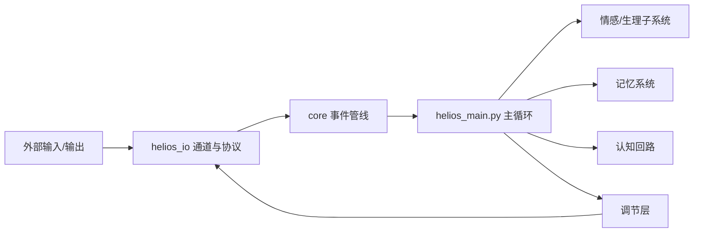
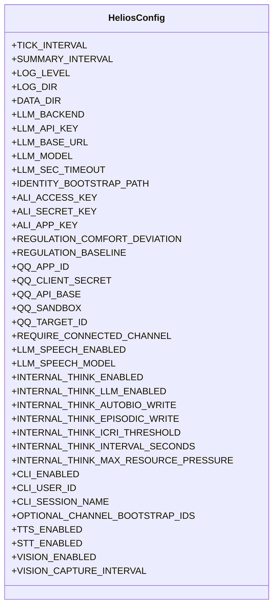
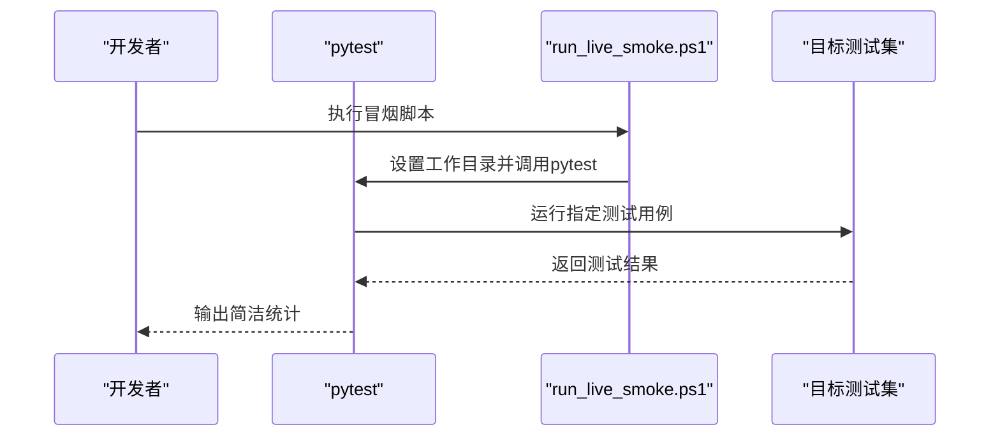
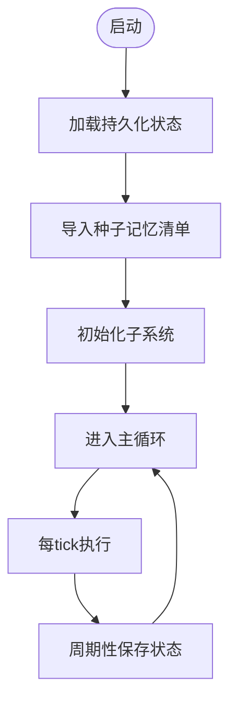
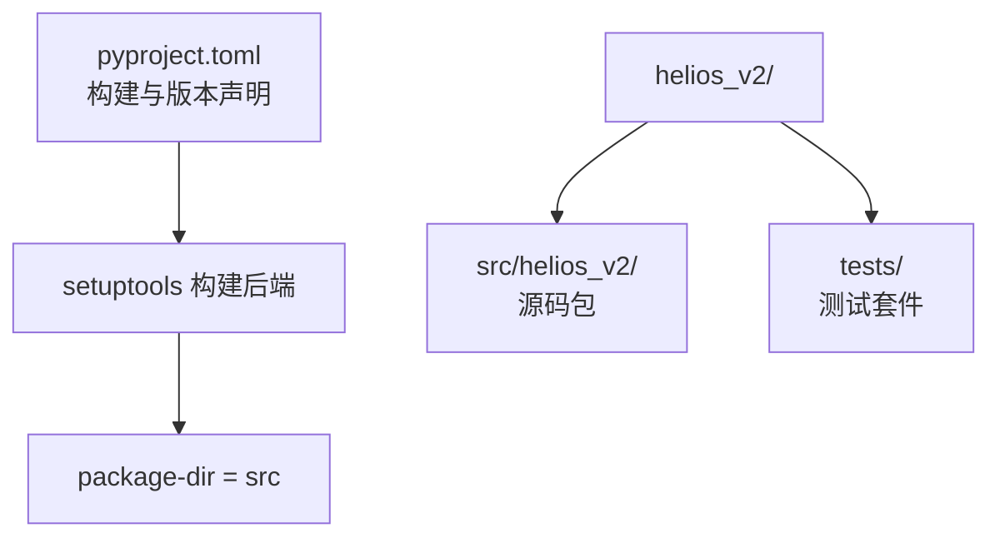

# 快速开始指南

<cite>
**本文引用的文件**
- [README.md](file://README.md)
- [archive/helios_v1/README.md](file://archive/helios_v1/README.md)
- [archive/helios_v1/helios_main.py](file://archive/helios_v1/helios_main.py)
- [archive/helios_v1/scripts/run_live_smoke.ps1](file://archive/helios_v1/scripts/run_live_smoke.ps1)
- [helios_v2/README.md](file://helios_v2/README.md)
- [helios_v2/pyproject.toml](file://helios_v2/pyproject.toml)
</cite>

## 目录
1. [简介](#简介)
2. [项目结构](#项目结构)
3. [核心组件](#核心组件)
4. [架构总览](#架构总览)
5. [详细组件分析](#详细组件分析)
6. [依赖分析](#依赖分析)
7. [性能考虑](#性能考虑)
8. [故障排除指南](#故障排除指南)
9. [结论](#结论)
10. [附录](#附录)

## 简介
本指南面向希望在30分钟内成功运行Helios项目的开发者，提供从环境准备到首次启动的完整路径。Helios是一个持续运行的具身与认知智能体，具备情感子系统、记忆体系、认知回路与调节层，并通过明确的I/O边界连接外部世界。当前活跃实现位于helios_v2/，而legacy v1已归档至archive/helios_v1/。

为保证可操作性，本指南聚焦于v1主循环入口与常用运行方式；同时在文末提供v2开发与测试要点，便于后续迁移与扩展。

## 项目结构
- 顶层README明确指出：当前活跃实现位于helios_v2/，旧版v1仅保留用于历史参考。
- v1主循环入口为archive/helios_v1/helios_main.py，提供完整的运行流程与环境变量配置说明。
- v2 README与pyproject.toml提供了开发工作流、包结构与测试运行方式。

图表来源
- [README.md:1-19](file://README.md#L1-L19)
- [archive/helios_v1/README.md:100-113](file://archive/helios_v1/README.md#L100-L113)
- [helios_v2/README.md:46-54](file://helios_v2/README.md#L46-L54)

章节来源
- [README.md:1-19](file://README.md#L1-L19)
- [archive/helios_v1/README.md:100-113](file://archive/helios_v1/README.md#L100-L113)
- [helios_v2/README.md:46-54](file://helios_v2/README.md#L46-L54)

## 核心组件
- 主循环与配置
  - v1主循环入口提供HeliosConfig类，集中管理主循环节拍、日志、LLM接入、QQ机器人、多模态通道等关键参数。
  - 常用运行命令：直接运行主循环入口或通过测试脚本进行“冒烟”验证。
- 多模态通道与I/O
  - v1支持CLI、QQ、TTS、STT、视觉等通道，可通过环境变量启用/禁用。
- 记忆与持久化
  - v1包含自传体、情景与工作记忆系统，启动时会加载持久化状态并导入种子记忆清单。
- 调节与行为执行
  - v1提供RegulationEngine与行为执行桥接，将内部状态转化为外部表达与行动。

章节来源
- [archive/helios_v1/helios_main.py:123-186](file://archive/helios_v1/helios_main.py#L123-L186)
- [archive/helios_v1/helios_main.py:318-429](file://archive/helios_v1/helios_main.py#L318-L429)
- [archive/helios_v1/helios_main.py:586-663](file://archive/helios_v1/helios_main.py#L586-L663)

## 架构总览
Helios v1采用“外部输入/输出 → I/O网关 → 核心事件管线 → 主循环 → 内部子系统（情感/记忆/认知/调节）→ I/O网关”的闭环结构。主循环每tick执行事件收集、情感与生理状态更新、记忆写入与整合、认知评估与驱动、行为调节与外部表达。

图表来源
- [archive/helios_v1/README.md:59-71](file://archive/helios_v1/README.md#L59-L71)
- [archive/helios_v1/helios_main.py:356-429](file://archive/helios_v1/helios_main.py#L356-L429)

## 详细组件分析

### 组件A：主循环与配置（HeliosConfig）
- 功能职责
  - 统一管理主循环节拍间隔、摘要输出周期、日志级别与目录、数据目录、LLM后端与凭证、阿里云相关密钥、调节舒适度与基线、QQ机器人参数、内部思考开关与阈值、多模态通道开关与捕获间隔等。
- 关键点
  - 所有参数均可通过环境变量覆盖，便于在不同部署场景下灵活调整。
  - 支持可选模块（如Phi、神经化学）按需启用。
- 使用建议
  - 首次运行建议先启用CLI通道与基础LLM能力，再逐步开启QQ与多模态通道以降低复杂度。

图表来源
- [archive/helios_v1/helios_main.py:123-186](file://archive/helios_v1/helios_main.py#L123-L186)

章节来源
- [archive/helios_v1/helios_main.py:123-186](file://archive/helios_v1/helios_main.py#L123-L186)

### 组件B：运行流程（启动与冒烟验证）
- 常见启动方式
  - 直接运行主循环入口：python helios_main.py
  - 使用测试脚本进行“冒烟”验证：运行指定测试用例以快速确认核心链路可用
- 冒烟验证要点
  - 测试脚本会自动定位仓库根目录并执行关键通道与响应管道测试，适合在本地快速验证运行链路。

图表来源
- [archive/helios_v1/scripts/run_live_smoke.ps1:1-7](file://archive/helios_v1/scripts/run_live_smoke.ps1#L1-L7)

章节来源
- [archive/helios_v1/scripts/run_live_smoke.ps1:1-7](file://archive/helios_v1/scripts/run_live_smoke.ps1#L1-L7)
- [archive/helios_v1/README.md:131-138](file://archive/helios_v1/README.md#L131-L138)

### 组件C：复杂逻辑流程（记忆导入与状态持久化）
- 流程说明
  - 启动时加载持久化的人格、身份与异稳态状态
  - 导入种子记忆清单，支持内联与文件两种来源
  - 周期性保存状态，确保运行中断后可恢复

图表来源
- [archive/helios_v1/helios_main.py:586-663](file://archive/helios_v1/helios_main.py#L586-L663)
- [archive/helios_v1/helios_main.py:686-771](file://archive/helios_v1/helios_main.py#L686-L771)

章节来源
- [archive/helios_v1/helios_main.py:586-663](file://archive/helios_v1/helios_main.py#L586-L663)
- [archive/helios_v1/helios_main.py:686-771](file://archive/helios_v1/helios_main.py#L686-L771)

## 依赖分析
- Python版本要求
  - v2 pyproject.toml声明最低Python版本为3.11，建议在该版本或更高版本上进行开发与运行。
- 包结构与构建
  - v2使用setuptools构建，包目录指向src，便于清晰分离源码与构建产物。
- 开发工作流
  - v2 README强调“先需求、再设计、后实现”，并通过显式接口契约与owner边界确保模块职责清晰。

图表来源
- [helios_v2/pyproject.toml:1-15](file://helios_v2/pyproject.toml#L1-L15)
- [helios_v2/README.md:46-54](file://helios_v2/README.md#L46-L54)

章节来源
- [helios_v2/pyproject.toml:1-15](file://helios_v2/pyproject.toml#L1-L15)
- [helios_v2/README.md:17-26](file://helios_v2/README.md#L17-L26)

## 性能考虑
- 主循环节拍与摘要周期
  - 通过环境变量控制主循环节拍与摘要输出周期，可在资源受限环境下适当增大周期以降低开销。
- LLM推理超时
  - LLM SEC评估与语音生成均支持超时配置，合理设置可避免阻塞导致的性能抖动。
- 多模态通道按需启用
  - 在首次运行中建议关闭非必要通道（如视觉），待核心链路稳定后再逐步启用，以减少初始化与I/O开销。

## 故障排除指南
- 启动失败或无输出
  - 检查日志目录与权限，确认日志文件是否被正确创建
  - 确认环境变量是否正确设置，尤其是LLM后端、API密钥与模型名称
- QQ机器人无法连接
  - 检查QQ应用ID与客户端密钥是否配置，沙箱模式与目标ID是否符合预期
- 冒烟测试失败
  - 使用提供的冒烟脚本快速定位问题范围，优先排查网络连通性与LLM服务可用性
- 记忆导入异常
  - 检查种子清单文件是否存在且格式正确，确认导入指纹与重复保护逻辑未阻止必要的导入

章节来源
- [archive/helios_v1/helios_main.py:528-564](file://archive/helios_v1/helios_main.py#L528-L564)
- [archive/helios_v1/helios_main.py:123-186](file://archive/helios_v1/helios_main.py#L123-L186)
- [archive/helios_v1/scripts/run_live_smoke.ps1:1-7](file://archive/helios_v1/scripts/run_live_smoke.ps1#L1-L7)

## 结论
通过本指南，您可以在30分钟内完成Helios v1的环境准备、依赖与配置，并成功运行首个实例。建议先以CLI通道与基础LLM能力启动，随后逐步启用QQ与多模态通道；同时结合冒烟测试快速验证核心链路。若计划长期开发，可参考v2的owner边界与契约化设计原则，为后续演进奠定基础。

## 附录

### A. 快速开始步骤清单
- 准备Python环境（推荐3.11+）
- 克隆仓库并进入根目录
- 安装依赖（如需要dotenv支持）
- 配置环境变量（至少设置LLM后端与API密钥）
- 运行主循环入口或执行冒烟脚本
- 观察日志与数据目录输出，确认运行正常

章节来源
- [archive/helios_v1/README.md:131-138](file://archive/helios_v1/README.md#L131-L138)
- [archive/helios_v1/helios_main.py:123-186](file://archive/helios_v1/helios_main.py#L123-L186)

### B. 常用启动命令与参数说明
- 运行主循环入口
  - python helios_main.py
- 冒烟验证（Windows PowerShell）
  - 执行脚本以运行关键测试用例，快速验证通道与响应链路
- 关键环境变量（示例）
  - HELIOS_LLM_BACKEND、HELIOS_LLM_API_KEY、HELIOS_LLM_MODEL
  - HELIOS_QQ_APP_ID、HELIOS_QQ_CLIENT_SECRET、HELIOS_QQ_TARGET_ID
  - HELIOS_CLI_ENABLED、HELIOS_TTS_ENABLED、HELIOS_STT_ENABLED、HELIOS_VISION_ENABLED

章节来源
- [archive/helios_v1/README.md:131-138](file://archive/helios_v1/README.md#L131-L138)
- [archive/helios_v1/helios_main.py:123-186](file://archive/helios_v1/helios_main.py#L123-L186)
- [archive/helios_v1/scripts/run_live_smoke.ps1:1-7](file://archive/helios_v1/scripts/run_live_smoke.ps1#L1-L7)