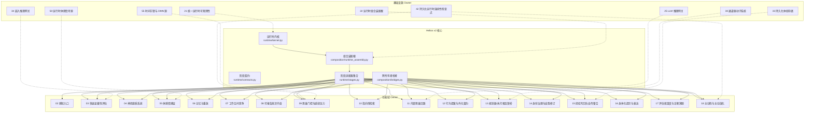
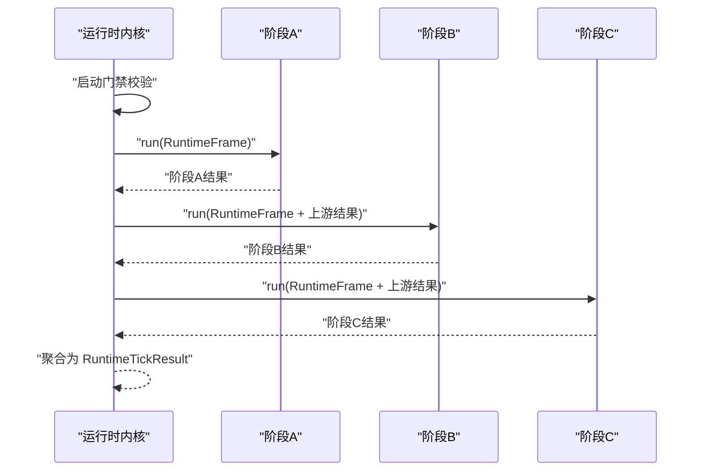
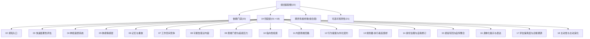
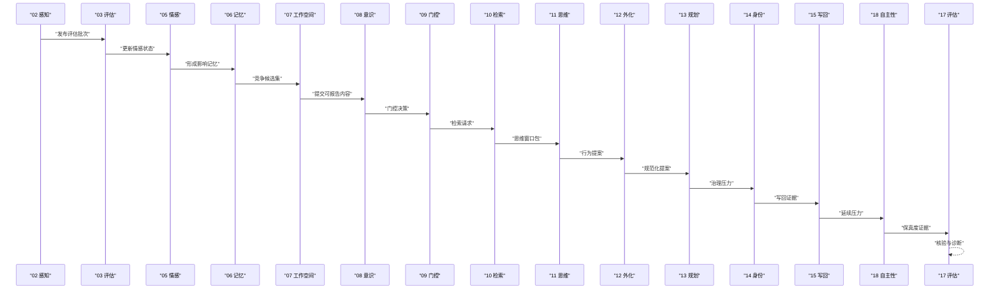

# 架构概览

<cite>
**本文档引用的文件**
- [helios_v2/README.md](file://helios_v2/README.md)
- [helios_v2/src/helios_v2/runtime/kernel.py](file://helios_v2/src/helios_v2/runtime/kernel.py)
- [helios_v2/src/helios_v2/runtime/stages.py](file://helios_v2/src/helios_v2/runtime/stages.py)
- [helios_v2/src/helios_v2/composition/runtime_assembly.py](file://helios_v2/src/helios_v2/composition/runtime_assembly.py)
- [helios_v2/src/helios_v2/composition/bridges.py](file://helios_v2/src/helios_v2/composition/bridges.py)
- [helios_v2/src/helios_v2/runtime/contracts.py](file://helios_v2/src/helios_v2/runtime/contracts.py)
- [helios_v2/docs/ARCHITECTURE_BOUNDARIES.md](file://helios_v2/docs/ARCHITECTURE_BOUNDARIES.md)
- [helios_v2/docs/OWNER_GUIDE.md](file://helios_v2/docs/OWNER_GUIDE.md)
- [helios_v1/README.md](file://archive/helios_v1/README.md)
- [helios_v1/helios_main.py](file://archive/helios_v1/helios_main.py)
</cite>

## 目录
1. [引言](#引言)
2. [项目结构](#项目结构)
3. [核心组件](#核心组件)
4. [架构总览](#架构总览)
5. [详细组件分析](#详细组件分析)
6. [依赖分析](#依赖分析)
7. [性能考虑](#性能考虑)
8. [故障排查指南](#故障排查指南)
9. [结论](#结论)
10. [附录](#附录)

## 引言

Helios 是一个受大脑启发的AI运行时系统，采用模块化、契约驱动与依赖注入的设计范式，通过阶段化执行实现从感知到行动的完整闭环。Helios v2 代表了新一代架构，强调“无硬编码策略路径”“无降级执行模式”“关键依赖必须在启动前可用”等原则，并以 owner 包为单位明确职责边界，确保跨模块协作通过显式 API 和操作契约进行。

本概览面向系统架构师与高级开发者，同时兼顾初学者对系统全貌的理解需求。我们将从运行时内核、模块化架构、阶段化执行、功能域交互、边界管理与契约驱动、依赖注入等方面展开，辅以架构图与数据流说明。

## 项目结构

Helios v2 采用清晰的分层与模块化组织方式：

- 运行时内核与阶段装配：`helios_v2/runtime/` 提供内核、阶段契约与装配逻辑
- 组合装配根：`helios_v2/composition/` 负责组装依赖门、阶段链与跨所有者桥接
- 功能域 owner：按领域划分（如感知、认知、情感、记忆、执行等），每个 owner 仅负责其职责范围内的决策与状态
- 基础设施 owner：提供能力与基础设施（如可观测性、LLM 网关、通道子系统、持久化、嵌入网关、连续性检查点、体感信号源、时间源）
- 文档与规范：`helios_v2/docs/` 提供架构边界、所有者指南、进度映射等权威文档

**图表来源**
- [helios_v2/src/helios_v2/runtime/kernel.py:1-145](file://helios_v2/src/helios_v2/runtime/kernel.py#L1-L145)
- [helios_v2/src/helios_v2/runtime/stages.py:1-800](file://helios_v2/src/helios_v2/runtime/stages.py#L1-L800)
- [helios_v2/src/helios_v2/composition/runtime_assembly.py:1-800](file://helios_v2/src/helios_v2/composition/runtime_assembly.py#L1-L800)
- [helios_v2/src/helios_v2/composition/bridges.py:1-800](file://helios_v2/src/helios_v2/composition/bridges.py#L1-L800)

**章节来源**
- [helios_v2/README.md:1-70](file://helios_v2/README.md#L1-L70)
- [helios_v2/docs/ARCHITECTURE_BOUNDARIES.md:1-329](file://helios_v2/docs/ARCHITECTURE_BOUNDARIES.md#L1-L329)

## 核心组件

- 运行时内核（RuntimeKernel）
  - 负责启动门禁校验、有序阶段派发、生命周期观测事件记录
  - 通过依赖提供者验证关键依赖是否满足，不满足则立即失败
  - 每个阶段执行后聚合输出，形成每 tick 的结果快照

- 阶段契约（RuntimeStage/RuntimeFrame）
  - 所有 owner 仅通过阶段契约暴露生命周期接口，内核统一调度
  - 每个阶段接收不可变的运行时帧（包含当前 tick 与上游阶段结果映射）

- 组合装配根（RuntimeAssembly）
  - 将依赖门禁、19 阶阶段链、首版本跨所有者桥接与可选可观测性装配为单一可运行句柄
  - 严格校验阶段顺序与数量，不允许降级或回退装配路径

- 跨所有者桥接（Bridges）
  - 以“所有者中立”的方式转发上游阶段结果，不进行下游语义决策
  - 保留上游溯源 ID，确保下游可验证与可追溯

**章节来源**
- [helios_v2/src/helios_v2/runtime/kernel.py:1-145](file://helios_v2/src/helios_v2/runtime/kernel.py#L1-L145)
- [helios_v2/src/helios_v2/runtime/contracts.py:1-50](file://helios_v2/src/helios_v2/runtime/contracts.py#L1-L50)
- [helios_v2/src/helios_v2/composition/runtime_assembly.py:1-800](file://helios_v2/src/helios_v2/composition/runtime_assembly.py#L1-L800)
- [helios_v2/src/helios_v2/composition/bridges.py:1-800](file://helios_v2/src/helios_v2/composition/bridges.py#L1-L800)

## 架构总览

Helios v2 的架构遵循“运行时内核 + 功能域 owner + 基础设施 owner”的三层结构，通过阶段化执行串联各领域，形成从感知、评估、情感、记忆到执行的完整闭环。

**图表来源**
- [helios_v2/docs/ARCHITECTURE_BOUNDARIES.md:175-210](file://helios_v2/docs/ARCHITECTURE_BOUNDARIES.md#L175-L210)
- [helios_v2/docs/OWNER_GUIDE.md:50-191](file://helios_v2/docs/OWNER_GUIDE.md#L50-L191)

## 详细组件分析

### 运行时内核与阶段化执行

- 内核职责
  - 启动门禁：在任何阶段执行前，验证关键依赖可用性，缺失则抛出启动错误
  - 阶段调度：按稳定顺序依次执行各阶段，记录每个阶段的生命周期事件
  - 结果聚合：将各阶段输出封装为不可变的 tick 结果，供后续阶段与评估使用

- 阶段契约
  - 每个阶段通过统一的阶段名标识自身所有权，内核仅通过阶段契约与其交互
  - 运行时帧包含当前 tick 编号与上游阶段结果映射，保证语义不变性

- 阶段适配器
  - 每个阶段适配器负责将上游阶段结果转换为下游阶段请求或上下文
  - 若上游结果不满足下游契约，阶段执行直接失败，避免静默回退

**图表来源**
- [helios_v2/src/helios_v2/runtime/kernel.py:75-145](file://helios_v2/src/helios_v2/runtime/kernel.py#L75-L145)
- [helios_v2/src/helios_v2/runtime/stages.py:1-800](file://helios_v2/src/helios_v2/runtime/stages.py#L1-L800)

**章节来源**
- [helios_v2/src/helios_v2/runtime/kernel.py:1-145](file://helios_v2/src/helios_v2/runtime/kernel.py#L1-L145)
- [helios_v2/src/helios_v2/runtime/contracts.py:1-50](file://helios_v2/src/helios_v2/runtime/contracts.py#L1-L50)

### 组合装配根与所有者边界

- 组合装配根
  - 负责装配依赖门禁、19 阶阶段链、首版本跨所有者桥接与可选可观测性
  - 严格校验阶段顺序与数量，不允许降级或回退装配路径
  - 通过运行时句柄对外暴露生命周期方法（startup、tick）

- 所有者边界
  - 每个 owner 仅负责其职责范围内的决策与状态，不得越界访问其他 owner 的私有状态
  - 跨模块协作通过显式 API 与操作契约进行，禁止直接状态穿透
  - 评估 owner 仅消费证据，不得修改运行时行为

**图表来源**
- [helios_v2/src/helios_v2/composition/runtime_assembly.py:222-273](file://helios_v2/src/helios_v2/composition/runtime_assembly.py#L222-L273)
- [helios_v2/docs/ARCHITECTURE_BOUNDARIES.md:34-124](file://helios_v2/docs/ARCHITECTURE_BOUNDARIES.md#L34-L124)

**章节来源**
- [helios_v2/src/helios_v2/composition/runtime_assembly.py:1-800](file://helios_v2/src/helios_v2/composition/runtime_assembly.py#L1-L800)
- [helios_v2/docs/ARCHITECTURE_BOUNDARIES.md:1-329](file://helios_v2/docs/ARCHITECTURE_BOUNDARIES.md#L1-L329)

### 功能域交互与数据流

- 感知（02）→ 评估（03）→ 情感（05）→ 记忆（06）→ 工作空间（07）→ 意识（08）→ 门控（09）→ 检索（10）→ 思维（11）→ 外化（12）→ 规划（13）→ 身份（14）→ 写回（15）→ 自主性（18）→ 评估（17）
- 数据在阶段间以“阶段结果 + 操作契约”的形式传递，所有者中立桥接仅转发字段并保留溯源 ID
- 评估（17）作为只读所有者，重建上一 tick 的执行时间线视图并与当前 tick 的自述结果进行保真度核验

**图表来源**
- [helios_v2/src/helios_v2/runtime/stages.py:1-800](file://helios_v2/src/helios_v2/runtime/stages.py#L1-L800)
- [helios_v2/docs/OWNER_GUIDE.md:68-191](file://helios_v2/docs/OWNER_GUIDE.md#L68-L191)

**章节来源**
- [helios_v2/src/helios_v2/runtime/stages.py:1-800](file://helios_v2/src/helios_v2/runtime/stages.py#L1-L800)
- [helios_v2/docs/OWNER_GUIDE.md:1-287](file://helios_v2/docs/OWNER_GUIDE.md#L1-L287)

### 设计模式应用

- 契约驱动开发
  - 所有跨模块交互通过显式 API 与操作契约进行，禁止隐藏调用
  - 每个阶段结果与提供者协议均在边界文档中明确定义

- 依赖注入
  - 组合装配根集中注入关键依赖与能力（如 LLM 网关、嵌入网关、通道子系统、持久化、时间源、体感信号源）
  - 所有者仅消费注入的能力，不直接管理其生命周期

- 边界管理
  - 明确划分“认知 owner”“基础设施 owner”，前者负责决策，后者提供能力
  - 评估 owner 仅消费证据，不参与决策

**章节来源**
- [helios_v2/docs/ARCHITECTURE_BOUNDARIES.md:23-32](file://helios_v2/docs/ARCHITECTURE_BOUNDARIES.md#L23-L32)
- [helios_v2/docs/OWNER_GUIDE.md:204-210](file://helios_v2/docs/OWNER_GUIDE.md#L204-L210)

## 依赖分析

Helios v2 的依赖方向遵循“上游输出 → 下游输入”的单向约束，避免环依赖与隐式耦合。

**图表来源**
- [helios_v2/docs/ARCHITECTURE_BOUNDARIES.md:175-210](file://helios_v2/docs/ARCHITECTURE_BOUNDARIES.md#L175-L210)

**章节来源**
- [helios_v2/docs/ARCHITECTURE_BOUNDARIES.md:175-210](file://helios_v2/docs/ARCHITECTURE_BOUNDARIES.md#L175-L210)

## 性能考虑

- 启动门禁与失败快速返回：在启动阶段即发现缺失关键依赖，避免运行期缓慢失败
- 阶段顺序固定且可验证：通过常量顺序与装配校验，减少动态调度开销
- 跨所有者桥接最小化：仅转发必要字段，不引入额外计算
- 可观测性默认关闭：内核不强制注入记录器，避免不必要的开销
- 持久化与嵌入按需启用：仅在装配时开启，避免非必要的 IO 与网络调用

[本节为通用指导，无需特定文件引用]

## 故障排查指南

- 启动失败（缺少关键依赖）
  - 检查依赖提供者返回的状态详情，确认缺失项并补齐
  - 关注内核记录的启动失败事件，定位具体依赖名称

- 阶段执行失败
  - 查看阶段失败事件记录，确认错误类型与阶段索引
  - 检查上游阶段结果是否满足下游契约，必要时回溯到上游阶段

- 评估保真度异常
  - 检查上一 tick 的执行时间线视图与当前 tick 的自述结果是否一致
  - 关注“不可验证/不一致/已证实”等核验结果，定位具体阶段与事实映射

**章节来源**
- [helios_v2/src/helios_v2/runtime/kernel.py:46-145](file://helios_v2/src/helios_v2/runtime/kernel.py#L46-L145)

## 结论

Helios v2 通过运行时内核、阶段化执行、契约驱动与依赖注入，构建了一个高内聚、低耦合、可验证的模块化架构。所有者边界清晰，跨模块协作通过显式 API 与操作契约进行；评估 owner 作为只读观察者，确保系统行为可诊断、可追溯。随着 P3 与后续波次的推进，更多上游信号将被真实化，系统将逐步实现从“基线真实”到“深度真实”的演进。

[本节为总结性内容，无需特定文件引用]

## 附录

- 与 v1 的差异
  - v1 采用“主循环 + 多模块拼装”的运行时结构，强调长期运行与多模态 I/O
  - v2 采用“内核 + 阶段链 + 所有者 owner”的架构，强调契约驱动与可验证性
  - v2 在所有者边界、依赖方向、API 与操作契约方面有更严格的规范

**章节来源**
- [archive/helios_v1/README.md:1-207](file://archive/helios_v1/README.md#L1-L207)
- [archive/helios_v1/helios_main.py:1-800](file://archive/helios_v1/helios_main.py#L1-L800)