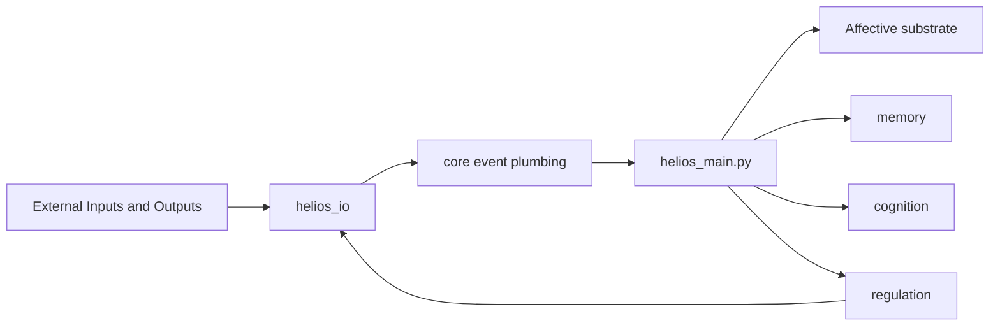

# Helios

Helios is not a one-shot chatbot demo. It is a continuously running affective and cognitive agent with a main loop, a memory system, a cognition stack, a regulation layer, and explicit I/O boundaries.

It is built as a long-lived process that keeps changing even when no one is talking to it.

Think less "command bot" and more "ongoing inner weather system with memory, mood, theory, and architecture."

## Start Here

If you only open one thing, open the documentation portal first:

- [docs/docs_home.html](docs/docs_home.html)

If you want the visual version immediately:

- [docs/architecture_overview.html](docs/architecture_overview.html)

Those two HTML pages are the best entry points for understanding what Helios is, how the current architecture works, and where the active docs and foundational archive live.

### Quick Mood Board

- cognition, drives, phi, endogenous thought
- affective substrate, mood, personality, allostasis
- autobiographical and episodic memory
- multimodal I/O, QQ integration, speech, channels
- research-backed architecture and theory mapping

## What Helios Is Trying To Be

Helios combines several layers into one runtime loop:

- affective substrate modules such as DAISY, allostasis, mood, personality, neurochemistry, and habituation
- memory layers for autobiographical, episodic, semantic, and working memory
- cognition layers for appraisal, drives, phi or ICRI, and endogenous thought
- regulation layers that turn internal deviation into behavior pressure
- `helios_io/` modules that connect the system to channels, protocols, speech, and external actions

The result is a codebase that mixes runtime engineering with research-driven ideas from affective neuroscience, predictive processing, consciousness models, memory systems, and appraisal theory.

### In One Sentence

Helios is an attempt to make an agent that does not merely respond, but continues to feel, remember, interpret, drift, regulate, and act inside an ongoing loop.

## Architecture At A Glance

One practical rule defines most of the repository:

- the repository root holds runtime entry surfaces and foundational substrate modules
- `helios_io/` owns transport and world-facing behavior
- `core/` owns transport-agnostic runtime infrastructure
- `memory/`, `cognition/`, and `regulation/` own the internal capability layers

## Fast Tour

| If you want to... | Open this |
| --- | --- |
| Understand the project quickly | [docs/docs_home.html](docs/docs_home.html) |
| See the visual architecture | [docs/architecture_overview.html](docs/architecture_overview.html) |
| Read the current architecture narrative | [docs/ARCHITECTURE.en.md](docs/ARCHITECTURE.en.md) |
| Read the detailed runtime design | [docs/DESIGN_PHILOSOPHY.en.md](docs/DESIGN_PHILOSOPHY.en.md) |
| Trace modules back to theory and tests | [docs/IMPLEMENTATION_REFERENCE.en.md](docs/IMPLEMENTATION_REFERENCE.en.md) |
| Inspect source provenance and citation backlog | [docs/SOURCE_CATALOG.en.md](docs/SOURCE_CATALOG.en.md) |
| Jump into the runtime entry point | `helios_main.py` |

### Suggested Path

1. Open the HTML portal.
2. Read the architecture overview.
3. Read the detailed runtime design.
4. Trace modules back to theories and papers.
5. Dive into the source catalog if you want provenance.

## Repository Shape

- `helios_main.py`: primary runtime entry point and orchestration loop
- `dashboard.py` and `dashboard.html`: runtime dashboard surface
- `allostasis.py`, `daisy_emotion.py`, `mood_tracker.py`, `personality.py`, `neurochem.py`, `habituation.py`: affective and physiological substrate
- `helios_io/`: protocols, channels, passive reply pipeline, conversation history, SEC evaluation, ICRI temperature mapping, behavior execution boundary
- `core/`: event plumbing, tick state, trigger merge, and tick guard
- `memory/`: autobiographical, episodic, semantic, working-memory, compression, and seed import logic
- `cognition/`: appraisal, drives, phi, thinking, and integration layers
- `regulation/`: action selection, conation, and behavior regulation
- `docs/`: active architecture, detailed design, implementation mapping, visual overviews, and bilingual entry pages
- `docs/foundations/`: foundational research archive, theory notes, and source materials
- `tests/`: regression and property-based tests

## Runtime Feel

Each tick of the runtime typically does the following:

1. collect events and channel input
2. update affective state, allostasis, mood, personality, and optional neurochemical or phi signals
3. write and consolidate memory
4. perform appraisal, drive estimation, and endogenous thinking
5. turn internal state into behavioral pressure through regulation
6. route external output back through `helios_io`

The authoritative runtime orchestration lives in `helios_main.py`. If older notes and current code disagree, the codebase and the active `docs/` documents win.

### The Rhythm

Sense -> feel -> remember -> think -> regulate -> express.

## Running Helios

Common entry points:

- run the main loop: `python helios_main.py`
- open the dashboard assets if you need the runtime surface
- use the HTML docs in `docs/` if you need the architecture view before reading code

Runtime behavior is environment-driven. `HeliosConfig` inside `helios_main.py` documents the main environment variables for timing, logging, LLM access, QQ integration, and multimodal channels.

## Reading Order

Use this path if you are new to the repository:

1. [docs/docs_home.html](docs/docs_home.html)
2. [docs/ARCHITECTURE.en.md](docs/ARCHITECTURE.en.md) or [docs/ARCHITECTURE.zh-CN.md](docs/ARCHITECTURE.zh-CN.md)
3. [docs/DESIGN_PHILOSOPHY.en.md](docs/DESIGN_PHILOSOPHY.en.md) or [docs/DESIGN_PHILOSOPHY.zh-CN.md](docs/DESIGN_PHILOSOPHY.zh-CN.md)
4. [docs/IMPLEMENTATION_REFERENCE.en.md](docs/IMPLEMENTATION_REFERENCE.en.md) or [docs/IMPLEMENTATION_REFERENCE.zh-CN.md](docs/IMPLEMENTATION_REFERENCE.zh-CN.md)
5. [docs/SOURCE_CATALOG.en.md](docs/SOURCE_CATALOG.en.md) or [docs/SOURCE_CATALOG.zh-CN.md](docs/SOURCE_CATALOG.zh-CN.md)
6. [docs/architecture_overview.html](docs/architecture_overview.html)
7. [docs/current_structure.md](docs/current_structure.md)

Use the foundational research notes in `docs/foundations/` only after the active docs. The active docs in `docs/` describe the current implementation. The foundational notes explain why the system was designed this way.

### Best First Click

If a new reader lands on this repository and you want them to immediately understand what matters, send them here:

- [docs/docs_home.html](docs/docs_home.html)

## Tests

The repository includes a broad suite under `tests/`. A documented validated baseline is:

- `python -m pytest -q` -> `601 passed`

If you are making changes, prefer validating the touched slice first and then rerunning the broader suite.

## Guardrails

- do not add new protocol clients or transport implementations at the repository root
- do not move transport-specific logic back into `core/`
- add future protocol implementations under `helios_io/protocols/`
- add future model-backed outward generation under `helios_io/llm/`
- keep `memory/`, `cognition/`, and `regulation/` focused on internal capability rather than transport details

## Current Documentation System

The `docs/` directory now includes:

- architecture overviews in Chinese and English
- detailed runtime design docs in Chinese and English
- implementation-to-theory mapping docs in Chinese and English
- source catalog and collection-backlog docs in Chinese and English
- static HTML pages for architecture navigation and visual system maps

The `docs/foundations/` directory now serves as the foundational archive for theory notes, historical synthesis, and raw source materials.

If you want the shortest path to understanding the project, go here first:

- [docs/docs_home.html](docs/docs_home.html)

## Why The Docs Matter

Helios is the kind of repository where code alone tells only part of the story.

The documentation system now splits responsibilities:

- `docs/` explains the current architecture, runtime design, implementation mapping, and source traceability
- `docs/foundations/` explains the theoretical background and preserved research basis
- together they show why modules exist, which theories influenced them, and how to move from architecture to sources without getting lost

So the README is intentionally a launchpad.

The actual guided experience starts in the HTML portal:

- [docs/docs_home.html](docs/docs_home.html)