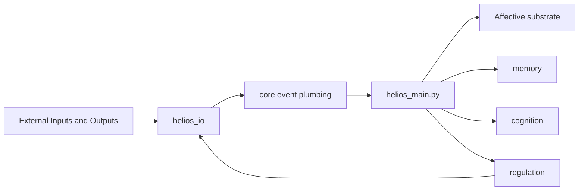

# Helios

Helios is not a one-shot chatbot demo. It is a continuously running affective and cognitive agent with a main loop, a memory system, a cognition stack, a regulation layer, and explicit I/O boundaries.

It is built as a long-lived process that keeps changing even when no one is talking to it.

## Start Here

If you only open one thing, open the research portal first:

- [research/research_home.html](research/research_home.html)

If you want the visual version immediately:

- [research/architecture_overview.html](research/architecture_overview.html)

Those two HTML pages are the best entry points for understanding what Helios is, how the current architecture works, and where the theory-backed design documents live.

## What Helios Is Trying To Be

Helios combines several layers into one runtime loop:

- affective substrate modules such as DAISY, allostasis, mood, personality, neurochemistry, and habituation
- memory layers for autobiographical, episodic, semantic, and working memory
- cognition layers for appraisal, drives, phi or ICRI, and endogenous thought
- regulation layers that turn internal deviation into behavior pressure
- `helios_io/` modules that connect the system to channels, protocols, speech, and external actions

The result is a codebase that mixes runtime engineering with research-driven ideas from affective neuroscience, predictive processing, consciousness models, memory systems, and appraisal theory.

## Architecture At A Glance

One practical rule defines most of the repository:

- the repository root holds runtime entry surfaces and foundational substrate modules
- `helios_io/` owns transport and world-facing behavior
- `core/` owns transport-agnostic runtime infrastructure
- `memory/`, `cognition/`, and `regulation/` own the internal capability layers

## Fast Tour

| If you want to... | Open this |
| --- | --- |
| Understand the project quickly | [research/research_home.html](research/research_home.html) |
| See the visual architecture | [research/architecture_overview.html](research/architecture_overview.html) |
| Read the current architecture narrative | [research/ARCHITECTURE.en.md](research/ARCHITECTURE.en.md) |
| Read the detailed runtime design | [research/DESIGN_PHILOSOPHY.en.md](research/DESIGN_PHILOSOPHY.en.md) |
| Trace modules back to theory and tests | [research/IMPLEMENTATION_REFERENCE.en.md](research/IMPLEMENTATION_REFERENCE.en.md) |
| Inspect source provenance and citation backlog | [research/SOURCE_CATALOG.en.md](research/SOURCE_CATALOG.en.md) |
| Jump into the runtime entry point | `helios_main.py` |

## Repository Shape

- `helios_main.py`: primary runtime entry point and orchestration loop
- `dashboard.py` and `dashboard.html`: runtime dashboard surface
- `allostasis.py`, `daisy_emotion.py`, `mood_tracker.py`, `personality.py`, `neurochem.py`, `habituation.py`: affective and physiological substrate
- `helios_io/`: protocols, channels, passive reply pipeline, conversation history, SEC evaluation, ICRI temperature mapping, behavior execution boundary
- `core/`: event plumbing, tick state, trigger merge, and tick guard
- `memory/`: autobiographical, episodic, semantic, working-memory, compression, and seed import logic
- `cognition/`: appraisal, drives, phi, thinking, and integration layers
- `regulation/`: action selection, conation, and behavior regulation
- `research/`: active architecture docs, implementation mapping, source catalog, and foundational research notes
- `tests/`: regression and property-based tests

## Runtime Feel

Each tick of the runtime typically does the following:

1. collect events and channel input
2. update affective state, allostasis, mood, personality, and optional neurochemical or phi signals
3. write and consolidate memory
4. perform appraisal, drive estimation, and endogenous thinking
5. turn internal state into behavioral pressure through regulation
6. route external output back through `helios_io`

The authoritative runtime orchestration lives in `helios_main.py`. If older notes and current code disagree, the codebase and the active `research/` documents win.

## Running Helios

Common entry points:

- run the main loop: `python helios_main.py`
- open the dashboard assets if you need the runtime surface
- use the HTML docs in `research/` if you need the architecture view before reading code

Runtime behavior is environment-driven. `HeliosConfig` inside `helios_main.py` documents the main environment variables for timing, logging, LLM access, QQ integration, and multimodal channels.

## Reading Order

Use this path if you are new to the repository:

1. [research/research_home.html](research/research_home.html)
2. [research/ARCHITECTURE.en.md](research/ARCHITECTURE.en.md) or [research/ARCHITECTURE.zh-CN.md](research/ARCHITECTURE.zh-CN.md)
3. [research/DESIGN_PHILOSOPHY.en.md](research/DESIGN_PHILOSOPHY.en.md) or [research/DESIGN_PHILOSOPHY.zh-CN.md](research/DESIGN_PHILOSOPHY.zh-CN.md)
4. [research/IMPLEMENTATION_REFERENCE.en.md](research/IMPLEMENTATION_REFERENCE.en.md) or [research/IMPLEMENTATION_REFERENCE.zh-CN.md](research/IMPLEMENTATION_REFERENCE.zh-CN.md)
5. [research/SOURCE_CATALOG.en.md](research/SOURCE_CATALOG.en.md) or [research/SOURCE_CATALOG.zh-CN.md](research/SOURCE_CATALOG.zh-CN.md)
6. [research/architecture_overview.html](research/architecture_overview.html)
7. [research/current_structure.md](research/current_structure.md)

Use the foundational research notes only after the active docs. The active docs describe the current implementation. The foundational notes explain why the system was designed this way.

## Tests

The repository includes a broad suite under `tests/`. A documented validated baseline in the active structure reference is:

- `pytest -q` -> `520 passed`

If you are making changes, prefer validating the touched slice first and then rerunning the broader suite.

## Guardrails

- do not add new protocol clients or transport implementations at the repository root
- do not move transport-specific logic back into `core/`
- add future protocol implementations under `helios_io/protocols/`
- add future model-backed outward generation under `helios_io/llm/`
- keep `memory/`, `cognition/`, and `regulation/` focused on internal capability rather than transport details

## Current Documentation System

The `research/` directory now includes:

- architecture overviews in Chinese and English
- detailed runtime design docs in Chinese and English
- implementation-to-theory mapping docs in Chinese and English
- source catalog and collection-backlog docs in Chinese and English
- static HTML pages for architecture navigation and visual system maps

If you want the shortest path to understanding the project, go here first:

- [research/research_home.html](research/research_home.html)