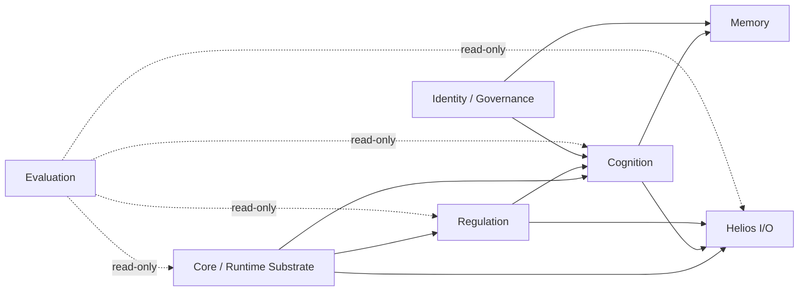
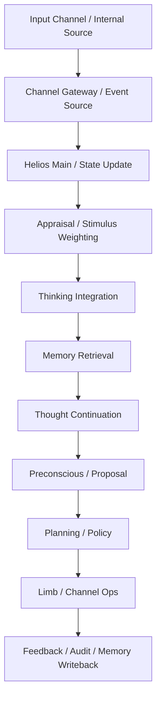
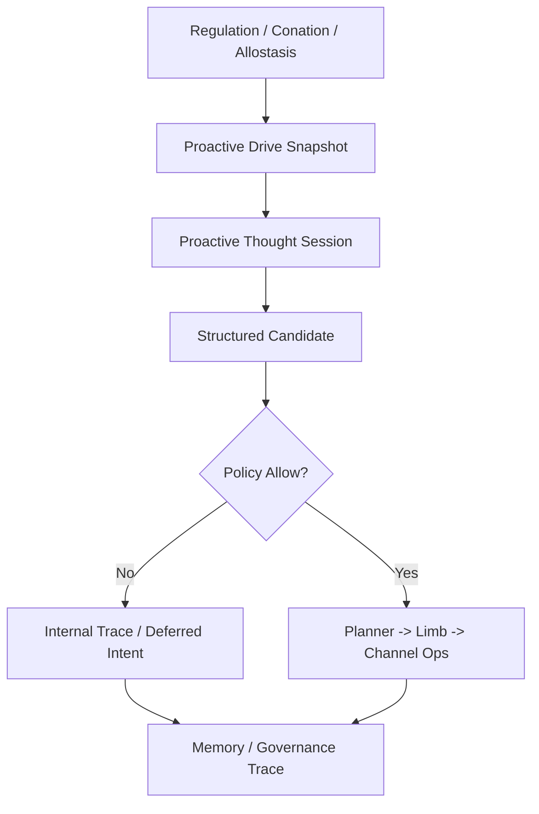
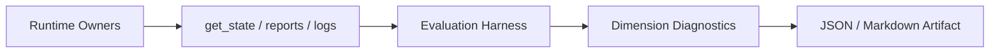

# Helios Architecture Boundaries

> Status: Working Draft
> Role: owner / boundary / collaboration truth document
> Scope: 用于在实现前后统一确认 Helios 各域 owner、允许依赖、禁止 shortcut、协作流和迁移态

## 1. 文档目的

本文件不替代哲学文档和 HLD，而是把它们落到更可执行的域边界层。

目标只有三个：

1. 明确谁拥有什么。
2. 明确谁可以依赖谁。
3. 明确哪些 shortcut 在当前重构批次中被视为架构违规。

## 2. 边界解释规则

### 2.1 owner 的含义

owner 指对某类状态、决策或输出负责的主要模块域。owner 不要求独占所有代码调用，但必须拥有最终语义解释权。

### 2.2 当前态与目标态

本文档同时描述两层事实：

1. 当前 runtime truth：代码现在已经主要怎样工作。
2. 目标边界 truth：后续 requirement 收敛后应该怎样工作。

如果两者冲突，必须显式标记为迁移态，而不是默认已经完成。

### 2.3 依赖方向规则

Helios 的依赖方向应尽量满足：

解释约束：

1. evaluation 只读观察，不拥有运行决策权。
2. channel 只拥有 I/O 适配与 ops，不拥有思考和身份写回权。
3. identity / governance 不直接拥有 channel outward 决策。

## 3. 域 Owner 总览

| 域 | 主要 owner | 主要职责 | 允许直接依赖 | 禁止拥有 |
| --- | --- | --- | --- | --- |
| Root Runtime | `helios_main.py` | 顶层 tick orchestration、阶段编排、owner 调度 | `core/`, `cognition/`, `regulation/`, `helios_io/`, `memory/` | prompt 细节、channel 私有实现细节、身份直接改写 |
| Core Infrastructure | `core/` | 统一事件、tick、时间动力学、状态快照 | 自身与被上层读取 | 思考语义、外发策略 |
| Cognition | `cognition/` | 思考触发、连续思考、recall intent、thought 产物 | `core/`, `memory/`, `regulation/`, `helios_io` 的正式 contract | 直接 channel 输出、最终身份写回 |
| Memory | `memory/` | 分层记忆、定向检索、整合和压缩 | `core/`, `cognition/`, `governance` 语义 | 外部交互策略、评估打分 |
| Identity / Governance | `personality.py`, identity persistence | 身份 bootstrap、自我修订治理、审计 | `memory/`, `cognition/`, feedback/audit | prompt 即时改写、channel 直接输出 |
| Helios I/O | `helios_io/` | planner、policy、limb、channel ops、输入输出适配 | `core/`, `cognition/`, `regulation/` 的正式产物 | 自主 thought owner、身份 owner |
| Regulation | `regulation/` | drives、conation、主动性张力、调节策略 | `core/`, `cognition/` | channel 执行 owner、评估 owner |
| Evaluation | `helios_evaluation/` | read-only 评估、diagnostic artifact、gap analysis | 所有 owner 的正式只读出口 | runtime 决策、临时旁路采样 |

## 4. 域级边界细化

### 4.1 Root Runtime / Substrate

当前态：

1. `helios_main.py` 已承担主循环编排与状态导出。
2. R16 后 channel runtime snapshot 已从主循环外抽离一部分 owner。
3. 但主动性和 thought continuation 仍处于迁移态，尚未完全成为单一 thought-centered orchestration。

目标态：

1. 主循环只做阶段调度，不携带 reply-first 语义分叉。
2. 主循环拥有阶段顺序，不拥有具体策略细节。
3. 主循环对 evaluation 暴露只读状态快照，但不向 evaluation 暴露私有 mutable 对象。

### 4.2 Cognition / Consciousness Loop

当前态：

1. `thinking_integration` 已经是 thought owner 的核心候选，但仍存在 fallback 与被动路径痕迹。
2. `thinking.py`、`phi.py`、`appraisal.py` 仍未完全围绕连续主观思考统一。

目标态：

1. cognition 拥有“是否思考、思考什么、是否继续思考”的语义解释权。
2. cognition 可以生成结构化行动候选，但不能直接执行 channel。
3. cognition 输出给 planning 的必须是正式 proposal / provenance，而不是临时文本 shortcut。

### 4.3 Memory / Retrieval

当前态：

1. 已有 working / episodic / semantic / autobiographical 能力。
2. 但对外术语、owner 划分和 directed retrieval 的使用方式仍在迁移态。

目标态：

1. memory 拥有短期、中期、长期、自传记忆和 directed retrieval。
2. memory 负责 recall intent 消费与 consolidation，不负责决定是否对外说话。
3. active trace、未完成意图和 self-evolution 记录需要由 memory 与 governance 协作完成。

### 4.4 Identity / Governance

当前态：

1. trait 状态和 personality contract 已存在。
2. 但身份 bootstrap、版本历史和慢变量审计仍未完全 owner 化。

目标态：

1. 所有身份慢变量变化必须经过治理 owner。
2. prompt 内容只消费身份，不直接改写身份。
3. 单次会话反馈只能形成治理输入，不直接成为身份事实。

### 4.5 Helios I/O / Channels / Ops

当前态：

1. R16 已把 channel lifecycle、ops、runtime registry 明确为正式边界。
2. planner、policy、limb、routing 仍需继续从 reply-first 语义迁移到 thought-to-action 语义。

目标态：

1. channel 只对外暴露 descriptor、ops、config、health、message ingress/egress 语义。
2. planner / policy 拥有“哪类 candidate 可以外化”的决策权。
3. channel gateway 只路由和执行，不判断“该不该主动”。

### 4.6 Regulation / Behavior Registry

当前态：

1. regulation 已拥有 internal pressure 和 action tendency 的主要能力。
2. 但 proactive drive 还没有成为正式的一等输出。

目标态：

1. regulation 拥有 drive pressure、conation、主动性趋势和调节建议。
2. behavior registry 拥有合法能力目录与审计约束。
3. regulation 不能直接调用 channel 发出动作，只能推动 cognition / planning。

### 4.7 Evaluation

当前态：

1. CLI evaluation 已能产出结构化分数和 artifact。
2. 但维度与证据的绑定还不够强，存在高内部健康分的失真。

目标态：

1. evaluation 只读取正式 owner 导出的 state、logs、artifacts。
2. evaluation 拥有诊断解释，不拥有运行期修正权。
3. 所有评分都应能回链到 owner 边界和诊断证据。

## 5. 关键协作流

### 5.1 Stimulus Ingress -> Thought -> Action

边界规则：

1. input channel 不能越过 gateway 直接调用 planning。
2. thought 不能越过 planning 直接调用具体 channel 实现。
3. feedback 必须进入审计或记忆 owner，不能只停留在瞬时输出文本。

### 5.2 Proactive Drive -> Externalization

边界规则：

1. regulation 不直接拥有 outbound execution。
2. 被拒绝的 proactive candidate 不能静默消失，必须进入内部 trace。
3. policy 决策结果需要对 evaluation 可见。

### 5.3 Evaluation Sampling Path

边界规则：

1. evaluation 只读采样，不回写 runtime。
2. report 渲染不重新创造运行事实，只表达已有诊断证据。

## 6. 禁止 Shortcut 清单

以下模式在当前架构中视为违规或仅允许极短期迁移：

1. channel 直接执行未经过 planning / policy 的高层动作决策。
2. evaluation 直接读取 channel 私有字段并把它当成评分真相。
3. prompt 文本直接修改人格或身份持久化状态。
4. thinking 直接调用具体 channel 类实例而绕过 gateway ops。
5. response pipeline 重新成为 reply-first 主路径 owner。
6. policy 拒绝后静默丢弃主动性结果，不留 trace。
7. memory 检索只服务回复上下文，而不服务 thought continuation。

## 7. 当前关键迁移态

1. `helios_main.py` 仍未完全摆脱被动响应历史语义。
2. `helios_evaluation/cli_brain_like_evaluation.py` 仍在从 presence-based 评分迁移到 evidence-driven 诊断。
3. proactive drive 还未成为正式 state/export 字段。
4. identity governance 的版本化与审计边界仍未完整落盘。

## 8. 对新开发的约束

1. 新 feature 必须先回答它属于哪个域 owner。
2. 如果一个改动需要跨两个以上 owner，必须写明主 owner 和只读/调用边界。
3. 如果为了速度引入临时 shortcut，必须在 requirement 或 task 中显式记录退出条件。
4. 新测试必须验证 owner 路径，而不是只验证最终字符串输出。
