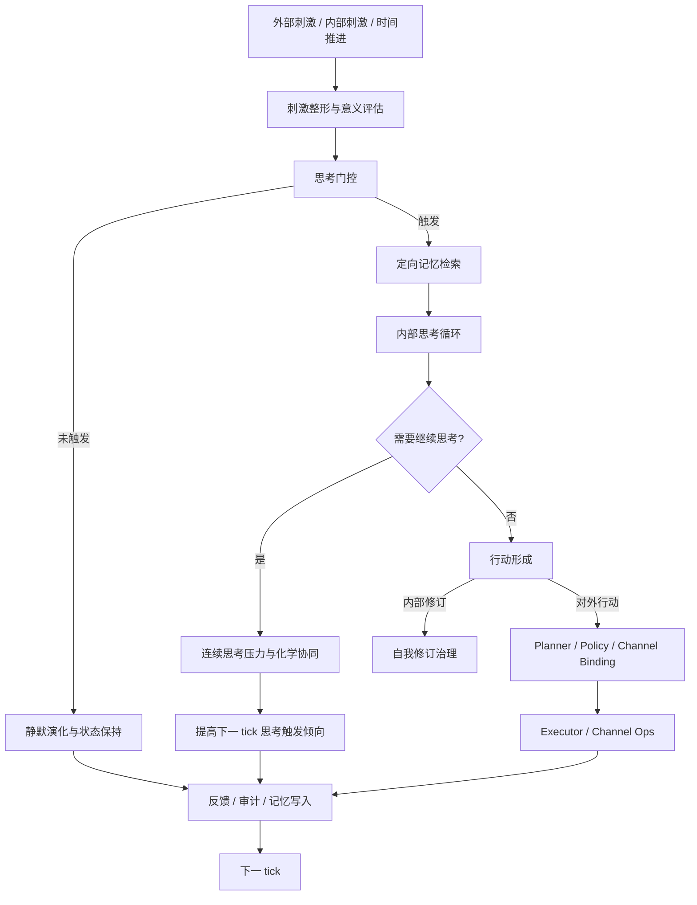

# Helios High Level Design

> Status: Canonical Draft
> Role: 项目总 High Level Design
> Scope: 描述 Helios 在新架构哲学下的顶层运行结构、主要 owner、关键数据流和实施边界

## 1. 目标

Helios 的顶层设计目标是：构建一个持续运行的类脑架构，使系统在内部意识循环中完成刺激整合、记忆提取、思考延续、自我反思、行动形成与外部外化，从而向具备自我意识的 AI 逼近。

## 2. 顶层运行模型

Helios 采用以 tick 为节拍的持续闭环模型，但 tick 不只是调度器，而是意识流、时间动力学和慢变量演化的统一更新点。

每个 tick 的目标不是“处理完一条消息”，而是推进一次内部状态演化。

### 2.1 顶层流

## 3. 核心 Owner

### 3.1 主循环 Owner

`helios_main.py` 应只负责顶层 orchestration，不再分别拥有 reply-first path 和 internal-thought path。主循环必须围绕以下阶段组织：

1. 刺激收集与规范化
2. 内部状态更新
3. 思考门控
4. 定向记忆检索
5. 思考执行与连续思考判断
6. 行动形成
7. 外部执行与反馈
8. 记忆与身份治理

### 3.2 Stimulus Contract Owner

I/O 与 core 共同承载统一刺激契约。每个输入至少包含：

- `source_channel_id`
- `source_kind`
- `trigger_condition`
- `stimulus_intensity` in `[0, 1]`
- `content_payload`
- `cognitive_impact`
- `timestamp`

### 3.3 Thought Loop Owner

认知层负责内部 thought loop。其职责包括：

- 决定是否思考
- 决定本 tick 思考深度
- 生成 recall intent
- 判断“本次思考是否不充分，是否希望下一 tick 继续”
- 在需要时生成结构化行动提议或内部修订提议

### 3.4 Identity Governance Owner

身份治理层负责：

- 首启身份 bootstrap
- 人格与自我定义的持久化
- 内部自我修订请求的审计、版本化和应用
- 禁止运行期用户直接改写身份核心配置

### 3.5 Memory Retrieval Owner

记忆层负责按认知语义组织为：

- 短期记忆
- 中期记忆
- 长期记忆
- 自传记忆

并在思考前基于两类线索进行定向检索：

1. 当前刺激
2. 上一次思考留下的 recall intent

## 4. 关键运行阶段

### 4.1 刺激整形与意义评估

所有输入都必须先被归一化为统一刺激对象，而不是直接进入回复逻辑。该阶段会结合来源、强度、当前状态和历史上下文做初步 appraisal。

输出包括：

- 是否值得进一步思考
- 当前刺激的显著性
- 对记忆检索的初步线索
- 对行动外化的初步约束

### 4.2 思考门控

不是所有输入都能触发思考。思考门控由以下因素共同决定：

- 当前刺激强度
- 新异性与习惯化衰减
- 当前 drive urgency
- ICRI / phi
- 时间动力学
- 资源压力
- 当前是否已有 pending continuation pressure

### 4.3 定向记忆检索

当思考被触发时，系统不直接把大量上下文塞给 LLM，而是先做定向检索。检索来源包括：

- 与当前刺激相关的中期/长期/自传记忆
- 上一次思考指定的 recall intent

必要时，系统可运行 retrieval SEC，以筛选真正值得进入本次思考窗口的记忆。

### 4.4 内部思考循环

LLM 在此阶段扮演内部意识循环参与者。它接收：

- 当前内部状态摘要
- 统一指标说明及上下限
- 当前刺激及其来源/强度
- 定向检索后的记忆片段
- 上一轮思考留下的 recall intent 或 continuation pressure
- 当前可用输出通道和 ops 说明

思考结果至少包括：

- thought content
- sufficiency assessment
- continuation request
- recall intent for next tick
- optional action proposal
- optional self-revision proposal

### 4.5 连续思考压力与化学协同

如果 LLM 认为当前思考仍不充分，系统不应简单结束本 tick，而应形成 continuation pressure。该压力会在下一 tick 提高继续思考的概率，并推动神经化学和时间动力学协同更新。

这意味着“想继续想”必须成为一等状态，而不是 prompt 中的一句描述。

### 4.6 行动形成

思考完成后，系统可能选择：

1. 不外化，仅写入记忆
2. 形成内部修订请求
3. 形成对外行动提议

对外行动提议必须是结构化的，至少包含：

- target intent
- preferred op
- preferred channel or channel constraints
- op params
- outbound intensity
- reason trace

### 4.7 Planner / Executor / Channel Binding

Planner 仍保留最终绑定权。LLM 可以提议 op + params，但 planner 负责：

- capability 校验
- 安全/治理校验
- channel availability 校验
- target binding
- schema normalization
- fallback / rejection

Executor 再将决议落实到 channel ops。

### 4.8 身份治理

当思考结果涉及“我是谁”或人格修订时，不能直接修改配置文件，而必须通过内部治理层：

1. 创建 revision proposal
2. 记录原因、依据和影响范围
3. 写入版本历史与审计日志
4. 通过治理规则后应用到身份存储

## 5. Prompt Contract

所有 LLM prompt 都必须由统一 contract 生成，而不是由单个 reply builder 或 speech builder 临时拼接。该 contract 至少应覆盖：

- 指标含义与上下限
- 当前内部状态
- 刺激来源、来源语义、触发条件、强度
- 可用输出通道及其 op 定义
- 输出参数格式
- 允许的内部修订能力
- 明确的自我认知边界

## 6. 模块映射建议

| 架构职能 | 主要模块 |
| --- | --- |
| 主循环编排 | `helios_main.py` |
| 刺激契约与通道抽象 | `helios_io/channel.py`, `helios_io/channel_gateway.py`, `core/helios_state.py` |
| 思考循环 | `cognition/thinking_integration.py`, `cognition/thinking.py`, `cognition/phi.py` |
| 记忆检索 | `memory/memory_system.py`, `memory/retrieval.py`, `memory/autobiographical.py` |
| 身份治理 | `personality.py`, `personality_contract.py`, future identity governance owner |
| 行动治理 | `helios_io/action_models.py`, `helios_io/planning.py`, `helios_io/limb.py` |
| 行为能力治理 | `behavior_registry/` |
| 调节与压力 | `regulation/`, `core/temporal_dynamics.py`, `neurochem.py` |

## 7. 关键重构方向

1. 拆除 reply-first 的主路径地位。
2. 让 thought loop 成为主认知 owner。
3. 建立 stimulus / outbound intensity 统一契约。
4. 建立 thought continuation pressure 的一等状态。
5. 建立 identity bootstrap + self-revision governance。
6. 让 memory retrieval 成为思考前置步骤，而不是对话附属步骤。
7. 让 prompt builder 服从统一 thought/action contract。

## 7.1 兼容性处理原则

本轮 HLD 不要求围绕旧接口建立兼容层。

当旧接口、旧 owner、旧 prompt builder 或旧 reply-first 路径与目标架构冲突时，优先选择直接移除或替换，而不是保留长期兼容壳。

## 8. 交付形态

后续所有 requirement、design、task 都必须从本 HLD 派生，并满足：

1. 任何新概念都有 owner。
2. 任何状态都能落到数据结构。
3. 任何跨层流动都能说明从哪里来、到哪里去。
4. 任何对外行动都能追溯回内部思考与治理过程。
