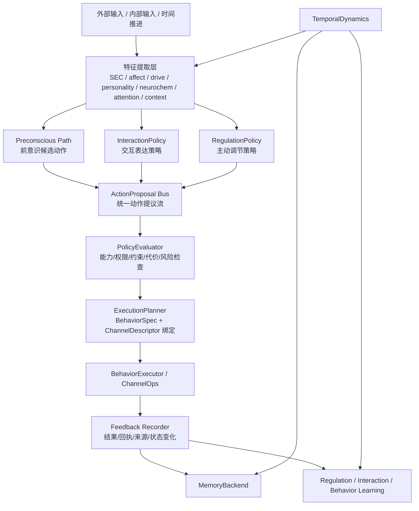

# Helios Soul-Core Enhance Low Level 设计文档

> Status: Finalized
> Audience: 架构维护者、功能扩展者、阶段实现负责人
> Scope: soul-core enhance 的低层设计、数据结构、模块接口、迁移顺序与失败模式

## 1. 设计目标

本设计文档的目标是把 `docs/requests.md` 中定义的 9 项需求收敛为一套统一的运行时架构，而不是引入 9 套彼此割裂的新机制。

本设计的核心结论是：

Helios 必须从当前“被动回复 + 主动行为 + 通道发送”的分叉模型，升级为“统一动作提议 -> 统一策略评估 -> 统一执行总线 -> 统一反馈闭环”的运行时模型。

## 2. 现状切点

当前系统的关键切点如下：

1. [helios_main.py] 当前持有 passive 与 active 的主要编排分叉。
2. [helios_io/response_pipeline.py] 当前持有被动回复判定与回复生成逻辑。
3. [regulation/regulation.py] 当前持有主动行为选择逻辑。
4. [helios_io/limb.py] 当前持有行为执行队列。
5. [helios_io/channel.py] 与 [helios_io/channel_gateway.py] 当前持有通道抽象与出入站路由。
6. [memory/memory_system.py] 与 [memory/autobiographical.py] 当前持有多层记忆与持久化语义。

本设计不会直接推翻这些模块，而是通过新增统一抽象层与后端替换层逐步迁移。

## 3. 总体架构



## 4. 新的统一抽象

### 4.1 ActionProposal

`ActionProposal` 是所有候选行为的统一结构，来源可能是：

1. InteractionPolicy
2. RegulationPolicy
3. Preconscious Path
4. 手动系统注入
5. 未来其他推理器

建议字段：

```text
proposal_id
source_type
source_module
intent_type
behavior_id_or_name
reason_summary
score_bundle
constraints
suggested_modalities
candidate_channels
parameters
provenance
created_at_tick
created_at_ts
```

### 4.2 ActionDecision

`ActionDecision` 是策略层与执行规划层共同产生的正式执行决议。

建议字段：

```text
decision_id
proposal_id
behavior_spec_id
selected_channel_id
selected_op
execution_priority
validated_params
rejection_reason
cost_estimate
policy_trace
```

### 4.3 BehaviorSpec

`BehaviorSpec` 是数据库中的正式行为定义。

建议字段：

```text
behavior_id
name
display_name
description
category
status
version
parameter_schema_json
applicable_context_json
cooldown_policy_json
cost_policy_json
allowed_channel_ids_json
required_capabilities_json
source_kind
source_detail_json
review_state
created_at
updated_at
```

### 4.4 ChannelDescriptor

`ChannelDescriptor` 是 channel 自描述对象。

建议字段：

```text
channel_id
display_name
input_types
output_types
input_formats
output_formats
supported_ops
management_ops
startup_requirements
shutdown_requirements
health_signals
ack_schema
limitations
```

### 4.5 PersonalityProjection

`PersonalityProjection` 是人格模块输出的结构化偏置结果。

建议字段：

```text
interaction_bias
initiative_bias
risk_tolerance
channel_preferences
style_preferences
behavior_biases
restlessness_bias
social_threshold_shift
```

### 4.6 TemporalState

`TemporalState` 是时间动力学维护的慢变量集合。

建议字段：

```text
boredom
fatigue_pressure
restoration_level
novelty_hunger
emotional_decay_factor
circadian_phase
inactivity_duration
recent_excitation_tail
```

## 5. 模块设计

### 5.1 InteractionPolicy 模块

#### 职责

评估主体当前是否想回应输入，以及应以什么行为和通道回应。

#### 输入

1. 入站消息
2. SEC 特征
3. 情绪状态
4. 人格投影
5. 注意力状态
6. neurochem 状态
7. temporal state
8. 最近互动上下文
9. 可用行为与 channel 能力

#### 输出

`list[ActionProposal]`

#### 替代现有位置

替代当前 `ResponsePipeline.should_reply()` 的核心判定职责；`ResponsePipeline` 后续可退化为“回复生成与对话上下文适配器”。

### 5.2 RegulationPolicy 模块

#### 职责

替代当前 `RegulationEngine.tick()` 中过于集中的评分逻辑，把主动行为选择提升为多因子策略评估。

#### 输入

1. affect / valence / arousal
2. drive urgency / drive dominant
3. personality projection
4. neurochem gate
5. temporal state
6. recent execution outcomes
7. behavior registry

#### 输出

`list[ActionProposal]`

#### 结构化边界

`RegulationPolicy` 至少应冻结以下中间对象：

1. `RegulationSignals`
    - panksepp / valence / hour_of_day
    - drive urgency / drive dominant
    - personality projection
    - neurochem gate
    - temporal gate
    - recent execution outcomes
2. `RegulationAssessment`
    - deviations
    - candidate actions
    - selected action
    - selected score
    - rationale / reason summary

#### 迁移兼容策略

在迁移阶段，`RegulationEngine` 不立即删除，而是退化为 learning / persistence / compatibility facade：

1. 学习与记忆更新仍由 `RegulationEngine` 持有。
2. 主动候选选择与 proposal 生成委托给 `RegulationPolicy`。
3. 旧的 `tick()` / `build_action_proposal()` 入口保留一段时间，用于主循环与测试平滑迁移。

#### 当前主循环落点

完成 `T4-3` 后，`helios_main.py` 的主动路径应优先消费 `generate_action_proposals()`，而不是再走“`tick()` 先返回 action string，再调用 `build_action_proposal()`”的过渡链。兼容 `tick()` 保留，仅用于旧测试和外部兼容入口。

#### 设计说明

保留当前调节主线，但将“固定权重 + 固定阈值 + cooldown/night 二值门”替换为策略项集合。

### 5.3 Preconscious Path 模块

#### 职责

在输入进入完整意识处理前生成快速候选动作。

#### 研究锚点

1. DMN / replay / episodic simulation 支持“先出现内部候选，再进入较慢反思整合”的结构。
2. 快速 appraisal 文献支持 salience-first 的低延迟优先级提升，但不支持绕过后续控制层直接执行。
3. 因此 Helios 的 preconscious path 应是 candidate path，而不是 hidden executor。

#### 限制

本模块必须在研究完成后再编码。

#### 输入

1. 最近输入 salience 与 appraisal 摘要
2. 当前 dominant affect / ICRI
3. temporal gate 与 neurochem gate
4. recent execution outcomes
5. compact memory retrieval hits
6. 内生 thought activity 摘要

#### 输出约束

只能生成 `ActionProposal`，不能直接操作 channel。

#### 建议边界

```text
PreconsciousSignals
PreconsciousAssessment
evaluate_preconscious(signals, state, retrieved_context) -> list[ActionProposal]
```

#### 设计约束

1. `source_type` 必须固定为 `preconscious`，便于后续 trace、审查与调试。
2. proposal 分数默认低于明确 reflective / interaction proposal，除非存在紧急 salience。
3. 不负责 memory backend 写入、channel 选择或执行批准。
4. 必须输出结构化 reason trace，说明是 replay、anticipation、threat salience 还是 comfort-seeking pressure 导致候选上浮。
5. 当信号较弱时应返回空列表，而不是制造弱意义 proposal。

#### 当前架构落点

第一版落点应靠近 `cognition/thinking_integration.py`、`helios_main.py` 的状态聚合层和统一 retrieval facade，而不是靠近 channel 层或执行器。

#### 第一版 rollout 约束

为避免 preconscious path 在早期阶段直接扰动已稳定的 regulation 主路径，第一版 runtime 接入采用保守部署策略：

1. preconscious 只产出内部行为候选，如 `reflect`、`learn`、`browse`。
2. preconscious proposal 仍进入统一 planner / executor 总线。
3. runtime 中 preconscious 作为 regulation 未产出可执行候选时的 fallback，而不是抢占 regulation 主路径。
4. 待 trace、回归和长期稳定性充分后，再评估是否前移到更早的 deliberation 阶段。

#### 5.3.1 Planner 约束规则

当 preconscious proposal 声明 `constraints.internal_only = true` 时，planner/policy 层必须把它视为只能绑定内部行为的候选：

1. 若 `BehaviorSpec.execution_mode != "internal"`，则必须拒绝该 proposal。
2. 拒绝原因必须在 `policy_trace.violations` 中留下明确 violation code，便于 focused regression 与运行期调试。
3. 该约束属于运行边界约束，而不是行为偏好约束，因此不能被 score、channel preference 或 modality 偏好覆盖。

#### 5.3.2 后续 rollout 连接点

第一版最小接入完成后，Preconscious Path 的后续开发应继续补齐以下连接点：

1. 统一 feedback 记录中可区分 preconscious 来源与拒绝/接受结果。
2. `HeliosState` 或等价 trace 面应能快照最近的 preconscious assessment / rationale / rejection reason。
3. 如后续引入 thought-to-behavior learning，必须通过反馈闭环做受控、可衰减更新，而不是在 proposal 生成阶段直接累积不可见状态。

### 5.4 Personality Influence 模块

#### 职责

把人格状态映射为可供交互策略、主动策略和行为规划器消费的偏置结果。

#### 研究锚点

1. Big Five 为长期 trait prior，而非 one-tick affect state。
2. personality-affect coupling 支持 trait 改变 approach/avoidance、expressivity、novelty seeking 等偏置面。
3. longitudinal personality change 研究支持慢变量适配，但不支持快速、大幅跳变。

#### 设计原则

不得把人格逻辑拆成散落在各评分器中的乘法常量。

#### 输入

1. `PersonalityProfile` 当前 trait 快照
2. 最近长期适应统计（如 emotion-cycle summary / long-horizon adaptation）
3. 可选 temporal / affect summary，仅用于 projection context，不直接覆盖 trait

#### 输出

推荐统一为 `PersonalityProjection`，至少暴露：

1. `social_initiation_bias`
2. `novelty_bias`
3. `persistence_bias`
4. `risk_tolerance_bias`
5. `expressivity_bias`
6. `self_disclosure_bias`

#### 消费边界

1. `InteractionPolicy` 读取 projection，用于回复/亲密表达阈值与表达风格调制。
2. `RegulationPolicy` 读取 projection，用于 exploratory vs restorative 候选打分。
3. planner 可读取 projection 作为 channel / modality 偏好辅助信号。
4. channel 实现和 transport 适配层不得直接消费原始 trait。

#### 设计约束

1. 原始 trait 标量不得在各模块中散落复制。
2. projection 必须是可快照、可记录、可测试的结构化对象。
3. personality adaptation 与 projection generation 必须职责分离。
4. policy trace 中应允许记录 personality 对最终分数的贡献。
5. 为兼容现有消费者，projection 可以保留旧字段，但需要显式暴露设计层 bias surface（如 `social_initiation_bias`、`novelty_bias`、`persistence_bias` 等）。

#### 5.4.1 消费者 rollout 规则

当前已接入消费者：

1. `InteractionPolicy`
2. `RegulationPolicy`

后续推荐依赖顺序：

1. `cognition/thinking_integration.py` 作为下一个 slow-prior 消费者
2. `temporal_gate.py` 作为恢复/探索压力调制消费者
3. `neurochem_gate.py` 作为神经化学评分调制消费者

所有新消费者都必须遵守两条规则：

1. 只能读取 `PersonalityProjection` 暴露的 bias surface，不得直接消费 raw traits。
2. 只能 bias 当前态评分，不得取代 affect、temporal、neurochem 或上下文本身。

#### 5.4.2 Trace 与 Analytics 约束

1. 新接入的人格消费者必须输出 `personality_influence_trace` 或等价 trace 结构，说明哪些 bias surface 参与了本次评分。
2. 如后续把人格影响落入 registry / feedback analytics，优先复用现有 feedback 与 registry 结构，不单独新建统计子系统。

### 5.5 TemporalDynamics 模块

#### 职责

集中维护 tick 对慢变量、情绪恢复、无聊、昼夜节律和神经化学层的影响。

#### 输入

1. 当前 tick
2. 外部输入密度
3. 最近行为执行情况
4. 情绪状态
5. allostasis / fatigue
6. neurochem 当前值

#### 输出

1. TemporalState
2. 对 neurochem 更新的建议
3. 对 interaction/regulation 的慢变量调制

### 5.6 BehaviorRegistry 模块

#### 职责

提供数据库化行为定义、注册、查询、启停、审核、来源记录与统计接口。

#### T8-4 工作流补充

为满足“LLM 提议而非裸执行”原则，BehaviorRegistry 在 `T8-4` 必须显式支持提议态工作流，而不是让调用方直接写入 active behavior：

1. `propose_behavior(...)` 只允许写入 `status=draft` 且 `review_state=pending` 的行为。
2. 所有 proposal 必须携带可追溯来源，至少记录 `source_kind`、`source_summary` 和写入时间。
3. planner / policy 默认只消费 `status=active` 且 `review_state=approved` 的行为。
4. `approve_behavior(...)` 负责把提议行为迁移到 `review_state=approved`，并显式激活 `status=active` 或调用方指定的受控状态。
5. 未通过审核的 proposal 可以保留在 registry 中供人工审查，但不得进入 runtime active snapshot。

#### 最小状态机

```text
llm/bootstrap/manual input
    -> propose_behavior()
    -> behaviors(status=draft, review_state=pending)
    -> human/system review
    -> approve_behavior()
    -> behaviors(status=active, review_state=approved)
    -> planner / runtime catalog visible
```

#### 第一版数据库选择

推荐 SQLite。

#### 原因

1. 易于本地开发与测试。
2. 支持事务、索引和 schema migration。
3. 适合记录行为来源和历史。

### 5.7 Channel Capability 模块

#### 职责

扩展现有 channel 抽象，让所有通道通过 descriptor 和 ops 声明自身能力。

#### 设计

在现有 `InputChannel` / `OutputChannel` 抽象外，新增 descriptor 查询接口与 ops dispatch 接口。

### 5.8 MemoryBackend 模块

#### 职责

把当前长期记忆文件持久化替换为数据库后端抽象，同时保持 working / episodic / semantic / autobiographical 的语义边界。

#### 第一阶段落点

`T9-1` 不直接切换到 SQLite，而是先把持久化边界从领域对象中抽出来：

1. `MemorySystem` 通过 `MemoryBackend` 访问 semantic / episodic 的长期存储。
2. `AutobiographicalStore` 通过独立的 `AutobiographicalBackend` 访问 append-only 自传日志与 chapter metadata。
3. 现有 JSON / JSONL 文件实现保留为默认 backend，确保运行时语义和故障行为不变。
4. `save_to_file()` / `load_from_file()` 继续保留为兼容包装，不要求调用方立刻迁移。

#### 第一阶段接口边界

```text
MemoryBackend
    save_semantic_payload(payload)
    load_semantic_payload() -> payload | None
    save_episodic_payload(payload)
    load_episodic_payload() -> payload | None

AutobiographicalBackend
    append_moments(payloads)
    load_moment_payloads() -> list[payload]
    save_chapter_payloads(payloads)
    load_chapter_payloads() -> list[payload]
    count_moments() -> int
    archive_active_log(archive_suffix)
    overwrite_active_moments(payloads)
```

#### 迁移原则

1. 保留 MemorySystem 顶层语义。
2. 先抽象 backend，再替换持久化细节。
3. 第一版预留向量检索接口，不强制一次性实现完整 embedding pipeline。

### 5.9 FeedbackRecorder 模块

#### 职责

把执行器完成事件统一转换为结构化反馈对象，并负责把行为执行结果、安全可记录的上下文和后续学习输入分发到正确的接收方。

#### 设计边界

`FeedbackRecorder` 第一阶段至少负责：

1. 从 `BehaviorCommand` + executor result 构造 `ExecutionFeedback`。
2. 把执行反馈写入 `behavior_execution_log`。
3. 为后续 learning / regulation / interaction 提供统一 feedback 载体。
4. 不直接更新 memory backend；memory 写入整合保留到 `T10-1` / `T9-*`。

#### 输入

1. `BehaviorCommand`
2. executor result payload
3. observed tick / timestamp

#### 输出

1. `ExecutionFeedback`
2. 行为 registry execution log 持久化记录

#### 主动闭环落点

在主动路径中，反馈链应收敛为：

`ActionProposal -> ActionDecision -> BehaviorCommand -> executor result -> ExecutionFeedback -> registry log + RegulationEngine learning input`

#### BehaviorCommand 元数据要求

为支持统一反馈记录，`BehaviorCommand` 至少必须携带：

1. `proposal_id`
2. `decision_id`
3. `behavior_id`
4. `behavior_name`
5. `channel_id`
6. `op_name`
7. `provenance`
8. `policy_trace`

## 6. 数据库设计

### 6.1 Behavior Registry 表

#### `behaviors`

```text
behavior_id TEXT PRIMARY KEY
name TEXT NOT NULL
display_name TEXT NOT NULL
description TEXT NOT NULL
category TEXT NOT NULL
status TEXT NOT NULL
version TEXT NOT NULL
parameter_schema_json TEXT NOT NULL
applicable_context_json TEXT NOT NULL
cooldown_policy_json TEXT NOT NULL
cost_policy_json TEXT NOT NULL
allowed_channel_ids_json TEXT NOT NULL
required_capabilities_json TEXT NOT NULL
source_kind TEXT NOT NULL
source_detail_json TEXT NOT NULL
review_state TEXT NOT NULL
created_at REAL NOT NULL
updated_at REAL NOT NULL
```

#### `behavior_sources`

```text
source_id TEXT PRIMARY KEY
behavior_id TEXT NOT NULL
source_kind TEXT NOT NULL
source_uri TEXT
source_summary TEXT NOT NULL
captured_at REAL NOT NULL
FOREIGN KEY(behavior_id) REFERENCES behaviors(behavior_id)
```

#### `behavior_execution_log`

```text
execution_id TEXT PRIMARY KEY
behavior_id TEXT NOT NULL
proposal_id TEXT NOT NULL
decision_id TEXT NOT NULL
channel_id TEXT
op_name TEXT
success INTEGER NOT NULL
result_json TEXT NOT NULL
feedback_json TEXT NOT NULL
created_at REAL NOT NULL
FOREIGN KEY(behavior_id) REFERENCES behaviors(behavior_id)
```

### 6.2 Memory Backend 表

第一版建议表：

1. `memory_working`
2. `memory_episodic`
3. `memory_semantic`
4. `memory_autobio`
5. `memory_links`
6. `memory_compression_log`

所有表需要统一保留以下元字段：

```text
memory_id
memory_type
created_at
updated_at
source_json
importance
tags_json
trace_json
```

#### T9-2 第一版实现约束

SQLite backend 第一阶段不要求一次性把所有领域对象完全 ORM 化，而是采用“payload + 可检索元字段”的折中方案：

1. semantic / episodic / autobio 主体内容以 `payload_json` 保存，确保现有运行时结构可稳定 round-trip。
2. 同时抽取时间、importance、tag、confidence 等关键字段建列，为后续查询和迁移保留空间。
3. autobiographical active view 与 archive view 在同一 SQLite DB 内分表管理，避免压缩时丢失原始历史。
4. chapter metadata 独立存表，不混入 active moment rows。

#### T9-2 落地表

```text
memory_semantic(memory_id, memory_key, payload_json, confidence, tags_json, updated_at)
memory_episodic(memory_id, summary, timestamp, importance, emotional_tag, tags_json, payload_json, updated_at)
memory_autobio(moment_id, timestamp, significance, tags_json, source_json, payload_json, updated_at)
memory_autobio_chapters(chapter_key, start_time, end_time, payload_json, updated_at)
memory_autobio_archive(archive_batch, moment_id, timestamp, payload_json, archived_at)
```

#### T9-3 检索接口预留

`T9-3` 不直接实现完整向量系统，而是先把“谁发起检索、返回什么结构、vector provider 未来插在哪里”固定下来。

##### 设计目标

1. `MemorySystem` 对外暴露统一检索入口，而不是让调用方分别直连 `episodic`、`semantic`、`autobio`。
2. LLM context、autobio related memories、future vector retrieval 共享同一 query/result contract。
3. vector retrieval provider 是可插拔能力，不是 `MemoryRetriever` 的硬依赖。

##### 查询对象

```text
MemorySearchQuery
    text: str
    user_id: str
    history_texts: list[str]
    valence: float
    arousal: float
    limit: int
    scopes: tuple[str, ...]  # working / episodic / semantic / autobiographical
    strategies: tuple[str, ...]  # keyword / affect / related / vector
    metadata: dict[str, object]
```

##### 结果对象

```text
MemorySearchHit
    memory_id: str
    memory_type: str
    score: float
    summary: str
    content: dict[str, object]
    source: str
    tags: tuple[str, ...]
    timestamp: float
    raw_payload: dict[str, object]
```

##### 检索器边界

```text
MemoryRetriever.search(query) -> list[MemorySearchHit]
MemoryRetriever.build_llm_context(query) -> str
MemoryRetriever.build_autobio_context(query) -> str
```

##### 向量 provider 预留

```text
VectorMemoryProvider
    is_available() -> bool
    search(query, limit) -> list[MemorySearchHit]
```

默认实现为空 provider：

1. 当未配置 vector provider 时，`strategies=(..., "vector")` 不报错，只返回空向量命中。
2. 当前轮次仍以 keyword / affect / related / hybrid 为主。

##### 调用面收敛要求

1. `ResponsePipeline` 不应再直接依赖 `AutobiographicalStore.query_related()` 作为主路径。
2. `MemorySystem.get_llm_context()` 和 autobio related retrieval 需要共同基于统一 query object。
3. 允许保留对旧接口的兼容 fallback，但主路径必须收敛到 retriever contract。

## 7. 接口设计

### 7.1 交互策略接口

```text
evaluate_interaction(message, state, context, personality_projection, temporal_state) -> list[ActionProposal]
```

### 7.2 主动策略接口

```text
evaluate_regulation(state, drive_state, personality_projection, temporal_state, behavior_context) -> list[ActionProposal]
```

### 7.3 人格投影接口

```text
project_personality(state, recent_context) -> PersonalityProjection
```

### 7.4 时间动力学接口

```text
advance_tick(state, incoming_signals, execution_feedback) -> TemporalState
```

### 7.5 行为注册表接口

```text
register_behavior(spec)
list_behaviors(filter)
get_behavior(behavior_id)
record_behavior_source(source)
record_execution_result(result)
propose_behavior(proposal)
approve_behavior(behavior_id)
```

其中：

1. `propose_behavior(proposal)` 必须负责规范化 proposal 的 `status/review_state/source_kind`，避免外部调用方直接绕过审核约束。
2. `approve_behavior(behavior_id)` 必须是显式的状态迁移操作，而不是通用 `upsert_behavior()` 的副作用。
3. runtime catalog 需要暴露 proposal / approval 封装，以便调用方不直接依赖底层 SQLite 细节。

### 7.6 Channel descriptor 接口

```text
get_descriptor() -> ChannelDescriptor
list_supported_ops() -> list[ChannelOpDescriptor]
invoke_op(op_name, payload) -> ChannelOpResult
```

### 7.7 Feedback recorder 接口

```text
record_command_result(command, result, observed_at_tick, observed_at_ts) -> ExecutionFeedback
```

## 8. 运行时迁移设计

### 8.1 Phase 1: 统一动作提议总线

1. 新增 `ActionProposal`、`ActionDecision` 数据结构。
2. 保留现有 passive/active 调用点，但都改为先生成 proposal。
3. 新增 `PolicyEvaluator` 和 `ExecutionPlanner`。

### 8.2 Phase 2: ChannelDescriptor 接入

1. 为现有 QQ、TTS、STT、Vision channel 增加 descriptor。
2. ChannelGateway 新增 capability 查询。

### 8.3 Phase 3: BehaviorRegistry 接入

1. 将现有硬编码动作池迁移为 bootstrap behaviors。
2. RegulationPolicy 改为从 registry 查询行为。

### 8.4 Phase 4: InteractionPolicy 替换 bool gate

1. `should_reply()` 降级为兼容层。
2. 主逻辑迁入 InteractionPolicy。

### 8.5 Phase 5: TemporalDynamics 与 neurochem 接入

1. boredom / decay / circadian 进入统一时间层。
2. neurochem 更新不再只是独立 tick，而是受时间层与事件层共同调制。

### 8.6 Phase 6: MemoryBackend 数据库化

1. 抽象 backend 接口。
2. 逐步用 DB 持久化替换文件后端。

## 9. 兼容策略

### 9.1 对现有主循环的兼容

在第一轮迁移中，`helios_main.py` 仍作为主编排器存在，但其 passive / active 两段内部逻辑逐步改为统一 proposal 流程。

### 9.2 对现有执行器的兼容

`BehaviorExecutor` 保留，扩展 command schema，不整体替换。

### 9.3 对现有 memory 语义的兼容

保持 working / episodic / semantic / autobio 四层语义，先替换 backend，再逐步扩展检索能力。

## 10. 失败模式

### 10.1 LLM 提议不合法

处理方式：拒绝进入执行，记录 proposal 和拒绝原因。

### 10.2 行为无可用 channel

处理方式：planner 返回 rejected decision，允许降级到其他行为或其他 channel。

### 10.3 行为来源不可追溯

处理方式：行为不得进入激活态。

### 10.4 memory backend 不可用

处理方式：回退到兼容文件持久化或只读模式，并记录告警。

### 10.5 research 前置未完成

处理方式：前意识/人格模块禁止进入实现阶段。

## 11. 可测试性设计

1. 所有策略模块必须输出结构化 trace，便于测试评分构成。
2. 所有行为注册、来源记录、执行记录必须可单元测试。
3. 所有 channel descriptor 必须可枚举和验证。
4. time dynamics 的 boredom、decay、circadian 规则必须能被窄测试覆盖。

## 12. Phase 0 完成定义

当以下条件满足时，Phase 0 low-level 设计完成：

1. 所有核心新对象均已定义。
2. 所有模块职责和边界清晰。
3. 数据库 schema 草案可用于后续实现。
4. 迁移路径清晰且与现有架构兼容。
