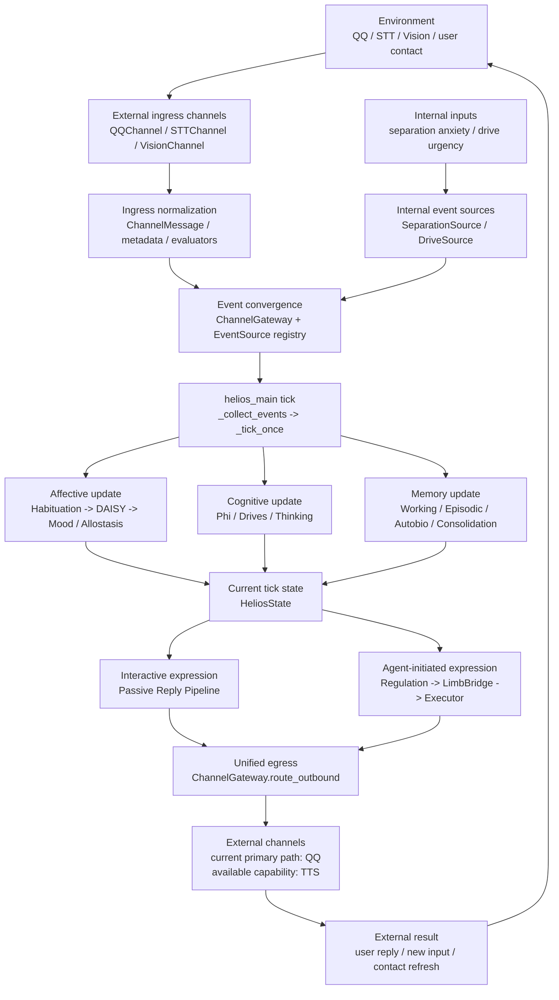

# Helios Runtime Loop Overview

> Status: Active
> Role: show the continuous runtime loop at the system level
> Source of truth: current `helios_main.py` and `helios_io/` implementation

Related diagrams:

- `tick_runtime_flow.en.md`
- `tick_ingress_egress_sequence.en.md`

This is still an overview diagram, but it now makes the main control points explicit: the external ingress path, the internal input path, event convergence, per-tick state update, the split between passive replies and active behavior, and the unified egress surface.

The “internal inputs” here are not abstract placeholders. They correspond to two implemented EventSource paths in the current code: `SeparationSource` emits `PANIC` from separation hours, and `DriveSource` emits mapped Panksepp triggers from the current dominant drive. If you want object-level call ordering, do not stop here; continue into `tick_ingress_egress_sequence.en.md`. In the current implementation, QQ remains the primary outbound path, while TTS is capability-ready but not the default main-loop sink.
