# Helios 单 Tick 细化闭环图

> Status: Active
> Role: 展示一个 tick 内部从入站到出站的主要数据流向
> Source of truth: `Helios._tick_once()` 与 `_collect_events()` 当前实现

相关图：

- `runtime_loop_overview.zh-CN.md`
- `tick_ingress_egress_sequence.zh-CN.md`

```mermaid
flowchart TD
    subgraph ING[入站与事件合流]
        IN[外部入站\nQQ / STT / Vision]
        CH[通道适配\nQQChannel / STTChannel / VisionChannel]
        META[消息富化\nevent_triggers / sec_result / cognitive_impact]
        ISRC[内部事件源\nSeparation / DriveSource]
        COL[_collect_events\nmerged_triggers + pending_messages]
        IN --> CH --> META --> COL
        ISRC --> COL
    end

    subgraph CORE[单 tick 内部状态更新]
        HAB[Habituation\nnovelty factor]
        DAISY[DAISY affect cycle\npanksepp / valence / arousal / dominant]
        PHI[Phi / ICRI aggregation\nimpact + affect + ignition + self-model + DMN]
        NEURO[Neurochem tick\noptional modulators]
        PERS[Personality drift\nadapt_from_snapshot]
        DRV[DriveOracle\nHeliosSnapshot -> drive vector]
        THINK[Thinking integration\noptional thought + DMN feedback]
        MEMAUTO[Autobio write\n10-tick + threshold gated]
        MEMEPI[Episodic write\nsignificant event gated]

        COL --> HAB --> DAISY --> PHI
        PHI --> NEURO --> PERS --> DRV --> THINK
        THINK --> MEMAUTO
        THINK --> MEMEPI
    end

    subgraph IO1[消息处理与被动回复]
        WKM[Working memory hold\nmessage + sec_result]
        SEC[LLM SEC evaluation]
        DECIDE[should_reply]
        GEN[generate_reply\nhistory + memory + autobio + temperature]
        OUTPASS[route_outbound\nreply -> QQ]
    end

    subgraph IO2[调节与主动行为]
        REG[RegulationEngine.tick]
        BRIDGE[LimbDecisionBridge\nscore -> priority]
        EXEC[BehaviorExecutor\nqueue / current / complete]
        ACTION[_handle_action\nspeak_* / request / internal intents]
        SPEECH[_generate_speech\nLLM or fallback template]
        OUTACT[route_outbound\nactive text -> QQ]
    end

    subgraph MA[维护]
        STAB[RSS stability check]
        CONS[consolidate\nlow-phi / pressure triggered]
        COMP[post-consolidation compression]
        PERSIST[periodic persistence]
    end

    MEMAUTO --> MSGCHK{本 tick 有消息?}
    MEMEPI --> MSGCHK
    MSGCHK -- 是 --> SEC --> WKM --> DECIDE
    DECIDE -- 回复 --> GEN --> OUTPASS --> REG
    DECIDE -- 跳过 --> REG
    MSGCHK -- 否 --> REG

    REG --> BRIDGE --> EXEC --> ACTION
    ACTION -- 文本动作 --> SPEECH --> OUTACT
    ACTION -- 内部意图 --> STAB
    OUTPASS --> STAB
    OUTACT --> STAB
    STAB --> CONS --> COMP --> PERSIST
```

实现约束：`HeliosState` 每个 tick 新建；`_collect_events()` 同时产出 trigger 流与 message 流；自传/情景/工作记忆写入都受阈值或条件门控；被动回复和主动行为共享正式出站口，但不是同一条决策路径。

如果你想确认这个流程在对象级别如何发生，继续看 `tick_ingress_egress_sequence.zh-CN.md`。
