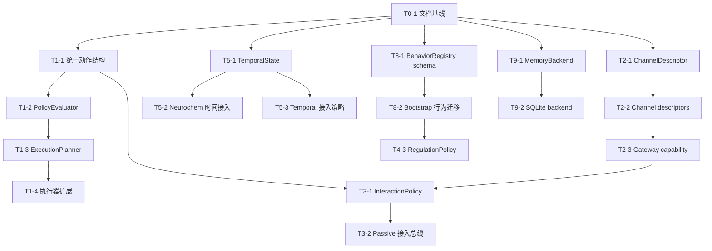

# Helios Soul-Core Enhance 任务书

> Status: Completed
> Audience: 本轮增强实施负责人、模块负责人、测试负责人
> Scope: 基于 `docs/requests.md` 与 `docs/design.md` 的阶段任务拆分
> Closeout: 2026-05-23 `python -m pytest` -> 601 passed

## 1. 任务拆分原则

本任务书遵循以下原则：

1. 先冻结统一抽象，再替换局部实现。
2. 先做基础设施，再做复杂策略。
3. 研究前置项必须单独立项，未完成前不得开始对应编码任务。
4. 每个任务都必须可独立验证。

## 1.1 原始需求映射说明

为避免任务编号与原始需求编号混淆，本任务书约定：

1. 原始需求第 6 条“人格影响模块”主要由 Phase 7 的 `T7-*` 任务承接。
2. 原始需求第 7 条“行为数据库化与动态扩展”主要由 Phase 8 的 `T8-*` 任务承接。
3. Phase 6 的 `T6-*` 任务对应原始需求第 5 条“前意识/非意识行为路径”，不等同于原始需求第 6 条。

## 2. 阶段总览

### Phase 0. 文档与研究准备

目标：完成本轮增强的需求、设计和任务拆分，并定义研究前置项。

### Phase 1. 统一动作与执行基础设施

目标：建立统一的 ActionProposal / ActionDecision / Planner / Feedback 基础设施。

### Phase 2. Channel descriptor 与 ops 基础设施

目标：为现有 channel 增加自描述和 ops 能力。

### Phase 3. 交互表达策略增强

目标：替换单一 bool gate 为结构化交互策略。

### Phase 4. 主动触发策略增强

目标：替换当前固定权重主动选择逻辑。

### Phase 5. Tick / 时间动力学增强

目标：让 tick 成为完整的时间动力学机制。

### Phase 6. 前意识行为研究与实现准备

目标：完成前意识/非意识行为研究与架构映射。

### Phase 7. 人格影响研究与实现准备

目标：完成人格影响模块研究与架构映射。

### Phase 8. 行为数据库化

目标：建立 BehaviorRegistry 并完成 bootstrap 行为迁移。

### Phase 9. 记忆数据库化

目标：建立 MemoryBackend 抽象与数据库后端。

### Phase 10. 统一闭环反馈与回归测试

目标：收敛全链路闭环反馈，补齐验证。

## 3. 详细任务

### [x] T0-1. 创建文档基线

- 目标：创建 `docs/requests.md`、`docs/design.md`、`docs/task.md`
- 依赖：无
- 涉及文件：
  - `docs/requests.md`
  - `docs/design.md`
  - `docs/task.md`
- 完成定义：三份文档建立且边界一致
- 验证：人工审阅 + 文档路径存在

### [x] T1-1. 定义统一动作数据结构

- 目标：新增 `ActionProposal`、`ActionDecision`、`ExecutionFeedback` 数据结构
- 依赖：T0-1
- 涉及文件：
  - `helios_io/` 下新增统一动作模型文件
  - `helios_main.py`
- 风险：与现有 `BehaviorCommand` 重叠
- 完成定义：passive 和 active 都能产出 proposal
- 验证：新增窄测试覆盖结构化对象创建与序列化

### [x] T1-2. 引入 PolicyEvaluator

- 目标：建立 proposal 校验和评分整合层
- 依赖：T1-1
- 涉及文件：
  - 新增策略评估模块
  - `helios_main.py`
- 完成定义：proposal 不再直接进入执行器
- 验证：窄测试验证合法/不合法 proposal 的处理

### [x] T1-3. 引入 ExecutionPlanner

- 目标：根据 BehaviorSpec 和 ChannelDescriptor 选择执行路线
- 依赖：T1-2, T2-1
- 涉及文件：
  - 新增 planner 模块
  - `helios_io/limb.py`
  - `helios_main.py`
- 完成定义：planner 可输出 ActionDecision
- 验证：窄测试覆盖 channel 可用/不可用、行为降级和拒绝路径

### [x] T1-4. 扩展 BehaviorExecutor command schema

- 目标：让执行器支持 channel、modality、provenance、result_details
- 依赖：T1-3
- 涉及文件：
  - `helios_io/limb.py`
  - `helios_io/limb_decision_bridge.py`
- 完成定义：执行命令携带足够元数据
- 验证：更新 executor 测试

### [x] T2-1. 定义 ChannelDescriptor 与 ChannelOpDescriptor

- 目标：建立 channel 自描述结构
- 依赖：T0-1
- 涉及文件：
  - `helios_io/channel.py`
  - 新增 descriptor 定义文件
- 完成定义：descriptor 可实例化并表达输入输出能力
- 验证：窄测试覆盖字段完整性

### [x] T2-2. 为现有 channel 提供 descriptor

- 目标：为 QQ、TTS、STT、Vision 增加 descriptor 实现
- 依赖：T2-1
- 涉及文件：
  - `helios_io/channels/qq_channel.py`
  - `helios_io/channels/tts_channel.py`
  - `helios_io/channels/stt_channel.py`
  - `helios_io/channels/vision_channel.py`
- 完成定义：每个 channel 能返回 descriptor
- 验证：新增 channel descriptor 测试

### [x] T2-3. 扩展 ChannelGateway 能力查询

- 目标：让 gateway 可以列出全部 channel descriptor 与状态
- 依赖：T2-2
- 涉及文件：
  - `helios_io/channel_gateway.py`
- 完成定义：planner 和 policy 可查询 channel 能力
- 验证：更新 gateway 测试

### [x] T3-1. 引入 InteractionPolicy

- 目标：替代单一 `should_reply()` 逻辑
- 依赖：T1-1, T2-3
- 涉及文件：
  - 新增 interaction policy 模块
  - `helios_io/response_pipeline.py`
  - `helios_main.py`
- 完成定义：输入消息可产生结构化 ActionProposal
- 验证：窄测试覆盖想回复/不想回复/改用非文本行为的分支

### [x] T3-2. 将 passive 路径接入统一执行总线

- 目标：让被动回复不再直接 route_outbound
- 依赖：T3-1, T1-3
- 涉及文件：
  - `helios_main.py`
  - `helios_io/response_pipeline.py`
- 完成定义：被动表达走 proposal -> planner -> executor
- 验证：集成测试覆盖 passive 消息处理

### [x] T4-1. 引入 PersonalityProjection 接口

- 目标：为主动与交互策略提供人格偏置结果
- 依赖：T7-1
- 涉及文件：
  - 新增人格投影模块
  - `personality.py`
- 完成定义：能输出结构化 personality projection
- 验证：窄测试覆盖内向/外向、风险偏好等偏置

### [x] T4-2. 引入 neurochem gate

- 目标：把神经化学状态接入主动策略与交互策略
- 依赖：T5-2
- 涉及文件：
  - `neurochem.py`
  - 新增 gate 模块
- 完成定义：neurochem 能影响 proposal 分数或约束
- 验证：窄测试覆盖高 cortisol / 高 dopamine 等条件

### [x] T4-3. 重构 RegulationEngine 为 RegulationPolicy

- 目标：把固定动作池与固定权重迁移到可配置策略评估
- 依赖：T1-1, T4-1, T4-2, T8-2
- 涉及文件：
  - `regulation/regulation.py`
  - 新增 regulation policy 组件
- 当前状态：`helios_main.py` 主动路径已切到 `generate_action_proposals()`，不再走 action string -> proposal 的过渡链
- 完成定义：主动候选行为来自 registry 并输出 proposal
- 验证：更新 regulation 测试

### [x] T5-1. 引入 TemporalState 与 boredom 模型

- 目标：建立时间动力学最小状态集合
- 依赖：T0-1
- 涉及文件：
  - 新增 temporal dynamics 模块
  - `helios_main.py`
- 完成定义：tick 可更新 boredom、inactivity、excitation tail
- 验证：窄测试覆盖长时间无输入和高刺激后恢复

### [x] T5-2. 将 neurochem 更新接入时间动力学层

- 目标：让神经化学状态受时间、输入和内部状态共同影响
- 依赖：T5-1
- 涉及文件：
  - `neurochem.py`
  - 时间动力学模块
- 完成定义：独立 neurochem tick 被重构为时间层协同更新
- 验证：窄测试覆盖不同 tick 情况下调质变化

### [x] T5-3. 将 temporal dynamics 接入主动/交互策略

- 目标：让无聊、疲劳、情绪抹平进入策略计算
- 依赖：T5-1, T3-1, T4-3
- 涉及文件：
  - 交互策略模块
  - 主动策略模块
  - `helios_main.py`
- 完成定义：时间慢变量参与 proposal 生成
- 验证：策略测试覆盖 boredom 对主动行为和交互欲的影响

### [x] T6-1. 前意识/非意识行为研究收集

- 目标：收集权威论文、综述和研究结果
- 依赖：T0-1
- 涉及文件：
  - `docs/foundations/` 下新增研究文档
- 完成定义：存在来源目录、摘要和架构映射
- 验证：人工审阅来源质量与相关性

### [x] T6-2. 设计 Preconscious Path 模块边界

- 目标：基于研究结果给出最小实现边界
- 依赖：T6-1
- 涉及文件：
  - `docs/design.md`
  - 研究文档
- 完成定义：模块职责、输入输出、约束明确
- 验证：人工审阅

### [x] T7-1. 人格影响研究收集

- 目标：收集人格影响交互和行为选择的权威来源
- 依赖：T0-1
- 涉及文件：
  - `docs/foundations/` 下新增研究文档
- 完成定义：存在来源目录、摘要和架构映射
- 验证：人工审阅来源质量与相关性

### [x] T7-2. 设计 Personality Influence 模块边界

- 目标：把研究结果映射为工程模块
- 依赖：T7-1
- 涉及文件：
  - `docs/design.md`
  - 研究文档
- 完成定义：人格投影接口与消费方明确
- 验证：人工审阅

### [x] T7-3. 对齐 PersonalityProjection 契约

- 目标：让人格投影显式暴露设计层 bias surface，同时保持旧消费方兼容
- 依赖：T7-2
- 涉及文件：
  - `personality_projection.py`
  - `tests/test_personality_projection.py`
- 完成定义：projection trace 中可见 `social_initiation_bias`、`novelty_bias`、`persistence_bias`、`risk_tolerance_bias`、`expressivity_bias`、`self_disclosure_bias`
- 验证：focused pytest 覆盖 projection + interaction/regulation 消费链

### [x] T7-4. 扩展 PersonalityProjection 消费面

- 目标：按照 design 中的 rollout 顺序，把人格 slow prior 扩展到更多评分面
- 依赖：T7-3
- 涉及文件：
  - `cognition/thinking_integration.py`
  - `temporal_gate.py`
  - `neurochem_gate.py`
  - 相关 focused tests
- 完成定义：至少一个新的上游评分面消费 `PersonalityProjection` 的 bias surface，且不回退为 raw trait 常量散布
- 验证：focused pytest 覆盖新消费者 + 既有 personality suites

### [x] T7-5. 补齐 Personality influence trace 与 analytics

- 目标：让人格影响在关键策略路径中可追踪、可汇总、可分析
- 依赖：T7-4, T10-1, T8-3
- 涉及文件：
  - 策略 trace / feedback / registry 相关模块
  - 相关 focused tests
- 完成定义：能记录本次决策受哪些人格 bias surface 影响，并可进入后续统计面
- 验证：focused pytest 覆盖 trace / analytics 记录

### [x] T7-6. Personality cross-policy consistency 回归

- 目标：验证同一人格投影在 interaction / regulation / thinking 等路径上的偏置方向保持一致
- 依赖：T7-4, T7-5
- 涉及文件：
  - `tests/` 下新增或扩展 cross-policy regression tests
- 完成定义：人格作为 slow prior 在多条路径上表现一致，不破坏既有 focused suites
- 验证：focused pytest 覆盖 cross-policy consistency

### [x] T6-3. 建立 PreconsciousPolicy 结构化候选模块

- 目标：新增受控前意识候选模块，输出结构化 internal proposals
- 依赖：T6-2, T9-3
- 涉及文件：
  - `cognition/preconscious.py`
  - `cognition/__init__.py`
  - `tests/test_preconscious_policy.py`
- 完成定义：存在 `PreconsciousSignals`、`PreconsciousAssessment`、`PreconsciousPolicy.propose()`，且只生成 proposal 不直接执行
- 验证：focused pytest 覆盖弱信号抑制、rumination→reflect、self_question→learn

### [x] T6-4. 将 Preconscious fallback 接入主循环

- 目标：将前意识候选以保守 fallback 方式接入统一 proposal 总线
- 依赖：T6-3, T1-3, T4-3
- 涉及文件：
  - `helios_main.py`
  - `tests/test_tick_response_wiring.py`
- 完成定义：regulation 仍是主动主路径；当 regulation 无可执行候选时，preconscious internal proposal 可进入 planner/executor
- 验证：focused pytest 覆盖 tick wiring，不回归既有 active/passive path

### [x] T6-5. 强制 Preconscious internal_only 约束

- 目标：确保前意识候选声明 internal_only 时不会被 planner 绑定到外部 channel
- 依赖：T6-4, T1-3
- 涉及文件：
  - `helios_io/planning.py`
  - `tests/test_execution_planning.py`
- 完成定义：`source_type=preconscious` 且 `constraints.internal_only=true` 的 proposal 如命中外部行为，必须被拒绝并留下结构化 violation trace
- 验证：`python -m pytest tests/test_execution_planning.py`

### [x] T6-6. 接入 Preconscious feedback 闭环

- 目标：让前意识候选的接受/拒绝结果进入统一 feedback 流程，为后续 learning 和分析提供依据
- 依赖：T6-5, T10-1
- 涉及文件：
  - `cognition/preconscious.py`
  - `helios_main.py`
  - `helios_io/feedback_recorder.py`
- 完成定义：能区分 preconscious proposal 的执行结果与 rejection trace，并通过统一 feedback 通道记录
- 验证：focused pytest 覆盖 preconscious 来源的 feedback / wiring

### [x] T6-7. 补齐 Preconscious 可观测性

- 目标：把最近 preconscious assessment / rationale / rejection reason 暴露到运行时可观察面
- 依赖：T6-6
- 涉及文件：
  - `cognition/preconscious.py`
  - `core/helios_state.py`
  - `helios_main.py`
  - 相关 focused tests
- 完成定义：调试与回归测试可观察前意识候选为何被抑制、拒绝或接受
- 验证：focused pytest 覆盖 state snapshot / tick wiring

### [x] T8-1. 建立 BehaviorRegistry SQLite schema

- 目标：创建行为数据库 schema 与迁移脚本
- 依赖：T0-1
- 涉及文件：
  - 新增 behavior registry 模块
  - 数据目录迁移脚本
- 完成定义：数据库可初始化
- 验证：窄测试覆盖 schema 创建与读写

### [x] T8-2. 迁移 bootstrap 行为到 registry

- 目标：把现有硬编码动作池迁移为 DB 中的 bootstrap records
- 依赖：T8-1
- 涉及文件：
  - `regulation/regulation.py`
  - 行为 registry 模块
- 完成定义：主动策略从 registry 查询行为
- 验证：回归测试覆盖现有动作仍可被选择

### [x] T8-3. 建立行为来源与执行记录

- 目标：记录行为来源、审核状态和执行结果
- 依赖：T8-1, T1-4
- 涉及文件：
  - 行为 registry 模块
  - 执行反馈模块
- 完成定义：行为来源与执行记录可查询
- 验证：窄测试覆盖插入、查询与关联

### [x] T8-4. 引入 LLM 行为提议注册流程

- 目标：允许 LLM 提议新行为，但不直接激活
- 依赖：T8-3
- 涉及文件：
  - registry 模块
  - planner/policy 模块
- 完成定义：存在 proposal -> review -> activate 流程
- 验证：窄测试覆盖非法行为拒绝与合法行为入库

### [x] T9-1. 定义 MemoryBackend 抽象

- 目标：将长期记忆持久化与检索从现有实现中抽象出来
- 依赖：T0-1
- 涉及文件：
  - `memory/memory_system.py`
  - `memory/autobiographical.py`
  - 新增 backend 模块
- 完成定义：memory system 通过 backend interface 访问长期存储
- 验证：窄测试覆盖 mock backend

### [x] T9-2. 建立 SQLite MemoryBackend

- 目标：实现长期记忆数据库后端
- 依赖：T9-1
- 涉及文件：
  - 新增 SQLite backend
  - memory migration 脚本
- 完成定义：episodic / semantic / autobio 可落到 DB
- 验证：窄测试覆盖保存、检索、压缩日志

### [x] T9-3. 预留向量检索与跨层检索接口

- 目标：不给第一版强行塞完整向量系统，但先留接口
- 依赖：T9-2
- 涉及文件：
  - MemoryBackend 抽象
  - retriever 模块
- 完成定义：接口存在且不破坏现有语义
- 验证：接口测试

### [x] T10-1. 统一反馈记录

- 目标：把执行结果、用户反馈、通道回执、记忆写入统一记录
- 依赖：T1-4, T8-3, T9-2
- 涉及文件：
  - 新增 feedback recorder
  - `helios_main.py`
- 完成定义：三类行为路径都走统一反馈记录
- 验证：集成测试覆盖 passive / active / preconscious

### [x] T10-2. 回归与属性测试补齐

- 目标：为新增模块补齐窄测试与必要集成测试
- 依赖：所有前置实现任务
- 涉及文件：
  - `tests/` 下新增相关测试文件
- 完成定义：核心路径有 focused validation
- 验证：pytest focused suites 通过

## 4. 依赖图

## 5. 研究前置任务声明

以下任务必须先完成研究文档再进入代码实现：

1. T6-2 前意识模块边界设计
2. T7-2 人格影响模块边界设计
3. 后续任何与前意识行为机制、人格理论映射直接相关的编码任务

## 6. 第一批建议启动任务

推荐实现顺序如下：

1. T1-1 统一动作数据结构
2. T2-1 ChannelDescriptor 定义
3. T2-2 为现有 channel 提供 descriptor
4. T2-3 扩展 ChannelGateway 能力查询
5. T8-1 建立 BehaviorRegistry schema

这 5 个任务完成后，系统才具备继续做交互策略、主动策略和行为数据库化的基础。

## 7. Phase 0 完成定义

以下条件满足时，任务拆分阶段完成：

1. 所有核心任务均有明确目标、依赖和验证方式。
2. 研究前置项和直接实现项已区分。
3. 第一批启动任务已清晰标出。
