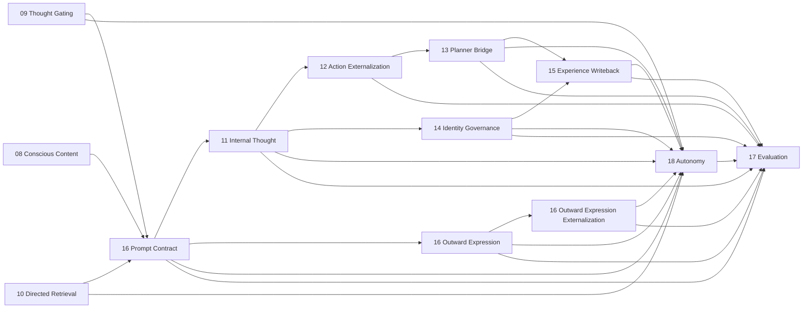

# Helios v2 Architecture Boundaries

> Status: baseline boundary-truth snapshot on 2026-06-02
> Scope: implementation-aligned owner and dependency truth for `helios_v2`

## 1. Purpose

This document is the boundary truth for Helios v2.

It operationalizes the philosophy, final-goal definition, and v2.0.0 release constraints defined in `ARCHITECTURE_PHILOSOPHY.zh-CN.md`.

API and ops formatting rules are defined in `API_AND_OPS_CONTRACT_GUIDE.md` and are mandatory for all public cross-module interfaces.

It defines:

1. owner modules,
2. allowed dependency directions,
3. prohibited implementation shortcuts,
4. startup and runtime hard-stop rules.
5. module API and ops exposure rules.
6. design-before-development workflow rules.

## 2. Global Constraints

1. Runtime strategy must not be hardcoded into source-level decision branches.
2. Runtime must not provide degraded, compatibility, or fallback behavior when critical dependencies are missing.
3. Missing critical dependencies must block startup or abort the active execution path.
4. One runtime concept must have one semantic owner.
5. Evaluation is read-only and cannot mutate runtime behavior.
6. Cross-module collaboration must happen through explicit APIs or ops contracts rather than direct state reach-through.
7. Public APIs and ops contracts must carry comments or docstrings describing ownership, inputs, outputs, and failure semantics.
8. Implementation work must not begin until requirement and design documents exist for the target slice.

## 3. Core Owner Map

| Domain | Owner package | Responsibility |
| --- | --- | --- |
| Runtime kernel | `helios_v2.runtime.kernel` | lifecycle orchestration, startup gating, stage dispatch |
| Runtime dependency gate | `helios_v2.runtime.dependencies` | critical dependency validation and fail-fast startup rules |
| Runtime observability | `helios_v2.observability` | structured runtime log events, severity/event-kind taxonomies, fail-fast sink dispatch, and the runtime observability recorder |
| Runtime composition root | `helios_v2.composition` | assembly-only wiring of the dependency gate, the canonical nineteen-stage chain with shipped first-version owner-neutral bridges, and the optional observability recorder into one runnable runtime handle |
| LLM inference gateway | `helios_v2.llm` | backend-neutral inference request/completion contracts, the named-profile registry, the vendor-neutral provider protocol and first-version OpenAI-compatible provider, network-free static readiness, and the opt-in live readiness probe |
| Requirement truth | `helios_v2/docs/requirements/*` | behavioral boundary, design, and task authority |

## 4. Stable Runtime Owner Snapshot (`16-18`)

This section is the active boundary-truth snapshot for the currently stabilized owner wave.

### 4.1 Requirement `16` prompt and outward-expression chain

| Owner | Primary modules | Owns | Explicitly does not own |
| --- | --- | --- | --- |
| Embodied prompt owner | `helios_v2.prompt_contract` | embodied subjective prompt-contract assembly for `thought` and `outward_expression` consumers; anti-theatrical constraints; capability and authority boundary rendering; outward-expression request handoff | internal thought execution; planner authority; channel execution; identity-governance judgment |
| Outward-expression owner | `helios_v2.outward_expression` | bounded outward-expression draft assembly from prompt-owned request | final execution authority; planner decision; channel routing; transport dispatch |
| Outward-expression externalization owner | `helios_v2.outward_expression_externalization` | execution-adjacent externalization draft assembly from outward-expression draft | final planner/channel/transport authority |

Boundary rules:

1. `prompt_contract` is the sole owner of prompt-contract assembly, not the owner of user-visible execution.
2. `outward_expression` may prepare one bounded draft, but that draft is non-authoritative.
3. `outward_expression_externalization` may prepare an execution-adjacent draft, but that draft is still non-authoritative.
4. The formal chain is `EmbodiedPromptContract -> OutwardExpressionPromptView -> OutwardExpressionRequest -> OutwardExpressionDraft -> OutwardExpressionExternalizationDraft`.

### 4.2 Requirement `17` evaluation owner

| Owner | Primary modules | Owns | Explicitly does not own |
| --- | --- | --- | --- |
| Evaluation owner | `helios_v2.evaluation` | read-only evaluation request/evidence-bundle assembly, diagnostic artifact publication, gap analysis, long-range diagnostics | runtime mutation; planner authority; channel execution; governance judgment; storage writes |

Boundary rules:

1. `evaluation` consumes only explicit owner outputs and provenance-rich evidence bundles.
2. `evaluation` must not scrape transient locals or private mutable runtime state.
3. `evaluation` currently consumes thought, action externalization, planner, governance, writeback, prompt, outward-expression, outward-expression externalization, and autonomy evidence.
4. `evaluation` consumes the prior-tick execution timeline only as the observability-owned `ExecutionTimelineView` projection, never as raw log events, and publishes consequence-binding path outcomes (internally-activated, blocked, rejected, executed, continuity-written) derived from owner-published statuses. Absent timeline evidence becomes an explicit incompleteness warning rather than inferred fidelity, and shim-derived dimensions are annotated explicitly.

### 4.3 Requirement `18` autonomy owner

| Owner | Primary modules | Owns | Explicitly does not own |
| --- | --- | --- | --- |
| Autonomy owner | `helios_v2.autonomy` | proactive-drive integration, bounded disposition selection, deferred continuity publication, outward-vs-inward proactive distinction, and long-horizon continuity threads (recurrence reinforcement, conflict arbitration, the owner-owned `LongHorizonContinuityState`) | prompt assembly; planner authority; channel execution; governance judgment |

Boundary rules:

1. `autonomy` is the sole owner of proactive-drive integration and deferred continuity in v2.
2. `autonomy` may request or justify proactive externalization semantically, but it must not directly execute a channel path.
3. Blocked proactive tendencies must become explicit deferred continuity records rather than disappearing silently.
4. Long-horizon continuity threads are owned solely by `autonomy`. They are computed from the owner's own deferred-continuity records plus owner-private prior-thread carry; reinforcement and conflict arbitration are deterministic and bounded; threads are retired only explicitly (expired or resolved) and suppressed threads remain preserved as continuity. No other owner may compute thread reinforcement or arbitration, and threads never grant direct channel or planner authority.

### 4.4 Requirement `21` observability owner

| Owner | Primary modules | Owns | Explicitly does not own |
| --- | --- | --- | --- |
| Observability owner | `helios_v2.observability` | structured `LogEvent` contract, severity and event-kind taxonomies, `LogSink` protocol, first-version in-memory and JSON-line sinks, the sequence-stamping `RuntimeObservabilityRecorder`, and the read-only `ExecutionTimelineView` plus its `ExecutionTimelineReconstructor` | any cognitive runtime decision or state; planner authority; channel execution; governance judgment; authoritative inter-owner state transport; persistence policy beyond the sink boundary |

Boundary rules:

1. `observability` is read-only infrastructure. It consumes only already-public runtime artifacts and lifecycle facts and never mutates owner state.
2. The uniform emission point for the `01-18` chain is the runtime kernel, which observes public stage results and lifecycle events only. Cognitive owners do not import `observability` to self-log in this slice.
3. Log events must never be the authoritative source of any first-class runtime concept. No owner may depend on the log channel to receive another owner's decision.
4. The recorder is fail-fast: zero sinks raise at construction and sink emission failures propagate. There is no degraded no-op recorder.
5. Observability is default-off at the kernel: an absent recorder is a non-instrumented runtime, not a degraded cognitive mode.
6. The `ExecutionTimelineReconstructor` rebuilds one tick's `ExecutionTimelineView` from already-captured kernel lifecycle events. It derives only execution-timing facts (stage order, lifecycle status, duration) and never reads an owner's semantic decision payload. The timeline view is the only sanctioned form in which downstream owners may consume execution-timing facts; downstream owners must not parse raw `LogEvent` objects. Missing lifecycle yields an explicitly incomplete view; malformed pairing raises.

### 4.5 Requirement `22` composition root owner

| Owner | Primary modules | Owns | Explicitly does not own |
| --- | --- | --- | --- |
| Composition root owner | `helios_v2.composition` | assembly-only wiring of the dependency gate, the canonical nineteen-stage chain, shipped first-version owner-neutral cross-owner bridges, first-version injected owner capabilities, and the optional `21` recorder into one runnable `RuntimeHandle`; the canonical stage-order constant and its assembly-time validation | any cognitive runtime decision or owner state; planner authority; channel execution; governance judgment; the observability taxonomy; any degraded or fallback assembly path |

Boundary rules:

1. `composition` is assembly-only. It constructs owners, owner-neutral bridges, and the kernel, then registers stages in the canonical order. It holds no cognitive policy.
2. The first-version bridges and injected owner capabilities are owner-neutral glue. They forward and shape explicit upstream contract fields and preserve provenance, but they must not compute a downstream owner's semantic decision. They are baseline shims that later owner-deepening waves replace through the owners themselves.
3. `composition` provides no degraded, reduced, or fallback assembly. A missing critical dependency fails fast through the existing startup gate; a wrong stage count or order raises `CompositionError`; a missing or inconsistent upstream artifact raises the existing stage execution error.
4. The single logging mechanism in Helios v2 is the `21` observability owner. No module under `helios_v2/src`, including `composition`, may use `logging` or `print`. This is enforced by a repository guard test (`tests/test_no_adhoc_logging_guard.py`).
5. The composition assembly contract (`assemble_runtime`, `RuntimeHandle`, `CANONICAL_STAGE_ORDER`) is the stable seam that later extension requirements build on additively rather than rewrite.

### 4.6 Requirement `25` LLM inference gateway owner

| Owner | Primary modules | Owns | Explicitly does not own |
| --- | --- | --- | --- |
| LLM inference gateway owner | `helios_v2.llm` | backend-neutral `LlmRequest`/`LlmCompletion`/`LlmUsage` contracts, the named `LlmProfile` and `LlmProfileRegistry`, the vendor-neutral `LlmProvider` protocol plus the first-version `OpenAICompatibleProvider`, the `LlmGateway` owner, network-free static readiness, and the opt-in live readiness probe | prompt assembly; cognitive interpretation of completion text; consumer identity or which cognitive stage a request serves; cross-owner state transport; planner/channel/governance authority |

Boundary rules:

1. `llm` is a capability owner, not a cognitive owner. It turns a neutral request into a completion through a named profile and reports readiness. It holds no cognitive policy and never interprets `output_text`.
2. The gateway keys only on `target_profile`. Profile-to-consumer binding is a composition concern; the gateway is ignorant of which owner consumes which profile.
3. The concrete provider is injected behind the `LlmProvider` protocol. The first-version `OpenAICompatibleProvider` imports the vendor SDK lazily inside its call path, so importing `helios_v2.llm` never requires the SDK; tests inject a deterministic fake provider and never reach the network.
4. The gateway is fail-fast: an unknown profile, a missing or empty api key, empty messages, or a provider failure raises `LlmError`. There is no degraded or fabricated completion path.
5. Static readiness (profile registered and api-key env var non-empty) is deterministic and network-free, and is the form wired into the startup dependency gate through the composition-owned `LlmReadinessDependencyProvider` and the `llm_profiles_ready` critical dependency. The live readiness probe issues a real call and is opt-in only; it is never part of the mandatory startup gate.
6. LLM facts (model, usage, latency, finish reason) travel only through the `LlmCompletion` contract, never through the log channel. The gateway adds no second logging mechanism and emits nothing itself.

## 5. Allowed Dependency Directions for `16-18`

The currently stabilized dependency directions are:

Interpretation rules:

1. `16` may consume upstream conscious, gating, and retrieval outputs only through explicit runtime request providers.
2. `18` may read explicit results from `09`, `10`, `11`, `13`, `14`, `15`, and the `16` outward-expression artifact chain, but it does not reclaim execution authority from those owners.
3. `17` is downstream and read-only. It may observe `18`, but `18` must never depend on `17` for runtime strategy.
4. No owner in `16-18` may bypass `13` when the path becomes externally consequential.

## 6. Prohibited Patterns

1. Branching to a low-capability execution path when an LLM, memory, evaluation, or channel capability is unavailable.
2. Encoding fixed routing rules, fixed prompt paths, or fixed decision thresholds directly in orchestration code.
3. Allowing a downstream adapter to silently reinterpret a rejected or unavailable capability as a different behavior.
4. Making runtime success depend on implicit defaults that hide dependency absence.
5. Importing another domain's private state or internal helper just to bypass its owner API.
6. Adding a new module without defining its owner, inbound API, outbound ops, and non-owned responsibilities.
7. Letting `prompt_contract` evolve into a hidden reply-first behavior owner.
8. Treating `OutwardExpressionDraft` or `OutwardExpressionExternalizationDraft` as final execution authority.
9. Letting `autonomy` emit timer-only outward text without planner and channel authority.
10. Allowing blocked proactive tendencies to vanish without deferred continuity evidence.
11. Letting `evaluation` infer strong runtime fidelity from missing provenance categories.

## 7. API and Ops Exposure Rules

1. Each module owner must expose a small public API surface.
2. Cross-domain commands must be expressed as ops-like contracts, not hidden helper calls.
3. Public API methods must document:
	- the owner responsibility,
	- required inputs,
	- returned outputs,
	- hard-stop conditions or raised errors.
4. Private helpers may remain undocumented only if they do not cross module boundaries.
5. If an interface is not stable enough to document, it is not stable enough to expose across module boundaries.
6. For `16-18`, every runtime stage result and provider protocol is part of the boundary truth and must preserve upstream provenance ids explicitly.

## 8. Migration-State Recording Rules

Current migration-state facts that must remain explicit rather than implied away:

1. `16` is stable at the current baseline, but its outward-expression path remains draft-only by design; final execution authority intentionally stays outside that owner family.
2. `17` is stable as a read-only diagnostic owner, but its first-version scoring depth is still shallower than the final project goal; baseline coverage does not mean complete evaluation semantics.
3. `18` now carries deferred continuity across ticks through owner-private stage state plus explicit request carry records, and the current baseline also includes long-horizon decay, same-key merge, and explicit resolved-or-expired accounting. It remains deterministic and bounded rather than a fully open-ended proactive-evolution policy.
4. Any later requirement that deepens `16-18` must update both its own package docs and this file's owner snapshot if boundary truth changes materially.
5. `21` observability landed as a baseline read-only owner plus an optional kernel emission seam. It is default-off, so existing runtime construction and tests are unaffected. Its current scope is the kernel-level lifecycle and per-stage timeline only; owner-level fine-grained emission remains intentionally out of scope until a later slice opens it through the same owner.
6. `25` LLM inference gateway landed as a backend-neutral capability owner with a named-profile registry, an injected provider protocol (first-version OpenAI-compatible provider with lazy SDK import), network-free static readiness wired into the startup gate, and an opt-in live probe. It owns no cognition and never interprets completion text.
7. `26` made the LLM-backed internal-thought path the default production cognition path: `11` now sources thought content from the `25` gateway while retaining all sufficiency/continuation/proposal judgment in an owner-private judgment helper shared with the deterministic path. The default assembled runtime therefore carries `llm_profiles_ready` as a critical dependency, so a real `startup()` requires a statically-ready bound profile (a non-empty api key in the environment); the test suite stays network-free by injecting a deterministic fake-provider gateway or the explicit deterministic path. There is no silent fallback from inference failure to deterministic synthesis.

## 9. Requirement Citation Rules

When later requirement packages cite current boundary truth, they must reuse the following vocabulary instead of redefining it locally:

1. `prompt-contract owner`
2. `outward-expression draft owner`
3. `outward-expression externalization draft owner`
4. `evaluation owner`
5. `autonomy owner`
6. `deferred continuity`
7. `read-only evidence consumer`
8. `final execution authority remains outside the owner`

## 10. Development Workflow Rule

1. Every implementation slice must start with a requirement package or an explicit addition to an existing requirement package.
2. Every requirement slice must have design before code changes expand beyond scaffolding.
3. Task decomposition must reference concrete files and validation commands before development begins.
4. Code written ahead of requirement and design truth is considered invalid implementation debt.

## 11. Startup Gate Rule

Startup is valid only when all declared critical dependencies are present.

If any critical dependency is missing:

1. startup must fail,
2. the missing dependency set must be explicit,
3. runtime must not switch to a reduced mode.

## 12. Traceability Rules

1. `helios_v2/docs/requirements/index.md` is the maturity index, not the detailed boundary document.
2. `helios_v2/docs/ARCHITECTURE_BOUNDARIES.md` is the active owner/boundary truth document for implemented slices.
3. `helios_v2/docs/BRAIN_ARCHITECTURE_COMPARISON.md` is the active scientific-grounding companion document and must not override owner-boundary truth.
4. Requirement packages `16`, `17`, `18`, `19`, and `20` are the detailed implementation truth for their respective owner or documentation slices and must remain mutually consistent with this file when they cite current runtime reality.
5. Requirement package `21` is the detailed implementation truth for the observability owner and the kernel emission seam, and must remain consistent with the observability owner snapshot in this file.
6. If current runtime truth and target truth diverge, the conflict must be recorded in the requirement package and, when cross-cutting, in this document's migration-state section.