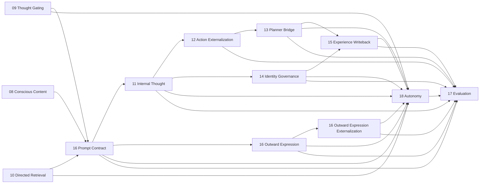

# Helios v2 Architecture Boundaries

> Status: baseline boundary-truth snapshot on 2026-06-02
> Scope: implementation-aligned owner and dependency truth for `helios_v2`

## 1. Purpose

This document is the boundary truth for Helios v2.

It operationalizes the philosophy, final-goal definition, and v2.0.0 release constraints defined in `ARCHITECTURE_PHILOSOPHY.zh-CN.md`.

API and ops formatting rules are defined in `API_AND_OPS_CONTRACT_GUIDE.md` and are mandatory for all public cross-module interfaces.

It defines:

1. owner modules,
2. allowed dependency directions,
3. prohibited implementation shortcuts,
4. startup and runtime hard-stop rules.
5. module API and ops exposure rules.
6. design-before-development workflow rules.

## 2. Global Constraints

1. Runtime strategy must not be hardcoded into source-level decision branches.
2. Runtime must not provide degraded, compatibility, or fallback behavior when critical dependencies are missing.
3. Missing critical dependencies must block startup or abort the active execution path.
4. One runtime concept must have one semantic owner.
5. Evaluation is read-only and cannot mutate runtime behavior.
6. Cross-module collaboration must happen through explicit APIs or ops contracts rather than direct state reach-through.
7. Public APIs and ops contracts must carry comments or docstrings describing ownership, inputs, outputs, and failure semantics.
8. Implementation work must not begin until requirement and design documents exist for the target slice.

## 3. Core Owner Map

| Domain | Owner package | Responsibility |
| --- | --- | --- |
| Runtime kernel | `helios_v2.runtime.kernel` | lifecycle orchestration, startup gating, stage dispatch |
| Runtime dependency gate | `helios_v2.runtime.dependencies` | critical dependency validation and fail-fast startup rules |
| Runtime observability | `helios_v2.observability` | structured runtime log events, severity/event-kind taxonomies, fail-fast sink dispatch, and the runtime observability recorder |
| Runtime composition root | `helios_v2.composition` | assembly-only wiring of the dependency gate, the canonical nineteen-stage chain with shipped first-version owner-neutral bridges, and the optional observability recorder into one runnable runtime handle |
| LLM inference gateway | `helios_v2.llm` | backend-neutral inference request/completion contracts, the named-profile registry, the vendor-neutral provider protocol and first-version OpenAI-compatible provider, network-free static readiness, and the opt-in live readiness probe |
| Channel driver subsystem | `helios_v2.channel` | the uniform `ChannelDriver` protocol, driver descriptor/config/management/status/readiness contracts, transport-intrinsic QoS taxonomy and inbound/outbound contracts, and the `ChannelSubsystem` framework (registry + bounded NAPI-style inbound drain + bounded outbound dispatch + real channel-state snapshot + network-free static readiness) |
| Durable experience store | `helios_v2.persistence` | the `PersistedExperienceRecord` and `PriorExistenceSnapshot` contracts, the `ExperienceStoreBackend` protocol (first-version SQLite file backend + in-memory double), the `ExperienceStore` facade (append / recent-N / count / snapshot / similarity search), and the recency + semantic store-backed directed-retrieval candidate providers; durable append of the `15` continuity stream, optional per-record embedding vector storage, and deterministic recency or cosine-similarity re-entry into `10`. Owns no cognitive policy, never embeds text itself (it stores/ranks vectors it is given), and is never an authoritative inter-owner transport |
| Embedding inference gateway | `helios_v2.embedding` | backend-neutral `EmbeddingRequest`/`EmbeddingResult` contracts, the named `EmbeddingProfile` and registry, the vendor-neutral `EmbeddingProvider` protocol plus the first-version lazy OpenAI-compatible provider, the `EmbeddingGateway` owner, network-free static readiness, and the opt-in live readiness probe; turns text into a vector through a named profile and reports readiness. Owns no cognitive policy and never interprets an embedding vector's meaning |
| Requirement truth | `helios_v2/docs/requirements/*` | behavioral boundary, design, and task authority |

## 4. Stable Runtime Owner Snapshot (`16-18`)

This section is the active boundary-truth snapshot for the currently stabilized owner wave.

### 4.1 Requirement `16` prompt and outward-expression chain

| Owner | Primary modules | Owns | Explicitly does not own |
| --- | --- | --- | --- |
| Embodied prompt owner | `helios_v2.prompt_contract` | embodied subjective prompt-contract assembly for `thought` and `outward_expression` consumers; anti-theatrical constraints; capability and authority boundary rendering; outward-expression request handoff | internal thought execution; planner authority; channel execution; identity-governance judgment |
| Outward-expression owner | `helios_v2.outward_expression` | bounded outward-expression draft assembly from prompt-owned request | final execution authority; planner decision; channel routing; transport dispatch |
| Outward-expression externalization owner | `helios_v2.outward_expression_externalization` | execution-adjacent externalization draft assembly from outward-expression draft | final planner/channel/transport authority |

Boundary rules:

1. `prompt_contract` is the sole owner of prompt-contract assembly, not the owner of user-visible execution.
2. `outward_expression` may prepare one bounded draft, but that draft is non-authoritative.
3. `outward_expression_externalization` may prepare an execution-adjacent draft, but that draft is still non-authoritative.
4. The formal chain is `EmbodiedPromptContract -> OutwardExpressionPromptView -> OutwardExpressionRequest -> OutwardExpressionDraft -> OutwardExpressionExternalizationDraft`.

### 4.2 Requirement `17` evaluation owner

| Owner | Primary modules | Owns | Explicitly does not own |
| --- | --- | --- | --- |
| Evaluation owner | `helios_v2.evaluation` | read-only evaluation request/evidence-bundle assembly, diagnostic artifact publication, gap analysis, long-range diagnostics | runtime mutation; planner authority; channel execution; governance judgment; storage writes |

Boundary rules:

1. `evaluation` consumes only explicit owner outputs and provenance-rich evidence bundles.
2. `evaluation` must not scrape transient locals or private mutable runtime state.
3. `evaluation` currently consumes thought, action externalization, planner, governance, writeback, prompt, outward-expression, outward-expression externalization, and autonomy evidence.
4. `evaluation` consumes the prior-tick execution timeline only as the observability-owned `ExecutionTimelineView` projection, never as raw log events, and publishes consequence-binding path outcomes (internally-activated, blocked, rejected, executed, continuity-written) derived from owner-published statuses. Absent timeline evidence becomes an explicit incompleteness warning rather than inferred fidelity, and shim-derived dimensions are annotated explicitly.
5. `evaluation` owns the consequence-claim contract (`ConsequenceClaim`) and the execution-truth corroboration verdict (`corroborated` / `discrepant` / `unverifiable_no_timeline`). Each tick it publishes a `ConsequenceClaim` (the derived path outcome plus the owner-published statuses it depended on) and corroborates the prior completed tick's carried claim against that same tick's `ExecutionTimelineView` using a documented outcome-to-kernel-stage-fact mapping. It reads only execution-timing facts from the timeline plus the carried claim's statuses; it re-derives no owner decision. A contradiction becomes a dedicated `consequence_discrepancy` fidelity warning. Absence, tick mismatch, or an incomplete timeline yields `unverifiable_no_timeline`, never an optimistic `corroborated`. The corroboration is strictly additive: it does not change the existing outcome taxonomy or `internal_to_visible_consequence` scoring.

### 4.3 Requirement `18` autonomy owner

| Owner | Primary modules | Owns | Explicitly does not own |
| --- | --- | --- | --- |
| Autonomy owner | `helios_v2.autonomy` | proactive-drive integration, bounded disposition selection, deferred continuity publication, outward-vs-inward proactive distinction, and long-horizon continuity threads (recurrence reinforcement, conflict arbitration, the owner-owned `LongHorizonContinuityState`) | prompt assembly; planner authority; channel execution; governance judgment |

Boundary rules:

1. `autonomy` is the sole owner of proactive-drive integration and deferred continuity in v2.
2. `autonomy` may request or justify proactive externalization semantically, but it must not directly execute a channel path.
3. Blocked proactive tendencies must become explicit deferred continuity records rather than disappearing silently.
4. Long-horizon continuity threads are owned solely by `autonomy`. They are computed from the owner's own deferred-continuity records plus owner-private prior-thread carry; reinforcement and conflict arbitration are deterministic and bounded; threads are retired only explicitly (expired or resolved) and suppressed threads remain preserved as continuity. No other owner may compute thread reinforcement or arbitration, and threads never grant direct channel or planner authority.

### 4.4 Requirement `21` observability owner

| Owner | Primary modules | Owns | Explicitly does not own |
| --- | --- | --- | --- |
| Observability owner | `helios_v2.observability` | structured `LogEvent` contract, severity and event-kind taxonomies, `LogSink` protocol, first-version in-memory and JSON-line sinks, the sequence-stamping `RuntimeObservabilityRecorder`, and the read-only `ExecutionTimelineView` plus its `ExecutionTimelineReconstructor` | any cognitive runtime decision or state; planner authority; channel execution; governance judgment; authoritative inter-owner state transport; persistence policy beyond the sink boundary |

Boundary rules:

1. `observability` is read-only infrastructure. It consumes only already-public runtime artifacts and lifecycle facts and never mutates owner state.
2. The uniform emission point for the `01-18` chain is the runtime kernel, which observes public stage results and lifecycle events only. Cognitive owners do not import `observability` to self-log in this slice.
3. Log events must never be the authoritative source of any first-class runtime concept. No owner may depend on the log channel to receive another owner's decision.
4. The recorder is fail-fast: zero sinks raise at construction and sink emission failures propagate. There is no degraded no-op recorder.
5. Observability is default-off at the kernel: an absent recorder is a non-instrumented runtime, not a degraded cognitive mode.
6. The `ExecutionTimelineReconstructor` rebuilds one tick's `ExecutionTimelineView` from already-captured kernel lifecycle events. It derives only execution-timing facts (stage order, lifecycle status, duration) and never reads an owner's semantic decision payload. The timeline view is the only sanctioned form in which downstream owners may consume execution-timing facts; downstream owners must not parse raw `LogEvent` objects. Missing lifecycle yields an explicitly incomplete view; malformed pairing raises.

### 4.5 Requirement `22` composition root owner

| Owner | Primary modules | Owns | Explicitly does not own |
| --- | --- | --- | --- |
| Composition root owner | `helios_v2.composition` | assembly-only wiring of the dependency gate, the canonical nineteen-stage chain, shipped first-version owner-neutral cross-owner bridges, first-version injected owner capabilities, and the optional `21` recorder into one runnable `RuntimeHandle`; the canonical stage-order constant and its assembly-time validation | any cognitive runtime decision or owner state; planner authority; channel execution; governance judgment; the observability taxonomy; any degraded or fallback assembly path |

Boundary rules:

1. `composition` is assembly-only. It constructs owners, owner-neutral bridges, and the kernel, then registers stages in the canonical order. It holds no cognitive policy.
2. The first-version bridges and injected owner capabilities are owner-neutral glue. They forward and shape explicit upstream contract fields and preserve provenance, but they must not compute a downstream owner's semantic decision. They are baseline shims that later owner-deepening waves replace through the owners themselves.
3. `composition` provides no degraded, reduced, or fallback assembly. A missing critical dependency fails fast through the existing startup gate; a wrong stage count or order raises `CompositionError`; a missing or inconsistent upstream artifact raises the existing stage execution error.
4. The single logging mechanism in Helios v2 is the `21` observability owner. No module under `helios_v2/src`, including `composition`, may use `logging` or `print`. This is enforced by a repository guard test (`tests/test_no_adhoc_logging_guard.py`).
5. The composition assembly contract (`assemble_runtime`, `RuntimeHandle`, `CANONICAL_STAGE_ORDER`) is the stable seam that later extension requirements build on additively rather than rewrite.

### 4.6 Requirement `25` LLM inference gateway owner

| Owner | Primary modules | Owns | Explicitly does not own |
| --- | --- | --- | --- |
| LLM inference gateway owner | `helios_v2.llm` | backend-neutral `LlmRequest`/`LlmCompletion`/`LlmUsage` contracts, the named `LlmProfile` and `LlmProfileRegistry`, the vendor-neutral `LlmProvider` protocol plus the first-version `OpenAICompatibleProvider`, the `LlmGateway` owner, network-free static readiness, and the opt-in live readiness probe | prompt assembly; cognitive interpretation of completion text; consumer identity or which cognitive stage a request serves; cross-owner state transport; planner/channel/governance authority |

Boundary rules:

1. `llm` is a capability owner, not a cognitive owner. It turns a neutral request into a completion through a named profile and reports readiness. It holds no cognitive policy and never interprets `output_text`.
2. The gateway keys only on `target_profile`. Profile-to-consumer binding is a composition concern; the gateway is ignorant of which owner consumes which profile.
3. The concrete provider is injected behind the `LlmProvider` protocol. The first-version `OpenAICompatibleProvider` imports the vendor SDK lazily inside its call path, so importing `helios_v2.llm` never requires the SDK; tests inject a deterministic fake provider and never reach the network.
4. The gateway is fail-fast: an unknown profile, a missing or empty api key, empty messages, or a provider failure raises `LlmError`. There is no degraded or fabricated completion path.
5. Static readiness (profile registered and api-key env var non-empty) is deterministic and network-free, and is the form wired into the startup dependency gate through the composition-owned `LlmReadinessDependencyProvider` and the `llm_profiles_ready` critical dependency. The live readiness probe issues a real call and is opt-in only; it is never part of the mandatory startup gate.
6. LLM facts (model, usage, latency, finish reason) travel only through the `LlmCompletion` contract, never through the log channel. The gateway adds no second logging mechanism and emits nothing itself.

### 4.7 Requirement `30` channel driver subsystem owner

| Owner | Primary modules | Owns | Explicitly does not own |
| --- | --- | --- | --- |
| Channel driver subsystem owner | `helios_v2.channel` | the uniform `ChannelDriver` protocol; driver descriptor/config/management/status/readiness contracts; transport-intrinsic `ChannelQosClass` taxonomy and inbound packet/drain contracts; outbound packet/dispatch-outcome contracts; the `ChannelSubsystem` framework (runtime-pluggable driver registry, NAPI-style bounded fair inbound drain, bounded priority-respecting outbound dispatch, real per-driver `ChannelStateSnapshot`, network-free static readiness) | raw-signal normalization (`02` sensory); salience/cognitive importance (`03` appraisal); channel selection or acceptance (`13` planner); outward content shaping (`16`) |

Boundary rules:

1. `channel` is a transport owner, not a cognitive owner. It is a registry + scheduler modeled on a Linux kernel driver subsystem; each concrete driver is one device-driver analog. The framework holds no cognitive policy.
2. The inbound path emits `RawSignal` only; it does not normalize. `02` sensory turns `RawSignal` into `Stimulus`. The subsystem maps one `InboundPacket -> RawSignal` (`signal_id=packet_id`, `source_name=channel=driver_id`, `signal_type=packet_type`), preserving driver provenance.
3. QoS is transport-intrinsic. `ChannelQosClass` (`control`/`interactive`/`bulk`/`background`) is derived only from transport-visible facts, never by reading content for meaning. It rides `RawSignal.metadata["channel_qos"]` (the reserved key `CHANNEL_QOS_METADATA_KEY`), which `02` sensory preserves onto `Stimulus.metadata` verbatim. Only `03` appraisal may interpret it as a salience input. The framework may use it for transport scheduling only and never maps it to cognitive importance. Carriage is a reserved string-valued metadata key, not a typed field, so `02` sensory does not reference this `30`-owned taxonomy and the owner dependency direction stays `30 -> 02`. First version ships the taxonomy + propagation only; multi-lane scheduling and selective dropping are design-reserved.
4. The inbound drain is NAPI-style and bounded: drivers receive asynchronously into their own bounded backlogs; the framework drains the ready set fairly (deterministic round-robin with a persisted cursor) under a global budget, leaving the remainder pending for the next tick. Per-driver backlog overflow applies the driver's documented policy and is counted, never silent or unbounded.
5. The outbound dispatch is bounded and honors the planner-provided `execution_priority` verbatim (it never recomputes priority or re-selects the channel; it sends to `target_driver_id`). An unknown/unavailable target yields an explicit `driver_unavailable` outcome; packets beyond the budget are deferred (counted), never dropped silently.
6. `channel_state_snapshot()` exposes the real per-driver descriptor/status for the planner to replace the hardcoded channel-state shim; it carries transport facts only and never recommends a selection.
7. Static readiness (a driver's declared credential/resource presence) is deterministic and network-free, and is the form wired into the startup gate through the composition-owned `ChannelReadinessDependencyProvider` and the `channel_drivers_ready` critical dependency when a critical driver is bound. There is no degraded transport mode.
8. This requirement ships the framework and a deterministic fake driver only; it is not wired into the assembled runtime. The first real driver (CLI) and the composition wiring that replaces the inbound shim and the planner channel-state shim are requirement `31`.

### 4.8 Requirement `31` CLI channel driver and channel-bound assembly

| Owner | Primary modules | Owns | Explicitly does not own |
| --- | --- | --- | --- |
| CLI channel driver | `helios_v2.channel.drivers.cli` | the first concrete `ChannelDriver`: a local bidirectional CLI transport (`CliChannelDriver`/`CliDriverConfig`) with injected in-memory I/O, a bounded inbound backlog (`submit_line`), QoS-tagged text drain, sink-rendered outbound send, lifecycle/config ops, and always-ready static readiness | normalization (`02`); salience (`03`); channel selection/acceptance (`13`); outward content shaping (`16`); any real stdio (a reader/writer adapter at the entry point owns that) |
| Channel-bound assembly wiring | `helios_v2.runtime.stages` (`ChannelInboundDrainRuntimeStage`, `ChannelOutboundDispatchRuntimeStage`), `helios_v2.composition` (`SubsystemBackedSensorySource`, `ChannelSubsystemStateProvider`, `ChannelBackedPlannerBridgeRequestBridge`, `assemble_runtime(channel_cli=True)`) | the opt-in 21-stage assembly variant that registers the subsystem + CLI driver, drains inbound into sensory, dispatches planner-accepted decisions outbound, and sources real planner channel-state | cognitive policy; the default 19-stage assembly (unchanged) |

Boundary rules:

1. The CLI driver is transport only. It writes solely through its injected `output_sink` and reads solely from its injected input (`submit_line`); it never calls `print` or touches real stdio itself. Real stdin/stdout is touched only by the `--channel-cli` entry point's reader adapter and injected stdout writer, never in the test suite.
2. The driver derives QoS transport-intrinsically (CLI operator text is `interactive`), set without reading content for meaning, consistent with `30`.
3. The channel-bound assembly is an explicit opt-in (`channel_cli=True`). It registers two transport stages: `channel_inbound_drain` runs first and feeds the drained `RawSignal` tuple to the subsystem-backed sensory source (sensory still normalizes); `channel_outbound_dispatch` runs right after the planner bridge and transports the planner-accepted decision to the target driver. The cognition chain between them is byte-for-byte the default chain.
4. In the channel-bound assembly the planner consumes the real per-driver channel state through `ChannelSubsystemStateProvider` (a connected driver is reported available/bound/executable), replacing the hardcoded shim. The planner still owns selection and acceptance; the dispatch stage performs the real transport. Writeback/evaluation behavior is unchanged because the planner still produces the same `executed` path.
5. The default (non-channel) assembly and its `CANONICAL_STAGE_ORDER` are unchanged. The channel-bound variant validates against `CHANNEL_BOUND_STAGE_ORDER` (21 stages) instead. A no-input tick drains nothing and the chain closes as an internal-only tick (`28`); nothing is dispatched.
6. The channel-bound assembly registers `channel_drivers_ready` as a critical dependency through `ChannelReadinessDependencyProvider`; CLI declares no credential so it always passes, but the fail-fast gate routes through it for a future critical driver. No degraded transport path exists.
7. No `logging`/`print` anywhere under `src/`; the driver writes only through its injected sink; the guard test stays green.

## 5. Allowed Dependency Directions for `16-18`

The currently stabilized dependency directions are:

Interpretation rules:

1. `16` may consume upstream conscious, gating, and retrieval outputs only through explicit runtime request providers.
2. `18` may read explicit results from `09`, `10`, `11`, `13`, `14`, `15`, and the `16` outward-expression artifact chain, but it does not reclaim execution authority from those owners.
3. `17` is downstream and read-only. It may observe `18`, but `18` must never depend on `17` for runtime strategy.
4. No owner in `16-18` may bypass `13` when the path becomes externally consequential.

## 6. Prohibited Patterns

1. Branching to a low-capability execution path when an LLM, memory, evaluation, or channel capability is unavailable.
2. Encoding fixed routing rules, fixed prompt paths, or fixed decision thresholds directly in orchestration code.
3. Allowing a downstream adapter to silently reinterpret a rejected or unavailable capability as a different behavior.
4. Making runtime success depend on implicit defaults that hide dependency absence.
5. Importing another domain's private state or internal helper just to bypass its owner API.
6. Adding a new module without defining its owner, inbound API, outbound ops, and non-owned responsibilities.
7. Letting `prompt_contract` evolve into a hidden reply-first behavior owner.
8. Treating `OutwardExpressionDraft` or `OutwardExpressionExternalizationDraft` as final execution authority.
9. Letting `autonomy` emit timer-only outward text without planner and channel authority.
10. Allowing blocked proactive tendencies to vanish without deferred continuity evidence.
11. Letting `evaluation` infer strong runtime fidelity from missing provenance categories.

## 7. API and Ops Exposure Rules

1. Each module owner must expose a small public API surface.
2. Cross-domain commands must be expressed as ops-like contracts, not hidden helper calls.
3. Public API methods must document:
	- the owner responsibility,
	- required inputs,
	- returned outputs,
	- hard-stop conditions or raised errors.
4. Private helpers may remain undocumented only if they do not cross module boundaries.
5. If an interface is not stable enough to document, it is not stable enough to expose across module boundaries.
6. For `16-18`, every runtime stage result and provider protocol is part of the boundary truth and must preserve upstream provenance ids explicitly.

## 8. Migration-State Recording Rules

Current migration-state facts that must remain explicit rather than implied away:

1. `16` is stable at the current baseline, but its outward-expression path remains draft-only by design; final execution authority intentionally stays outside that owner family.
2. `17` is stable as a read-only diagnostic owner, but its first-version scoring depth is still shallower than the final project goal; baseline coverage does not mean complete evaluation semantics.
3. `18` now carries deferred continuity across ticks through owner-private stage state plus explicit request carry records, and the current baseline also includes long-horizon decay, same-key merge, and explicit resolved-or-expired accounting. It remains deterministic and bounded rather than a fully open-ended proactive-evolution policy.
4. Any later requirement that deepens `16-18` must update both its own package docs and this file's owner snapshot if boundary truth changes materially.
5. `21` observability landed as a baseline read-only owner plus an optional kernel emission seam. It is default-off, so existing runtime construction and tests are unaffected. Its current scope is the kernel-level lifecycle and per-stage timeline only; owner-level fine-grained emission remains intentionally out of scope until a later slice opens it through the same owner.
6. `25` LLM inference gateway landed as a backend-neutral capability owner with a named-profile registry, an injected provider protocol (first-version OpenAI-compatible provider with lazy SDK import), network-free static readiness wired into the startup gate, and an opt-in live probe. It owns no cognition and never interprets completion text.
7. `26` made the LLM-backed internal-thought path the default production cognition path: `11` now sources thought content from the `25` gateway while retaining all sufficiency/continuation/proposal judgment in an owner-private judgment helper shared with the deterministic path. The default assembled runtime therefore carries `llm_profiles_ready` as a critical dependency, so a real `startup()` requires a statically-ready bound profile (a non-empty api key in the environment); the test suite stays network-free by injecting a deterministic fake-provider gateway or the explicit deterministic path. There is no silent fallback from inference failure to deterministic synthesis.
8. `27` made real cognition behaviorally consequential at the `11` owner: the LLM-backed path requests a structured `json_object` thought envelope (sufficiency/continuation/action/self-revision intent), which the owner parses, bounds, and maps into its final judgment under explicit deterministic rules (bounded sufficiency blend; model continuation intent under owner floors; action/self-revision gated by both model intent and owner constraints). Malformed/empty envelopes yield an explicit `insufficient_generation`; no retrieval-only fallback. The composition root gained an explicit `deterministic_thought` offline assembly seam (no LLM dependency), and the driver gained `--deterministic`. `27` deliberately scoped out the internal-only tick closure (a model "continue"/"no action" decision produces no proposal, which the `13`/`15`/`18` chain did not yet tolerate); that cross-owner work is requirement `28`.
9. `28` closed the internal-only tick (wave_C opener). A fired tick that produces no normalized proposal now completes through the chain as an explicit internal-only outcome: `13` planner-bridge publishes a `no_actionable_proposal` result (no decision/rejection/failure); `15` writeback records an `internal_only` continuity packet (`written_internal_only`) with real provenance to the planner result; `18` autonomy integrates the tick with real, non-empty planner and writeback provenance (no contract change, no fabricated ids); `17`/`23` evaluation classifies it as the explicit non-failure `internal_only_decision` consequence outcome. The externalizing path is unchanged. Deciding there is no proposal to route is an orchestration fact derived from the upstream externalization status, mapped into the planner owner's internal-only result; no owner gained outward channel execution authority. Remaining wave_C work: outward channel execution of a normalized proposal, and feeding autonomy drive inputs from real cognition (autonomy drive summaries are still bridge-hardcoded).
10. `29` grounded the autonomy drive inputs in real cognition. The composition autonomy request bridge no longer hardcodes the drive constants; it derives `continuation_pressure`, `temporal_pressure` (an explicit non-switching baseline), `identity_unresolved_pressure`, and the outward-readiness pair from the thought-cycle decision (action present / continue / concluded / self-revision intent), the planner status, and the continuation state. The `18` owner rule and contracts are unchanged; only the bridge's input values changed. Effect: a tick where the thought owner acts drives `externalize`; a no-action tick drives `reflect` or `defer` instead of the previous forced `externalize`; and because real deferrals now occur, the `24` continuity-thread layer forms and reinforces where it was previously permanently inert (autonomy always externalized and cleared deferrals). Remaining wave_C work: real outward channel execution of a normalized proposal (external transport), still deferred.
11. `30` landed the channel driver subsystem framework (transport owner, Linux-driver-style). It ships `helios_v2.channel`: the uniform `ChannelDriver` protocol, driver descriptor/config/management/status/readiness contracts, the transport-intrinsic `ChannelQosClass` taxonomy with inbound packet/drain contracts, outbound packet/dispatch-outcome contracts, the `ChannelSubsystem` framework (runtime-pluggable register/deregister, NAPI-style bounded fair inbound drain mapping packets to QoS-tagged `RawSignal`, bounded priority-respecting outbound dispatch, real per-driver `ChannelStateSnapshot`, network-free static readiness), and a deterministic in-memory fake driver for tests. QoS carriage was resolved to the `RawSignal.metadata["channel_qos"]` reserved key so `02` sensory is unchanged and the owner dependency direction stays `30 -> 02`; the composition `channel_drivers_ready` capability + `ChannelReadinessDependencyProvider` ship as an unbound mechanism. The framework is additive and not wired into the assembled runtime: the existing 19-stage runtime and its tests are untouched. The first real driver (CLI) and the composition wiring that replaces the inbound shim and the planner channel-state shim are requirement `31`.
12. `31` landed the first concrete driver and the first channel composition wiring (wave_C outward-execution closure, local scope). It ships `CliChannelDriver`/`CliDriverConfig` (a local bidirectional CLI transport with injected in-memory I/O, bounded backlog, QoS-tagged drain, sink-rendered outbound send, lifecycle/config ops, always-ready static readiness); two runtime transport stages (`ChannelInboundDrainRuntimeStage`, `ChannelOutboundDispatchRuntimeStage`); and the opt-in `assemble_runtime(channel_cli=True)` 21-stage variant that registers the subsystem + CLI driver, swaps in a `SubsystemBackedSensorySource` (inbound drain feeds sensory) and a real `ChannelSubsystemStateProvider` + `ChannelBackedPlannerBridgeRequestBridge` (the planner consumes real channel state), dispatches planner-accepted decisions outbound to the driver sink, and registers `channel_drivers_ready`. A `--channel-cli` driver entry point runs a real local round trip (reader adapter for real stdin, injected stdout writer); the suite uses injected in-memory I/O and stays network-free. The default 19-stage assembly and its `CANONICAL_STAGE_ORDER` are unchanged; the driver introduces no normalization, salience, selection, or content shaping, and no external network transport. Remaining wave_C work: real external (network) drivers (QQ/voice/vision), and making a channel-bound assembly the default once a real external driver is operational, each via its own requirement.
13. `32` closed `wave_A_behavioral_truth`. The `17` evaluation owner now corroborates the previous completed tick's self-reported consequence outcome against that same tick's kernel execution timeline and publishes a first-class corroboration verdict (`corroborated` / `discrepant` / `unverifiable_no_timeline`). It owns a new `ConsequenceClaim` contract: each tick it publishes the derived consequence path outcome plus the owner-published statuses it depended on (planner status, action-normalization status, continuity-written). Composition carries the prior tick's claim forward through an owner-neutral `FirstVersionPriorConsequenceClaimEvidenceBridge`, tick-aligned with the already-carried `ExecutionTimelineView`, captured by the `RuntimeHandle` after each tick. Corroboration maps each outcome to the kernel stage-completion facts it implies (e.g. `continuity_written` implies the planner-bridge and writeback stages completed) using only execution-timing facts plus the carried claim statuses; it re-derives no owner decision and never parses raw `LogEvent` objects. A contradiction escalates to a dedicated `consequence_discrepancy` fidelity warning referencing both evidence ids. Absence, tick mismatch, or an incomplete timeline yields `unverifiable_no_timeline`, never an optimistic `corroborated`; the existing outcome taxonomy and `internal_to_visible_consequence` scoring are unchanged (strictly additive). Default and channel-bound assemblies both carry the claim; no new logging mechanism; the guard test and full suite stay green and network-free. Remaining behavioral-truth depth (richer discrepancy taxonomies, owner-level emission corroboration) is gated on later non-deterministic cognition and the `21` owner-level emission slice.
14. `33` opened `P2` (durable memory base). It ships `helios_v2.persistence`, a new infrastructure owner peer to observability: the immutable `PersistedExperienceRecord` and `PriorExistenceSnapshot` contracts, the injected `ExperienceStoreBackend` protocol (first-version `SqliteExperienceStoreBackend` file backend using the standard-library `sqlite3`, plus a deterministic `InMemoryExperienceStoreBackend` double), the `ExperienceStore` facade (append-only batch append with a store-assigned strictly-increasing sequence, deterministic most-recent-N read ascending by sequence, count, bounded prior-existence snapshot), and the `StoreBackedDirectedMemoryCandidateProvider`. Composition gained an owner-neutral `ExperienceRecordBridge` (flattens each tick's `15` `ExperienceWritebackResult` + `ContinuityEvidencePacket` into a record, preserving `source_provenance` linkage verbatim) and a `RuntimeHandle._persist_experience` post-tick append seam mirroring the timeline carry (no new stage; `CANONICAL_STAGE_ORDER`/`CHANNEL_BOUND_STAGE_ORDER` unchanged). Persistence is an explicit opt-in `assemble_runtime(experience_store=...)`, default-off: the default assembly keeps the fabricating `FirstVersionDirectedMemoryCandidateProvider`, opens no store, and registers no new dependency. When enabled, the store-backed provider replaces the `10` shim so persisted experience (including a prior session's, after a restart against the same SQLite file) re-enters the thought window through deterministic recency/provenance selection; the `experience_store_ready` critical dependency (via `ExperienceStoreReadinessDependencyProvider`) fails fast when the backend cannot initialize, with no degraded non-persistent path and no silent fallback on a write failure. No embeddings/vectors/semantic ranking (that is `34`); the store holds no cognitive policy and is never an authoritative inter-owner transport; durable file lives under the git-ignored `data/`; no new logging mechanism. Remaining P2 work: semantic retrieval (`34`), latest-state checkpoint/restore for `18`/`09`/`14` (a separate requirement), and persisting `06` memory items once de-shimmed.
15. `34` landed `P2`'s second slice (the `P2 -> P3` hinge): semantic experience retrieval. It ships `helios_v2.embedding`, a backend-neutral embedding capability owner mirroring the `25` LLM gateway: neutral `EmbeddingRequest`/`EmbeddingResult` contracts, the named `EmbeddingProfile` and `EmbeddingProfileRegistry`, the vendor-neutral `EmbeddingProvider` protocol plus the first-version `OpenAICompatibleEmbeddingProvider` (lazy SDK import; tests inject a deterministic fake), the `EmbeddingGateway` owner, network-free static readiness, and an opt-in live probe. The `33` persistence owner gained an additive optional `embedding` vector on `PersistedExperienceRecord` (a nullable JSON column in SQLite; preserved exactly across re-open), a module-level standard-library `cosine_similarity`, a deterministic bounded `search_similar` on both backends (ranks only embedded records descending by cosine with a descending-sequence tie-break, scans at most `max_scan` most-recent records, reports `skipped_non_embedded_count`, no external index/numpy), and a `SemanticStoreBackedDirectedMemoryCandidateProvider` that takes an injected `embed_query` callable. Composition wires semantic memory through the opt-in `assemble_runtime(experience_store=..., embedding_gateway=...)`: it embeds each record's summary at write (the existing `_persist_experience` seam, via an injected `embed_record` callable) and selects the semantic provider for `10` (recall ranked by similarity to the retrieval query, `source="experience_store_semantic"`), replacing recency-only selection. The persistence owner never imports the embedding owner; the query/record embedding capability is injected by composition, preserving the `persistence`-independent-of-`embedding` boundary. Enabling `embedding_gateway` without `experience_store` raises `CompositionError`; the `embedding_profile_ready` critical dependency (via `EmbeddingReadinessDependencyProvider`) fails fast on an unready profile; an embedding failure at write or query is a hard stop with no recency fallback and no fabricated vector. `03` appraisal and every other cognitive owner are unchanged: wiring embedding distance into `03` novelty is the first `P3` slice, deliberately out of scope here. The default, recency-only persistent, and channel-bound assemblies are byte-for-byte unchanged when semantic memory is off; no new heavyweight dependency; no new logging mechanism. Remaining P2/P3 work: real `03` novelty-from-memory, re-embedding/backfill of pre-semantic records, an ANN index at scale, and embedding additional state families once de-shimmed.
16. `35` landed `P3`'s first cognitive-owner de-shim: memory-grounded novelty in the `03` appraisal owner. The `03` owner gained an owner-defined `MemorySimilaritySource` protocol (returns a raw cosine retrieval fact in `[-1, 1]` or `None`, never a salience value) and a `MemoryGroundedDimensionEstimator` that owns the novelty salience mapping (`novelty = clamp(1 - max_similarity, 0, 1)`, `None -> 1.0`) while keeping the other four dimensions at their first-version constants and leaving the aggregate estimator untouched. Composition gained the owner-neutral `MemoryGroundedSimilaritySource` (embeds `stimulus.content` through the existing `_embed_text` callable bound to the same embedding profile the store was written with, runs the `33` store `search_similar(limit=1)`, returns the top cosine or `None`); it imports the `ExperienceStore` type only and reaches the embedding owner solely through the injected callable, so `03` imports neither the embedding nor persistence owner. The novelty salience semantic (the `1 - x` mapping and the cold/empty `-> 1.0` decision) lives in `03`, not in the composition glue. Selection triggers on the existing semantic-memory opt-in (store + embedding gateway both present); otherwise `03` keeps `FirstVersionDimensionEstimator` and the constant novelty `0.6`. Empty stimulus content returns max novelty without an embedding call; a cold/all-non-embedded store returns max novelty; a runtime embedding/store failure is a hard stop with no constant fallback. The first-version comparison is cross-register (stimulus input vs `15` result summaries sharing the embedding profile), explicitly recorded in the `03` owner entry of `OWNER_GUIDE.md` and not over-claimed; the apples-to-apples "method B" (persist the raw stimulus stream) and the other four dimensions are later P3 slices. No new contract on `RapidSalienceVector`/`RapidAppraisalBatch`; novelty flows through unchanged. No new logging mechanism; the guard test and full suite stay green and network-free.
17. `36` landed `P3`'s second cognitive-owner de-shim: appraisal-derived neuromodulation in the `04` neuromodulator owner. The constant `FirstVersionNeuromodulatorUpdatePath` (which ignored its `batch` argument and returned fixed levels every tick) is replaced under the semantic-memory assembly by the composition-provided `AppraisalDerivedNeuromodulatorUpdatePath`, which conforms to the owner's existing `NeuromodulatorUpdatePath` protocol (the `04` engine and its `NeuromodulatorState`/`NeuromodulatorLevels` contracts are unchanged). The path aggregates the `RapidAppraisalBatch` into one coarse salience vector by per-dimension maximum across the batch's appraisals (the most salient stimulus drives modulation; an empty batch yields the tonic baseline directly), then derives each channel as `clamp(tonic_baseline_channel + sum(sensitivity_k * salience_k), legal_min, legal_max)` with explicit bounded first-version sensitivity constants: dopamine driven up by reward (and weakly by novelty as exploration drive), norepinephrine by novelty and uncertainty, cortisol by threat, and the other channels regressing to their clamped tonic baseline. The derivation is a total deterministic linear-combination-plus-clamp function of the batch and config: no NN, no hidden runtime strategy branch, no divergence outside the legal range, and explicitly stateless (it reads no prior-tick levels). The path reads only the batch plus the owner config; it imports/reaches no other owner's state and produces no feeling/action semantics. Selection reuses the existing semantic-memory opt-in (store + embedding gateway both present, where the R35 novelty is real); the default, recency-only persistent, and deterministic offline assemblies keep the constant update path and their current `04` behavior byte-for-byte. The sensitivity coefficients sit under the config's already-declared learned-parameter categories and are the surface a later P5 learning slice tunes. Deferred to later slices (recorded in the `04` `OWNER_GUIDE` next-steps): dual-timescale tonic/phasic decay carrying prior-tick levels (the `18`/`09`/`14` state-checkpoint family), P5 coefficient learning, cross-channel coupling, downstream coupling into a de-shimmed `05`/`09`, and de-shimming the remaining four `03` dimensions so all neuromodulator drivers are real. No new contract; no new logging mechanism; the guard test and full suite stay green and network-free.
18. `37` landed `P3`'s third cognitive-owner de-shim, and the first time a real `04` level shapes a downstream cognitive decision: neuromodulatory gating coupling at the `09` thought-gating owner. The `09` `ThoughtGateSignalSnapshot` gained one additive optional raw-fact field `neuromodulatory_arousal: float | None` (`[0,1]`, default `None`), and the `09` owner gained an `ArousalAwareThoughtGatePath` that owns how that fact maps into the gate decision. Composition's `NeuromodulatorAwareThoughtGateSignalBridge` reads the `04` `NeuromodulatorStageResult` already present in `frame.stage_results` (the canonical order runs `04` before `09`, so no stage reorder) and forwards `state.levels.norepinephrine` verbatim as the raw arousal fact; it computes no gate score and no activation mapping. The arousal-to-gate semantic lives in the `09` owner, exactly as R35 keeps the novelty salience semantic in `03` while composition forwards only the raw retrieval fact. The arousal-aware path adds one non-negative bounded term `arousal_gain * arousal` (first-version `arousal_gain = 0.15`, under the already-declared `gate_policy` learned-parameter category, P5-learnable later) to the existing gate-score sum and records it in `contributing_signals`; the existing `global_activation_level` term and all other terms are untouched (de-shimming that still-constant input, likely from a de-shimmed `07` workspace, is a separate later slice). The coupling is monotonic non-decreasing in arousal, deterministic, and stateless (it reads no prior-tick gate or neuromodulator state). It is structurally never a hard gate by itself: the term's weight `0.15` is below the `0.55` fire threshold, so arousal alone cannot force a fire, and being additive and non-negative it cannot suppress a fire other signals already justify. Selection reuses the existing semantic-memory opt-in (store + embedding gateway both present, where the R36 `04` levels are real); when the fact is `None` the arousal-aware path reproduces the first-version path byte-for-byte, so the default, recency-only persistent, and deterministic offline assemblies keep the constant `global_activation_level` and their current `09` behavior. Deferred to later slices (recorded in the `09`/`04` `OWNER_GUIDE` next-steps): cortisol/inhibition hard-gate-eligibility coupling (the `04` config already reserves `hard_gate_eligibility_channels=("cortisol","inhibition")`, which may legitimately suppress a fire and has its own safety semantics), coupling the real `04` state into a de-shimmed `05` feeling, additional `04` channels into their consumers (dopamine→retrieval/exploration), dual-timescale `04` dynamics, P5 learning of the coupling coefficient and gate thresholds, and de-shimming the other gate-signal inputs. No new contract beyond the one additive optional field; no new logging mechanism (the influence travels through the existing `ThoughtGateResult.contributing_signals`); the guard test and full suite stay green and network-free.
19. `38` landed `P3`'s fourth cognitive-owner de-shim: neuromodulator-derived feeling in the `05` interoceptive feeling owner, bringing `04`'s second downstream consumer to real (with `37`, both `09` gating and `05` feeling now consume the real `04` state). The constant `FirstVersionFeelingConstructionPath` (which did `del neuromodulator_state, ...` and returned a fixed 7-dimensional `InteroceptiveFeelingVector` every tick) is replaced under the semantic-memory assembly by the owner-private `NeuromodulatorDerivedFeelingConstructionPath` inside `helios_v2.feeling`. Because subjectivizing neuromodulator state into feeling is `05`'s entire reason to exist, the channel-to-dimension mapping lives in the `05` owner itself (an owner-private construction path), not in composition glue — the cleanest de-shim so far: the `05` owner already receives the complete `04` `NeuromodulatorState` every tick, so there is no contract change, no new bridge, and no stage reorder; only the injected construction path changes. Each dimension is derived as `clamp(baseline_dimension + sum(coupling_k * level_k), legal_min_dimension, legal_max_dimension)` with explicit bounded first-version coefficients: valence up from dopamine/opioid/serotonin and down from cortisol; arousal up from norepinephrine/excitation; tension up from cortisol/norepinephrine; comfort up from opioid/oxytocin/serotonin and down from cortisol; pain_like up from cortisol and down from opioid; social_safety up from oxytocin/serotonin and down from cortisol; fatigue weakly up from inhibition and down from excitation (real fatigue needs cross-tick accumulation, deferred). The derivation is a total deterministic linear-combination-plus-clamp function of the neuromodulator levels and config: no NN, no hidden branch, no divergence outside the legal range, and explicitly stateless (it reads no prior-tick feeling; the declared `feeling_persistence` dual-timescale category is intentionally unused this slice). The path reads only the neuromodulator levels plus the owner config; it ignores `internal_signals`/`tick_id` this slice (integrating real interoceptive signals is a later slice) and produces no memory/action semantics. The coupling coefficients sit under the config's already-declared learned-parameter categories and are the surface a later P5 learning slice tunes. Selection reuses the existing semantic-memory opt-in (where the R36 `04` levels are real); the default, recency-only persistent, and deterministic offline assemblies keep the constant construction path and their current `05` behavior byte-for-byte. Deferred to later slices (recorded in the `05`/`04` `OWNER_GUIDE` next-steps): dual-timescale feeling persistence (prior-tick carry, the `18`/`09`/`14`/`04` state-checkpoint family), real interoceptive-signal integration, P5 coefficient learning, feeding the real `05` feeling into downstream consumers (`06` memory-affect, conscious content, behavior — FG-2), and de-shimming the remaining `03` dimensions and `04`'s dual-timescale dynamics so all upstream drivers of feeling are real. No new contract; no new logging mechanism; the guard test and full suite stay green and network-free.
20. `39` landed `P3`'s fifth cognitive-owner de-shim: two of the `03` appraisal owner's four remaining constant dimensions — `uncertainty` and `social` — become real, generalizing the R35 boundary pattern (composition supplies raw facts; the `03` owner owns the salience mapping) into a new owner-owned `GroundedDimensionEstimator`. `uncertainty` is grounded in retrieval ambiguity over the R34 embedding + R33 store substrate: a new owner-defined `RetrievalAmbiguitySource` protocol returns the top-N cosine similarities descending (empty when no comparable memory), and `03` maps `uncertainty = clamp(1 - (n1 - n2), 0, 1)` over the top-two cosines normalized to `[0,1]` (no comparable memory → `1.0`; one dominant match → low; several near-equal matches → high). This is a deliberately distinct read of the retrieval result from novelty (which reads only the top match): a stimulus can be familiar (low novelty) yet ambiguous (high uncertainty). `social` is grounded in transport provenance: a new owner-defined `SocialContextSource` protocol returns a bounded `social_presence` fact (external interactive-agent channel like a CLI operator → high; internal body/background → 0), and `03` maps `social = clamp(social_floor + social_gain * presence, 0, 1)`. The composition glue (`MemoryGroundedRetrievalAmbiguitySource`, `TransportGroundedSocialContextSource`) returns raw facts only and owns the channel-to-presence classification; `03` imports neither the embedding, persistence, nor channel owners (it reaches them solely through injected sources). The fast pre-attentive path stays deterministic, network-free in tests, and LLM-free (the LLM is the slow `11` path). Honest grounding, recorded and not over-claimed: `uncertainty` is `B_functional_inspiration` (retrieval ambiguity is a functional proxy for categorization uncertainty, not a calibrated confidence); `social` is a pure transport fact that does NOT require the embedding/store substrate but is bundled under the existing semantic-memory opt-in here only to keep one rollout switch (a later slice may enable it in the channel-bound assembly independently). `threat` and `reward` remain first-version constants in this slice; their de-shim is the explicitly-scoped next slice (`40`, a network-free prototype-embedding method whose weaker `C_engineering_hypothesis` grounding will be annotated thoroughly). Selection reuses the existing semantic-memory opt-in; novelty behavior is unchanged from R35; the default, recency-only persistent, and deterministic offline assemblies keep the constant estimator (`uncertainty 0.3`, `social 0.0`). No new contract on `RapidSalienceVector`/`RapidAppraisalBatch`; no new logging mechanism; the guard test and full suite stay green and network-free.
21. `40` landed `P3`'s sixth cognitive-owner de-shim and completed the `03` dimension de-shim: the last two constant dimensions — `threat` and `reward` — become real, so all five `03` dimensions are now real and the `04` reward→dopamine and threat→cortisol channels are driven by real signals on every channel (the chain `03 → 04 → 05`/`09` is now real end to end). `threat`/`reward` are scored by the stimulus's maximum cosine similarity to owner-owned prototype phrase sets (`THREAT_PROTOTYPES`/`REWARD_PROTOTYPES`, explicit `03` owner constants), embedded through the R34 substrate. The `03` owner defines a new `PrototypeSimilaritySource` protocol and owns the mapping `dimension = clamp(gain * max(0.0, max_cosine), 0, 1)` (positive correlation — proximity to a semantic anchor, the inverse of novelty's distance read; only positive similarity contributes; a `None` fact from empty content → `0.0`). The composition glue `EmbeddingPrototypeSimilaritySource` embeds the owner-provided phrases once (cached per phrase tuple) and the stimulus through the injected `embed_text` callable, returns the max `cosine_similarity`, and does not know which set means threat vs reward — the `03` owner passes the sets and owns their meaning. `03` imports neither the embedding nor persistence owner. The fast pre-attentive path stays deterministic, network-free in tests, and LLM-free; there is no cold-start (prototypes are embedded at assembly time, so threat/reward are real from the first tick, unlike novelty's cold-store maximum). **The grounding is honestly `C_engineering_hypothesis` and must not be over-claimed:** the prototype phrase set is a hand-authored, English-centric PLACEHOLDER anchor, not a calibrated affective model. It is the surface a later slice replaces: P5 learning of the prototypes/gains, a `06` memory-affect grounding scoring threat/reward from the good/bad outcomes of similar past experience, or a slow `11`-LLM second-stage re-appraisal (a distinct owner concern from the fast `03` path). This caveat is recorded in the `03` `OWNER_GUIDE` entry (both languages), `BRAIN_ARCHITECTURE_COMPARISON.md`, and the requirement package. Selection reuses the existing semantic-memory opt-in; `novelty`/`uncertainty`/`social` are unchanged; the default, recency-only persistent, and deterministic offline assemblies keep the constant estimator (`threat 0.2`, `reward 0.1`). With all five dimensions real, the constant aggregate estimator de-shim becomes a sensible later slice. No new contract on `RapidSalienceVector`/`RapidAppraisalBatch`; no new logging mechanism; the guard test and full suite stay green and network-free.
22. `41` closed the `03` appraisal owner's `P3` de-shim: the sixth and final `03` output — the aggregate salience judgment (`RapidSalienceVector.aggregate`) — becomes real, so under the semantic-memory assembly every `03` output (the five dimensions plus the aggregate) is a real signal, none constant. The constant `FirstVersionAggregateEstimator` (which did `del stimulus, dimensions` and returned `0.4`) is replaced by an owner-owned `WeightedAggregateEstimator` implementing the existing `AggregateJudgmentEstimator` protocol: `aggregate = clamp(sum(weight_k * dimension_k), 0, 1)`, a convex combination of the five real dimensions with explicit first-version per-dimension weights summing to `1.0` (`threat 0.25`, `reward 0.25`, `novelty 0.20`, `uncertainty 0.15`, `social 0.15`). The combination is owned by `03`, not composition; it needs no injected fact source (a pure function of the `RapidDimensionEstimate` already produced), is monotonic non-decreasing in each dimension, deterministic, bounded (convex combination of in-range values plus a defensive clamp), and stateless (no prior-tick read). It matches the `RapidSalienceVector.aggregate` contract's "dimension combination ... room for later learned or model-assisted overall appraisal" allowance. Honest caveats, recorded and not over-claimed: the weights are a first-version PLACEHOLDER allocation (an engineering choice, not a calibrated importance prior) and are the P5-learnable surface; and the aggregate inherits the grounding strength of its inputs — while `threat`/`reward` remain the R40 `C_engineering_hypothesis` prototype anchor, the aggregate's threat/reward contribution is only as strong as that anchor, and it strengthens automatically as the input dimensions are upgraded. Deferred (recorded in the `03` `OWNER_GUIDE` next-steps): P5 weight learning, a model-assisted/non-linear or slow-`11`-LLM second-stage overall appraisal, and affect/recency weighting. Selection reuses the existing semantic-memory opt-in; the five dimension behaviors are unchanged; the default, recency-only persistent, and deterministic offline assemblies keep the constant aggregate (`0.4`), because aggregating still-constant first-version dimensions carries no real signal. No new contract; no new logging mechanism; the guard test and full suite stay green and network-free.

## 9. Requirement Citation Rules

When later requirement packages cite current boundary truth, they must reuse the following vocabulary instead of redefining it locally:

1. `prompt-contract owner`
2. `outward-expression draft owner`
3. `outward-expression externalization draft owner`
4. `evaluation owner`
5. `autonomy owner`
6. `deferred continuity`
7. `read-only evidence consumer`
8. `final execution authority remains outside the owner`
9. `channel driver subsystem owner` (transport only; QoS is transport-intrinsic and rides `channel_qos`)

## 10. Development Workflow Rule

1. Every implementation slice must start with a requirement package or an explicit addition to an existing requirement package.
2. Every requirement slice must have design before code changes expand beyond scaffolding.
3. Task decomposition must reference concrete files and validation commands before development begins.
4. Code written ahead of requirement and design truth is considered invalid implementation debt.

## 11. Startup Gate Rule

Startup is valid only when all declared critical dependencies are present.

If any critical dependency is missing:

1. startup must fail,
2. the missing dependency set must be explicit,
3. runtime must not switch to a reduced mode.

## 12. Traceability Rules

1. `helios_v2/docs/requirements/index.md` is the maturity index, not the detailed boundary document.
2. `helios_v2/docs/ARCHITECTURE_BOUNDARIES.md` is the active owner/boundary truth document for implemented slices.
3. `helios_v2/docs/BRAIN_ARCHITECTURE_COMPARISON.md` is the active scientific-grounding companion document and must not override owner-boundary truth.
4. Requirement packages `16`, `17`, `18`, `19`, and `20` are the detailed implementation truth for their respective owner or documentation slices and must remain mutually consistent with this file when they cite current runtime reality.
5. Requirement package `21` is the detailed implementation truth for the observability owner and the kernel emission seam, and must remain consistent with the observability owner snapshot in this file.
6. If current runtime truth and target truth diverge, the conflict must be recorded in the requirement package and, when cross-cutting, in this document's migration-state section.
7. `helios_v2/docs/PROGRESS_FLOW.en.md` and `helios_v2/docs/PROGRESS_FLOW.zh-CN.md` are the module-level progress maps. Their owner colors must stay consistent with the `index.md` maturity column and with the owner snapshots in this document, and they must be updated in the same change set as any requirement that materially changes owner maturity, the runtime stage chain, or owner boundaries (see `requirement-authoring-standard.md` §8.1).