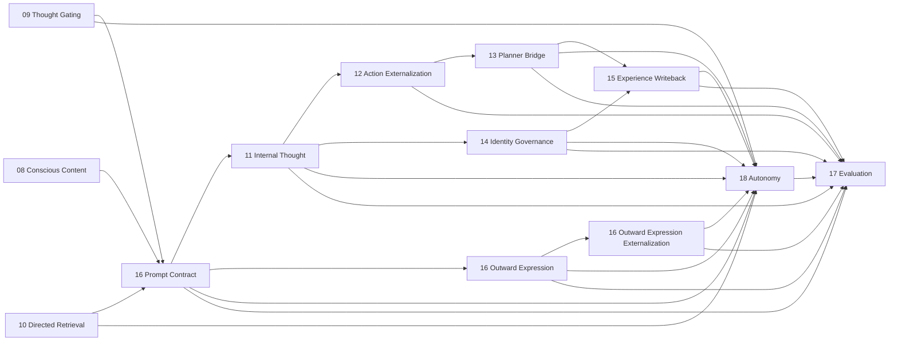

# Helios v2 Architecture Boundaries

> Status: boundary-truth snapshot, last synced R90 (R88–R90 P5 evaluation framework are tests-only diagnostics; no owner or boundary change since the R87 consequence-truth real-delivery verdict — B4 closeout)
> Scope: implementation-aligned owner and dependency truth for `helios_v2`

## 1. Purpose

This document is the boundary truth for Helios v2.

It operationalizes the philosophy, final-goal definition, and v2.0.0 release constraints defined in `ARCHITECTURE_PHILOSOPHY.zh-CN.md`.

API and ops formatting rules are defined in `API_AND_OPS_CONTRACT_GUIDE.md` and are mandatory for all public cross-module interfaces.

It defines:

1. owner modules,
2. allowed dependency directions,
3. prohibited implementation shortcuts,
4. startup and runtime hard-stop rules.
5. module API and ops exposure rules.
6. design-before-development workflow rules.

## 2. Global Constraints

1. Runtime strategy must not be hardcoded into source-level decision branches.
2. Runtime must not provide degraded, compatibility, or fallback behavior when critical dependencies are missing.
3. Missing critical dependencies must block startup or abort the active execution path.
4. One runtime concept must have one semantic owner.
5. Evaluation is read-only and cannot mutate runtime behavior.
6. Cross-module collaboration must happen through explicit APIs or ops contracts rather than direct state reach-through.
7. Public APIs and ops contracts must carry comments or docstrings describing ownership, inputs, outputs, and failure semantics.
8. Implementation work must not begin until requirement and design documents exist for the target slice.

## 3. Core Owner Map

| Domain | Owner package | Responsibility |
| --- | --- | --- |
| Runtime kernel | `helios_v2.runtime.kernel` | lifecycle orchestration, startup gating, stage dispatch |
| Runtime dependency gate | `helios_v2.runtime.dependencies` | critical dependency validation and fail-fast startup rules |
| Runtime observability | `helios_v2.observability` | structured runtime log events, severity/event-kind taxonomies, fail-fast sink dispatch, and the runtime observability recorder |
| Runtime composition root | `helios_v2.composition` | assembly-only wiring of the dependency gate, the canonical nineteen-stage chain with shipped first-version owner-neutral bridges, and the optional observability recorder into one runnable runtime handle |
| LLM inference gateway | `helios_v2.llm` | backend-neutral inference request/completion contracts, the named-profile registry, the vendor-neutral provider protocol and first-version OpenAI-compatible provider, network-free static readiness, and the opt-in live readiness probe |
| Channel driver subsystem | `helios_v2.channel` | the uniform `ChannelDriver` protocol, driver descriptor/config/management/status/readiness contracts, transport-intrinsic QoS taxonomy and inbound/outbound contracts, and the `ChannelSubsystem` framework (registry + bounded NAPI-style inbound drain + bounded outbound dispatch + real channel-state snapshot + network-free static readiness) |
| Durable experience store | `helios_v2.persistence` | the `PersistedExperienceRecord` and `PriorExistenceSnapshot` contracts, the `ExperienceStoreBackend` protocol (first-version SQLite file backend + in-memory double), the `ExperienceStore` facade (append / recent-N / count / snapshot / similarity search), and the recency + semantic store-backed directed-retrieval candidate providers; durable append of the `15` continuity stream and (with `45`) the `06` consolidation-worthy affect-memory stream distinguished by an additive opaque `record_kind` discriminator on one shared store, optional per-record embedding vector storage, and deterministic recency or cosine-similarity re-entry into `10`. Owns no cognitive policy, never embeds text itself (it stores/ranks vectors it is given), never interprets `record_kind`/`metadata` for meaning, and is never an authoritative inter-owner transport |
| Embedding inference gateway | `helios_v2.embedding` | backend-neutral `EmbeddingRequest`/`EmbeddingResult` contracts, the named `EmbeddingProfile` and registry, the vendor-neutral `EmbeddingProvider` protocol plus the first-version lazy OpenAI-compatible provider and the network-free `DeterministicHashEmbeddingProvider` (R69, 16-dimension character-hash-to-bucket), the `EmbeddingGateway` owner, network-free static readiness, and the opt-in live readiness probe; turns text into a vector through a named profile and reports readiness. Owns no cognitive policy and never interprets an embedding vector's meaning |
| Runtime interoceptive signal source | `helios_v2.interoception` | the `RuntimePressureSample` contract (four bounded `[0,1]` compute/runtime-pressure channels), the injected `RuntimePressureSampler` protocol plus the first-version `StdlibRuntimePressureSampler` (lazy psutil with defined neutral defaults; never raises for a merely-unavailable fact), and the `RuntimeInteroceptiveSource` (implements the existing `SensorySource`, emitting one bounded `signal_type="interoceptive"` `RawSignal` per channel); reports the runtime's real internal condition as interoceptive afferents into `02`. Owns only the runtime-fact-to-signal projection; holds no feeling/salience/cognitive policy, imports no feeling/appraisal/neuromodulation owner, and never normalizes (`02` owns that) |
| Temporal pacing and rest-state source | `helios_v2.temporal` | the `TemporalPacingSample` contract (`temporal_signal` `[0,1]` + `dmn_available` bool), the injected `TemporalSource` protocol (`sample(external_stimulus_present)` + `observe_tick(fired)`), and the first-version `RestStateTemporalSource` (rest→DMN engaged, external task→DMN suppressed; `temporal_signal` accumulating across consecutive no-fire ticks and resetting on a fire); reports the two temporal/rest-state facts the `09` gate consumes, replacing the composition-injected constants. Owns no gate decision or weights (those stay in `09`), holds no salience/feeling/cognitive policy, and imports no gate/appraisal/feeling/neuromodulation owner |
| Durable runtime-continuity checkpoint | `helios_v2.continuity_checkpoint` | the `RuntimeContinuitySnapshot` contract (an owner-neutral serializable projection of the genuinely cross-tick continuity state — the `09` `ContinuationPressureState` plus the `18`/`24` long-horizon continuity, reusing those owners' own contracts verbatim), the `CheckpointStoreBackend` protocol (first-version single-row SQLite file backend + in-memory double), and the `ContinuityCheckpointStore` facade (latest-state `save_latest` replace / `load_latest` or explicit absence); keeps one latest-state snapshot and restores it on restart so a restarted runtime resumes its `09`/`18` cross-tick state. Owns no cognitive policy, never computes or reinterprets a continuity decision (the stage-result projection and owner-state reconstruction are owner-neutral composition glue), and is never an authoritative inter-owner transport |
| Requirement truth | `helios_v2/docs/requirements/*` | behavioral boundary, design, and task authority |

## 4. Stable Runtime Owner Snapshot (`16-18`)

This section is the active boundary-truth snapshot for the currently stabilized owner wave.

### 4.1 Requirement `16` prompt and outward-expression chain

| Owner | Primary modules | Owns | Explicitly does not own |
| --- | --- | --- | --- |
| Embodied prompt owner | `helios_v2.prompt_contract` | embodied subjective prompt-contract assembly for `thought` and `outward_expression` consumers; anti-theatrical constraints; capability and authority boundary rendering; outward-expression request handoff | internal thought execution; planner authority; channel execution; identity-governance judgment |
| Outward-expression owner | `helios_v2.outward_expression` | bounded outward-expression draft assembly from prompt-owned request | final execution authority; planner decision; channel routing; transport dispatch |
| Outward-expression externalization owner | `helios_v2.outward_expression_externalization` | execution-adjacent externalization draft assembly from outward-expression draft | final planner/channel/transport authority |

Boundary rules:

1. `prompt_contract` is the sole owner of prompt-contract assembly, not the owner of user-visible execution.
2. `outward_expression` may prepare one bounded draft, but that draft is non-authoritative.
3. `outward_expression_externalization` may prepare an execution-adjacent draft, but that draft is still non-authoritative.
4. The formal chain is `EmbodiedPromptContract -> OutwardExpressionPromptView -> OutwardExpressionRequest -> OutwardExpressionDraft -> OutwardExpressionExternalizationDraft`.

### 4.2 Requirement `17` evaluation owner

| Owner | Primary modules | Owns | Explicitly does not own |
| --- | --- | --- | --- |
| Evaluation owner | `helios_v2.evaluation` | read-only evaluation request/evidence-bundle assembly, diagnostic artifact publication, gap analysis, long-range diagnostics | runtime mutation; planner authority; channel execution; governance judgment; storage writes |

Boundary rules:

1. `evaluation` consumes only explicit owner outputs and provenance-rich evidence bundles.
2. `evaluation` must not scrape transient locals or private mutable runtime state.
3. `evaluation` currently consumes thought, action externalization, planner, governance, writeback, prompt, outward-expression, outward-expression externalization, and autonomy evidence.
4. `evaluation` consumes the prior-tick execution timeline only as the observability-owned `ExecutionTimelineView` projection, never as raw log events, and publishes consequence-binding path outcomes (internally-activated, blocked, rejected, executed, continuity-written) derived from owner-published statuses. Absent timeline evidence becomes an explicit incompleteness warning rather than inferred fidelity, and shim-derived dimensions are annotated explicitly.
5. `evaluation` owns the consequence-claim contract (`ConsequenceClaim`) and the execution-truth corroboration verdict (`corroborated` / `discrepant` / `unverifiable_no_timeline`). Each tick it publishes a `ConsequenceClaim` (the derived path outcome plus the owner-published statuses it depended on) and corroborates the prior completed tick's carried claim against that same tick's `ExecutionTimelineView` using a documented outcome-to-kernel-stage-fact mapping. It reads only execution-timing facts from the timeline plus the carried claim's statuses; it re-derives no owner decision. A contradiction becomes a dedicated `consequence_discrepancy` fidelity warning. Absence, tick mismatch, or an incomplete timeline yields `unverifiable_no_timeline`, never an optimistic `corroborated`. The corroboration is strictly additive: it does not change the existing outcome taxonomy or `internal_to_visible_consequence` scoring.
6. `evaluation` additionally owns the real-delivery corroboration verdict (`really_delivered` / `delivered_failed` / `delivery_unverified` / `delivery_not_applicable`, R87). For an `executed`/`continuity_written` claim whose action is a KNOWN non-user-visible host/world effector op, it matches the carried claim's `decision_id` against the `tool_result` reafference drained this tick (an owner-neutral `delivered_tool_result_evidence` projection composition forwards from the `channel_inbound_drain` stage result) and reads only the reafference `ok` fact: `ok=True` is `really_delivered`, `ok=False` is `delivered_failed` (a dedicated `consequence_delivery_discrepancy` warning), an absent reafference is `delivery_unverified` (honest, never optimistic), and a non-executed/unknown/user-visible/internal action is `delivery_not_applicable` (the stage-completion corroboration stands). This is strictly additive: it never changes the existing corroboration verdict, outcome taxonomy, or scoring, and re-derives no owner decision (it matches by id and reads the `ok` fact). `effect_class`/`user_visible` are the per-op driver self-description facts (R85) consumed here.

### 4.3 Requirement `18` autonomy owner

| Owner | Primary modules | Owns | Explicitly does not own |
| --- | --- | --- | --- |
| Autonomy owner | `helios_v2.autonomy` | proactive-drive integration, bounded disposition selection, deferred continuity publication, outward-vs-inward proactive distinction, and long-horizon continuity threads (recurrence reinforcement, conflict arbitration, the owner-owned `LongHorizonContinuityState`) | prompt assembly; planner authority; channel execution; governance judgment |

Boundary rules:

1. `autonomy` is the sole owner of proactive-drive integration and deferred continuity in v2.
2. `autonomy` may request or justify proactive externalization semantically, but it must not directly execute a channel path.
3. Blocked proactive tendencies must become explicit deferred continuity records rather than disappearing silently.
4. Long-horizon continuity threads are owned solely by `autonomy`. They are computed from the owner's own deferred-continuity records plus owner-private prior-thread carry; reinforcement and conflict arbitration are deterministic and bounded; threads are retired only explicitly (expired or resolved) and suppressed threads remain preserved as continuity. No other owner may compute thread reinforcement or arbitration, and threads never grant direct channel or planner authority.

### 4.4 Requirement `21` observability owner

| Owner | Primary modules | Owns | Explicitly does not own |
| --- | --- | --- | --- |
| Observability owner | `helios_v2.observability` | structured `LogEvent` contract, severity and event-kind taxonomies, `LogSink` protocol, first-version in-memory and JSON-line sinks, the sequence-stamping `RuntimeObservabilityRecorder`, and the read-only `ExecutionTimelineView` plus its `ExecutionTimelineReconstructor` | any cognitive runtime decision or state; planner authority; channel execution; governance judgment; authoritative inter-owner state transport; persistence policy beyond the sink boundary |

Boundary rules:

1. `observability` is read-only infrastructure. It consumes only already-public runtime artifacts and lifecycle facts and never mutates owner state.
2. The uniform emission point for the `01-18` chain is the runtime kernel, which observes public stage results and lifecycle events only. Cognitive owners do not import `observability` to self-log in this slice.
3. Log events must never be the authoritative source of any first-class runtime concept. No owner may depend on the log channel to receive another owner's decision.
4. The recorder is fail-fast: zero sinks raise at construction and sink emission failures propagate. There is no degraded no-op recorder.
5. Observability is default-off at the kernel: an absent recorder is a non-instrumented runtime, not a degraded cognitive mode.
6. The `ExecutionTimelineReconstructor` rebuilds one tick's `ExecutionTimelineView` from already-captured kernel lifecycle events. It derives only execution-timing facts (stage order, lifecycle status, duration) and never reads an owner's semantic decision payload. The timeline view is the only sanctioned form in which downstream owners may consume execution-timing facts; downstream owners must not parse raw `LogEvent` objects. Missing lifecycle yields an explicitly incomplete view; malformed pairing raises.

### 4.5 Requirement `22` composition root owner

| Owner | Primary modules | Owns | Explicitly does not own |
| --- | --- | --- | --- |
| Composition root owner | `helios_v2.composition` | assembly-only wiring of the dependency gate, the canonical nineteen-stage chain, shipped first-version owner-neutral cross-owner bridges, first-version injected owner capabilities, and the optional `21` recorder into one runnable `RuntimeHandle`; the canonical stage-order constant and its assembly-time validation | any cognitive runtime decision or owner state; planner authority; channel execution; governance judgment; the observability taxonomy; any degraded or fallback assembly path |

Boundary rules:

1. `composition` is assembly-only. It constructs owners, owner-neutral bridges, and the kernel, then registers stages in the canonical order. It holds no cognitive policy.
2. The first-version bridges and injected owner capabilities are owner-neutral glue. They forward and shape explicit upstream contract fields and preserve provenance, but they must not compute a downstream owner's semantic decision. They are baseline shims that later owner-deepening waves replace through the owners themselves.
3. `composition` provides no degraded, reduced, or fallback assembly. A missing critical dependency fails fast through the existing startup gate; a wrong stage count or order raises `CompositionError`; a missing or inconsistent upstream artifact raises the existing stage execution error.
4. The single logging mechanism in Helios v2 is the `21` observability owner. No module under `helios_v2/src`, including `composition`, may use `logging` or `print`. This is enforced by a repository guard test (`tests/test_no_adhoc_logging_guard.py`).
5. The composition assembly contract (`assemble_runtime`, `RuntimeHandle`, `CANONICAL_STAGE_ORDER`) is the stable seam that later extension requirements build on additively rather than rewrite.

### 4.6 Requirement `25` LLM inference gateway owner

| Owner | Primary modules | Owns | Explicitly does not own |
| --- | --- | --- | --- |
| LLM inference gateway owner | `helios_v2.llm` | backend-neutral `LlmRequest`/`LlmCompletion`/`LlmUsage` contracts, the named `LlmProfile` and `LlmProfileRegistry`, the vendor-neutral `LlmProvider` protocol plus the first-version `OpenAICompatibleProvider`, the `LlmGateway` owner, network-free static readiness, and the opt-in live readiness probe | prompt assembly; cognitive interpretation of completion text; consumer identity or which cognitive stage a request serves; cross-owner state transport; planner/channel/governance authority |

Boundary rules:

1. `llm` is a capability owner, not a cognitive owner. It turns a neutral request into a completion through a named profile and reports readiness. It holds no cognitive policy and never interprets `output_text`.
2. The gateway keys only on `target_profile`. Profile-to-consumer binding is a composition concern; the gateway is ignorant of which owner consumes which profile.
3. The concrete provider is injected behind the `LlmProvider` protocol. The first-version `OpenAICompatibleProvider` imports the vendor SDK lazily inside its call path, so importing `helios_v2.llm` never requires the SDK; tests inject a deterministic fake provider and never reach the network.
4. The gateway is fail-fast: an unknown profile, a missing or empty api key, empty messages, or a provider failure raises `LlmError`. There is no degraded or fabricated completion path.
5. Static readiness (profile registered and api-key env var non-empty) is deterministic and network-free, and is the form wired into the startup dependency gate through the composition-owned `LlmReadinessDependencyProvider` and the `llm_profiles_ready` critical dependency. The live readiness probe issues a real call and is opt-in only; it is never part of the mandatory startup gate.
6. LLM facts (model, usage, latency, finish reason) travel only through the `LlmCompletion` contract, never through the log channel. The gateway adds no second logging mechanism and emits nothing itself.

### 4.7 Requirement `30` channel driver subsystem owner

| Owner | Primary modules | Owns | Explicitly does not own |
| --- | --- | --- | --- |
| Channel driver subsystem owner | `helios_v2.channel` | the uniform `ChannelDriver` protocol; driver descriptor/config/management/status/readiness contracts; transport-intrinsic `ChannelQosClass` taxonomy and inbound packet/drain contracts; outbound packet/dispatch-outcome contracts; the `ChannelSubsystem` framework (runtime-pluggable driver registry, NAPI-style bounded fair inbound drain, bounded priority-respecting outbound dispatch, real per-driver `ChannelStateSnapshot`, network-free static readiness) | raw-signal normalization (`02` sensory); salience/cognitive importance (`03` appraisal); channel selection or acceptance (`13` planner); outward content shaping (`16`) |

Boundary rules:

1. `channel` is a transport owner, not a cognitive owner. It is a registry + scheduler modeled on a Linux kernel driver subsystem; each concrete driver is one device-driver analog. The framework holds no cognitive policy.
2. The inbound path emits `RawSignal` only; it does not normalize. `02` sensory turns `RawSignal` into `Stimulus`. The subsystem maps one `InboundPacket -> RawSignal` (`signal_id=packet_id`, `source_name=channel=driver_id`, `signal_type=packet_type`), preserving driver provenance.
3. QoS is transport-intrinsic. `ChannelQosClass` (`control`/`interactive`/`bulk`/`background`) is derived only from transport-visible facts, never by reading content for meaning. It rides `RawSignal.metadata["channel_qos"]` (the reserved key `CHANNEL_QOS_METADATA_KEY`), which `02` sensory preserves onto `Stimulus.metadata` verbatim. Only `03` appraisal may interpret it as a salience input. The framework may use it for transport scheduling only and never maps it to cognitive importance. Carriage is a reserved string-valued metadata key, not a typed field, so `02` sensory does not reference this `30`-owned taxonomy and the owner dependency direction stays `30 -> 02`. First version ships the taxonomy + propagation only; multi-lane scheduling and selective dropping are design-reserved.
4. The inbound drain is NAPI-style and bounded: drivers receive asynchronously into their own bounded backlogs; the framework drains the ready set fairly (deterministic round-robin with a persisted cursor) under a global budget, leaving the remainder pending for the next tick. Per-driver backlog overflow applies the driver's documented policy and is counted, never silent or unbounded.
5. The outbound dispatch is bounded and honors the planner-provided `execution_priority` verbatim (it never recomputes priority or re-selects the channel; it sends to `target_driver_id`). An unknown/unavailable target yields an explicit `driver_unavailable` outcome; packets beyond the budget are deferred (counted), never dropped silently.
6. `channel_state_snapshot()` exposes the real per-driver descriptor/status for the planner to replace the hardcoded channel-state shim; it carries transport facts only and never recommends a selection.
7. Static readiness (a driver's declared credential/resource presence) is deterministic and network-free, and is the form wired into the startup gate through the composition-owned `ChannelReadinessDependencyProvider` and the `channel_drivers_ready` critical dependency when a critical driver is bound. There is no degraded transport mode.
8. This requirement ships the framework and a deterministic fake driver only; it is not wired into the assembled runtime. The first real driver (CLI) and the composition wiring that replaces the inbound shim and the planner channel-state shim are requirement `31`.

### 4.8 Requirement `31` CLI channel driver and channel-bound assembly

| Owner | Primary modules | Owns | Explicitly does not own |
| --- | --- | --- | --- |
| CLI channel driver | `helios_v2.channel.drivers.cli` | the first concrete `ChannelDriver`: a local bidirectional CLI transport (`CliChannelDriver`/`CliDriverConfig`) with injected in-memory I/O, a bounded inbound backlog (`submit_line`), QoS-tagged text drain, sink-rendered outbound send, lifecycle/config ops, and always-ready static readiness | normalization (`02`); salience (`03`); channel selection/acceptance (`13`); outward content shaping (`16`); any real stdio (a reader/writer adapter at the entry point owns that) |
| Channel-bound assembly wiring | `helios_v2.runtime.stages` (`ChannelInboundDrainRuntimeStage`, `ChannelOutboundDispatchRuntimeStage`), `helios_v2.composition` (`SubsystemBackedSensorySource`, `ChannelSubsystemStateProvider`, `ChannelBackedPlannerBridgeRequestBridge`, `assemble_runtime(channel_cli=True)`) | the opt-in 21-stage assembly variant that registers the subsystem + CLI driver, drains inbound into sensory, dispatches planner-accepted decisions outbound, and sources real planner channel-state | cognitive policy; the default 19-stage assembly (unchanged) |

Boundary rules:

1. The CLI driver is transport only. It writes solely through its injected `output_sink` and reads solely from its injected input (`submit_line`); it never calls `print` or touches real stdio itself. Real stdin/stdout is touched only by the `--channel-cli` entry point's reader adapter and injected stdout writer, never in the test suite.
2. The driver derives QoS transport-intrinsically (CLI operator text is `interactive`), set without reading content for meaning, consistent with `30`.
3. The channel-bound assembly is an explicit opt-in (`channel_cli=True`). It registers two transport stages: `channel_inbound_drain` runs first and feeds the drained `RawSignal` tuple to the subsystem-backed sensory source (sensory still normalizes); `channel_outbound_dispatch` runs right after the planner bridge and transports the planner-accepted decision to the target driver. The cognition chain between them is byte-for-byte the default chain.
4. In the channel-bound assembly the planner consumes the real per-driver channel state through `ChannelSubsystemStateProvider` (a connected driver is reported available/bound/executable), replacing the hardcoded shim. The planner still owns selection and acceptance; the dispatch stage performs the real transport. Writeback/evaluation behavior is unchanged because the planner still produces the same `executed` path.
5. The default (non-channel) assembly and its `CANONICAL_STAGE_ORDER` are unchanged. The channel-bound variant validates against `CHANNEL_BOUND_STAGE_ORDER` (21 stages) instead. A no-input tick drains nothing and the chain closes as an internal-only tick (`28`); nothing is dispatched.
6. The channel-bound assembly registers `channel_drivers_ready` as a critical dependency through `ChannelReadinessDependencyProvider`; CLI declares no credential so it always passes, but the fail-fast gate routes through it for a future critical driver. No degraded transport path exists.
7. No `logging`/`print` anywhere under `src/`; the driver writes only through its injected sink; the guard test stays green.

### 4.9 Requirement `84` OS file-system effector driver and generalized multi-driver assembly

| Owner | Primary modules | Owns | Explicitly does not own |
| --- | --- | --- | --- |
| OS file-system channel driver | `helios_v2.channel.drivers.os_fs` (`OsFileSystemChannelDriver`, `OsFileSystemDriverConfig`, `FileOpExecutor`/`InlineFileOpExecutor`/`ThreadPoolFileOpExecutor`) | the first concrete **effector** `ChannelDriver`: sandboxed `fs_read`/`fs_write`/`fs_list`/`fs_modify` execution confined to a configured sandbox root with strict path-escape defense, asynchronous execution through an injected executor, a thread-safe bounded result backlog, and `tool_result` reafference (the op result re-entering `02` sensory with correlation provenance) | normalization (`02`); salience (`03`); channel selection/acceptance (`13`); outward content shaping (`16`); interpretation of a result's meaning; process spawning (`85`); network transport |
| Generalized channel-bound assembly | `helios_v2.composition` (`RuntimeProfile.channel_drivers`, the effective-driver-set assembly block) | registering a set of drivers (CLI relay + effectors) on one subsystem, all drained into the subsystem-backed sensory source, all readiness-gated; the cli-only path preserved byte-for-byte | cognitive policy; the default 19-stage assembly; autonomous tool selection |

Boundary rules:

1. The OS file-system driver is a transport/effector only. It performs I/O strictly inside the resolved sandbox root; an out-of-sandbox path (absolute outside, `..` traversal, or symlink escape, caught via `Path.resolve()` + relative-to-root) is a rejected operation, never a redirected or clamped one. It holds no cognitive policy and never interprets a result's meaning.
2. The effector loop is efference→reafference: `send_outbound` accepts synchronously (returning `delivered` = "accepted for async execution", never "completed") and submits to the injected executor; the operation's result (success or failure) is enqueued exactly once as a `tool_result` `InboundPacket` carrying the originating decision's correlation provenance, drained on a later tick boundary into `02`. QoS is transport-intrinsic (`bulk` for local data results), set without reading the result content for meaning, consistent with `30`.
3. Failure is never silent and never fabricated as success: a structural rejection (unknown op / missing param / write-disabled) returns a failed dispatch outcome and also enqueues a failure reafference (double write-back); an execution failure enqueues a failure reafference only; the driver never falls back to a different operation. There is no degraded path: a missing sandbox root reports not-ready and trips the fail-fast startup gate when the driver is bound.
4. The injected executor is the threading seam: production uses `ThreadPoolFileOpExecutor` (true async, so a slow op enqueues its result whenever it finishes); the network-free test/CI/long-run path uses `InlineFileOpExecutor` (synchronous, deterministic, race-free). The backlog is lock-guarded for safe worker-thread enqueue vs tick-thread drain.
5. The channel-bound assembly is generalized to a set of drivers via `RuntimeProfile.channel_drivers`; the effective set is the CLI driver (when `channel_cli`) plus the injected drivers, all registered on one subsystem with one subsystem-backed sensory source and one readiness gate over all bound driver ids. The cli-only path (`channel_cli=True`, no extra drivers) is byte-for-byte the R31 single-CLI assembly, and `CHANNEL_BOUND_STAGE_ORDER` (21 stages) is unchanged (transport stages are per-subsystem). Any channel binding remains mutually exclusive with an injected `external_signal_source`.
6. Autonomous LLM-driven planner tool selection (`11`→`12`→`13` function-calling choosing an `fs_*` op) is explicitly NOT owned here; R84 ships the effector and the loop mechanism, and the planner's autonomous tool selection is a deferred follow-on requirement. The driver never re-selects a channel or recomputes a decision.

### 4.10 Requirement `85` LLM-driven autonomous tool selection and per-op driver self-description

| Owner | Primary modules | Owns | Explicitly does not own |
| --- | --- | --- | --- |
| Per-op driver self-description | `helios_v2.channel.contracts` (`ChannelOpSpec`, `ChannelDriverDescriptor.output_op_specs`, `op_spec`), `channel.drivers.cli`/`channel.drivers.os_fs` (the declarations) | each output op's `required_params`, `user_visible`, `effect_class`, `risk_class` — declared by the owning driver as transport/capability facts | how those facts are interpreted (the planner validates; `14`/`17` consume effect/risk later); cognitive policy |
| Tool-intent cognition | `helios_v2.prompt_contract` (v3 tool-intent schema), `helios_v2.internal_thought` (`op_params`, the tool-intent parse + carrier) | expressing a tool intent (op name + params) as model content with deterministic action-slot precedence | channel selection, binding, or input validation (all `13`); per-op property knowledge |
| Generic planner tool binding | `helios_v2.planner_bridge.engine` (generic `required_params` validation + op effect/risk on the policy trace), `helios_v2.composition` (op_specs projection, capability gate from channel-state, the rejection-tick `world_blocked` writeback) | selecting/binding the op to the offering driver, validating its inputs generically, the channel-state-derived capability gate | the op's intrinsic properties (the driver declares them); cognition's intent |

Boundary rules:

1. Cognition names an op and its params (model content); it never selects, binds, or validates a channel. Selection/binding/validation stays in `13`.
2. Each op's intrinsic properties (`required_params`/`user_visible`/`effect_class`/`risk_class`) are declared by the owning driver in its descriptor and travel to the planner through the real channel-state snapshot. Per-op knowledge must never be hardcoded in the planner; the planner validates generically against the declared spec (with a legacy reply fallback when an op declares no spec).
3. The proposal `scope` taxonomy is unchanged (`internal`/`external`; no `tool` value). An effector op is an `external` proposal whose user-visibility comes from the op's declared `user_visible`, never from scope. The `external`-scope outbound_text rule is removed; op-aware validation lives only in `13` (D2a).
4. The capability gate is the driver self-description: an op offered by a connected outbound driver is a registered, reviewed behavior; an unoffered op is a formal planner rejection. No `14` governance is added in R85; `effect_class`/`risk_class` are declared and ride the policy trace read-through only (R86 enforces `risk_class`; R87 consumes `effect_class`).
5. A tool failure, rejection, or unavailable op is a formal written-back outcome (planner rejection / consistency failure with a `world_blocked` continuity record, or the R84 failure reafference), never silently dropped and never reported as success. No native function-calling (`25` unchanged); no degraded path.

### 4.11 Requirement `86` governed OS command execution, enforced risk-class gate, and `14` action authorization

| Owner | Primary modules | Owns | Explicitly does not own |
| --- | --- | --- | --- |
| Governed OS command driver | `helios_v2.channel.drivers.os_command` (`OsCommandChannelDriver`, `OsCommandDriverConfig`, `CommandAllowRule`, `CommandExecutor`/`InlineCommandExecutor`/`ThreadPoolCommandExecutor`, `CommandRunner`/`FakeCommandRunner`/`SubprocessCommandRunner`) | the second effector `ChannelDriver`: sandboxed no-shell `run_command` execution confined to a sandbox cwd, a default-deny argv-prefix allowlist with a per-command `risk_class`, wall-clock timeout + bounded output, async execution through an injected executor + runner, structural-rejection + failure double-write-back, and `tool_result` reafference into `02`; self-describing its allowlist as `ChannelDriverDescriptor.command_invocation_policy` | the risk-class gate (`13`); the authorization decision (`14`); normalization (`02`); salience (`03`); channel selection (`13`); content shaping (`16`); interpreting a result's meaning; spawning interpreters / arbitrary code |
| Enforced risk-class gate | `helios_v2.planner_bridge.engine` (`_risk_class_gate`, `_match_command_policy`, `_action_authorization_key`), `helios_v2.planner_bridge.contracts` (`governance_approval`, `pending_governed_action`, the additive rejection reasons) | enforcing the per-op/per-invocation risk gate before binding (`unrestricted` proceeds, `restricted`/unknown is fail-closed, `governed` requires a carried `14` authorization), reading the driver-projected per-command policy generically | the allowlist content (the driver); the authorization decision (`14`); per-command knowledge hardcoded in the planner |
| Governed-action authorization | `helios_v2.identity_governance` (`GovernedActionAuthorization`, `GovernedActionGovernancePath`, `authorize_governed_action`, `evaluate_self_revision_and_authorize`, the additive request/result/config fields) | the authorize/deny verdict for a pending `governed` action, published as an audited carried verdict | selecting/binding/executing a channel or command; the allowlist; the gate; the self-revision contracts (unchanged) |
| Two-tick carry + projection | `helios_v2.composition.bridges` (`PriorGovernedAuthorizationHolder`, the `command_policy` projection, the pending-action projection into `14`, the `governance_approval` projection into `13`), `helios_v2.composition.runtime_assembly` (`RuntimeHandle._carry_governed_authorization`, the `14` config/path wiring) | owner-neutral carry of the `14` verdict across the tick boundary and projection of the driver-declared policy into the planner; deriving `14`'s authorized governed prefixes from bound drivers | any cognitive/authorization/gate decision (those stay in `13`/`14`/the driver) |

Boundary rules:

1. Three owners, three concerns: the **driver** owns the allowlist + per-command risk (capability/transport fact); the **`13` planner** owns the enforced risk-class gate (selection/binding/validation/acceptance); the **`14` owner** owns the authorization judgment for the `governed` tier. Cognition never selects/binds/authorizes. Per-command policy is never hardcoded in the planner — it is read generically from the driver-projected `command_policy`.
2. The gate is global but a no-op for every pre-R86 (`unrestricted` op-level) op (reply, `fs_*`), so those paths are byte-for-byte unchanged. `restricted` (including any non-allowlisted command) never binds and never executes. `governed` executes only after a carried `14` `authorized=True` verdict for that exact action (stable `action_authorization_key`) AND a fresh re-proposal from current cognition — the planner never acts on a stored intent without a current proposal.
3. The `14` authorization is additive: `authorize_governed_action` is inert (returns `None`) when no pending action is present, so the self-revision governance path, contracts, and validators are unchanged. The handshake is two-tick and fail-closed by construction (no carried authorization → `governance_required`), honoring the canonical `13` → `14` → `15` stage order. Defense in depth: the planner refuses to bind an unauthorized op and the driver independently refuses to execute a non-allowlisted command.
4. No-shell only (argv list, `shell=False`); shell-metacharacter, absolute-path, and `..` arguments are rejected, which (with the sandbox cwd outside the source tree) structurally prevents writing the Helios source/requirement tree. No interpreters / arbitrary code are allowlisted (argv-level allowlisting cannot contain in-script effects — that needs OS-level isolation, a future requirement); governed self-code modification is hard-denied (P7). CI is subprocess-free (`FakeCommandRunner`/`InlineCommandExecutor`); a real subprocess runs only in production / an opt-in smoke. No `logging`/`print` under `src/`; owner-boundary + ad-hoc-logging guards stay green.

## 5. Allowed Dependency Directions for `16-18`

The currently stabilized dependency directions are:

Interpretation rules:

1. `16` may consume upstream conscious, gating, and retrieval outputs only through explicit runtime request providers.
2. `18` may read explicit results from `09`, `10`, `11`, `13`, `14`, `15`, and the `16` outward-expression artifact chain, but it does not reclaim execution authority from those owners.
3. `17` is downstream and read-only. It may observe `18`, but `18` must never depend on `17` for runtime strategy.
4. No owner in `16-18` may bypass `13` when the path becomes externally consequential.

## 6. Prohibited Patterns

1. Branching to a low-capability execution path when an LLM, memory, evaluation, or channel capability is unavailable.
2. Encoding fixed routing rules, fixed prompt paths, or fixed decision thresholds directly in orchestration code.
3. Allowing a downstream adapter to silently reinterpret a rejected or unavailable capability as a different behavior.
4. Making runtime success depend on implicit defaults that hide dependency absence.
5. Importing another domain's private state or internal helper just to bypass its owner API.
6. Adding a new module without defining its owner, inbound API, outbound ops, and non-owned responsibilities.
7. Letting `prompt_contract` evolve into a hidden reply-first behavior owner.
8. Treating `OutwardExpressionDraft` or `OutwardExpressionExternalizationDraft` as final execution authority.
9. Letting `autonomy` emit timer-only outward text without planner and channel authority.
10. Allowing blocked proactive tendencies to vanish without deferred continuity evidence.
11. Letting `evaluation` infer strong runtime fidelity from missing provenance categories.

## 7. API and Ops Exposure Rules

1. Each module owner must expose a small public API surface.
2. Cross-domain commands must be expressed as ops-like contracts, not hidden helper calls.
3. Public API methods must document:
	- the owner responsibility,
	- required inputs,
	- returned outputs,
	- hard-stop conditions or raised errors.
4. Private helpers may remain undocumented only if they do not cross module boundaries.
5. If an interface is not stable enough to document, it is not stable enough to expose across module boundaries.
6. For `16-18`, every runtime stage result and provider protocol is part of the boundary truth and must preserve upstream provenance ids explicitly.

## 8. Migration-State Recording Rules

Current migration-state facts that must remain explicit rather than implied away:

1. `16` is stable at the current baseline, but its outward-expression path remains draft-only by design; final execution authority intentionally stays outside that owner family. With R79 the default embodied-prompt path is the v3 `OwnerGroundedEmbodiedPromptPath` (identity rendered from the prior-tick `14` `identity_state_snapshot`, never hardcoded; `embodied_prompt_mode="v1"` is a legacy escape hatch), and `11`'s structured-thought parse is robust to a reasoning model's `<think>`/code-fence output (no-JSON stays an explicit `insufficient_generation`). Identity stays owned by `14`; the prompt remains a formatter.
2. `17` is stable as a read-only diagnostic owner, but its first-version scoring depth is still shallower than the final project goal; baseline coverage does not mean complete evaluation semantics.
3. `18` now carries deferred continuity across ticks through owner-private stage state plus explicit request carry records, and the current baseline also includes long-horizon decay, same-key merge, and explicit resolved-or-expired accounting. It remains deterministic and bounded rather than a fully open-ended proactive-evolution policy.
4. Any later requirement that deepens `16-18` must update both its own package docs and this file's owner snapshot if boundary truth changes materially.
5. `21` observability landed as a baseline read-only owner plus an optional kernel emission seam. It is default-off, so existing runtime construction and tests are unaffected. Its current scope is the kernel-level lifecycle and per-stage timeline only; owner-level fine-grained emission remains intentionally out of scope until a later slice opens it through the same owner.
6. `25` LLM inference gateway landed as a backend-neutral capability owner with a named-profile registry, an injected provider protocol (first-version OpenAI-compatible provider with lazy SDK import), network-free static readiness wired into the startup gate, and an opt-in live probe. It owns no cognition and never interprets completion text.
7. `26` made the LLM-backed internal-thought path the default production cognition path: `11` now sources thought content from the `25` gateway while retaining all sufficiency/continuation/proposal judgment in an owner-private judgment helper shared with the deterministic path. The default assembled runtime therefore carries `llm_profiles_ready` as a critical dependency, so a real `startup()` requires a statically-ready bound profile (a non-empty api key in the environment); the test suite stays network-free by injecting a deterministic fake-provider gateway or the explicit deterministic path. There is no silent fallback from inference failure to deterministic synthesis.
8. `27` made real cognition behaviorally consequential at the `11` owner: the LLM-backed path requests a structured `json_object` thought envelope (sufficiency/continuation/action/self-revision intent), which the owner parses, bounds, and maps into its final judgment under explicit deterministic rules (bounded sufficiency blend; model continuation intent under owner floors; action/self-revision gated by both model intent and owner constraints). Malformed/empty envelopes yield an explicit `insufficient_generation`; no retrieval-only fallback. The composition root gained an explicit `deterministic_thought` offline assembly seam (no LLM dependency), and the driver gained `--deterministic`. `27` deliberately scoped out the internal-only tick closure (a model "continue"/"no action" decision produces no proposal, which the `13`/`15`/`18` chain did not yet tolerate); that cross-owner work is requirement `28`.
9. `28` closed the internal-only tick (wave_C opener). A fired tick that produces no normalized proposal now completes through the chain as an explicit internal-only outcome: `13` planner-bridge publishes a `no_actionable_proposal` result (no decision/rejection/failure); `15` writeback records an `internal_only` continuity packet (`written_internal_only`) with real provenance to the planner result; `18` autonomy integrates the tick with real, non-empty planner and writeback provenance (no contract change, no fabricated ids); `17`/`23` evaluation classifies it as the explicit non-failure `internal_only_decision` consequence outcome. The externalizing path is unchanged. Deciding there is no proposal to route is an orchestration fact derived from the upstream externalization status, mapped into the planner owner's internal-only result; no owner gained outward channel execution authority. Remaining wave_C work: outward channel execution of a normalized proposal, and feeding autonomy drive inputs from real cognition (autonomy drive summaries are still bridge-hardcoded).
10. `29` grounded the autonomy drive inputs in real cognition. The composition autonomy request bridge no longer hardcodes the drive constants; it derives `continuation_pressure`, `temporal_pressure` (an explicit non-switching baseline), `identity_unresolved_pressure`, and the outward-readiness pair from the thought-cycle decision (action present / continue / concluded / self-revision intent), the planner status, and the continuation state. The `18` owner rule and contracts are unchanged; only the bridge's input values changed. Effect: a tick where the thought owner acts drives `externalize`; a no-action tick drives `reflect` or `defer` instead of the previous forced `externalize`; and because real deferrals now occur, the `24` continuity-thread layer forms and reinforces where it was previously permanently inert (autonomy always externalized and cleared deferrals). Remaining wave_C work: real outward channel execution of a normalized proposal (external transport), still deferred.
11. `30` landed the channel driver subsystem framework (transport owner, Linux-driver-style). It ships `helios_v2.channel`: the uniform `ChannelDriver` protocol, driver descriptor/config/management/status/readiness contracts, the transport-intrinsic `ChannelQosClass` taxonomy with inbound packet/drain contracts, outbound packet/dispatch-outcome contracts, the `ChannelSubsystem` framework (runtime-pluggable register/deregister, NAPI-style bounded fair inbound drain mapping packets to QoS-tagged `RawSignal`, bounded priority-respecting outbound dispatch, real per-driver `ChannelStateSnapshot`, network-free static readiness), and a deterministic in-memory fake driver for tests. QoS carriage was resolved to the `RawSignal.metadata["channel_qos"]` reserved key so `02` sensory is unchanged and the owner dependency direction stays `30 -> 02`; the composition `channel_drivers_ready` capability + `ChannelReadinessDependencyProvider` ship as an unbound mechanism. The framework is additive and not wired into the assembled runtime: the existing 19-stage runtime and its tests are untouched. The first real driver (CLI) and the composition wiring that replaces the inbound shim and the planner channel-state shim are requirement `31`.
12. `31` landed the first concrete driver and the first channel composition wiring (wave_C outward-execution closure, local scope). It ships `CliChannelDriver`/`CliDriverConfig` (a local bidirectional CLI transport with injected in-memory I/O, bounded backlog, QoS-tagged drain, sink-rendered outbound send, lifecycle/config ops, always-ready static readiness); two runtime transport stages (`ChannelInboundDrainRuntimeStage`, `ChannelOutboundDispatchRuntimeStage`); and the opt-in `assemble_runtime(channel_cli=True)` 21-stage variant that registers the subsystem + CLI driver, swaps in a `SubsystemBackedSensorySource` (inbound drain feeds sensory) and a real `ChannelSubsystemStateProvider` + `ChannelBackedPlannerBridgeRequestBridge` (the planner consumes real channel state), dispatches planner-accepted decisions outbound to the driver sink, and registers `channel_drivers_ready`. A `--channel-cli` driver entry point runs a real local round trip (reader adapter for real stdin, injected stdout writer); the suite uses injected in-memory I/O and stays network-free. The default 19-stage assembly and its `CANONICAL_STAGE_ORDER` are unchanged; the driver introduces no normalization, salience, selection, or content shaping, and no external network transport. Remaining wave_C work: real external (network) drivers (QQ/voice/vision), and making a channel-bound assembly the default once a real external driver is operational, each via its own requirement.
13. `32` closed `wave_A_behavioral_truth`. The `17` evaluation owner now corroborates the previous completed tick's self-reported consequence outcome against that same tick's kernel execution timeline and publishes a first-class corroboration verdict (`corroborated` / `discrepant` / `unverifiable_no_timeline`). It owns a new `ConsequenceClaim` contract: each tick it publishes the derived consequence path outcome plus the owner-published statuses it depended on (planner status, action-normalization status, continuity-written). Composition carries the prior tick's claim forward through an owner-neutral `FirstVersionPriorConsequenceClaimEvidenceBridge`, tick-aligned with the already-carried `ExecutionTimelineView`, captured by the `RuntimeHandle` after each tick. Corroboration maps each outcome to the kernel stage-completion facts it implies (e.g. `continuity_written` implies the planner-bridge and writeback stages completed) using only execution-timing facts plus the carried claim statuses; it re-derives no owner decision and never parses raw `LogEvent` objects. A contradiction escalates to a dedicated `consequence_discrepancy` fidelity warning referencing both evidence ids. Absence, tick mismatch, or an incomplete timeline yields `unverifiable_no_timeline`, never an optimistic `corroborated`; the existing outcome taxonomy and `internal_to_visible_consequence` scoring are unchanged (strictly additive). Default and channel-bound assemblies both carry the claim; no new logging mechanism; the guard test and full suite stay green and network-free. Remaining behavioral-truth depth (richer discrepancy taxonomies, owner-level emission corroboration) is gated on later non-deterministic cognition and the `21` owner-level emission slice.
14. `33` opened `P2` (durable memory base). It ships `helios_v2.persistence`, a new infrastructure owner peer to observability: the immutable `PersistedExperienceRecord` and `PriorExistenceSnapshot` contracts, the injected `ExperienceStoreBackend` protocol (first-version `SqliteExperienceStoreBackend` file backend using the standard-library `sqlite3`, plus a deterministic `InMemoryExperienceStoreBackend` double), the `ExperienceStore` facade (append-only batch append with a store-assigned strictly-increasing sequence, deterministic most-recent-N read ascending by sequence, count, bounded prior-existence snapshot), and the `StoreBackedDirectedMemoryCandidateProvider`. Composition gained an owner-neutral `ExperienceRecordBridge` (flattens each tick's `15` `ExperienceWritebackResult` + `ContinuityEvidencePacket` into a record, preserving `source_provenance` linkage verbatim) and a `RuntimeHandle._persist_experience` post-tick append seam mirroring the timeline carry (no new stage; `CANONICAL_STAGE_ORDER`/`CHANNEL_BOUND_STAGE_ORDER` unchanged). Persistence is an explicit opt-in `assemble_runtime(experience_store=...)`, default-off: the default assembly keeps the fabricating `FirstVersionDirectedMemoryCandidateProvider`, opens no store, and registers no new dependency. When enabled, the store-backed provider replaces the `10` shim so persisted experience (including a prior session's, after a restart against the same SQLite file) re-enters the thought window through deterministic recency/provenance selection; the `experience_store_ready` critical dependency (via `ExperienceStoreReadinessDependencyProvider`) fails fast when the backend cannot initialize, with no degraded non-persistent path and no silent fallback on a write failure. No embeddings/vectors/semantic ranking (that is `34`); the store holds no cognitive policy and is never an authoritative inter-owner transport; durable file lives under the git-ignored `data/`; no new logging mechanism. Remaining P2 work: semantic retrieval (`34`), latest-state checkpoint/restore for `18`/`09`/`14` (a separate requirement), and persisting `06` memory items once de-shimmed.
15. `34` landed `P2`'s second slice (the `P2 -> P3` hinge): semantic experience retrieval. It ships `helios_v2.embedding`, a backend-neutral embedding capability owner mirroring the `25` LLM gateway: neutral `EmbeddingRequest`/`EmbeddingResult` contracts, the named `EmbeddingProfile` and `EmbeddingProfileRegistry`, the vendor-neutral `EmbeddingProvider` protocol plus the first-version `OpenAICompatibleEmbeddingProvider` (lazy SDK import; tests inject a deterministic fake), the `EmbeddingGateway` owner, network-free static readiness, and an opt-in live probe. The `33` persistence owner gained an additive optional `embedding` vector on `PersistedExperienceRecord` (a nullable JSON column in SQLite; preserved exactly across re-open), a module-level standard-library `cosine_similarity`, a deterministic bounded `search_similar` on both backends (ranks only embedded records descending by cosine with a descending-sequence tie-break, scans at most `max_scan` most-recent records, reports `skipped_non_embedded_count`, no external index/numpy), and a `SemanticStoreBackedDirectedMemoryCandidateProvider` that takes an injected `embed_query` callable. Composition wires semantic memory through the opt-in `assemble_runtime(experience_store=..., embedding_gateway=...)`: it embeds each record's summary at write (the existing `_persist_experience` seam, via an injected `embed_record` callable) and selects the semantic provider for `10` (recall ranked by similarity to the retrieval query, `source="experience_store_semantic"`), replacing recency-only selection. The persistence owner never imports the embedding owner; the query/record embedding capability is injected by composition, preserving the `persistence`-independent-of-`embedding` boundary. Enabling `embedding_gateway` without `experience_store` raises `CompositionError`; the `embedding_profile_ready` critical dependency (via `EmbeddingReadinessDependencyProvider`) fails fast on an unready profile; an embedding failure at write or query is a hard stop with no recency fallback and no fabricated vector. `03` appraisal and every other cognitive owner are unchanged: wiring embedding distance into `03` novelty is the first `P3` slice, deliberately out of scope here. The default, recency-only persistent, and channel-bound assemblies are byte-for-byte unchanged when semantic memory is off; no new heavyweight dependency; no new logging mechanism. Remaining P2/P3 work: real `03` novelty-from-memory, re-embedding/backfill of pre-semantic records, an ANN index at scale, and embedding additional state families once de-shimmed.
16. `35` landed `P3`'s first cognitive-owner de-shim: memory-grounded novelty in the `03` appraisal owner. The `03` owner gained an owner-defined `MemorySimilaritySource` protocol (returns a raw cosine retrieval fact in `[-1, 1]` or `None`, never a salience value) and a `MemoryGroundedDimensionEstimator` that owns the novelty salience mapping (`novelty = clamp(1 - max_similarity, 0, 1)`, `None -> 1.0`) while keeping the other four dimensions at their first-version constants and leaving the aggregate estimator untouched. Composition gained the owner-neutral `MemoryGroundedSimilaritySource` (embeds `stimulus.content` through the existing `_embed_text` callable bound to the same embedding profile the store was written with, runs the `33` store `search_similar(limit=1)`, returns the top cosine or `None`); it imports the `ExperienceStore` type only and reaches the embedding owner solely through the injected callable, so `03` imports neither the embedding nor persistence owner. The novelty salience semantic (the `1 - x` mapping and the cold/empty `-> 1.0` decision) lives in `03`, not in the composition glue. Selection triggers on the existing semantic-memory opt-in (store + embedding gateway both present); otherwise `03` keeps `FirstVersionDimensionEstimator` and the constant novelty `0.6`. Empty stimulus content returns max novelty without an embedding call; a cold/all-non-embedded store returns max novelty; a runtime embedding/store failure is a hard stop with no constant fallback. The first-version comparison is cross-register (stimulus input vs `15` result summaries sharing the embedding profile), explicitly recorded in the `03` owner entry of `OWNER_GUIDE.md` and not over-claimed; the apples-to-apples "method B" (persist the raw stimulus stream) and the other four dimensions are later P3 slices. No new contract on `RapidSalienceVector`/`RapidAppraisalBatch`; novelty flows through unchanged. No new logging mechanism; the guard test and full suite stay green and network-free.
17. `36` landed `P3`'s second cognitive-owner de-shim: appraisal-derived neuromodulation in the `04` neuromodulator owner. The constant `FirstVersionNeuromodulatorUpdatePath` (which ignored its `batch` argument and returned fixed levels every tick) is replaced under the semantic-memory assembly by the composition-provided `AppraisalDerivedNeuromodulatorUpdatePath`, which conforms to the owner's existing `NeuromodulatorUpdatePath` protocol (the `04` engine and its `NeuromodulatorState`/`NeuromodulatorLevels` contracts are unchanged). The path aggregates the `RapidAppraisalBatch` into one coarse salience vector by per-dimension maximum across the batch's appraisals (the most salient stimulus drives modulation; an empty batch yields the tonic baseline directly), then derives each channel as `clamp(tonic_baseline_channel + sum(sensitivity_k * salience_k), legal_min, legal_max)` with explicit bounded first-version sensitivity constants: dopamine driven up by reward (and weakly by novelty as exploration drive), norepinephrine by novelty and uncertainty, cortisol by threat, and the other channels regressing to their clamped tonic baseline. The derivation is a total deterministic linear-combination-plus-clamp function of the batch and config: no NN, no hidden runtime strategy branch, no divergence outside the legal range, and explicitly stateless (it reads no prior-tick levels). The path reads only the batch plus the owner config; it imports/reaches no other owner's state and produces no feeling/action semantics. Selection reuses the existing semantic-memory opt-in (store + embedding gateway both present, where the R35 novelty is real); the default, recency-only persistent, and deterministic offline assemblies keep the constant update path and their current `04` behavior byte-for-byte. The sensitivity coefficients sit under the config's already-declared learned-parameter categories and are the surface a later P5 learning slice tunes. Deferred to later slices (recorded in the `04` `OWNER_GUIDE` next-steps): dual-timescale tonic/phasic decay carrying prior-tick levels (the `18`/`09`/`14` state-checkpoint family), P5 coefficient learning, cross-channel coupling, downstream coupling into a de-shimmed `05`/`09`, and de-shimming the remaining four `03` dimensions so all neuromodulator drivers are real. No new contract; no new logging mechanism; the guard test and full suite stay green and network-free.
18. `37` landed `P3`'s third cognitive-owner de-shim, and the first time a real `04` level shapes a downstream cognitive decision: neuromodulatory gating coupling at the `09` thought-gating owner. The `09` `ThoughtGateSignalSnapshot` gained one additive optional raw-fact field `neuromodulatory_arousal: float | None` (`[0,1]`, default `None`), and the `09` owner gained an `ArousalAwareThoughtGatePath` that owns how that fact maps into the gate decision. Composition's `NeuromodulatorAwareThoughtGateSignalBridge` reads the `04` `NeuromodulatorStageResult` already present in `frame.stage_results` (the canonical order runs `04` before `09`, so no stage reorder) and forwards `state.levels.norepinephrine` verbatim as the raw arousal fact; it computes no gate score and no activation mapping. The arousal-to-gate semantic lives in the `09` owner, exactly as R35 keeps the novelty salience semantic in `03` while composition forwards only the raw retrieval fact. The arousal-aware path adds one non-negative bounded term `arousal_gain * arousal` (first-version `arousal_gain = 0.15`, under the already-declared `gate_policy` learned-parameter category, P5-learnable later) to the existing gate-score sum and records it in `contributing_signals`; the existing `global_activation_level` term and all other terms are untouched (de-shimming that still-constant input, likely from a de-shimmed `07` workspace, is a separate later slice). The coupling is monotonic non-decreasing in arousal, deterministic, and stateless (it reads no prior-tick gate or neuromodulator state). It is structurally never a hard gate by itself: the term's weight `0.15` is below the `0.55` fire threshold, so arousal alone cannot force a fire, and being additive and non-negative it cannot suppress a fire other signals already justify. Selection reuses the existing semantic-memory opt-in (store + embedding gateway both present, where the R36 `04` levels are real); when the fact is `None` the arousal-aware path reproduces the first-version path byte-for-byte, so the default, recency-only persistent, and deterministic offline assemblies keep the constant `global_activation_level` and their current `09` behavior. Deferred to later slices (recorded in the `09`/`04` `OWNER_GUIDE` next-steps): cortisol/inhibition hard-gate-eligibility coupling (the `04` config already reserves `hard_gate_eligibility_channels=("cortisol","inhibition")`, which may legitimately suppress a fire and has its own safety semantics), coupling the real `04` state into a de-shimmed `05` feeling, additional `04` channels into their consumers (dopamine→retrieval/exploration), dual-timescale `04` dynamics, P5 learning of the coupling coefficient and gate thresholds, and de-shimming the other gate-signal inputs. No new contract beyond the one additive optional field; no new logging mechanism (the influence travels through the existing `ThoughtGateResult.contributing_signals`); the guard test and full suite stay green and network-free.
19. `38` landed `P3`'s fourth cognitive-owner de-shim: neuromodulator-derived feeling in the `05` interoceptive feeling owner, bringing `04`'s second downstream consumer to real (with `37`, both `09` gating and `05` feeling now consume the real `04` state). The constant `FirstVersionFeelingConstructionPath` (which did `del neuromodulator_state, ...` and returned a fixed 7-dimensional `InteroceptiveFeelingVector` every tick) is replaced under the semantic-memory assembly by the owner-private `NeuromodulatorDerivedFeelingConstructionPath` inside `helios_v2.feeling`. Because subjectivizing neuromodulator state into feeling is `05`'s entire reason to exist, the channel-to-dimension mapping lives in the `05` owner itself (an owner-private construction path), not in composition glue — the cleanest de-shim so far: the `05` owner already receives the complete `04` `NeuromodulatorState` every tick, so there is no contract change, no new bridge, and no stage reorder; only the injected construction path changes. Each dimension is derived as `clamp(baseline_dimension + sum(coupling_k * level_k), legal_min_dimension, legal_max_dimension)` with explicit bounded first-version coefficients: valence up from dopamine/opioid/serotonin and down from cortisol; arousal up from norepinephrine/excitation; tension up from cortisol/norepinephrine; comfort up from opioid/oxytocin/serotonin and down from cortisol; pain_like up from cortisol and down from opioid; social_safety up from oxytocin/serotonin and down from cortisol; fatigue weakly up from inhibition and down from excitation (real fatigue needs cross-tick accumulation, deferred). The derivation is a total deterministic linear-combination-plus-clamp function of the neuromodulator levels and config: no NN, no hidden branch, no divergence outside the legal range, and explicitly stateless (it reads no prior-tick feeling; the declared `feeling_persistence` dual-timescale category is intentionally unused this slice). The path reads only the neuromodulator levels plus the owner config; it ignores `internal_signals`/`tick_id` this slice (integrating real interoceptive signals is a later slice) and produces no memory/action semantics. The coupling coefficients sit under the config's already-declared learned-parameter categories and are the surface a later P5 learning slice tunes. Selection reuses the existing semantic-memory opt-in (where the R36 `04` levels are real); the default, recency-only persistent, and deterministic offline assemblies keep the constant construction path and their current `05` behavior byte-for-byte. Deferred to later slices (recorded in the `05`/`04` `OWNER_GUIDE` next-steps): dual-timescale feeling persistence (prior-tick carry, the `18`/`09`/`14`/`04` state-checkpoint family), real interoceptive-signal integration, P5 coefficient learning, feeding the real `05` feeling into downstream consumers (`06` memory-affect, conscious content, behavior — FG-2), and de-shimming the remaining `03` dimensions and `04`'s dual-timescale dynamics so all upstream drivers of feeling are real. No new contract; no new logging mechanism; the guard test and full suite stay green and network-free.
20. `39` landed `P3`'s fifth cognitive-owner de-shim: two of the `03` appraisal owner's four remaining constant dimensions — `uncertainty` and `social` — become real, generalizing the R35 boundary pattern (composition supplies raw facts; the `03` owner owns the salience mapping) into a new owner-owned `GroundedDimensionEstimator`. `uncertainty` is grounded in retrieval ambiguity over the R34 embedding + R33 store substrate: a new owner-defined `RetrievalAmbiguitySource` protocol returns the top-N cosine similarities descending (empty when no comparable memory), and `03` maps `uncertainty = clamp(1 - (n1 - n2), 0, 1)` over the top-two cosines normalized to `[0,1]` (no comparable memory → `1.0`; one dominant match → low; several near-equal matches → high). This is a deliberately distinct read of the retrieval result from novelty (which reads only the top match): a stimulus can be familiar (low novelty) yet ambiguous (high uncertainty). `social` is grounded in transport provenance: a new owner-defined `SocialContextSource` protocol returns a bounded `social_presence` fact (external interactive-agent channel like a CLI operator → high; internal body/background → 0), and `03` maps `social = clamp(social_floor + social_gain * presence, 0, 1)`. The composition glue (`MemoryGroundedRetrievalAmbiguitySource`, `TransportGroundedSocialContextSource`) returns raw facts only and owns the channel-to-presence classification; `03` imports neither the embedding, persistence, nor channel owners (it reaches them solely through injected sources). The fast pre-attentive path stays deterministic, network-free in tests, and LLM-free (the LLM is the slow `11` path). Honest grounding, recorded and not over-claimed: `uncertainty` is `B_functional_inspiration` (retrieval ambiguity is a functional proxy for categorization uncertainty, not a calibrated confidence); `social` is a pure transport fact that does NOT require the embedding/store substrate but is bundled under the existing semantic-memory opt-in here only to keep one rollout switch (a later slice may enable it in the channel-bound assembly independently). `threat` and `reward` remain first-version constants in this slice; their de-shim is the explicitly-scoped next slice (`40`, a network-free prototype-embedding method whose weaker `C_engineering_hypothesis` grounding will be annotated thoroughly). Selection reuses the existing semantic-memory opt-in; novelty behavior is unchanged from R35; the default, recency-only persistent, and deterministic offline assemblies keep the constant estimator (`uncertainty 0.3`, `social 0.0`). No new contract on `RapidSalienceVector`/`RapidAppraisalBatch`; no new logging mechanism; the guard test and full suite stay green and network-free.
21. `40` landed `P3`'s sixth cognitive-owner de-shim and completed the `03` dimension de-shim: the last two constant dimensions — `threat` and `reward` — become real, so all five `03` dimensions are now real and the `04` reward→dopamine and threat→cortisol channels are driven by real signals on every channel (the chain `03 → 04 → 05`/`09` is now real end to end). `threat`/`reward` are scored by the stimulus's maximum cosine similarity to owner-owned prototype phrase sets (`THREAT_PROTOTYPES`/`REWARD_PROTOTYPES`, explicit `03` owner constants), embedded through the R34 substrate. The `03` owner defines a new `PrototypeSimilaritySource` protocol and owns the mapping `dimension = clamp(gain * max(0.0, max_cosine), 0, 1)` (positive correlation — proximity to a semantic anchor, the inverse of novelty's distance read; only positive similarity contributes; a `None` fact from empty content → `0.0`). The composition glue `EmbeddingPrototypeSimilaritySource` embeds the owner-provided phrases once (cached per phrase tuple) and the stimulus through the injected `embed_text` callable, returns the max `cosine_similarity`, and does not know which set means threat vs reward — the `03` owner passes the sets and owns their meaning. `03` imports neither the embedding nor persistence owner. The fast pre-attentive path stays deterministic, network-free in tests, and LLM-free; there is no cold-start (prototypes are embedded at assembly time, so threat/reward are real from the first tick, unlike novelty's cold-store maximum). **The grounding is honestly `C_engineering_hypothesis` and must not be over-claimed:** the prototype phrase set is a hand-authored, English-centric PLACEHOLDER anchor, not a calibrated affective model. It is the surface a later slice replaces: P5 learning of the prototypes/gains, a `06` memory-affect grounding scoring threat/reward from the good/bad outcomes of similar past experience, or a slow `11`-LLM second-stage re-appraisal (a distinct owner concern from the fast `03` path). This caveat is recorded in the `03` `OWNER_GUIDE` entry (both languages), `BRAIN_ARCHITECTURE_COMPARISON.md`, and the requirement package. Selection reuses the existing semantic-memory opt-in; `novelty`/`uncertainty`/`social` are unchanged; the default, recency-only persistent, and deterministic offline assemblies keep the constant estimator (`threat 0.2`, `reward 0.1`). With all five dimensions real, the constant aggregate estimator de-shim becomes a sensible later slice. No new contract on `RapidSalienceVector`/`RapidAppraisalBatch`; no new logging mechanism; the guard test and full suite stay green and network-free.
22. `41` closed the `03` appraisal owner's `P3` de-shim: the sixth and final `03` output — the aggregate salience judgment (`RapidSalienceVector.aggregate`) — becomes real, so under the semantic-memory assembly every `03` output (the five dimensions plus the aggregate) is a real signal, none constant. The constant `FirstVersionAggregateEstimator` (which did `del stimulus, dimensions` and returned `0.4`) is replaced by an owner-owned `WeightedAggregateEstimator` implementing the existing `AggregateJudgmentEstimator` protocol: `aggregate = clamp(sum(weight_k * dimension_k), 0, 1)`, a convex combination of the five real dimensions with explicit first-version per-dimension weights summing to `1.0` (`threat 0.25`, `reward 0.25`, `novelty 0.20`, `uncertainty 0.15`, `social 0.15`). The combination is owned by `03`, not composition; it needs no injected fact source (a pure function of the `RapidDimensionEstimate` already produced), is monotonic non-decreasing in each dimension, deterministic, bounded (convex combination of in-range values plus a defensive clamp), and stateless (no prior-tick read). It matches the `RapidSalienceVector.aggregate` contract's "dimension combination ... room for later learned or model-assisted overall appraisal" allowance. Honest caveats, recorded and not over-claimed: the weights are a first-version PLACEHOLDER allocation (an engineering choice, not a calibrated importance prior) and are the P5-learnable surface; and the aggregate inherits the grounding strength of its inputs — while `threat`/`reward` remain the R40 `C_engineering_hypothesis` prototype anchor, the aggregate's threat/reward contribution is only as strong as that anchor, and it strengthens automatically as the input dimensions are upgraded. Deferred (recorded in the `03` `OWNER_GUIDE` next-steps): P5 weight learning, a model-assisted/non-linear or slow-`11`-LLM second-stage overall appraisal, and affect/recency weighting. Selection reuses the existing semantic-memory opt-in; the five dimension behaviors are unchanged; the default, recency-only persistent, and deterministic offline assemblies keep the constant aggregate (`0.4`), because aggregating still-constant first-version dimensions carries no real signal. No new contract; no new logging mechanism; the guard test and full suite stay green and network-free.
23. `42` landed `P2`'s third slice: a durable runtime-continuity checkpoint that makes the genuinely cross-tick continuity state survive a restart. It ships `helios_v2.continuity_checkpoint`, a new infrastructure owner peer to `33` persistence: the `RuntimeContinuitySnapshot` contract (an owner-neutral serializable projection that reuses the `09` `ContinuationPressureState`, `18` `DeferredContinuityRecord`, and `24` `ContinuityThread` contracts verbatim as its fields, plus a `snapshot_version` for additive evolution), the injected `CheckpointStoreBackend` protocol (first-version single-row `SqliteCheckpointBackend` using `INSERT OR REPLACE` for atomic latest-state replace, plus a deterministic `InMemoryCheckpointBackend` double), and the `ContinuityCheckpointStore` facade (which owns the snapshot JSON encode/decode so the backend stays a dumb durable text sink; `save_latest` replaces, `load_latest` returns the latest or `None`). The two runtime stages gained explicit owner-neutral composition-time seed seams (`ThoughtGatingRuntimeStage.seed_prior_continuation_state`, `AutonomyRuntimeStage.seed_prior_continuity`) so the cross-tick fields stay owned by the stages while composition can restore them; no per-tick behavior change. Composition gained an owner-neutral `ContinuityCheckpointBridge` (projects the published `09`/`18` stage results into a snapshot; copies owner-published values only, computes nothing) and, on the opt-in `assemble_runtime(continuity_checkpoint=...)`, a `RuntimeHandle._checkpoint_continuity` post-tick save seam (mirroring `_persist_experience`) plus a restore step inside `RuntimeHandle.startup()` that runs after the fail-fast dependency gate (so an un-initializable backend fails fast through the gate, not during assembly) and seeds both stages from the latest snapshot. The `continuity_checkpoint_ready` critical dependency (via `ContinuityCheckpointReadinessDependencyProvider`) fails fast when the backend cannot initialize; reconstruction runs the owners' own contract validation, so a corrupt/invariant-violating stored snapshot is a hard stop on load; a cold store keeps the existing inert defaults; there is no degraded non-checkpointing path once enabled. Checkpointing is independent of `33`/`34` (it persists a different state — the latest cross-tick continuity, not the episodic experience stream) and may be enabled with or without them. It is opt-in and default-off: the default, `33`, `34`, and channel-bound assemblies are byte-for-byte unchanged when checkpointing is off; the checkpoint file is git-ignored; no new logging mechanism; the guard test and full suite stay green and network-free. Out of scope (deliberately, recorded in the `42`/`09`/`18` `OWNER_GUIDE` entries): `04` neuromodulator, `05` feeling, and `14` identity state are not cross-tick in-process state in the current runtime (they are stateless-per-tick or snapshot-supplied), so they are not checkpointed yet; the versioned snapshot lets them be added additively once their dual-timescale or persisted carry lands. `06` memory-item persistence remains a separate slice.
24. `43` added dual-timescale dynamics to the `04` neuromodulator owner and persisted its cross-tick state through the R42 checkpoint (the P2/P3 hinge for affect). The R36 instantaneous appraisal-derived drive is unchanged; on top of it, under the semantic-memory assembly, the `04` update path becomes the owner-owned `DualTimescaleNeuromodulatorUpdatePath` (in `helios_v2.neuromodulation`) wrapping the R36 drive path. Per channel it applies a leaky-integrator step `next = clamp(prior + alpha_phasic*(drive - prior) + alpha_tonic*(baseline - prior), legal_min, legal_max)` with `0 < alpha_tonic < alpha_phasic <= 1` (rejected at construction otherwise), under the already-declared `decay_speed_persistence` learned-parameter category (P5-learnable). The instantaneous drive stays owned by the injected path; the cross-tick carry/decay is the new `04`-owned semantic. The `NeuromodulatorUpdatePath` protocol and `NeuromodulatorSystemAPI.update_state` gained an additive optional `prior_levels`/`prior_state` (default `None` reproduces the stateless behavior byte-for-byte, so the constant path and every existing caller are unaffected); `NeuromodulatorRuntimeStage` now holds the prior-tick `NeuromodulatorState` as cross-tick stage state (like `09`/`18`), feeds it into `update_state`, updates it after each tick, and exposes a `seed_prior_state` restore seam. Cold start (no prior / cold checkpoint) defaults the prior to the tonic baseline (one integrator step from baseline; no fabricated history); the integrator is provably bounded. The R42 `RuntimeContinuitySnapshot` is bumped to `snapshot_version = 2` with an additive `neuromodulator_levels` field; `ContinuityCheckpointBridge` now reads the published `04` levels into the snapshot and reconstructs a `NeuromodulatorState` to seed the `04` stage on restart, so `04` resumes its trajectory across a process restart. Version is not migrated: a payload whose version is not 2 (or whose levels violate the `04` range) is rejected on load. Activates under the same semantic-memory opt-in as R36; the default, recency-only, and offline assemblies keep the stateless constant `04` byte-for-byte. Deferred: cross-channel coupling, P5 coefficient learning, and the cortisol/inhibition hard gate. No new logging mechanism; the guard test and full suite stay green and network-free.
25. `44` added dual-timescale persistence to the `05` interoceptive feeling owner and persisted its cross-tick state through the checkpoint — the `05` mirror of `43`, completing the affect pair (`04` neuromodulator dynamics + `05` felt body-state dynamics). The R38 instantaneous neuromodulator-derived target feeling is unchanged; on top of it, under the semantic-memory assembly, the `05` construction path becomes the owner-owned `PersistentFeelingConstructionPath` (in `helios_v2.feeling`) wrapping the R38 path. Per dimension it applies the same leaky-integrator step as R43 `next = clamp(prior + alpha_phasic*(target - prior) + alpha_tonic*(baseline - prior), legal_min, legal_max)` with `0 < alpha_tonic < alpha_phasic <= 1` (rejected at construction otherwise), under the already-declared `feeling_persistence` learned-parameter category (P5-learnable), using the same default constants as R43 so the two affect owners decay on one consistent timescale. The instantaneous target stays owned by the injected R38 path; the cross-tick carry is the new `05`-owned semantic. The `FeelingConstructionPath` protocol and `InteroceptiveFeelingAPI.update_state` gained an additive optional `prior_feeling`/`prior_state` (default `None` reproduces the stateless behavior byte-for-byte); `InteroceptiveFeelingRuntimeStage` now holds the prior-tick `InteroceptiveFeelingState` as cross-tick stage state (like `04`/`09`/`18`), feeds it into `update_state`, updates it after each tick, and exposes a `seed_prior_state` restore seam. Cold start (no prior / cold checkpoint) defaults the prior to the baseline feeling (one integrator step from baseline; no fabricated history); the integrator is provably bounded. The `RuntimeContinuitySnapshot` is bumped to `snapshot_version = 3` with an additive `feeling` field; `ContinuityCheckpointBridge` now reads the published `05` feeling into the snapshot and reconstructs an `InteroceptiveFeelingState` to seed the `05` stage on restart. Version is not migrated: a payload whose version is not 3 (or whose feeling violates the `05` range) is rejected on load. This requirement also removed a pre-existing dead duplicate `NeuromodulatorDerivedFeelingConstructionPath` definition in `feeling/engine.py` (the first of two identically-named classes was shadowed dead code), leaving exactly one canonical R38 path. Activates under the same semantic-memory opt-in as R38; the default, recency-only, and offline assemblies keep the stateless constant `05` byte-for-byte. Deferred: real interoceptive-signal integration, P5 coefficient learning, and feeding the evolving `05` feeling into `06`/behavior (FG-2). No new logging mechanism; the guard test and full suite stay green and network-free.
26. `45` landed `P2`'s closeout / a `P3` mid-chain de-shim of the `06` memory owner: it closed two coupled `06` shims at once. Formation: an owner-owned `AffectGroundedMemoryFormationPath` (in `helios_v2.memory`) forms affect-tagged memory from the real `05` `InteroceptiveFeelingState` (the item's `affect_tag` is the genuine felt body-state, not a constant), with an owner-owned episodic-vs-autobiographical family mapping (mismatch evidence → autobiographical). Salience gate: an owner-owned `SalienceGatedReplayCandidateSelector` computes a bounded affect-intensity over the real feeling (arousal/tension/pain) and mismatch and sets each replay candidate's `forced_consolidation` + `priority_hint` from it (under the declared `consolidation_policy`/`replay_priority_policy` categories), so a flat low-affect tick consolidates nothing and a salient or high-mismatch tick consolidates. Durability: `PersistedExperienceRecord` gained an additive `record_kind` discriminator (default `experience_writeback`, so `15` records stay byte-for-byte) plus an opaque `metadata` map, and the SQLite backend adds the columns via a PRAGMA-guarded `ALTER TABLE` so an existing R33/R34 file upgrades in place. An owner-neutral `MemoryRecordBridge` + a `RuntimeHandle._persist_memory` carry seam durably persist exactly the `forced_consolidation` items as `record_kind="affect_memory"`, embedded at write, co-resident with the `15` stream; the existing semantic candidate provider makes them recall-eligible through `10` across a restart, with `_record_tier` family-aware. `06` imports neither persistence nor embedding; the carry seam re-derives no decision. Opt-in on the semantic-memory assembly; default and recency-only keep the constant `06` shim. No dedup/merge this slice (deferred under `consolidation_policy`). No new logging mechanism; the guard test and full suite stay green and network-free.
27. `46` landed a `P3` mid-chain de-shim of the `07` workspace owner (the attention bottleneck), building on R45's real `priority_hint`. Competition: an owner-owned `SalienceWeightedWorkspaceCompetitionPath` (in `helios_v2.workspace`) scores each candidate as `clamp(0.6*priority_hint + 0.4*feeling_salience, 0, 1)` from the real `06` priority and the real `05` feeling salience, replacing the constant `workspace_score_hint=0.95`; every replay candidate stays in the published set (forced flag + feeling provenance preserved, so the engine invariants hold). Attention bottleneck: an owner-owned `BoundedAttentionRetentionPath` retains only the top-K scoring subset (first-version `max_retained=3`, under `working_state_update_policy`) into the working state with a deterministic candidate-id tie-break and a never-empty guarantee for a non-empty set, replacing retain-everything. Owner-confirmed brain-aligned semantic: "consolidated" (a `06`-forced candidate, persisted long-term) is distinct from "held in attention" (the bounded working state), so a forced candidate may lose the attention competition and not be held this tick while remaining in the candidate set (still reaching `08` as material) and still persisted. Opt-in on the same semantic-memory opt-in as R45; default and non-semantic keep the constant-score / retain-everything shim. No contract change; `07` imports no other owner; all existing invariants still fail fast. No new logging mechanism; the guard test and full suite stay green and network-free.
28. `47` landed a `P3` mid-chain de-shim of the `08` reportable conscious-content commitment, building on R46's real `workspace_score_hint`. Problem: the count-based first-version `_RetainedWorkingStateSelectionPolicy` declared `no_commit/semantic_conflict_unresolved` whenever more than one candidate was retained — and R46's bounded top-K working state retains >1 by design, so `08` would rarely become conscious of anything. Fix: an owner-owned `IgnitionFocalSelectionPolicy` (in `helios_v2.consciousness`, injected through the existing `focal_selection_policy` seam) ignites the single highest-`workspace_score_hint` retained candidate as focal reportable content (global-workspace winner-take-all, deterministic tie-break by `source_workspace_candidate_id`) and demotes the rest to supporting context (descending score, bounded by `max_supporting_context_items`). Preserved verbatim: `insufficient_commitment_signal` (zero retained) and `context_not_reportable` (empty focal summary); `semantic_conflict_unresolved` stays in the taxonomy for a future genuine-conflict slice but is no longer emitted for mere multiplicity. No contract/engine/renderer change (ignition produces exactly the focal+supporting shape the engine validation and the deterministic renderer already accept). Opt-in on the same semantic-memory opt-in as R45/R46; default and non-semantic keep the count-based policy. End-to-end the chain forms one candidate per tick today, so the headline win (multiplicity → ignite winner) is owner-level tested now and becomes end-to-end visible once a multi-candidate source lands. No new logging mechanism; the guard test and full suite stay green and network-free.
29. `48` landed a `P3` de-shim of the `09` thought-gate's `global_activation_level` (its second-largest non-stimulus term, weight `* 0.20`), building on R46's real `workspace_score_hint` and reusing the R37 gate-signal bridge seam. Under the semantic-memory assembly the gate-signal bridge (`NeuromodulatorAwareThoughtGateSignalBridge`) now sources `global_activation_level` from the same tick's `07` `WorkspaceCompetitionStageResult` — the maximum `workspace_score_hint` among the retained working-state candidates (the global workspace's dominant ignition strength held in attention), or `0.0` when nothing is retained — instead of the constant `0.9`, via an owner-neutral `_workspace_activation` helper that forwards a raw bounded fact (clamped/rounded to `[0,1]`) and reads only already-published `07` values. The `09` owner keeps sole ownership of the gate decision and the `global_activation_level` weight (the gate path is unchanged); the R37 `neuromodulatory_arousal` coupling is preserved, so the gate now consumes two real upstream signals on one snapshot. `07` runs before `09`, so a missing or wrong-typed workspace result is a hard fail (the existing `RuntimeStageExecutionError`), never a silent fallback; an empty retained set is a defined `0.0`. No contract change to `ThoughtGateSignalSnapshot`/`ThoughtGateResult`; the real value surfaces in `contributing_signals["global_activation_level"]`. Opt-in on the same semantic-memory opt-in as R37/R46; the default and non-semantic assemblies keep the constant `0.9`. The remaining four constant gate inputs (`workload_pressure`, `temporal_signal`, `drive_urgency_signal`, `dmn_available`) and the `selected_stimuli` projection stay first-version constants — none has a real producer running before `09` yet (`drive_urgency_signal` is owned by `18`, which runs after `09`; the rest need currently-unowned compute/clock/DMN producers). No new logging mechanism; the guard test and full suite stay green and network-free.
30. `49` landed a `P3` de-shim of the `10` directed-retrieval request's `recall_intent` and `selected_memory_refs` (the query-planning path itself was already real; only its composition-fed inputs were shim). The constant `recall_intent="remember runtime chain context"` and fabricated `selected_memory_refs=("memory:runtime:{tick}",)` are replaced, under the semantic-memory assembly, by the prior tick's `11` internal-thought `MemoryHandoffDirective` (`recall_intent` + `selected_memory_refs`, when `11` set `saved_for_next_tick`), so a line of thought the system chose to continue steers what memory the next tick retrieves — closing the memory-guided-maintenance loop locked in `ARCHITECTURE_PHILOSOPHY.zh-CN.md` §5.3. The carry reuses the R32 consequence-claim / R42 continuity-state pattern exactly: an owner-neutral `PriorThoughtRecallHolder`, a post-tick `RuntimeHandle._carry_recall_directive` capture that reads the `11` stage result's published `memory_handoff` (clearing the holder when none was saved), and a `ThoughtDirectedRetrievalRequestBridge` that reads the holder when building the next tick's `RetrievalRequest`. With no saved handoff (the first tick, a non-fired tick, or a tick where `11` did not continue) the request falls back to the real `09` `compact_stimuli` with no recall intent — a defined behavior, not a degraded path, and always valid because `compact_stimuli` is the real `09` selected-stimulus summaries. Owner-neutral: composition transports the `11`-owned directive verbatim and computes no retrieval policy; the `10` and `11` engines and the `RetrievalRequest`/`RetrievalQueryPlan`/`MemoryHandoffDirective` contracts are unchanged. Opt-in on the same semantic-memory opt-in as R45-R48; the default and non-semantic assemblies keep the constant recall intent and fabricated ref byte-for-byte. No new logging mechanism; the guard test and full suite stay green and network-free.
31. `50` closed the producer half of `gap_interoceptive_signal_source` by adding a new owner `helios_v2.interoception` (a peripheral afferent producer, peer to the other infrastructure owners). It ships the `RuntimePressureSample` contract (four bounded `[0,1]` channels: cpu/memory/latency/error), the injected `RuntimePressureSampler` protocol, a first-version `StdlibRuntimePressureSampler` (real CPU/memory via lazily-imported `psutil`, degrading to a stdlib load-average estimate or a defined neutral default; latency/error are first-version injectable defaults; it never raises for a merely-unavailable fact, so sampling the body cannot crash a tick), and `RuntimeInteroceptiveSource` implementing the existing `02` `SensorySource` protocol (one bounded, deterministic `signal_type="interoceptive"` `RawSignal` per channel, with the numeric pressure on metadata). Sensory normalizes these to `modality="interoceptive"` stimuli, which the `InteroceptiveFeelingRuntimeStage` already filters and `validate_internal_body_signal` accepts, so on an opt-in `assemble_runtime(interoceptive_sampler=...)` the `05` feeling stage receives non-empty, validated `internal_signals` — the `02 -> 05` interoceptive afferent (present in code but always empty) is now live end to end. The owner holds no feeling/salience/cognitive policy and imports no feeling/appraisal/neuromodulation owner; `02` still owns normalization and `05` still owns feeling. Scope boundary (recorded so the gap note stays honest): R50 delivers the producer and the live, validated afferent only; the `05` R38/R44 construction path still ignores `internal_signals` this slice (the felt body-state value is unchanged), so making `05` consume the interoceptive signal is the explicitly-deferred next slice, and feeding the same pressure reading into the still-constant `09` `workload_pressure` is a separate later consumer. A merely-unavailable fact degrades to a defined bounded default (a defined "unknown -> neutral" reading, not a fabricated specific condition); an outright sampler exception propagates (no degraded body-state that pretends a condition the runtime is not in). Opt-in and default-off: the default, channel-bound, and semantic assemblies are byte-for-byte unchanged when no sampler is supplied; `psutil` is optional and lazily imported, so no new mandatory or network dependency is introduced and the test suite injects a deterministic fake sampler. No new logging mechanism; the guard test and full suite stay green and network-free.
32. `51` closed the consumption half of `gap_interoceptive_signal_source` and formed the first end-to-end, evaluation-reconstructable FG-2 causal chain: the `05` interoceptive feeling owner now actually consumes the interoceptive `internal_signals` R50 delivers. An owner-owned `InteroceptiveSignalModulatedFeelingConstructionPath` (in `helios_v2.feeling`) wraps the R38 `NeuromodulatorDerivedFeelingConstructionPath`; it reads the bounded `pressure_channel`/`pressure_value` facts from the interoceptive stimulus metadata that the `50` producer set (owner-read reserved metadata keys, mirroring the `30` `channel_qos` reserved-key pattern; it never parses the human-readable content string, takes the max per channel, and skips any signal whose channel is not a string or whose value is not a numeric in `[0,1]` — contributing nothing rather than raising or fabricating a condition) and adds a bounded, non-negative, stress-directional per-dimension contribution over the neuromodulator-derived target (cpu→arousal/tension, memory→fatigue/tension, latency→fatigue/tension, error→pain_like/tension), clamped to the `05` legal range. The contribution is additive over the inner target (it never replaces the neuromodulator-derived component) and reproduces the inner target byte-for-byte on empty/unrecognized `internal_signals`. Composition nests it as `PersistentFeelingConstructionPath(InteroceptiveSignalModulatedFeelingConstructionPath(NeuromodulatorDerivedFeelingConstructionPath()))` only when the semantic-memory assembly and a `50` interoceptive sampler are both present, so the body contribution rides the same R44 dual-timescale carry as the neuromodulator component — there is no second persistence mechanism and no new assembly parameter (it reuses the existing `interoceptive_sampler`). The body-signal-to-feeling mapping lives entirely in the `05` owner (as the channel-to-dimension neuromodulator mapping already does); the path imports no interoception/appraisal/neuromodulation/workspace owner and reads only the already-normalized `Stimulus` values it is handed. Because `05` feeling already feeds `07` workspace competition (R46 reads arousal/tension/pain as `feeling_salience`), a high-pressure interoceptive sample now measurably changes both the `05` feeling-state and the `07` candidate score versus an at-rest sample, so the real "machine internal condition → felt body-state → workspace competition" chain holds and is reconstructable. valence/comfort/social_safety are untouched this slice (a narrow, monotone first version — pressure can only push toward stress/load); the per-channel coefficients are explicit bounded first-version constants under the config's declared `feeling_coupling_strength` learned-parameter category (P5-learnable). Deferred (recorded in the `05`/`50` `OWNER_GUIDE` next-steps): real latency/error channel sources, cross-tick fatigue accumulation, richer interoceptive channels, feeding the same pressure into the `09` gate's `workload_pressure`, and wiring pressure into valence/comfort. Opt-in on the semantic + interoceptive assembly; the default, recency-only, channel-bound-without-interoception, and semantic-without-sampler assemblies are byte-for-byte unchanged. No new contract; no new logging mechanism; the guard test and full suite stay green and network-free.
33. `52` activated the dormant `07`/`08`/`09` multiplicity behaviors (R46/R47/R48) by giving the workspace a genuine multiplicity to arbitrate. Before R52 the chain formed exactly one workspace candidate per tick (one binding context -> one `06` memory item -> one replay candidate), so the real competition/ignition/activation logic was owner-level tested but never exercised over multiple candidates. R52 has the `06` memory owner surface recalled prior affect-memories as additional, non-`forced_consolidation` replay candidates alongside the current-tick memory (hippocampal-style replay competing for the global workspace, which is `06`'s stated replay-candidate-surfacing responsibility). An owner-owned recalled-replay path in `MemoryAffectReplayEngine` re-forms each injected `RecalledMemoryFact` into an `AffectTaggedMemoryItem` preserving the recalled `memory_id`, stored `family`, and original persisted `affect_tag` (anchored to the current feeling state + binding context, so every existing `MemoryFormationState`/item/candidate invariant holds) plus a non-forced `MemoryReplayCandidate` whose `priority_hint` is an owner-owned bounded convex blend of recall relevance and recalled affect intensity (under the declared `replay_priority_policy` learned-parameter category, P5-learnable). The recalled-memory source is injected behind a narrow `RecalledMemoryProvider` protocol, so the `06` owner imports neither the persistence nor the embedding owner; composition's `StoreBackedRecalledMemoryProvider` embeds the current binding-context content and ranks `affect_memory`-kind records by cosine similarity (reusing the R34 `search_similar` surface), reconstructing each recalled affect vector from the durable record. To enable faithful recall, the R45 `MemoryRecordBridge` now additionally writes the formed memory's affect vector into the affect-memory record's opaque `metadata` (an additive string-encoded extension; no `PersistedExperienceRecord` contract change; the SQLite `metadata` column already exists from R45; legacy records without the key are simply not workspace-recall-eligible and read back unchanged). End-to-end under the semantic assembly, once a prior consolidation-worthy affect-memory exists, a later tick's `07` competes over more than one candidate, `08` ignites the single highest-scoring retained candidate as focal content (the rest demoted to supporting context), and `09` `global_activation_level` equals the maximum retained score - R46/R47/R48 now exercised over genuine multiplicity, and a sufficiently strong recalled memory can win the workspace. Recalled candidates are strictly additive and never `forced_consolidation`, so the R45 durable-persistence carry never re-stores an already-stored memory; the current-tick formed memory, its salience gate, and the persistence carry are unchanged. A cold store, an empty/absent binding context, or no similar prior memory yields zero recalled candidates (single-candidate behavior unchanged), never a fabricated recall; an embedding/store failure during recall is a hard stop, consistent with the R35 novelty source, never a silent single-candidate fallback. The recalled-replay priority mapping and the re-forming live in `helios_v2.memory`; composition owns only the store/embedding access and the affect reconstruction. Multiplicity from concurrent within-tick contents (multiple stimuli in one tick) remains future, gated on de-shimming the `02`/`03` stimulus projection. Opt-in on the semantic assembly; the default, recency-only, channel-bound-without-semantic, and offline assemblies are byte-for-byte unchanged. No new contract; no new logging mechanism; the guard test and full suite stay green and network-free.
34. `53` grounded the `09` thought-gate's `workload_pressure` in the runtime's real compute/runtime load, making the `09` gate the second consumer of the R50 interoceptive afferent (after `05` feeling, R51). Both composition gate-signal bridges (`NeuromodulatorAwareThoughtGateSignalBridge` semantic, `FirstVersionThoughtGateSignalBridge` default) hardcoded `workload_pressure=0.1`, yet in the `09` owner it is a real load-suppressive term: it is subtractive in the gate score (`- workload_pressure * 0.45`) and, at or above `policy.resource_pressure_block_threshold` (0.9) with low continuation, it blocks firing with the `resource_pressure_too_high` no-fire reason. An owner-neutral module-level helper `_interoceptive_workload_pressure(frame, default=0.1)` reads the current tick's `02` `SensoryIngressStageResult` batch for interoceptive cpu/memory load stimuli (the R50 afferent), takes the maximum of their bounded `pressure_value`s (the dominant resource pressure) from the reserved `pressure_channel`/`pressure_value` metadata the `50` producer set, and returns it (or the `default` when no recognized load stimulus is present). It reads only the reserved metadata (never the content string), skips any stimulus whose channel is not a recognized load channel or whose value is not a numeric in `[0,1]` (contributing nothing rather than raising or fabricating a load), and is bounded, deterministic, and monotonic-non-decreasing in the load channels. Both bridges forward it in place of the constant. This is owner-neutral glue exactly like R37/R48: the bridge forwards a raw bounded fact and the `09` owner keeps sole ownership of the gate weight, the block threshold, and every gate decision (the gate path is unchanged); the bridge computes no gate score and imports no interoception owner (the afferent already flows through `02`). The real value surfaces in `contributing_signals["workload_pressure"]`. SURFACED ARCHITECTURAL CONSTRAINT (recorded, not papered over): grounding this term means a high real compute load now correctly drives the gate to `resource_pressure_too_high` / no-fire -- but the assembled `01-18` chain has no gate-no-fire closure today, because the directed-retrieval stage (and the fired-path stages after it) require a fired `ThoughtGateResult` and raise `DirectedRetrievalError` on a non-fired one. So R53 exercises the real `workload_pressure` end to end only within the gate's firing window (cpu/memory load up to ~0.3 given the other still-constant first-version gate signals), and validates the high-load -> high-pressure -> block relationship at the owner-neutral helper level. Closing the gate-no-fire tick (the gating-no-fire analog of R28's fired-but-no-proposal `internal_only` closure: a non-fired tick must complete through writeback/autonomy/evaluation as an explicit no-fire outcome instead of a downstream stage raising) is a newly-surfaced, high-priority follow-on requirement, recorded in the `09` OWNER_GUIDE next-steps and the R53 package; R53 itself does not weaken the gate or the block path, it only sources the input. When no recognized interoceptive load stimulus is present the helper returns the constant `0.1` byte-for-byte, so the default, recency-only, channel-bound-without-interoception, and semantic-without-sampler assemblies are unchanged. The other four constant gate inputs (`temporal_signal`, `drive_urgency_signal`, `dmn_available`) and the `selected_stimuli` projection stay first-version constants (their producers -- a clock source, a DMN source, the `18`-owned drive carried across ticks, and a de-shimmed `02`/`03` projection -- are later slices). No new contract on `ThoughtGateSignalSnapshot`/`ThoughtGateResult`; no new logging mechanism; the guard test and full suite stay green and network-free.
35. `54` closed the gate no-fire tick, the upstream mirror of R28's fired-but-no-proposal internal-only closure. The assembled `01-18` chain could not complete a tick whose `09` gate decided `no_fire`: the post-gate stages (`10` directed-retrieval, the `16` prompt / outward-expression / outward-expression-externalization family, `11` internal-thought, `12` action-externalization, `14` identity-governance) hard-require a fired `ThoughtGateResult` (a deliberate owner invariant) and raised. This blocked R53 (a high real compute load now decides `no_fire` via `resource_pressure_too_high`, then crashed) and would block R55/R56. Whether a stage runs its owner's fired-path API is a runtime-orchestration fact owned by the stage adapter, not a cognitive decision: each affected stage result gained an additive `activated: bool = True` discriminator (plus `inactive_id`, Optional artifact fields, and an `inactive(tick_id)` factory, all defaulting to the fired shape), and each post-gate stage `run` now reads the gate owner's published `decision` (or the upstream result's `activated` flag) and returns an explicit not-activated result without invoking its owner's fired-path API. The fired-path owners' invariants are never violated and never relaxed (they still fail fast for any direct misuse). The closure tail reuses R28 entirely: the planner stage's no-fire branch synthesizes an owner-neutral no-fire marker externalization result (`status="no_externalization"`, no fabricated proposal) and routes it through the existing `evaluate_internal_only` -> `no_actionable_proposal`; the writeback request bridge already emits an `internal_only` continuity record for that outcome (a governance-inactive guard added so the identity-writeback branch is skipped when `14` is inactive); the `18` autonomy and `17` evaluation owners still run (autonomy integrates continuation/continuity regardless of whether thought fired; evaluation is read-only) from no-fire-marker-anchored requests with no-action drive inputs and explicit `activated=False` evidence, with the autonomy stage's artifact-provenance checks gated on `activated`. So continuation pressure and the `18`/`24` long-horizon continuity carry across a no-fire tick (it is not reset), and the tick is diagnostically reconstructable rather than aborting. No fabricated cognition: inactive results carry `None` artifacts and the closure-tail markers are ids only (explicit absence, not default-valued artifacts). The no-fire closure is part of the default assembled runtime (a correctness fix, not opt-in); the fired-gate path is byte-for-byte unchanged because every new stage-result field defaults to the fired shape and the no-fire branches are reached only when `decision != "fire"`. This lifts the R53 firing-window constraint: a high-compute-load tick now completes end to end as a no-fire tick. The `RuntimeHandle.tick` carry seams already tolerate a no-fire tick (they read stage results through tolerant `.get`/`getattr`). No new owner contract; no new logging mechanism; the guard test and full suite stay green and network-free (690 passed).
36. `55` grounded the `09` thought-gate's last two constant inputs besides drive-urgency: `temporal_signal` (was `0.4`) and `dmn_available` (was `True`), via a new owner `helios_v2.temporal`. Both are real, behaviorally-active gate terms (`temporal_signal * 0.10`, `+0.10 when dmn_available`) mapping to the default-mode-network rest-state dynamic the constants flattened: the DMN engages at rest (no external task) and is suppressed during external task, and the propensity for spontaneous internally-generated thought accumulates the longer the system has been at rest without thinking. The owner ships the `TemporalPacingSample` contract (`temporal_signal` `[0,1]` + `dmn_available` bool), the injected `TemporalSource` protocol (`sample(external_stimulus_present)` + `observe_tick(fired)`), and the first-version `RestStateTemporalSource`: `dmn_available = not external_stimulus_present`, and `temporal_signal = clamp(per_tick_increment * ticks_since_last_fire, 0, max_signal)` which rises across consecutive no-fire ticks and resets to 0 the tick after a fire. Both gate-signal bridges gained an optional `temporal_source` and forward its outputs in place of the constants through a shared owner-neutral `_temporal_inputs(frame, source)` helper, which reads the raw external-stimulus-presence fact from the `02` batch via `_external_stimulus_present` (any stimulus whose modality is not internal `body`/`interoceptive`/`background`). The `09` owner keeps the gate weights and the decision; the bridge forwards raw facts only, and the rest-to-DMN and elapsed-to-temporal mappings live in the `helios_v2.temporal` owner. The cross-tick elapsed-rest count is the owner's first-class state, advanced after each tick from the published `09` gate decision through an owner-neutral `RuntimeHandle._carry_temporal` seam (a fire resets it, a no-fire increments it), mirroring the `_carry_recall_directive` seam. R54 made this safe: a real temporal input can now legitimately fail to push the gate over threshold (a no-fire tick) without aborting, so the runtime can express rest-state spontaneous-thought pacing (more inclined to think the longer at rest) and DMN task-disengagement across the gate's full range. The temporal owner holds no salience/feeling/cognitive policy and imports no gate/appraisal/feeling/neuromodulation owner. Opt-in (`assemble_runtime(temporal_source=...)`); deterministic for a fixed observation sequence; when no temporal source is wired the helper returns the constants `0.4`/`True` byte-for-byte, so the default, recency-only, semantic, channel-bound, and interoceptive assemblies are unchanged. The remaining constant gate inputs are now just `drive_urgency_signal` (owned by `18`, which runs after `09`; a later slice) and the `selected_stimuli` projection (a `02`/`03` slice). No contract change to `ThoughtGateSignalSnapshot`/`ThoughtGateResult`; no new logging mechanism; the guard test and full suite stay green and network-free (702 passed).
37. `56` recovered an owner-boundary violation without changing runtime behavior. The R36 appraisal-derived neuromodulator drive mapping (`AppraisalDerivedNeuromodulatorUpdatePath`, with its private `_aggregate_salience`/`_AggregatedSalience` helper) — the `04` owner's defining cognitive policy of which appraisal salience drives which neuromodulator channel and how strongly (`reward_to_dopamine`, `novelty_to_norepinephrine`, `threat_to_cortisol`, … with `level = clamp(tonic_baseline + sum(sensitivity_k * salience_k), legal_min, legal_max)`) — had been defined inside the assembly-only composition root (`composition/bridges.py`), contradicting §4.5 (composition holds no cognitive policy) and `ARCHITECTURE_PHILOSOPHY` §3.2/§7.1 (orchestration must not own a downstream owner's semantic judgment), even though its R43 dual-timescale decay wrapper (`DualTimescaleNeuromodulatorUpdatePath`) already lived in the `04` owner package. `56` relocates the drive mapping and its helper into the `04` owner package `helios_v2.neuromodulation` (reusing the owner's existing `_clamp`), re-exports it from that package, and conforms to the unchanged `NeuromodulatorUpdatePath` protocol; composition now only constructs/injects/wraps it (it no longer authors the mapping). A new repository guard (`tests/test_composition_owner_boundary_guard.py`) fails if a `<salience>_to_<channel>` neuromodulator sensitivity coefficient reappears under `helios_v2/composition`, with a positive-control assertion so it is not vacuous. The change is behavior-preserving: identical neuromodulator levels for every batch/config and every assembly (default, recency-only, semantic, channel-bound, interoceptive, temporal, continuity-checkpoint) — a pure relocation, not a policy change. What legitimately remains in composition is recorded as accepted owner-neutral glue under §4.5 rule 2: the constant first-version shim paths (`FirstVersionNeuromodulatorUpdatePath`, `FirstVersionActiveChannelReporter`, which carry no salience-to-channel mapping) and the pure projection bridges (which forward an already-published owner field as a raw bounded fact with no scoring weight, the consuming owner owning the mapping). `test_neuromodulator_engine.py` now imports the path from the `04` owner. No public owner contract changed shape; no new logging mechanism; the ad-hoc-logging guard and the full network-free suite stay green (704 passed = prior 702 + 2 guard tests).
38. `57` recovered the second, deeper owner-boundary violation without changing runtime behavior: the cognition-derived autonomy drive-input mapping. The composition `FirstVersionAutonomyRequestBridge` had authored the `18` owner's policy — the tuned drive pressures (`_ACTION_CONTINUATION_PRESSURE=0.9`, `_ACTION_TEMPORAL_PRESSURE=0.4`, `_ACTION_IDENTITY_PRESSURE=0.4`, `_CONTINUE_/_CONCLUDED_*`, `_*_IDENTITY_PRESSURE`), the planner executed/blocked classification (`_PLANNER_*_STATUSES`), the retrieval-pull `/4.0` normalization — and, per its own docstring, chose those constants so `outward_drive = 0.9 + 0.4 + 0.4 = 1.7 >= 1.6` reaches the `18` owner's action threshold, i.e. composition reverse-engineered and depended on the consumer owner's internal decision threshold. "How strong a proactive drive a given cognition outcome should produce, relative to my own action threshold" is the `18` owner's defining judgment, contradicting §4.5 and `ARCHITECTURE_PHILOSOPHY` §7.1/§3.3. `57` adds an `18`-owned `ProactiveCognitionFacts` raw-fact input contract (activated, has_action_proposal, continuation_requested, continuation_active, has_self_revision, planner_status, retrieval_hit_count) and an `18`-owned `AutonomyDriveInputProjection.derive_drive_inputs(facts)` that produces the five existing drive-input summaries verbatim, and promotes the action threshold to the named owner constant `OUTWARD_ACTION_THRESHOLD = 1.6` (reused by `FirstVersionAutonomyPath`). The composition bridge is reduced to extracting raw facts from the published upstream stage results, forwarding provenance ids, and calling the owner projection; all pressure constants, the planner classification, the normalization, and the threshold knowledge are removed. The `ProactiveDriveRequest` contract is unchanged in shape, so the existing autonomy, autonomy-contract, and runtime-stage-chain tests are unaffected. The owner-boundary guard is extended to fail if composition defines an autonomy drive-pressure constant (`*_(CONTINUATION|TEMPORAL|IDENTITY)_PRESSURE = <num>`) or references the autonomy action threshold (`outward_drive >=` / `OUTWARD_ACTION_THRESHOLD =`), with a positive control, scoped so it does not flag the legitimate `09` gate `workload_pressure` projection. The change is behavior-preserving: a field-for-field identical `ProactiveDriveRequest` and a byte-for-byte identical autonomy disposition for every cognition-fact combination (fired with/without action, continue, concluded, self-revision, each planner status, and the no-fire tick) and every assembly. No public owner contract changed shape; no new logging mechanism; the full network-free suite stays green (716 passed = prior 704 + 12 tests). Together R56 and R57 establish the pattern and the guard for recovering any further cognitive policy found in the assembly-only composition root.
39. `58` is a composition-root structural refactor with no runtime behavior change and no owner-boundary implication (no cognitive policy is involved). `assemble_runtime` had accumulated nine loose capability seams (`recorder`, `gateway`, `deterministic_thought`, `channel_cli`+`cli_output_sink`, `experience_store`, `embedding_gateway`+`embedding_profile_name`, `continuity_checkpoint`, `interoceptive_sampler`, `temporal_source`) plus three dependency-surface overrides, with the cross-capability rule (an embedding gateway requires a durable experience store) validated inline and the derived `semantic_memory_enabled` recomputed as a local threaded through roughly ten ternaries — the accretion pattern that produced v1's debt. `58` introduces a frozen, composition-owned `RuntimeProfile` capability bundle that groups these seams, owns the cross-capability validation in `__post_init__` (the `embedding requires store` `CompositionError`, relocated verbatim), and exposes the derived capability flag as the `semantic_memory_enabled` property (computed once). `assemble_runtime` gains an additive `profile` parameter resolved through `_resolve_profile`: it still accepts every existing loose keyword argument (built into a profile through an `_UNSET` sentinel that distinguishes an omitted argument from an explicit `None`), and it rejects combining an explicit profile with overlapping loose kwargs as a `CompositionError`. The assembly body rebinds its locals from the resolved profile, so all wiring is transcribed unchanged. `RuntimeProfile` holds no cognitive policy (it is a capability/configuration bundle), so the owner-boundary guard is unaffected. The change is behavior-preserving for every assembly (default, deterministic, channel-CLI, persistence, semantic, checkpoint, interoceptive, temporal) and every existing caller; the public keyword signature is preserved (additive `profile` only). A new capability is now added as a `RuntimeProfile` field rather than another loose `assemble_runtime` kwarg. No new logging mechanism; the full network-free suite stays green (721 passed = prior 716 + 5 tests).
40. R59–R69 closed P3 and made the de-shimmed cognitive chain the default runtime behavior. R59 made the external afferent a first-class injectable capability (`RuntimeProfile.external_signal_source`) and retired the constant-placeholder sensory source as the default. R60 derived `06` memory binding-context content from the real `02` percept. R61 grounded `06` prediction-mismatch in real `03` novelty. R62 carried the prior-tick `18` outward drive into the `09` gate's `drive_urgency_signal`. R63 projected real `03` appraisal into `selected_stimuli`, the last constant gate input — after R63 every `09` gate input is real. R64 formally assessed P3 exit (FG-1/FG-2.1/FG-2.2 all PASS). R65 closed the zero-percept pre-gate chain (`06`/`07`/`08` return inactive results on empty `02` batch). R66 closed the fired-thought non-success path (`12`/`14` emit inactive markers on non-completed `11` results). R67 stabilized the `18` continuity thread key to derive from `carry_reason._base_reason` only, enabling multi-tick reinforcement across record expiry. R68 added `14` identity governance cross-tick `GovernanceCarryState`. R69 made semantic assembly the default: ships `DeterministicHashEmbeddingProvider` (network-free, 16-dim character-hash) in `helios_v2.embedding`; adds `RuntimeProfile.default_signal_mode` (`"semantic"` new default vs `"legacy_constant"` escape hatch); auto-provisions in-memory store + hash embedding when the caller provides neither; `assemble_runtime()` with no arguments produces `semantic_memory_enabled == True`. No owner code change in R69; no new bridge; no contract shape change. Full suite green and network-free (775 passed).

## 9. Requirement Citation Rules

When later requirement packages cite current boundary truth, they must reuse the following vocabulary instead of redefining it locally:

1. `prompt-contract owner`
2. `outward-expression draft owner`
3. `outward-expression externalization draft owner`
4. `evaluation owner`
5. `autonomy owner`
6. `deferred continuity`
7. `read-only evidence consumer`
8. `final execution authority remains outside the owner`
9. `channel driver subsystem owner` (transport only; QoS is transport-intrinsic and rides `channel_qos`)

## 10. Development Workflow Rule

1. Every implementation slice must start with a requirement package or an explicit addition to an existing requirement package.
2. Every requirement slice must have design before code changes expand beyond scaffolding.
3. Task decomposition must reference concrete files and validation commands before development begins.
4. Code written ahead of requirement and design truth is considered invalid implementation debt.

## 11. Startup Gate Rule

Startup is valid only when all declared critical dependencies are present.

If any critical dependency is missing:

1. startup must fail,
2. the missing dependency set must be explicit,
3. runtime must not switch to a reduced mode.

## 12. Traceability Rules

1. `helios_v2/docs/requirements/index.md` is the maturity index, not the detailed boundary document.
2. `helios_v2/docs/ARCHITECTURE_BOUNDARIES.md` is the active owner/boundary truth document for implemented slices.
3. `helios_v2/docs/BRAIN_ARCHITECTURE_COMPARISON.md` is the active scientific-grounding companion document and must not override owner-boundary truth.
4. Requirement packages `16`, `17`, `18`, `19`, and `20` are the detailed implementation truth for their respective owner or documentation slices and must remain mutually consistent with this file when they cite current runtime reality.
5. Requirement package `21` is the detailed implementation truth for the observability owner and the kernel emission seam, and must remain consistent with the observability owner snapshot in this file.
6. If current runtime truth and target truth diverge, the conflict must be recorded in the requirement package and, when cross-cutting, in this document's migration-state section.
7. `helios_v2/docs/PROGRESS_FLOW.en.md` and `helios_v2/docs/PROGRESS_FLOW.zh-CN.md` are the module-level progress maps. Their owner colors must stay consistent with the `index.md` maturity column and with the owner snapshots in this document, and they must be updated in the same change set as any requirement that materially changes owner maturity, the runtime stage chain, or owner boundaries (see `requirement-authoring-standard.md` §8.1).