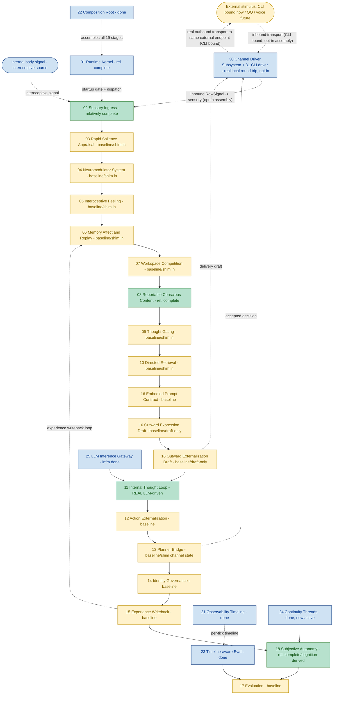

# Helios v2 Module Progress Flow (English)

> Status: living progress map. MUST be updated in the same change set as any requirement that
> materially alters owner maturity, the runtime stage chain, or owner boundaries.
> Last synced: R31 (CLI channel driver + channel-bound assembly). Test baseline: 393 passed. HEAD-era: R31.
> Companion: `PROGRESS_FLOW.zh-CN.md` (Chinese) must be updated together with this file.

## 1. Purpose

This document is the module-level progress map for Helios v2. It shows the canonical runtime
stage chain (the `CANONICAL_STAGE_ORDER` executed each tick) plus the supporting
infrastructure owners, color-coded by real implementation maturity, and marks the one
remaining structural gap (real external network transport: the local CLI round trip works
end to end through an opt-in assembly, but network drivers and a default channel-bound
runtime are still future).

It is intentionally implementation-facing: the colors reflect shipped code and validation
evidence, not planned architecture quality, and must match the `Maturity` column in
`requirements/index.md`.

## 2. Legend

- Deep & real (green): LLM-driven cognition or `relatively_complete` owner behavior.
- Baseline (yellow): owner is real with fail-fast contracts and tests, but its inputs are
  still composition-injected deterministic shim.
- Infrastructure done (blue): supporting owner shipped (kernel, gateway, observability,
  composition, evaluation substrate, continuity threads).
- Gap, no owner yet (red, dashed): a first-class concept that is consistently referenced but
  has never been assigned an owner.

## 3. Flow

## 4. Status Summary

- Cognition main chain (02 to 17) runs end to end; 393 tests pass, network-free, plus real
  LLM smoke.
- Deep & real owners: 02 sensory, 08 conscious content, 11 internal thought (real LLM-driven
  cognition core), 18 autonomy (cognition-derived), plus infrastructure (01, 21, 22, 23, 24,
  25).
- Baseline owners (the majority): 03-07, 09-10, 12-17 (excluding 13's planner judgment which
  is real) - owners are real with contracts and tests, but their inputs are still
  composition-injected deterministic shim. In the default assembly 13's channel
  descriptor/status snapshots are still shim-injected; in the opt-in channel-bound assembly
  they come from the real `30` channel-state snapshot.
- Transport owner now real for CLI (30 + 31): the channel driver subsystem framework plus the
  first concrete `CliChannelDriver` are shipped and wired through an opt-in 21-stage
  channel-bound assembly. A real local round trip works end to end: an operator line drains
  into a QoS-tagged RawSignal, sensory normalizes it, the cognition chain runs, and an
  externalizing decision is dispatched to the CLI sink. The default 19-stage assembly is
  unchanged.
- Single remaining structural gap: real external network transport (dashed EXT <-> CH). The
  local CLI round trip is proven, but network drivers (QQ/voice/vision) and making a
  channel-bound assembly the default runtime are still future requirements.
- The experience-writeback loop (15 -> 06) is implemented, so each tick is subjectively
  connected to the previous one.

## 5. Update Rule

This file and its Chinese companion `PROGRESS_FLOW.zh-CN.md` MUST be updated in the same
change set whenever a requirement materially changes:

1. an owner's maturity color,
2. the runtime stage chain order or membership,
3. owner boundaries (a new owner, a merged owner, or a closed gap).

The "Last synced" line at the top must name the requirement that last touched this file. A
change set that alters owner maturity without updating this map is incomplete, mirroring the
`requirements/index.md` maturity rule.
