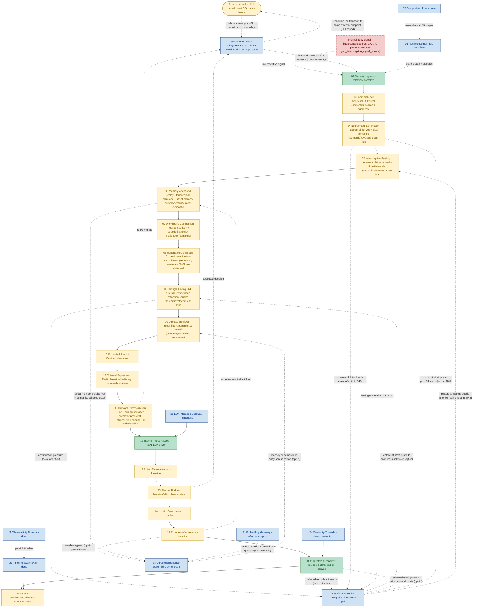

# Helios v2 Module Progress Flow (English)

> Status: living progress map. MUST be updated in the same change set as any requirement that
> materially alters owner maturity, the runtime stage chain, or owner boundaries.
> Last synced: R49 (`10` directed-retrieval recall-intent sourced from the real prior-tick `11` handoff; memory-guided-maintenance loop closed). Test baseline: 635 passed. HEAD-era: R49. Doc clarification (post-R41): BODY reclassified as a gap (no producer); 16 externalization labelled as non-authoritative premotor-prep draft.
> Companion: `PROGRESS_FLOW.zh-CN.md` (Chinese) must be updated together with this file.

## 1. Purpose

This document is the module-level progress map for Helios v2. It shows the canonical runtime
stage chain (the `CANONICAL_STAGE_ORDER` executed each tick) plus the supporting
infrastructure owners, color-coded by real implementation maturity, and marks the one
remaining structural gap (real external network transport: the local CLI round trip works
end to end through an opt-in assembly, but network drivers and a default channel-bound
runtime are still future).

It is intentionally implementation-facing: the colors reflect shipped code and validation
evidence, not planned architecture quality, and must match the `Maturity` column in
`requirements/index.md`.

For the detailed by-owner reference (each owner's responsibility, role in the loop,
completeness, and next development/optimization step), see the companion `OWNER_GUIDE.md`.

## 2. Legend

- Deep & real (green): LLM-driven cognition or `relatively_complete` owner behavior.
- Baseline (yellow): owner is real with fail-fast contracts and tests, but its inputs are
  still composition-injected deterministic shim.
- Infrastructure done (blue): supporting owner shipped (kernel, gateway, observability,
  composition, evaluation substrate, continuity threads).
- Gap, no owner yet (red, dashed): a first-class concept that is consistently referenced but
  has never been assigned an owner.

> Perspective note: this map's colors reflect "is it driven by real signals", which is a different
> lens from `index.md`'s "owner-boundary maturity". `08` is exactly where the two differ — by the
> owner-boundary lens it is `relatively_complete` in `index.md` (its owner semantics are rel.
> complete, and an upstream gap does not downgrade its own maturity), but by this map's
> real-signal lens its upstream 06/07 and commitment path are still first-version shim, so it is
> colored baseline. Both documents are correct; this is not a conflict.

## 3. Flow

## 4. Status Summary

- Cognition main chain (02 to 17) runs end to end; 560 tests pass, network-free, plus real
  LLM smoke.
- Deep & real owners: 02 sensory, 11 internal thought (real LLM-driven
  cognition core), 18 autonomy (cognition-derived), plus infrastructure (01, 21, 22, 23, 24,
  25, 33, 34, 42).
  (Note: 08 reportable conscious content is owner-semantically rel. complete, but its upstream
  06/07 and commitment path are still first-version shim, so it is colored baseline under the same
  rule as 03-07 and no longer counted deep & real.)
- P3 began (R35): the `03` appraisal owner's novelty dimension is now a real signal under the
  semantic-memory assembly (novelty = 1 - max cosine similarity of the stimulus to stored
  experience, via the 34 embedding substrate + 33 store), the first cognitive consumer of the
  embedding base. `03` owns the novelty salience mapping; composition injects an owner-neutral
  similarity-fact source, so `03` imports neither the embedding nor persistence owner. The
  other four `03` dimensions stay shim (later P3 slices); default and recency-only assemblies
  keep constant novelty 0.6. First-version comparison is cross-register (stimulus vs 15 result
  summaries), noted and not over-claimed.
- P3 second de-shim (R36): the `04` neuromodulator owner is now the first real downstream
  consumer of `03` salience. Under the semantic-memory assembly the constant update path is
  replaced by an appraisal-derived one (composition-provided, conforming to the owner's
  `NeuromodulatorUpdatePath` protocol; the engine and contracts are unchanged): the batch is
  aggregated by per-dimension max, then each channel is `clamp(tonic_baseline + sum(sensitivity
  * salience), legal_min, legal_max)` - dopamine from reward (and weak novelty), norepinephrine
  from novelty and uncertainty, cortisol from threat, others regressing to tonic baseline. The
  derivation is deterministic, bounded (no NN, no divergence), and stateless (no prior-tick
  carry). Default, recency-only, and offline assemblies keep the constant path. Deferred:
  dual-timescale decay (prior-tick carry), P5 coefficient learning, cross-channel coupling, and
  downstream coupling into a de-shimmed 05/09.
- P3 third de-shim (R37): the `09` thought-gating decision is now the first real consumer of an
  `04` neuromodulator level. Under the semantic-memory assembly composition forwards the real
  `04` norepinephrine level into the gate-signal snapshot as a raw `neuromodulatory_arousal`
  fact, and the `09` owner's new arousal-aware gate path adds a bounded non-negative term
  (`arousal_gain = 0.15`) so elevated arousal measurably raises fire propensity. The mapping is
  owned by `09` (composition forwards the raw fact only), monotonic, deterministic, stateless,
  and structurally never a hard gate (0.15 < the 0.55 fire threshold; additive non-negative so
  it cannot suppress an otherwise-justified fire). The other gate-signal inputs stay
  first-version constants; with `neuromodulatory_arousal=None` the path is byte-for-byte the
  first-version path, so default/recency/offline assemblies are unchanged. Deferred:
  cortisol/inhibition hard gate, 04->05 feeling coupling, and de-shimming the other gate inputs
  (e.g. global_activation_level from 07).
- P3 fourth de-shim (R38): the `05` interoceptive feeling vector is now a real bounded function
  of the `04` neuromodulator state, bringing `04`'s second downstream consumer to real (with R37,
  both `09` gating and `05` feeling now consume the real `04` state). The constant feeling shim is
  replaced under the semantic-memory assembly by an owner-private
  `NeuromodulatorDerivedFeelingConstructionPath` in `helios_v2.feeling` (the channel->dimension
  mapping lives in `05` itself, since subjectivizing neuromodulator state into feeling is this
  owner's whole reason to exist; engine/contracts unchanged, no new bridge, no stage reorder). Each
  dimension = clamp(baseline + sum(coupling * level)): valence +DA/opioid/5-HT -cortisol, arousal
  +NE/excitation, tension +cortisol/NE, comfort +opioid/oxytocin/5-HT -cortisol, pain_like
  +cortisol -opioid, social_safety +oxytocin/5-HT -cortisol, fatigue +inhibition -excitation
  (weak). Deterministic, bounded (clamped to legal range), stateless (no prior-tick feeling).
  Default/recency/offline keep the constant feeling. Deferred: dual-timescale feeling persistence,
  real interoceptive-signal integration, and feeding the real feeling into 06/behavior (FG-2).
- P3 fifth de-shim (R39): two more `03` dimensions are real, so three of five (novelty, uncertainty,
  social) now ground in real facts. `uncertainty` reads retrieval ambiguity over the 34/33 substrate
  (top-two cosine margin: one dominant match -> low; several near-equal matches -> high; a distinct
  read from novelty, so familiar-but-ambiguous gives low novelty + high uncertainty). `social` reads
  transport provenance (external interactive-agent channel like the CLI operator -> high; internal
  body/background -> 0). Both mappings live in the owner-owned `GroundedDimensionEstimator`;
  composition supplies only raw facts (03 imports neither embedding, persistence, nor channel).
  Honest grounding: uncertainty is B_functional_inspiration (a proxy, not calibrated confidence);
  social is a pure transport fact bundled under the semantic opt-in only for one switch. The fast
  path stays deterministic, network-free, LLM-free. threat/reward stay constant pending R40
  (network-free prototype-embedding, weaker C_engineering_hypothesis grounding). Default/recency/
  offline keep constant uncertainty 0.3 / social 0.0; novelty unchanged.
- P3 sixth de-shim (R40): the last two `03` dimensions are real, so all five (novelty, uncertainty,
  social, threat, reward) now ground in real facts and the `04` reward->dopamine and
  threat->cortisol channels are driven by real signals on every channel (03 -> 04 -> 05/09 is now
  real end to end). threat/reward are scored by the stimulus's max cosine to owner-owned prototype
  phrase sets (THREAT_PROTOTYPES/REWARD_PROTOTYPES), embedded through the 34 substrate; 03 maps
  dimension = clamp(gain * max(0, max_cosine)) (positive correlation, proximity to a semantic
  anchor; None/empty -> 0). The prototype sets + mapping live in 03; composition's
  EmbeddingPrototypeSimilaritySource embeds the owner-provided phrases once and returns raw cosine
  (03 imports neither embedding nor persistence). No cold-start (prototypes embedded at assembly).
  HONEST GROUNDING C_engineering_hypothesis: the prototype set is a hand-authored, English-centric
  PLACEHOLDER anchor, not a calibrated affective model; it must not be over-claimed and is the
  surface a later P5 / 06 memory-affect / slow-LLM-re-appraisal slice replaces. Default/recency/
  offline keep constant threat 0.2 / reward 0.1; novelty/uncertainty/social unchanged. With all five
  dimensions real, the constant aggregate-salience estimator is the next sensible de-shim.
- P3 03-owner closeout (R41): the `03` aggregate judgment (RapidSalienceVector.aggregate) is now a
  real dimension-grounded convex combination of the five real dimensions (owner-owned
  WeightedAggregateEstimator: aggregate = clamp(sum(weight_k * dim_k)), first-version weights
  threat 0.25 / reward 0.25 / novelty 0.20 / uncertainty 0.15 / social 0.15, summing to 1.0), so
  EVERY 03 output (five dimensions + aggregate) is real under the semantic assembly, none constant.
  Monotonic, deterministic, bounded, stateless; needs no injected fact source (pure function of the
  dimensions). Honest caveats: the weights are a first-version PLACEHOLDER allocation (P5-learnable),
  and the aggregate inherits its inputs' grounding (threat/reward still the R40 C_engineering_hypothesis
  anchor). Default/recency/offline keep constant aggregate 0.4; the five dimensions unchanged. Next
  for 03: P5 weight/coefficient learning and model-assisted overall appraisal.
- Baseline owners (the majority): 03-07, 09-10, 12-17 (excluding 13's planner judgment which
  is real) - owners are real with contracts and tests, but their inputs are still
  composition-injected deterministic shim. In the default assembly 13's channel
  descriptor/status snapshots are still shim-injected; in the opt-in channel-bound assembly
  they come from the real `30` channel-state snapshot.
- wave_A behavioral truth closed at baseline (R32): the 17 evaluation owner now corroborates
  the prior tick's self-reported consequence outcome against that same tick's 21 execution
  timeline and publishes a `corroborated`/`discrepant`/`unverifiable_no_timeline` verdict,
  escalating contradictions to a `consequence_discrepancy` warning. The causal chain is now
  falsifiable against execution truth, not self-report alone. 17 stays baseline because its
  inputs remain shim; the corroboration is strictly additive (no scoring redesign).
- P2 opened (R33) and deepened (R34): a durable experience-store owner (33) persists the 15
  continuity stream to a SQLite file and, on an opt-in persistent assembly, surfaces it back
  through the 10 directed-retrieval candidate path so a prior session's experience re-enters
  the thought window after a process restart. With R34 an embedding capability owner (34,
  mirroring the 25 LLM gateway) embeds each record at write and recall is now semantic
  (bounded cosine similarity, `source="experience_store_semantic"`) rather than recency-only,
  so the system recalls experience relevant to the current query across restarts. Both are
  opt-in and default-off: the default assembly is byte-for-byte unchanged. Persistence owner
  never imports the embedding owner (query embedding is injected). `experience_store_ready` /
  `embedding_profile_ready` fail fast when their backends/profiles are not ready; semantic
  memory requires a durable store (else CompositionError); an embedding failure is a hard stop
  with no recency fallback.
- Transport owner now real for CLI (30 + 31): the channel driver subsystem framework plus the
  first concrete `CliChannelDriver` are shipped and wired through an opt-in 21-stage
  channel-bound assembly. A real local round trip works end to end: an operator line drains
  into a QoS-tagged RawSignal, sensory normalizes it, the cognition chain runs, and an
  externalizing decision is dispatched to the CLI sink. The default 19-stage assembly is
  unchanged.
- Remaining structural gaps: real external network transport (dashed EXT <-> CH; network
  drivers QQ/voice/vision and a default channel-bound runtime are future), and the rest of P2
  (R42 now checkpoints/restores the genuinely cross-tick `09`/`18`/`24` continuity; `06`/`04`/
  `05`/`14` are not yet durable — `04`/`05`/`14` only become checkpointable once their
  dual-timescale/persisted carry lands, and `06` memory items still need the durable base). The
  P2->P3 hinge is in place: real `03` novelty-from-memory builds on the R34 embedding substrate.
- The experience-writeback loop (15 -> 06) is implemented in-process, and with R33 the 15
  stream is now also durably persisted and re-entrant across restarts.
- P2 third slice (R42): a durable runtime-continuity checkpoint owner (42,
  `helios_v2.continuity_checkpoint`) keeps ONE latest-state snapshot of the genuinely cross-tick
  continuity state — the `09` continuation-pressure state and the `18`/`24` long-horizon
  continuity (deferred records + threads), reusing those owners' own contracts verbatim — in a
  single-row SQLite file (or an in-memory double). On an opt-in
  `assemble_runtime(continuity_checkpoint=...)` the runtime saves the latest snapshot after each
  tick (owner-neutral carry, mirroring `_persist_experience`, reading only published stage-result
  values) and restores it at startup (after the fail-fast gate), seeding the `09` and `18` stages'
  prior cross-tick state through explicit owner-neutral stage seed seams, so after a process
  restart against the same file the system resumes its prior continuation pressure and continuity
  threads instead of starting inert (advancing FG-5.1). Independent of 33/34 (a different state).
  Reconstruction runs the owners' own validation; a cold store keeps the inert defaults; a
  corrupt snapshot fails fast on load; `continuity_checkpoint_ready` fails fast on an
  un-initializable backend; no degraded path once enabled. `04`/`05`/`14`/`06` state stays out of
  scope (not cross-tick in-process today; the snapshot is versioned for additive extension).
  Default/33/34/channel-bound assemblies byte-for-byte unchanged when off.
- P2/P3 hinge (R43): `04` neuromodulator state now evolves across ticks. Under the semantic
  assembly the `04` update path is replaced (from stateless) by an owner-owned dual-timescale
  leaky-integrator (`DualTimescaleNeuromodulatorUpdatePath` wrapping the R36 instantaneous drive
  path): per channel `next = clamp(prior + alpha_phasic*(drive-prior) + alpha_tonic*(baseline-prior))`,
  phasic fast and tonic slow (`0 < alpha_tonic < alpha_phasic <= 1`, under the
  `decay_speed_persistence` category, P5-learnable). The instantaneous drive stays owned by the
  injected path; the cross-tick carry/decay is the new `04`-owned semantic. `NeuromodulatorUpdatePath`
  /`update_state` gain an additive optional `prior_levels`/`prior_state` (default `None` reproduces
  the stateless behavior byte-for-byte); `NeuromodulatorRuntimeStage` holds the prior-tick state
  (like 09/18) and exposes `seed_prior_state`. Cold start (no prior / cold checkpoint) defaults
  prior to the tonic baseline (one step from baseline; no fabricated history); the integrator is
  bounded (clamped, alpha in (0,1]); an unstable alpha ordering is rejected at construction. The
  R42 snapshot is bumped to version 2 with a `neuromodulator_levels` field, so `04` survives a
  restart (save reads the published levels, restore seeds the stage); a version mismatch or corrupt
  levels hard-stop on load (no v1 migration). Default/recency/offline keep the stateless constant
  `04`. Deferred: cross-channel coupling, P5 coefficient learning, cortisol/inhibition hard gate.
- P2/P3 hinge (R44): `05` interoceptive feeling now evolves across ticks (the `05` mirror of R43,
  completing the affect pair). Under the semantic assembly the `05` construction path is replaced
  (from stateless) by an owner-owned `PersistentFeelingConstructionPath` (wrapping the R38
  instantaneous neuromodulator-derived target path), per dimension the same form as R43:
  `next = clamp(prior + alpha_phasic*(target-prior) + alpha_tonic*(baseline-prior))` (under the
  `feeling_persistence` category, P5-learnable; same constants as R43 so the two affect owners
  share one decay timescale). The instantaneous target stays owned by the injected R38 path; the
  cross-tick carry is the new `05`-owned semantic. `FeelingConstructionPath`/`update_state` gain an
  additive optional `prior_feeling`/`prior_state` (default `None` reproduces stateless behavior
  byte-for-byte); `InteroceptiveFeelingRuntimeStage` holds the prior-tick state (like `04`/`09`/`18`)
  and exposes `seed_prior_state`. Cold start defaults prior to the baseline feeling. The snapshot is
  bumped to version 3 with a `feeling` field, so `05` survives a restart; a version mismatch (v1/v2)
  or corrupt feeling hard-stops on load. Default/recency/offline keep the stateless constant `05`.
  Also removed a pre-existing dead duplicate `NeuromodulatorDerivedFeelingConstructionPath`. Deferred:
  real interoceptive-signal integration, P5 coefficient learning, feeding the evolving `05` feeling
  into `06`/behavior (FG-2).
- P2 closeout / P3 mid-chain (R45): the `06` memory owner closes both its shims at once. Formation
  de-shim: an owner-owned `AffectGroundedMemoryFormationPath` replaces the constant shim under the
  semantic assembly, forming affect-tagged memory from the real `05` feeling state (the item's
  `affect_tag` is the genuine felt body-state, not a constant; owner-owned episodic/autobiographical
  family mapping, mismatch → autobiographical). Salience gate: an owner-owned
  `SalienceGatedReplayCandidateSelector` computes a bounded affect-intensity from the real feeling
  (arousal/tension/pain) + mismatch and sets each candidate's `forced_consolidation` + `priority_hint`
  from it (threshold/weights under `consolidation_policy`/`replay_priority_policy`, P5-learnable), so a
  flat low-affect tick consolidates nothing and a high-affect or high-mismatch tick consolidates.
  Durability: `PersistedExperienceRecord` gains an additive `record_kind` (default
  `experience_writeback`, so the 15 stream is byte-for-byte unchanged) + an opaque `metadata`; the
  SQLite backend upgrades an old file in place via a PRAGMA-guarded `ALTER TABLE`; an owner-neutral
  `MemoryRecordBridge` + `RuntimeHandle._persist_memory` carry persists exactly the
  `forced_consolidation` items as `record_kind="affect_memory"`, embedded at write, co-residing with
  the 15 stream. Recall: reuses the 34 semantic recall surface, so affect-memory is recallable through
  10 and resumes across restart; `_record_tier` maps by family. `06` imports neither persistence nor
  embedding; the carry seam re-derives no decision. Opt-in on the existing semantic-memory switch;
  default/recency assemblies keep the constant `06` shim. A request without store+embedding is a
  CompositionError; an embedding/store failure is a hard stop; no dedup/merge this slice. 607 tests
  green and network-free. Deferred: dedup/merge, deeper feeling-driven formation, real 06→07 candidates.
- P3 mid-chain (R46): the `07` workspace owner is de-shimmed into a real attention bottleneck.
  Competition: an owner-owned `SalienceWeightedWorkspaceCompetitionPath` scores each candidate as a
  bounded function of the real `06` `priority_hint` + the real `05` feeling salience
  (`clamp(0.6*priority + 0.4*feeling_salience)`), replacing the constant 0.95; every replay candidate
  stays in the candidate set (forced flag + provenance preserved, owner invariants hold). Bottleneck:
  an owner-owned `BoundedAttentionRetentionPath` retains only the top-K (`max_retained=3`, under
  `working_state_update_policy`) into the working state with a deterministic tie-break and a never-empty
  guarantee, replacing retain-everything. Brain-aligned semantic (owner-confirmed): "consolidated" (a
  `06`-forced candidate, persisted long-term) ≠ "held in attention" (the bounded working state) — a
  forced candidate may lose the competition and not be held this tick, while remaining in the candidate
  set (still reaching `08`) and still persisted. Opt-in on the same semantic-memory switch as R45;
  default/non-semantic assemblies keep the constant-score / retain-everything shim. No contract change;
  `07` imports no other owner. 618 tests green and network-free. Deferred: P5 weight/K learning, a
  sharper `08` commitment, multi-source competition.
- P3 mid-chain (R47): the `08` reportable conscious-content commitment is de-shimmed into
  global-workspace ignition. Problem: the count-based first-version policy declared
  `no_commit/semantic_conflict_unresolved` whenever the working state retained >1 candidate, and
  R46's bounded top-K working state retains >1 by design, so `08` would rarely become aware of
  anything. Fix: an owner-owned `IgnitionFocalSelectionPolicy` (injected through the existing
  `focal_selection_policy` seam, in `helios_v2.consciousness`) ignites the single
  highest-`workspace_score_hint` retained candidate as focal (winner-take-all, deterministic
  tie-break) and demotes the rest to supporting context (descending score, bounded by
  `max_supporting_context_items`). Preserved: `insufficient_commitment_signal` (zero retained) and
  `context_not_reportable` (empty focal summary); `semantic_conflict_unresolved` stays in the
  taxonomy for a future genuine-conflict slice but is no longer emitted for mere multiplicity. No
  contract/engine/renderer change. Opt-in on the same semantic-memory switch as R45/R46;
  default/non-semantic assemblies keep the count-based policy. End-to-end the chain forms one
  candidate per tick today, so the headline win (multiplicity → ignite winner) is owner-level tested
  now and becomes end-to-end visible once a multi-candidate source lands. 626 tests green and
  network-free. Deferred: genuine semantic-conflict detection, an LLM semantic renderer, P5
  ignition-threshold learning.
- P3 mid-chain (R48): the `09` gate's `global_activation_level` (its second-largest non-stimulus
  term, weight `* 0.20`) is de-shimmed from the constant `0.9` to the real `07` workspace
  activation. Under the semantic assembly the gate-signal bridge sources it from the same tick's
  `07` `WorkspaceCompetitionStageResult` — the maximum `workspace_score_hint` among the retained
  working-state candidates (the dominant ignition strength held in attention), or `0.0` when
  nothing is retained. Owner-neutral glue (the bridge forwards a raw bounded fact clamped to
  `[0,1]`); `09` keeps sole ownership of the gate decision and the term weight. The R37 arousal
  coupling is preserved (both real facts ride one snapshot). `07` runs before `09`, so a
  missing/wrong-typed `07` result is a hard fail. No contract change; the real value surfaces in
  `contributing_signals["global_activation_level"]`. Opt-in on the same switch; default/non-semantic
  keep `0.9`. The other four constant gate inputs (`workload_pressure`, `temporal_signal`,
  `drive_urgency_signal`, `dmn_available`) and the `selected_stimuli` projection remain first-version
  constants (no real producer running before `09` yet — `drive_urgency_signal` is owned by `18`,
  which runs after `09`; the rest need unowned compute/clock/DMN producers). 631 tests green and
  network-free.
- P3 mid-chain (R49): the `10` directed-retrieval request's `recall_intent`/`selected_memory_refs`
  are de-shimmed (the query-planning path itself was already real; only its inputs were shim). The
  constant `recall_intent="remember runtime chain context"` and fabricated refs are replaced, under
  the semantic assembly, by the prior tick's `11` `MemoryHandoffDirective` (when `11` saved one for
  the next tick), so a line of thought the system chose to continue steers what memory it retrieves
  next tick (memory-guided maintenance, `ARCHITECTURE_PHILOSOPHY` §5.3). The carry mirrors the
  R32/R42 pattern: an owner-neutral `PriorThoughtRecallHolder`, a post-tick
  `_carry_recall_directive` capture, and a `ThoughtDirectedRetrievalRequestBridge`. With no saved
  handoff (first tick / non-fired / `11` did not continue) the request falls back to the real `09`
  `compact_stimuli` with no recall intent (a defined behavior, always valid). Owner-neutral:
  composition transports the `11`-owned directive verbatim; `10`/`11` are unchanged. Opt-in on the
  same switch; default/non-semantic keep the constant. 635 tests green and network-free.
- Interoceptive-source gap (BODY node, red): `05` is built to consume real body/interoceptive
  signals (the feeling stage filters the `02` batch for body/interoceptive modality), but nothing
  produces them today — the sensory sources emit only text, so `internal_signals` is always empty
  and feeling is derived from the `04` neuromodulator state alone. The BODY node is an
  interface-only placeholder with no owner. A real producer is a future owner: a simulated
  body-state model, or a first-version proxy mapping compute/runtime pressure (CPU/memory/latency)
  into bounded interoceptive signals (see `gap_interoceptive_signal_source`).
- Premotor-preparation vs execution (16 labels): the `16` outward-expression and externalization
  nodes produce NON-AUTHORITATIVE drafts, the functional analog of premotor/SMA motor preparation
  and internal rehearsal, NOT execution. The real go/no-go authority is `13` planner and the real
  transport is `30`/`31` channel. The draft carries explicit `forbidden_capabilities` /
  `final_authorities` / `execution_boundary_summary`; "draft" must never be read as "execution"
  (see `gap_premotor_preparation_vs_execution`).

## 5. Update Rule

This file and its Chinese companion `PROGRESS_FLOW.zh-CN.md` MUST be updated in the same
change set whenever a requirement materially changes:

1. an owner's maturity color,
2. the runtime stage chain order or membership,
3. owner boundaries (a new owner, a merged owner, or a closed gap).

The "Last synced" line at the top must name the requirement that last touched this file. A
change set that alters owner maturity without updating this map is incomplete, mirroring the
`requirements/index.md` maturity rule.
