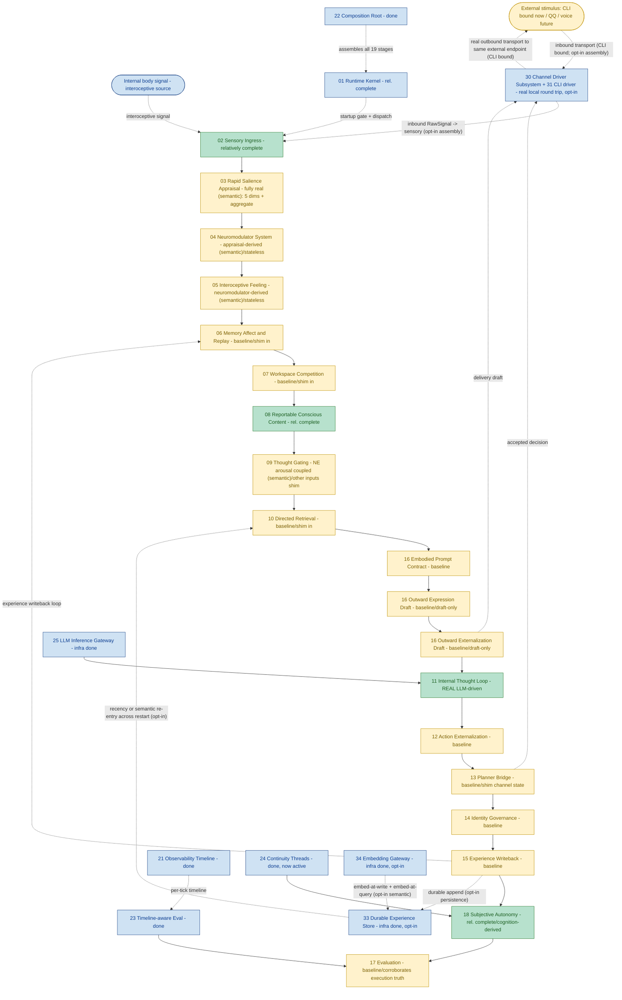

# Helios v2 Module Progress Flow (English)

> Status: living progress map. MUST be updated in the same change set as any requirement that
> materially alters owner maturity, the runtime stage chain, or owner boundaries.
> Last synced: R41 (dimension-grounded aggregate salience; P3 03-owner closeout, all 03 outputs real). Test baseline: 536 passed. HEAD-era: R41.
> Companion: `PROGRESS_FLOW.zh-CN.md` (Chinese) must be updated together with this file.

## 1. Purpose

This document is the module-level progress map for Helios v2. It shows the canonical runtime
stage chain (the `CANONICAL_STAGE_ORDER` executed each tick) plus the supporting
infrastructure owners, color-coded by real implementation maturity, and marks the one
remaining structural gap (real external network transport: the local CLI round trip works
end to end through an opt-in assembly, but network drivers and a default channel-bound
runtime are still future).

It is intentionally implementation-facing: the colors reflect shipped code and validation
evidence, not planned architecture quality, and must match the `Maturity` column in
`requirements/index.md`.

For the detailed by-owner reference (each owner's responsibility, role in the loop,
completeness, and next development/optimization step), see the companion `OWNER_GUIDE.md`.

## 2. Legend

- Deep & real (green): LLM-driven cognition or `relatively_complete` owner behavior.
- Baseline (yellow): owner is real with fail-fast contracts and tests, but its inputs are
  still composition-injected deterministic shim.
- Infrastructure done (blue): supporting owner shipped (kernel, gateway, observability,
  composition, evaluation substrate, continuity threads).
- Gap, no owner yet (red, dashed): a first-class concept that is consistently referenced but
  has never been assigned an owner.

## 3. Flow

## 4. Status Summary

- Cognition main chain (02 to 17) runs end to end; 536 tests pass, network-free, plus real
  LLM smoke.
- Deep & real owners: 02 sensory, 08 conscious content, 11 internal thought (real LLM-driven
  cognition core), 18 autonomy (cognition-derived), plus infrastructure (01, 21, 22, 23, 24,
  25, 33, 34).
- P3 began (R35): the `03` appraisal owner's novelty dimension is now a real signal under the
  semantic-memory assembly (novelty = 1 - max cosine similarity of the stimulus to stored
  experience, via the 34 embedding substrate + 33 store), the first cognitive consumer of the
  embedding base. `03` owns the novelty salience mapping; composition injects an owner-neutral
  similarity-fact source, so `03` imports neither the embedding nor persistence owner. The
  other four `03` dimensions stay shim (later P3 slices); default and recency-only assemblies
  keep constant novelty 0.6. First-version comparison is cross-register (stimulus vs 15 result
  summaries), noted and not over-claimed.
- P3 second de-shim (R36): the `04` neuromodulator owner is now the first real downstream
  consumer of `03` salience. Under the semantic-memory assembly the constant update path is
  replaced by an appraisal-derived one (composition-provided, conforming to the owner's
  `NeuromodulatorUpdatePath` protocol; the engine and contracts are unchanged): the batch is
  aggregated by per-dimension max, then each channel is `clamp(tonic_baseline + sum(sensitivity
  * salience), legal_min, legal_max)` - dopamine from reward (and weak novelty), norepinephrine
  from novelty and uncertainty, cortisol from threat, others regressing to tonic baseline. The
  derivation is deterministic, bounded (no NN, no divergence), and stateless (no prior-tick
  carry). Default, recency-only, and offline assemblies keep the constant path. Deferred:
  dual-timescale decay (prior-tick carry), P5 coefficient learning, cross-channel coupling, and
  downstream coupling into a de-shimmed 05/09.
- P3 third de-shim (R37): the `09` thought-gating decision is now the first real consumer of an
  `04` neuromodulator level. Under the semantic-memory assembly composition forwards the real
  `04` norepinephrine level into the gate-signal snapshot as a raw `neuromodulatory_arousal`
  fact, and the `09` owner's new arousal-aware gate path adds a bounded non-negative term
  (`arousal_gain = 0.15`) so elevated arousal measurably raises fire propensity. The mapping is
  owned by `09` (composition forwards the raw fact only), monotonic, deterministic, stateless,
  and structurally never a hard gate (0.15 < the 0.55 fire threshold; additive non-negative so
  it cannot suppress an otherwise-justified fire). The other gate-signal inputs stay
  first-version constants; with `neuromodulatory_arousal=None` the path is byte-for-byte the
  first-version path, so default/recency/offline assemblies are unchanged. Deferred:
  cortisol/inhibition hard gate, 04->05 feeling coupling, and de-shimming the other gate inputs
  (e.g. global_activation_level from 07).
- P3 fourth de-shim (R38): the `05` interoceptive feeling vector is now a real bounded function
  of the `04` neuromodulator state, bringing `04`'s second downstream consumer to real (with R37,
  both `09` gating and `05` feeling now consume the real `04` state). The constant feeling shim is
  replaced under the semantic-memory assembly by an owner-private
  `NeuromodulatorDerivedFeelingConstructionPath` in `helios_v2.feeling` (the channel->dimension
  mapping lives in `05` itself, since subjectivizing neuromodulator state into feeling is this
  owner's whole reason to exist; engine/contracts unchanged, no new bridge, no stage reorder). Each
  dimension = clamp(baseline + sum(coupling * level)): valence +DA/opioid/5-HT -cortisol, arousal
  +NE/excitation, tension +cortisol/NE, comfort +opioid/oxytocin/5-HT -cortisol, pain_like
  +cortisol -opioid, social_safety +oxytocin/5-HT -cortisol, fatigue +inhibition -excitation
  (weak). Deterministic, bounded (clamped to legal range), stateless (no prior-tick feeling).
  Default/recency/offline keep the constant feeling. Deferred: dual-timescale feeling persistence,
  real interoceptive-signal integration, and feeding the real feeling into 06/behavior (FG-2).
- P3 fifth de-shim (R39): two more `03` dimensions are real, so three of five (novelty, uncertainty,
  social) now ground in real facts. `uncertainty` reads retrieval ambiguity over the 34/33 substrate
  (top-two cosine margin: one dominant match -> low; several near-equal matches -> high; a distinct
  read from novelty, so familiar-but-ambiguous gives low novelty + high uncertainty). `social` reads
  transport provenance (external interactive-agent channel like the CLI operator -> high; internal
  body/background -> 0). Both mappings live in the owner-owned `GroundedDimensionEstimator`;
  composition supplies only raw facts (03 imports neither embedding, persistence, nor channel).
  Honest grounding: uncertainty is B_functional_inspiration (a proxy, not calibrated confidence);
  social is a pure transport fact bundled under the semantic opt-in only for one switch. The fast
  path stays deterministic, network-free, LLM-free. threat/reward stay constant pending R40
  (network-free prototype-embedding, weaker C_engineering_hypothesis grounding). Default/recency/
  offline keep constant uncertainty 0.3 / social 0.0; novelty unchanged.
- P3 sixth de-shim (R40): the last two `03` dimensions are real, so all five (novelty, uncertainty,
  social, threat, reward) now ground in real facts and the `04` reward->dopamine and
  threat->cortisol channels are driven by real signals on every channel (03 -> 04 -> 05/09 is now
  real end to end). threat/reward are scored by the stimulus's max cosine to owner-owned prototype
  phrase sets (THREAT_PROTOTYPES/REWARD_PROTOTYPES), embedded through the 34 substrate; 03 maps
  dimension = clamp(gain * max(0, max_cosine)) (positive correlation, proximity to a semantic
  anchor; None/empty -> 0). The prototype sets + mapping live in 03; composition's
  EmbeddingPrototypeSimilaritySource embeds the owner-provided phrases once and returns raw cosine
  (03 imports neither embedding nor persistence). No cold-start (prototypes embedded at assembly).
  HONEST GROUNDING C_engineering_hypothesis: the prototype set is a hand-authored, English-centric
  PLACEHOLDER anchor, not a calibrated affective model; it must not be over-claimed and is the
  surface a later P5 / 06 memory-affect / slow-LLM-re-appraisal slice replaces. Default/recency/
  offline keep constant threat 0.2 / reward 0.1; novelty/uncertainty/social unchanged. With all five
  dimensions real, the constant aggregate-salience estimator is the next sensible de-shim.
- P3 03-owner closeout (R41): the `03` aggregate judgment (RapidSalienceVector.aggregate) is now a
  real dimension-grounded convex combination of the five real dimensions (owner-owned
  WeightedAggregateEstimator: aggregate = clamp(sum(weight_k * dim_k)), first-version weights
  threat 0.25 / reward 0.25 / novelty 0.20 / uncertainty 0.15 / social 0.15, summing to 1.0), so
  EVERY 03 output (five dimensions + aggregate) is real under the semantic assembly, none constant.
  Monotonic, deterministic, bounded, stateless; needs no injected fact source (pure function of the
  dimensions). Honest caveats: the weights are a first-version PLACEHOLDER allocation (P5-learnable),
  and the aggregate inherits its inputs' grounding (threat/reward still the R40 C_engineering_hypothesis
  anchor). Default/recency/offline keep constant aggregate 0.4; the five dimensions unchanged. Next
  for 03: P5 weight/coefficient learning and model-assisted overall appraisal.
- Baseline owners (the majority): 03-07, 09-10, 12-17 (excluding 13's planner judgment which
  is real) - owners are real with contracts and tests, but their inputs are still
  composition-injected deterministic shim. In the default assembly 13's channel
  descriptor/status snapshots are still shim-injected; in the opt-in channel-bound assembly
  they come from the real `30` channel-state snapshot.
- wave_A behavioral truth closed at baseline (R32): the 17 evaluation owner now corroborates
  the prior tick's self-reported consequence outcome against that same tick's 21 execution
  timeline and publishes a `corroborated`/`discrepant`/`unverifiable_no_timeline` verdict,
  escalating contradictions to a `consequence_discrepancy` warning. The causal chain is now
  falsifiable against execution truth, not self-report alone. 17 stays baseline because its
  inputs remain shim; the corroboration is strictly additive (no scoring redesign).
- P2 opened (R33) and deepened (R34): a durable experience-store owner (33) persists the 15
  continuity stream to a SQLite file and, on an opt-in persistent assembly, surfaces it back
  through the 10 directed-retrieval candidate path so a prior session's experience re-enters
  the thought window after a process restart. With R34 an embedding capability owner (34,
  mirroring the 25 LLM gateway) embeds each record at write and recall is now semantic
  (bounded cosine similarity, `source="experience_store_semantic"`) rather than recency-only,
  so the system recalls experience relevant to the current query across restarts. Both are
  opt-in and default-off: the default assembly is byte-for-byte unchanged. Persistence owner
  never imports the embedding owner (query embedding is injected). `experience_store_ready` /
  `embedding_profile_ready` fail fast when their backends/profiles are not ready; semantic
  memory requires a durable store (else CompositionError); an embedding failure is a hard stop
  with no recency fallback.
- Transport owner now real for CLI (30 + 31): the channel driver subsystem framework plus the
  first concrete `CliChannelDriver` are shipped and wired through an opt-in 21-stage
  channel-bound assembly. A real local round trip works end to end: an operator line drains
  into a QoS-tagged RawSignal, sensory normalizes it, the cognition chain runs, and an
  externalizing decision is dispatched to the CLI sink. The default 19-stage assembly is
  unchanged.
- Remaining structural gaps: real external network transport (dashed EXT <-> CH; network
  drivers QQ/voice/vision and a default channel-bound runtime are future), and the rest of P2
  (latest-state checkpoint/restore, persisting 06/04/05/14 once de-shimmed). The P2->P3 hinge
  is in place: real `03` novelty-from-memory can now build on the R34 embedding substrate.
- The experience-writeback loop (15 -> 06) is implemented in-process, and with R33 the 15
  stream is now also durably persisted and re-entrant across restarts.

## 5. Update Rule

This file and its Chinese companion `PROGRESS_FLOW.zh-CN.md` MUST be updated in the same
change set whenever a requirement materially changes:

1. an owner's maturity color,
2. the runtime stage chain order or membership,
3. owner boundaries (a new owner, a merged owner, or a closed gap).

The "Last synced" line at the top must name the requirement that last touched this file. A
change set that alters owner maturity without updating this map is incomplete, mirroring the
`requirements/index.md` maturity rule.
