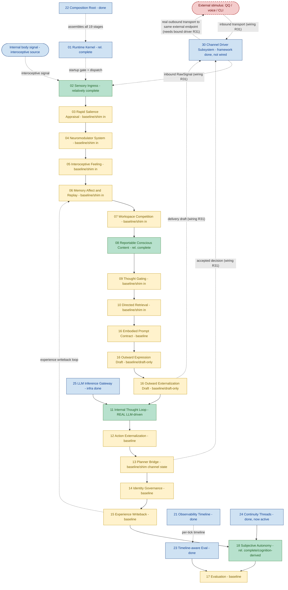

# Helios v2 Module Progress Flow (English)

> Status: living progress map. MUST be updated in the same change set as any requirement that
> materially alters owner maturity, the runtime stage chain, or owner boundaries.
> Last synced: R30 (channel driver subsystem framework). Test baseline: 372 passed. HEAD-era: R30.
> Companion: `PROGRESS_FLOW.zh-CN.md` (Chinese) must be updated together with this file.

## 1. Purpose

This document is the module-level progress map for Helios v2. It shows the canonical runtime
stage chain (the `CANONICAL_STAGE_ORDER` executed each tick) plus the supporting
infrastructure owners, color-coded by real implementation maturity, and marks the one
remaining structural gap (the channel subsystem is not yet wired into the runtime, so the
external endpoint - inbound stimulus and outbound output - is not yet connected through a
concrete bound driver).

It is intentionally implementation-facing: the colors reflect shipped code and validation
evidence, not planned architecture quality, and must match the `Maturity` column in
`requirements/index.md`.

## 2. Legend

- Deep & real (green): LLM-driven cognition or `relatively_complete` owner behavior.
- Baseline (yellow): owner is real with fail-fast contracts and tests, but its inputs are
  still composition-injected deterministic shim.
- Infrastructure done (blue): supporting owner shipped (kernel, gateway, observability,
  composition, evaluation substrate, continuity threads).
- Gap, no owner yet (red, dashed): a first-class concept that is consistently referenced but
  has never been assigned an owner.

## 3. Flow

## 4. Status Summary

- Cognition main chain (02 to 17) runs end to end; 372 tests pass, network-free, plus real
  LLM smoke.
- Deep & real owners: 02 sensory, 08 conscious content, 11 internal thought (real LLM-driven
  cognition core), 18 autonomy (cognition-derived), plus infrastructure (01, 21, 22, 23, 24,
  25).
- Baseline owners (the majority): 03-07, 09-10, 12-17 (excluding 13's planner judgment which
  is real) - owners are real with contracts and tests, but their inputs are still
  composition-injected deterministic shim. 13's channel descriptor/status snapshots are
  shim-injected (the real `30` channel-state snapshot replaces them when a driver is bound in
  R31).
- Transport owner now exists (30, blue): the channel driver subsystem framework shipped (uniform
  driver protocol, NAPI-style bounded inbound drain emitting QoS-tagged RawSignal, bounded
  priority-respecting outbound dispatch, real per-driver channel state, fail-fast readiness) plus
  a deterministic fake driver. It is additive and not yet wired into the runtime.
- External stimulus is channel inbound: the external endpoint (EXT: QQ / voice / CLI) is the
  bidirectional boundary - inbound transport enters through the channel subsystem, becomes a
  QoS-tagged RawSignal, and is normalized by 02 sensory; outbound transport returns to the same
  endpoint through the channel subsystem. Only the interoceptive internal body signal (BODY)
  feeds 02 directly without an external channel.
- Single remaining structural gap: the channel subsystem is not wired into the runtime, so the
  external boundary (dashed EXT <-> CH) is not yet connected - real external stimulus does not
  enter and a real proactive proposal does not leave until the CLI driver and its opt-in wiring
  land in R31. This is the brain.mmd inbound transduction relay plus `M outward output` stage.
- The experience-writeback loop (15 -> 06) is implemented, so each tick is subjectively
  connected to the previous one.

## 5. Update Rule

This file and its Chinese companion `PROGRESS_FLOW.zh-CN.md` MUST be updated in the same
change set whenever a requirement materially changes:

1. an owner's maturity color,
2. the runtime stage chain order or membership,
3. owner boundaries (a new owner, a merged owner, or a closed gap).

The "Last synced" line at the top must name the requirement that last touched this file. A
change set that alters owner maturity without updating this map is incomplete, mirroring the
`requirements/index.md` maturity rule.
