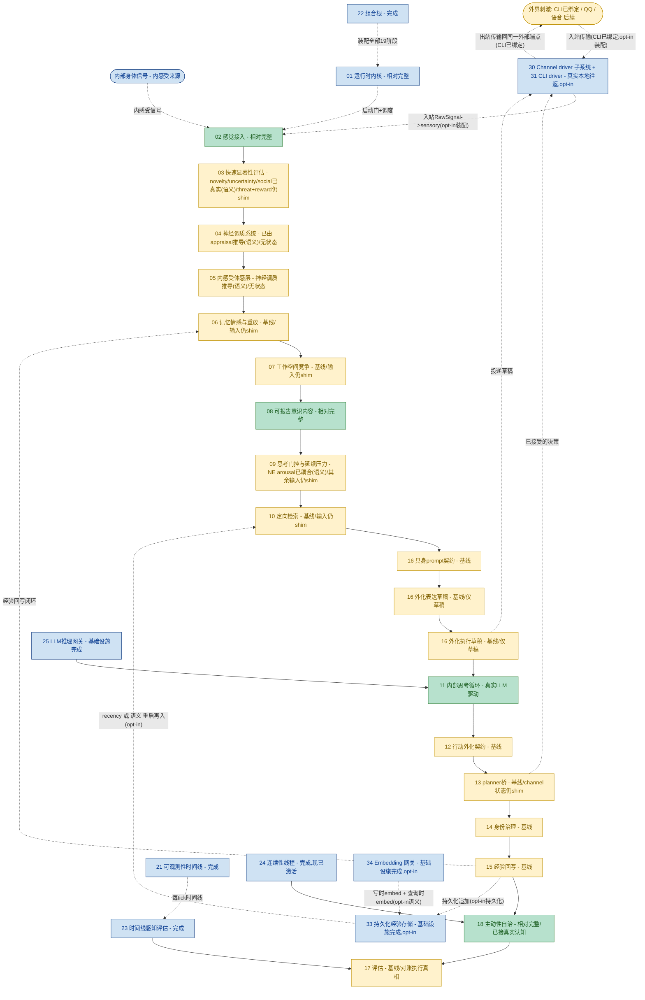

# Helios v2 模块进度流程图（中文）

> 状态：活文档（进度地图）。任何实质改变 owner 成熟度、运行时阶段链或 owner 边界的 requirement，
> 必须在同一次变更里同步更新本文件。
> 最近同步：R39（基于记忆的 uncertainty + 传输 grounded 的 social 评估；P3 第五个认知 owner 去 shim）。测试基线：523 passed。版本：R39。
> 配套：英文版 `PROGRESS_FLOW.en.md` 必须与本文件一起更新。

## 1. 目的

本文件是 Helios v2 的模块级进度地图。它展示规范运行时阶段链（每个 tick 执行的
`CANONICAL_STAGE_ORDER`）加支撑性的基础设施 owner，按真实实现成熟度着色，并标出唯一一个
剩余结构性留白（真实外部网络传输：本地 CLI 往返已端到端打通[opt-in 装配],但网络 driver
与默认 channel-bound 运行时仍是后续工作）。

它是面向实现的：颜色反映已落地代码和验证证据，而非规划意图，且必须与
`requirements/index.md` 的 `Maturity` 列保持一致。

每个 owner 的详细说明（职责、在循环中的作用、完成度、下一步开发/优化方向）见配套文档
`OWNER_GUIDE.md`。

## 2. 图例

- 深度真实（绿）：LLM 驱动认知，或 `relatively_complete` 的 owner 行为。
- 基线（黄）：owner 真实、含 fail-fast 契约与测试，但其**输入仍是 composition 注入的确定性 shim**。
- 基础设施完成（蓝）：支撑性 owner 已交付（内核、网关、可观测、组合根、评估底座、连续性线程）。
- 留白·尚无 owner（红·虚线）：一个被一致引用、但从未分配 owner 的一等概念。

## 3. 流程图

## 4. 状态小结

- 认知主链（02 到 17）端到端贯通；523 测试全绿、离线，外加真实 LLM 冒烟。
- 深度真实 owner：02 感觉接入、08 可报告意识、11 内部思考（真实 LLM 驱动的认知核心）、
  18 主动性（已接真实认知），加基础设施（01、21、22、23、24、25、33、34）。
- P3 已开始（R35）：`03` 评估 owner 的 novelty 维在语义记忆装配下已是真实信号（novelty =
  1 - 刺激对已存经验的最大余弦相似度，经 34 embedding 底座 + 33 store），是 embedding 底座的
  首个认知消费者。`03` 拥有 novelty 显著性映射；composition 注入 owner-neutral 的相似度事实源，
  故 `03` 既不 import embedding 也不 import persistence owner。其余四维仍 shim（后续 P3 切片）；
  默认/recency-only 装配保持常量 novelty 0.6。首版为跨语域比较（刺激 vs 15 结果摘要），已标注、不过度宣称。
- P3 第二刀去 shim（R36）：`04` 神经调质 owner 现在是 `03` 显著性的首个真实下游消费者。语义记忆装配下
  常量更新路径被换成 appraisal 推导的路径（composition 提供，遵循 owner 的 `NeuromodulatorUpdatePath`
  协议；引擎与契约不变）：批次按维度取最大聚合，再对每通道 `clamp(tonic_baseline + sum(sensitivity *
  salience), legal_min, legal_max)`——多巴胺来自 reward（及弱 novelty）、去甲肾上腺素来自 novelty 与
  uncertainty、皮质醇来自 threat，其余通道回归 tonic 基线。推导确定性、有界（无 NN、不发散）、无状态
  （不携带上一 tick）。默认/recency-only/离线装配保持常量路径。延后：双时间尺度衰减（上一 tick 携带）、
  P5 系数学习、跨通道耦合、以及耦合进去 shim 的 05/09。
- P3 第三刀去 shim（R37）：`09` 思考门控决策现在是 `04` 神经调质水平的首个真实消费者。语义记忆装配下
  composition 把真实 `04` 去甲肾上腺素水平作为原始 `neuromodulatory_arousal` 事实转发进门控信号快照,
  `09` owner 新增的 arousal-aware 门控 path 加一个有界非负项（`arousal_gain = 0.15`）,使升高的 arousal
  可度量地提升 fire 倾向。映射归 `09`（composition 只转发原始事实）、单调、确定性、无状态,且结构上绝非
  硬门控（0.15 < fire 阈值 0.55；加项非负故无法压制其他信号已支撑的 fire）。其余门控信号输入仍是首版常量；
  当 `neuromodulatory_arousal=None` 时该 path 字节级等同首版,故默认/recency/离线装配不变。延后:
  cortisol/inhibition 硬门控、`04`→`05` 体感耦合、以及其余门控输入去 shim（例如 `global_activation_level`
  来自 `07`）。
- P3 第四刀去 shim（R38）：`05` 内感受体感向量现在是 `04` 神经调质状态的真实有界函数,使 `04` 的第二个
  下游消费者也接真（连同 R37,`09` 门控与 `05` 体感都消费真实 `04` 状态）。语义记忆装配下常量构造 shim 被
  换成 owner 私有的 `NeuromodulatorDerivedFeelingConstructionPath`（channel→维度映射归 `05` 自己——把神经调质
  状态主观化成体感正是该 owner 的天职；引擎/契约不变,无新 bridge,无需重排阶段）。每维 `clamp(baseline +
  sum(coupling * level))`:valence +DA/opioid/5-HT −cortisol、arousal +NE/excitation、tension +cortisol/NE、
  comfort +opioid/oxytocin/5-HT −cortisol、pain_like +cortisol −opioid、social_safety +oxytocin/5-HT −cortisol、
  fatigue +inhibition −excitation（弱）。确定性、有界（clamp 守 legal range）、无状态（不读上一 tick 体感）。
  默认/recency/离线保持常量体感。延后:双时间尺度体感持久化、真实内感受信号整合、把真实体感喂给 06/行为（FG-2）。
- P3 第五刀去 shim（R39）：`03` 又有两维变真,五维中三维（novelty、uncertainty、social）已 grounded 于真实事实。
  `uncertainty` 读检索歧义度（top-2 余弦差距:单一强匹配→低;多个近似匹配→高;与 novelty 不同读法,故熟悉但
  歧义→低 novelty + 高 uncertainty）。`social` 读传输出处（外部交互主体 channel 如 CLI operator→高;内部
  body/background→0）。两个映射都在 owner 持有的 `GroundedDimensionEstimator` 里;composition 只供原始事实
  （`03` 既不 import embedding/persistence 也不 import channel）。诚实标注:uncertainty 是 B_functional_inspiration
  （代理,非校准置信度）;social 是纯传输事实,挂语义 opt-in 仅为单一开关。快路保持确定性、网络无关、无 LLM。
  threat/reward 仍常量,待 R40（网络无关原型 embedding,较弱 C_engineering_hypothesis grounding）。默认/recency/
  离线保持常量 uncertainty 0.3 / social 0.0;novelty 不变。
- 基线 owner（占大头）：03-07、09-10、12-17（13 的 planner 判断本身是真实的）——owner 真实、
  含契约与测试，但**输入仍是 composition 注入的确定性 shim**；默认装配里 13 的 channel 描述符/状态
  快照仍是 shim 注入,opt-in channel-bound 装配里则来自 `30` 的真实 channel-state 快照。
- wave_A 行为真相已在基线收口（R32）：17 评估 owner 现在把上一 tick 的自报后果结论与该 tick 的
  21 执行时间线对账，发布 `corroborated`/`discrepant`/`unverifiable_no_timeline` 判定，矛盾升级为
  `consequence_discrepancy` 告警。因果链现在可被执行真相证伪，而非仅凭自报。17 仍是基线（其输入仍是
  shim），对账为严格 additive（不重设计打分）。
- P2 已开篇（R33）并深化（R34）：持久化经验存储 owner（33）把 15 连续性流持久化到 SQLite 文件，并在
  opt-in 持久化装配里经 10 定向检索候选路径重新呈现，使进程重启后上一会话的经验重新进入思考窗口。
  R34 起一个 embedding 能力 owner（34，镜像 25 LLM 网关）在写时 embed 每条记录，召回从 recency-only
  升级为**语义召回**（有界余弦相似度，`source="experience_store_semantic"`），使系统跨重启召回与当前
  query 相关的经验。两者均 opt-in 且默认关闭：默认装配字节级不变。persistence owner 不 import embedding
  owner（query embedding 由 composition 注入）。`experience_store_ready` / `embedding_profile_ready` 在
  后端/profile 未就绪时 fail-fast；语义记忆需要持久化（否则 CompositionError）；embedding 失败是
  hard stop,无 recency 回退。
- 传输 owner 对 CLI 已真实（30 + 31）：channel driver 子系统框架加首个具体 `CliChannelDriver` 已交付,
  并经 opt-in 的 21 阶段 channel-bound 装配接入。真实本地往返已端到端打通：一行 operator 输入 drain 成
  带 QoS 标记的 RawSignal、sensory 归一化、认知链运行、外化决策 dispatch 到 CLI sink。默认 19 阶段装配
  保持不变。
- 剩余结构性留白：真实外部网络传输（虚线 EXT ↔ CH；网络 driver QQ/语音/视觉 与默认 channel-bound
  运行时仍是后续），以及 P2 的其余部分（最新态检查点/恢复、de-shim 后持久化 06/04/05/14）。P2→P3
  铰链已就位：真实 `03` novelty-from-memory 现在可基于 R34 的 embedding 底座构建。
- 经验回写闭环（15 → 06）进程内已实现；R33 起 15 流还被持久化并可跨重启再入,R34 起为语义召回。

## 5. 更新约束

本文件与英文配套 `PROGRESS_FLOW.en.md` 必须在以下任一情况发生时、于**同一次变更**内同步更新：

1. 某 owner 的成熟度颜色发生变化；
2. 运行时阶段链的顺序或成员发生变化；
3. owner 边界发生变化（新增 owner、合并 owner、或填补留白）。

顶部"最近同步"行必须写明最后改动本文件的 requirement。若一次变更改变了 owner 成熟度却未更新
本地图，则该变更视为不完整——与 `requirements/index.md` 的成熟度规则一致。
