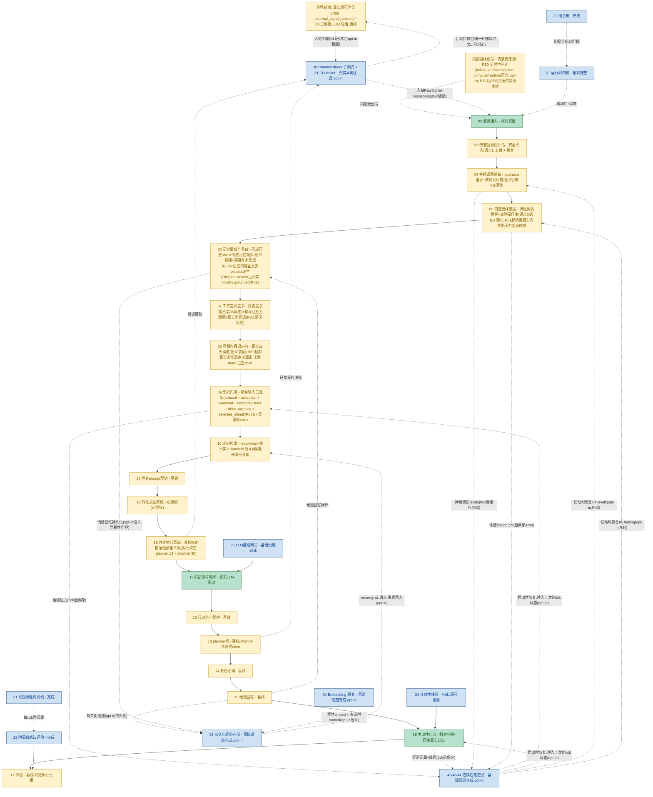

# Helios v2 模块进度流程图（中文）

> 状态：活文档（进度地图）。任何实质改变 owner 成熟度、运行时阶段链或 owner 边界的 requirement，
> 必须在同一次变更里同步更新本文件。
> 最近同步：R64（P3 退出评估：自动化评估测试 `tests/test_p3_exit_evaluation.py` 正式验证 P3 退出信号——FG-1 去 shim 覆盖率（03-10 每阶段消费真实信号）、FG-2.1 情感跨 tick 演化、FG-2.2 外部因果链（变化刺激→03→04→05→09）和内部因果链（机器压力→05→07→09）、结构化 `P3ExitVerdict` pass/fail 报告；诚实记录不在 P3 范围的剩余 shim。测试基线：746 passed）。R63（`09` 门控 `selected_stimuli` 去 shim——门控信号中最后一个常量 shim 被真实同 tick `03` appraisal 取代；**R63 后门控信号中不再有常量 shim**）。版本：R64。文档澄清（R41 后）：16 外化执行标注为非授权的前运动预备草案。
> 配套：英文版 `PROGRESS_FLOW.en.md` 必须与本文件一起更新。

## 1. 目的

本文件是 Helios v2 的模块级进度地图。它展示规范运行时阶段链（每个 tick 执行的
`CANONICAL_STAGE_ORDER`）加支撑性的基础设施 owner，按真实实现成熟度着色，并标出唯一一个
剩余结构性留白（真实外部网络传输：本地 CLI 往返已端到端打通[opt-in 装配],但网络 driver
与默认 channel-bound 运行时仍是后续工作）。

它是面向实现的：颜色反映已落地代码和验证证据，而非规划意图，且必须与
`requirements/index.md` 的 `Maturity` 列保持一致。

每个 owner 的详细说明（职责、在循环中的作用、完成度、下一步开发/优化方向）见配套文档
`OWNER_GUIDE.md`。

## 2. 图例

- 深度真实（绿）：LLM 驱动认知，或 `relatively_complete` 的 owner 行为。
- 基线（黄）：owner 真实、含 fail-fast 契约与测试，但其**输入仍是 composition 注入的确定性 shim**。
- 基础设施完成（蓝）：支撑性 owner 已交付（内核、网关、可观测、组合根、评估底座、连续性线程）。
- 留白·尚无 owner（红·虚线）：一个被一致引用、但从未分配 owner 的一等概念。

> 口径说明：本图颜色反映"是否由真实信号驱动"，与 `index.md` 的"owner 边界成熟度"是两个不同视角。
> `08` 即此差异点——按 owner 边界口径它在 `index.md` 中是 `relatively_complete`（owner 语义相对完整，
> 上游缺失不下调其自身成熟度），但按本图"真实信号驱动"口径，其上游 06/07 与承诺路径仍是首版 shim，故标黄。
> 两份文档各自正确，不视为冲突。

## 3. 流程图

## 4. 状态小结

- 认知主链（02 到 17）端到端贯通；560 测试全绿、离线，外加真实 LLM 冒烟。
- 深度真实 owner：02 感觉接入、11 内部思考（真实 LLM 驱动的认知核心）、
  18 主动性（已接真实认知），加基础设施（01、21、22、23、24、25、33、34、42）。
  （注：08 可报告意识 owner 语义相对完整,但其上游 06/07 与承诺路径仍是首版 shim,故按 03-07 同一口径标黄,不再计入深度真实。）
- P3 已开始（R35）：`03` 评估 owner 的 novelty 维在语义记忆装配下已是真实信号（novelty =
  1 - 刺激对已存经验的最大余弦相似度，经 34 embedding 底座 + 33 store），是 embedding 底座的
  首个认知消费者。`03` 拥有 novelty 显著性映射；composition 注入 owner-neutral 的相似度事实源，
  故 `03` 既不 import embedding 也不 import persistence owner。其余四维仍 shim（后续 P3 切片）；
  默认/recency-only 装配保持常量 novelty 0.6。首版为跨语域比较（刺激 vs 15 结果摘要），已标注、不过度宣称。
- P3 第二刀去 shim（R36）：`04` 神经调质 owner 现在是 `03` 显著性的首个真实下游消费者。语义记忆装配下
  常量更新路径被换成 appraisal 推导的路径（composition 提供，遵循 owner 的 `NeuromodulatorUpdatePath`
  协议；引擎与契约不变）：批次按维度取最大聚合，再对每通道 `clamp(tonic_baseline + sum(sensitivity *
  salience), legal_min, legal_max)`——多巴胺来自 reward（及弱 novelty）、去甲肾上腺素来自 novelty 与
  uncertainty、皮质醇来自 threat，其余通道回归 tonic 基线。推导确定性、有界（无 NN、不发散）、无状态
  （不携带上一 tick）。默认/recency-only/离线装配保持常量路径。延后：双时间尺度衰减（上一 tick 携带）、
  P5 系数学习、跨通道耦合、以及耦合进去 shim 的 05/09。
- P3 第三刀去 shim（R37）：`09` 思考门控决策现在是 `04` 神经调质水平的首个真实消费者。语义记忆装配下
  composition 把真实 `04` 去甲肾上腺素水平作为原始 `neuromodulatory_arousal` 事实转发进门控信号快照,
  `09` owner 新增的 arousal-aware 门控 path 加一个有界非负项（`arousal_gain = 0.15`）,使升高的 arousal
  可度量地提升 fire 倾向。映射归 `09`（composition 只转发原始事实）、单调、确定性、无状态,且结构上绝非
  硬门控（0.15 < fire 阈值 0.55；加项非负故无法压制其他信号已支撑的 fire）。其余门控信号输入仍是首版常量；
  当 `neuromodulatory_arousal=None` 时该 path 字节级等同首版,故默认/recency/离线装配不变。延后:
  cortisol/inhibition 硬门控、`04`→`05` 体感耦合、以及其余门控输入去 shim（例如 `global_activation_level`
  来自 `07`）。
- P3 第四刀去 shim（R38）：`05` 内感受体感向量现在是 `04` 神经调质状态的真实有界函数,使 `04` 的第二个
  下游消费者也接真（连同 R37,`09` 门控与 `05` 体感都消费真实 `04` 状态）。语义记忆装配下常量构造 shim 被
  换成 owner 私有的 `NeuromodulatorDerivedFeelingConstructionPath`（channel→维度映射归 `05` 自己——把神经调质
  状态主观化成体感正是该 owner 的天职；引擎/契约不变,无新 bridge,无需重排阶段）。每维 `clamp(baseline +
  sum(coupling * level))`:valence +DA/opioid/5-HT −cortisol、arousal +NE/excitation、tension +cortisol/NE、
  comfort +opioid/oxytocin/5-HT −cortisol、pain_like +cortisol −opioid、social_safety +oxytocin/5-HT −cortisol、
  fatigue +inhibition −excitation（弱）。确定性、有界（clamp 守 legal range）、无状态（不读上一 tick 体感）。
  默认/recency/离线保持常量体感。延后:双时间尺度体感持久化、真实内感受信号整合、把真实体感喂给 06/行为（FG-2）。
- P3 第五刀去 shim（R39）：`03` 又有两维变真,五维中三维（novelty、uncertainty、social）已 grounded 于真实事实。
  `uncertainty` 读检索歧义度（top-2 余弦差距:单一强匹配→低;多个近似匹配→高;与 novelty 不同读法,故熟悉但
  歧义→低 novelty + 高 uncertainty）。`social` 读传输出处（外部交互主体 channel 如 CLI operator→高;内部
  body/background→0）。两个映射都在 owner 持有的 `GroundedDimensionEstimator` 里;composition 只供原始事实
  （`03` 既不 import embedding/persistence 也不 import channel）。诚实标注:uncertainty 是 B_functional_inspiration
  （代理,非校准置信度）;social 是纯传输事实,挂语义 opt-in 仅为单一开关。快路保持确定性、网络无关、无 LLM。
  threat/reward 仍常量,待 R40（网络无关原型 embedding,较弱 C_engineering_hypothesis grounding）。默认/recency/
  离线保持常量 uncertainty 0.3 / social 0.0;novelty 不变。
- P3 第六刀去 shim（R40）：`03` 最后两维变真,五维（novelty、uncertainty、social、threat、reward）全部 grounded 于真实事实,
  `04` 的 reward→多巴胺、threat→皮质醇 两条通道也由真实信号驱动（`03 → 04 → 05`/`09` 端到端全真）。threat/reward 由刺激对
  owner 持有的原型短语集（THREAT_PROTOTYPES/REWARD_PROTOTYPES）的最大余弦打分,经 34 底座 embed;`03` 映射
  `dimension = clamp(gain * max(0, max_cosine))`（正相关,靠近语义锚点;None/空 → 0）。原型集与映射归 `03`;composition 的
  EmbeddingPrototypeSimilaritySource 把 owner 给的短语 embed 一次并回原始余弦（`03` 既不 import embedding 也不 import
  persistence）。无冷启动（原型装配期 embed）。诚实标注 C_engineering_hypothesis：原型集是人工、英语中心的占位锚点,非校准
  情感模型,不得过度宣称,是后续 P5 / 06 记忆-情感 / 慢速 LLM 再评估替换的接口。默认/recency/离线保持常量 threat 0.2 /
  reward 0.1;novelty/uncertainty/social 不变。五维全真后,常量 aggregate estimator 是下一刀。
- P3 03-owner 收口（R41）：`03` 聚合判断（RapidSalienceVector.aggregate）现在是五维真实维度的真实凸组合
  （owner 持有的 WeightedAggregateEstimator：aggregate = clamp(sum(weight_k * dim_k)),首版权重
  threat 0.25 / reward 0.25 / novelty 0.20 / uncertainty 0.15 / social 0.15,和为 1.0），故语义装配下
  `03` 的每个输出（五维 + 聚合）都真实,无常量。单调、确定性、有界、无状态;无需注入事实源（纯维度函数）。
  诚实标注：权重是首版占位分配（P5 可学）,且聚合继承输入 grounding（threat/reward 仍是 R40 的
  C_engineering_hypothesis 锚点）。默认/recency/离线保持常量聚合 0.4;五维不变。03 下一步：P5 权重/系数学习与
  模型辅助整体评估。
- 基线 owner（占大头）：03-07、09-10、12-17（13 的 planner 判断本身是真实的）——owner 真实、
  含契约与测试，但**输入仍是 composition 注入的确定性 shim**；默认装配里 13 的 channel 描述符/状态
  快照仍是 shim 注入,opt-in channel-bound 装配里则来自 `30` 的真实 channel-state 快照。
- wave_A 行为真相已在基线收口（R32）：17 评估 owner 现在把上一 tick 的自报后果结论与该 tick 的
  21 执行时间线对账，发布 `corroborated`/`discrepant`/`unverifiable_no_timeline` 判定，矛盾升级为
  `consequence_discrepancy` 告警。因果链现在可被执行真相证伪，而非仅凭自报。17 仍是基线（其输入仍是
  shim），对账为严格 additive（不重设计打分）。
- P2 已开篇（R33）并深化（R34）：持久化经验存储 owner（33）把 15 连续性流持久化到 SQLite 文件，并在
  opt-in 持久化装配里经 10 定向检索候选路径重新呈现，使进程重启后上一会话的经验重新进入思考窗口。
  R34 起一个 embedding 能力 owner（34，镜像 25 LLM 网关）在写时 embed 每条记录，召回从 recency-only
  升级为**语义召回**（有界余弦相似度，`source="experience_store_semantic"`），使系统跨重启召回与当前
  query 相关的经验。两者均 opt-in 且默认关闭：默认装配字节级不变。persistence owner 不 import embedding
  owner（query embedding 由 composition 注入）。`experience_store_ready` / `embedding_profile_ready` 在
  后端/profile 未就绪时 fail-fast；语义记忆需要持久化（否则 CompositionError）；embedding 失败是
  hard stop,无 recency 回退。
- 传输 owner 对 CLI 已真实（30 + 31）：channel driver 子系统框架加首个具体 `CliChannelDriver` 已交付,
  并经 opt-in 的 21 阶段 channel-bound 装配接入。真实本地往返已端到端打通：一行 operator 输入 drain 成
  带 QoS 标记的 RawSignal、sensory 归一化、认知链运行、外化决策 dispatch 到 CLI sink。默认 19 阶段装配
  保持不变。
- 剩余结构性留白：真实外部网络传输（虚线 EXT ↔ CH；网络 driver QQ/语音/视觉 与默认 channel-bound
  运行时仍是后续），以及 P2 的其余部分（R42 已检查点/恢复真正跨 tick 的 `09`/`18`/`24` 连续性；
  `06`/`04`/`05`/`14` 尚未耐久——`04`/`05`/`14` 要等各自双时间尺度/持久化 carry 落地后才可检查点,
  `06` 记忆条目仍需接耐久底座）。P2→P3 铰链已就位：真实 `03` novelty-from-memory 基于 R34 的 embedding 底座构建。
- 经验回写闭环（15 → 06）进程内已实现；R33 起 15 流还被持久化并可跨重启再入,R34 起为语义召回。
- P2 第三刀（R42）：耐久运行时连续性检查点 owner（42,`helios_v2.continuity_checkpoint`）把真正跨 tick 的
  连续性状态——`09` 延续压力 + `18`/`24` 长程连续性（延迟记录 + 线程,直接复用这些 owner 自己的契约）——
  以单行 SQLite 文件（或内存 double）保存为唯一最新态快照。opt-in `assemble_runtime(continuity_checkpoint=...)`
  下,运行时每 tick 后保存最新快照（owner-neutral carry,仿 `_persist_experience`,只读已发布的 stage 结果值）,
  并在启动时（fail-fast 门通过后）恢复,经显式 owner-neutral 的 stage 种入口种入 `09`/`18` 的上次跨 tick 状态,
  故进程重启对同一文件后,系统恢复上次的延续压力与连续性线程而非从惰性零开始（推进 FG-5.1）。独立于 33/34
  （持久化的是不同状态）。重建跑 owner 自己的校验；冷库保持惰性默认；损坏快照在 load 时 fail-fast；
  `continuity_checkpoint_ready` 在后端不可初始化时 fail-fast；启用后无降级路径。`04`/`05`/`14`/`06` 状态在范围外
  （当前非跨 tick 进程内状态；快照已版本化以便后续增量扩展）。关闭时默认/33/34/channel-bound 装配字节级不变。
- P2/P3 铰链（R43）：`04` 神经调质现在跨 tick 演化。语义装配下 `04` 更新路径从无状态换成 owner 持有的
  双时间尺度 leaky-integrator（`DualTimescaleNeuromodulatorUpdatePath` 包裹 R36 的瞬时 drive path）：
  每通道 `next = clamp(prior + alpha_phasic*(drive-prior) + alpha_tonic*(baseline-prior))`,相位快、张力慢
  （`0 < alpha_tonic < alpha_phasic <= 1`,挂 `decay_speed_persistence` 类别,P5 可学）。瞬时 drive 仍归注入路径;
  跨 tick carry/衰减是新的 `04` owner 语义。`NeuromodulatorUpdatePath`/`update_state` 加可选 `prior_levels`/
  `prior_state`（默认 None 字节级复刻无状态行为）;`NeuromodulatorRuntimeStage` 像 09/18 一样持有上一 tick 状态
  并提供 `seed_prior_state` 恢复口。冷启动（无 prior/冷检查点）prior=tonic baseline（从基线一步,无伪造历史）;
  积分器有界（clamp,alpha∈(0,1]）;不稳定 alpha 在构造期被拒。R42 快照升到 version 2 并加 `neuromodulator_levels`
  字段,故 `04` 跨重启续存（保存读已发布 levels,恢复 seed stage）;版本不符或 levels 损坏在 load 时 fail-fast（不迁移 v1）。
  默认/recency/离线保持无状态常量 `04`。延后:跨通道耦合、P5 系数学习、cortisol/inhibition 硬门控。
- P2/P3 铰链（R44）：`05` 体感现在跨 tick 演化（`04` 的镜像,完成情感对子）。语义装配下 `05` 构造路径从无状态换成
  owner 持有的 `PersistentFeelingConstructionPath`（包裹 R38 的瞬时 target path）,每维与 R43 同形
  `next = clamp(prior + alpha_phasic*(target-prior) + alpha_tonic*(baseline-prior))`（挂 `feeling_persistence`
  类别,P5 可学,系数与 R43 一致以统一两情感 owner 的衰减时标）。瞬时 target 仍归注入的 R38 路径;跨 tick carry 是新的
  `05` owner 语义。`FeelingConstructionPath`/`update_state` 加可选 `prior_feeling`/`prior_state`（默认 None 字节级复刻
  无状态）;`InteroceptiveFeelingRuntimeStage` 像 04/09/18 持有上一 tick 状态并提供 `seed_prior_state`。冷启动 prior=baseline
  feeling。快照升 version 3 加 `feeling` 字段,`05` 跨重启续存;版本不符（v1/v2）或 feeling 损坏在 load 时 fail-fast。
  默认/recency/离线保持无状态常量 `05`。同时清除了一处既有的死重复 `NeuromodulatorDerivedFeelingConstructionPath` 定义。
  延后:真实内感受信号整合、P5 系数学习、把演化的 `05` feeling 喂给 06/行为（FG-2）。
- P2 收尾 / P3 中段（R45）：`06` 记忆 owner 一次收口两处 shim。形成去 shim：owner 自有的
  `AffectGroundedMemoryFormationPath` 在语义装配下取代常量 shim,从真实 `05` 体感状态形成 affect-tagged 记忆
  （item 的 `affect_tag` 是真实当下体感,非常量;owner 持有 episodic/autobiographical 家族映射,mismatch→autobiographical）。
  显著性门控：owner 自有的 `SalienceGatedReplayCandidateSelector` 从真实体感（arousal/tension/pain）+ mismatch 算有界
  affect-intensity,据此设每条 candidate 的 `forced_consolidation` + `priority_hint`（阈值/系数挂 `consolidation_policy`/
  `replay_priority_policy`,P5 可学）,故平淡低情感 tick 不巩固、高情感或高 mismatch tick 才巩固。耐久：`PersistedExperienceRecord`
  加 additive `record_kind`（默认 `experience_writeback`,15 流字节级不变）+ 不透明 `metadata`,SQLite 经 PRAGMA 守卫的
  `ALTER TABLE` 就地升级旧文件;owner-neutral 的 `MemoryRecordBridge` + `RuntimeHandle._persist_memory` carry 把恰好被标记
  `forced_consolidation` 的 item 以 `record_kind="affect_memory"` 写时 embed 持久化,与 15 流共存。召回：复用 34 语义召回面,
  affect-memory 经 10 可召回且跨重启续存;`_record_tier` 按家族映射。`06` 既不 import persistence 也不 import embedding;
  carry seam 不重算决策。opt-in 于既有语义记忆开关;默认/recency 装配保持常量 `06` shim。无 store+embedding 请求是
  CompositionError;embedding/store 失败 hard stop;本刀不做去重/合并。607 测试全绿、离线。延后:去重/合并、更深的体感驱动形成、06→07 真实候选。
- P3 中段（R46）：`07` 工作空间去 shim,成为真正的注意力瓶颈。竞争：owner 自有的 `SalienceWeightedWorkspaceCompetitionPath`
  把每个候选竞争分算成真实有界函数 `clamp(0.6*priority_hint + 0.4*feeling_salience)`（读真实 `06` priority + 真实 `05`
  体感 arousal/tension/pain）,取代常量 0.95;每条候选仍进 candidate set（保留 forced 标记与 provenance,owner 不变量全成立）。
  瓶颈：owner 自有的 `BoundedAttentionRetentionPath` 只保留 top-K（首版 max_retained=3,挂 `working_state_update_policy`）进
  working state,确定性 tie-break,非空集永不空,取代"保留全部"。类脑语义（已与 owner 确认）："被巩固"（forced,长期持久化）≠
  "此刻在注意焦点"（bounded working state）：forced 候选可在注意竞争中落选、本 tick 不被 held,但仍在 candidate set（仍到 `08`）、
  仍被持久化。opt-in 于与 R45 同一开关;默认/非语义装配保持常量分 + 保留全部。无契约变更;`07` 不 import 其他 owner。618 测试全绿、离线。
  延后:P5 学权重/K、更锐利的 `08` 承诺、多来源竞争。
- P3 中段（R47）：`08` 可报告意识承诺去 shim,成为全局工作空间点火。问题:首版 count-based 策略只要 working state
  保留 >1 候选就判 `no_commit/semantic_conflict_unresolved`,而 R46 的有界 top-K 工作态按设计保留 >1,故 `08` 几乎永不
  意识到任何东西。修复:owner 自有的 `IgnitionFocalSelectionPolicy`（经既有 `focal_selection_policy` 注入口,归
  `helios_v2.consciousness`）把单个最高 `workspace_score_hint` 的保留候选点火为焦点（winner-take-all,确定性 tie-break）,
  其余降为支持上下文（按分降序,受 `max_supporting_context_items` 上限）。保留 `insufficient_commitment_signal`（零保留）与
  `context_not_reportable`（焦点摘要空）;`semantic_conflict_unresolved` 留给后续真实冲突切片,不再因单纯多数触发。无契约/引擎/
  渲染器变更。opt-in 于与 R45/R46 同一开关;默认/非语义装配保持 count-based。端到端现状:链每 tick 只形成一个候选,故"多数→
  点火赢家"头条今天 owner 级验证,待多候选来源落地后端到端可见。618→626 测试全绿、离线。延后:真实语义冲突检测、LLM 语义渲染器、P5 学点火阈值。
- P3 中段（R48）：`09` 门控的 `global_activation_level`（门控分中第二大的非刺激项,权重 `* 0.20`）从常量 `0.9` 去 shim,接真实 `07`
  工作空间激活。语义装配下门控信号 bridge 从同 tick 的 `07` `WorkspaceCompetitionStageResult` 取保留候选中的最大 `workspace_score_hint`
  （注意力中持有的主导点火强度,无保留则 `0.0`）。owner-neutral glue（bridge 只转发有界原始事实,clamp `[0,1]`）;`09` 仍独占门控决策与该项
  权重。R37 的 arousal 耦合保留（两个真实事实同乘一快照）。`07` 在 `09` 前运行,缺失/类型错的 `07` 结果 hard fail。无契约变更;真实值现于
  `contributing_signals["global_activation_level"]`。opt-in 于同一开关;默认/非语义装配保持 `0.9`。其余四个常量门控输入
  （`workload_pressure`、`temporal_signal`、`drive_urgency_signal`、`dmn_available`）与 `selected_stimuli` 投影仍首版常量（`09` 前暂无真实
  生产者——`drive_urgency_signal` 归 `18`,在 `09` 后;其余需未拥有的 compute/时钟/DMN 源）。626→631 测试全绿、离线。
- P3 中段（R49）：`10` 定向检索的 `recall_intent`/`selected_memory_refs` 去 shim（查询规划路径本身早已真实,只是输入是 shim）。
  常量 `recall_intent="remember runtime chain context"` 与伪造 refs 在语义装配下被替换为**上一 tick 的 `11` `MemoryHandoffDirective`**
  （当 `11` 为下一 tick 保存了 recall_intent + refs 时）,故系统选择继续的那条思路真实引导下一 tick 检索什么记忆（记忆引导维持闭环,
  `ARCHITECTURE_PHILOSOPHY` §5.3）。carry 复用 R32/R42 机制：owner-neutral `PriorThoughtRecallHolder` + `_carry_recall_directive`
  tick 后捕获 + `ThoughtDirectedRetrievalRequestBridge`。无保存 handoff 时（首 tick/未 fire/未继续）回落到真实 `09` `compact_stimuli`、
  无 recall intent（定义行为,因 `compact_stimuli` 恒真而始终有效）。owner-neutral：逐字转发 `11` directive、不算检索策略;`10`/`11` 不变。
  opt-in 于同一开关;默认/非语义保持常量。631→635 测试全绿、离线。
- P3 / FG-2 前置（R50）：内感受生产者落地,收口 `gap_interoceptive_signal_source` 的**生产者半边**。新增 owner
  `helios_v2.interoception`（外周传入式生产者）把运行时真实内部状况（compute/runtime 压力:CPU/内存/延迟/错误率）作为
  有界 `interoceptive` `RawSignal` 喂进 `02`:`RuntimePressureSample` 契约（四个 `[0,1]` 通道）+ 注入式 `RuntimePressureSampler`
  协议 + 首版 `StdlibRuntimePressureSampler`（懒 psutil,缺失降级到 stdlib load-average 或定义的中性默认,绝不为"仅不可用"
  抛错）+ `RuntimeInteroceptiveSource`（实现既有 `SensorySource`,每通道一条有界确定性信号）。sensory 归一化为
  `modality="interoceptive"` 刺激,`05` stage 已筛入并经 `validate_internal_body_signal` 校验,故 `05` 收到非空 `internal_signals`。
  **范围（无半步）**：本刀交付生产者 + 活的已校验传入路径;`05` 构造路径本刀仍忽略 `internal_signals`（体感值不变）,让 `05`
  真正消费它塑造体感是下一刀（FG-2）。owner 不拥有 feeling/salience/认知策略,不 import feeling/appraisal/neuromodulation owner;
  仅不可用事实降级到定义默认,彻底的 sampler 异常仍上抛（不伪造健康身体）。opt-in `assemble_runtime(interoceptive_sampler=...)`;
  默认/channel-bound/语义装配关闭时字节级不变;无新强制/网络依赖（psutil 懒加载且可降级）。635→650 测试全绿、离线。
- P3 FG-2 收口（R51）：`05` 体感现真正消费 R50 送达的内感受 `internal_signals`,收口 `gap_interoceptive_signal_source` 的**消费者半边**,
  并形成**第一条端到端、可被评估层只读重建的 FG-2 因果链**。`05` owner 新增 `InteroceptiveSignalModulatedFeelingConstructionPath`,
  包裹 R38 神经调质 target,从刺激 metadata 读有界 `pressure_channel`/`pressure_value`（不解析 content;每通道取 max;不认识/越界/非数值
  零贡献、不抛错）,叠加**有界、非负、朝压力方向**的逐维贡献（cpu→arousal/tension、memory→fatigue/tension、latency→fatigue/tension、
  error→pain_like/tension）,再 clamp。贡献叠加在神经调质 target 之上（绝不替换）,空/不认识 afferent 字节级复刻 inner target。
  装配嵌套为 `persistence(interoceptive(neuromodulator))`,身体贡献与神经调质分量走同一 R44 双时标 carry（无第二套持久化）。因 `05` 体感
  早已经 R46 喂 `07` 工作空间竞争（读 arousal/tension/pain）,高压力样本现可度量地改变 `05` 体感与 `07` 候选分,**真实"机器内部状况 →
  体感 → 工作空间竞争"链路成立**。映射归 `helios_v2.feeling`;`05` 不 import interoception/appraisal/neuromodulation/workspace owner。
  valence/comfort/social_safety 本刀不受影响（首版窄、单调）;系数为首版常量（挂 `feeling_coupling_strength`,P5 可学）。opt-in 于语义+内感受装配;
  默认/recency/channel-bound/无 sampler 的语义装配字节级不变。650→664 测试全绿、离线。
- P3 多候选激活（R52）：`06` 现召回过往情感记忆作为额外重放候选喂 `07`,给工作空间**第一次真实的多候选竞争**,使 R46 竞争/R47 点火/R48 门控激活端到端被激活（此前链每 tick 只形成一个候选,三者只在 owner 级被验证）。`06` owner 新增 recalled-replay 路径:把注入的 `RecalledMemoryFact` 重新成形为非 forced 的 `MemoryReplayCandidate`（保留原 `memory_id`、stored family、原始持久化 `affect_tag`,锚定当前 feeling state + binding context,故 `MemoryFormationState` 既有不变量全成立）,优先级由 owner 持有的 recall-relevance + 召回情感强度有界混合（挂 `replay_priority_policy`,P5 可学）。召回源经窄协议 `RecalledMemoryProvider` 注入（`06` 不 import persistence/embedding）;composition 的 `StoreBackedRecalledMemoryProvider` embed 当前 binding-context 内容、按余弦排 `affect_memory` 类记录（复用 R34 `search_similar`）,并从持久化记录重建召回情感向量。为支持忠实召回,R45 的 `MemoryRecordBridge` 现额外把情感向量写进 affect-memory 记录的不透明 `metadata`（additive 字符串编码;无持久化契约变更;旧记录无此键则不参与工作空间召回）。端到端:语义装配下一旦有过往可巩固情感记忆,后续 tick `07` 对 >1 候选竞争、`08` 点火单一最高分焦点（其余降为支持上下文）、`09` `global_activation_level` 等于最大保留分;足够强的召回记忆可赢得工作空间。召回候选 additive 且永不 forced（故 R45 持久化 carry 不重存）;当前 tick 形成记忆与门控不变。冷库/空 binding context/无相似记忆 → 零召回候选（单候选行为不变）;召回时 embedding/store 失败 hard stop（无静默单候选回退）。opt-in 于语义装配;默认/recency/非语义/离线字节级不变;旧 store 文件可读回。664→678 测试全绿、离线。
- P3 门控输入去 shim（R53）：`09` 门控的 `workload_pressure` 接真实 compute/runtime 负载,成为内感受 afferent 的第二个消费者（继 R51 的 `05` 体感）。owner-neutral 的 `_interoceptive_workload_pressure(frame)` 从同 tick `02` 批次读 R50 的 cpu/memory 负载刺激（读保留元数据,每通道取 max;不认识/越界跳过、不抛错）取代常量 `0.1`;`09` 仍独占该项权重与 block 阈值;bridge 只转发有界原始事实、不算门控分、不 import interoception owner。default/recency/无 sampler 装配保持 `0.1` 字节级不变。**浮现约束（后由 R54 收口）**：高负载会正确地把门控压到 no-fire,而当时装配链无 no-fire 收口。631→685 测试全绿、离线。
- P3 使能项（R54）：gate-no-fire tick 收口。装配链此前无法完成 `09` 门控判 `no_fire` 的 tick（gate 后阶段 `10`/`16`-族/`11`/`12`/`14` 硬要求 fire 门控而抛错）,阻碍 R53 高负载 no-fire,也将阻碍 R55/R56。R54 是 R28 fired-but-no-proposal internal-only 收口的上游镜像：每个 gate 后阶段结果新增可加的 `activated` 判别符（+ `inactive_id`、Optional artifact、`inactive(tick_id)` 工厂,均默认 fire 形状）,no-fire 时观察 gate owner 发布的 `decision`（或上游 `activated` 标志）返回显式 not-activated 结果而不调 owner 的 fire 路径 API,故这些 owner 的"需 fire 门控"不变式从不被违反或放宽。收口尾复用 R28：planner 阶段 no-fire 分支合成 owner-neutral 的 `status="no_externalization"` 标记外化结果（无伪造提议）经既有 `evaluate_internal_only` → `no_actionable_proposal`;writeback bridge 已为该结果发 `internal_only` 连续性记录（加 governance-inactive 守卫）;`18` 主动性与 `17` 评估仍运行（主动性无论是否 fire 都整合连续性;评估只读）,从 no-fire 标记锚点请求 + 无动作驱动输入 + 显式 `activated=False` 证据构建,故延续压力与 `18`/`24` 长程连续性跨 no-fire tick carry,tick 可被评估层重建而非中止。无伪造认知（not-activated 结果携 `None` artifact;标记仅 id）。fire 路径字节级不变。此举解除 R53 fire 窗口约束：高计算负载 tick 现端到端作为 no-fire tick 完成。685→690 测试全绿、离线。
- P3 门控输入去 shim（R55）：`09` 门控的 `temporal_signal`（曾常量 `0.4`）+ `dmn_available`（曾常量 `True`）接真实时间/rest-state 源。新 owner `helios_v2.temporal` 产 `TemporalPacingSample`（`temporal_signal` `[0,1]` + `dmn_available` bool）;首版 `RestStateTemporalSource`：`dmn_available = not external_stimulus_present`（DMN 在 rest 在线、外部任务时退离）,`temporal_signal = clamp(per_tick_increment * ticks_since_last_fire)`（跨无 fire tick 累积、fire 时重置——elapsed rest 的自发思考节律）。两个门控信号 bridge 经共享 `_temporal_inputs(frame, source)`（从 `02` 批次读 `_external_stimulus_present` 原始事实）转发源输出取代常量;`09` 仍独占权重与决策。跨 tick elapsed 状态经 owner-neutral 的 `RuntimeHandle._carry_temporal` seam 从已发布门控决策推进（fire 重置、no-fire 累加）。R54 使其安全：真实 temporal 输入现可正常导致 no-fire 而不中止。temporal owner 不持 salience/feeling/认知策略,不 import gate/appraisal/feeling/neuromodulation owner。opt-in（`assemble_runtime(temporal_source=...)`）;确定性;默认/recency/语义/channel-bound/内感受装配无源时保持 `0.4`/`True` 字节级不变。690→702 测试全绿、离线。
- Owner 边界回收（R56）：把误置于 composition 的 `04` 神经调质 drive 映射回迁到 `04` owner（无运行时行为变化）。R36 的 `AppraisalDerivedNeuromodulatorUpdatePath`（含 `reward_to_dopamine`/`threat_to_cortisol` 等敏感度系数与 `level = clamp(tonic_baseline + sum(sensitivity_k * salience_k))` 方程——"哪个显著性驱动哪个神经调质通道、强度多少"正是 `04` 的本职认知策略）此前定义在 assembly-only 的 `composition/bridges.py`,违反 `ARCHITECTURE_BOUNDARIES.md` §4.5 / `ARCHITECTURE_PHILOSOPHY` §3.2/§7.1,而其 R43 双时间尺度 decay 包裹器早已在 `04` owner 包。R56 把 drive 策略（及其私有 `_aggregate_salience`/`_AggregatedSalience` 助手）回迁到 `04` owner 包 `helios_v2.neuromodulation`（复用 owner 既有 `_clamp`）;composition 现仅经不变的 `NeuromodulatorUpdatePath` 协议构造/注入/包裹它。新增 guard（`tests/test_composition_owner_boundary_guard.py`）在 `helios_v2/composition` 出现 `<salience>_to_<channel>` 敏感度系数时失败（含 positive-control 断言,非空检查）。行为字节级不变:任意 batch/config、任意装配（默认/recency/语义/channel-bound/内感受/temporal/checkpoint）产出相同神经调质 levels——纯回迁,非策略变更。明确留在 composition 的被接受 owner-neutral 胶水:常量首版 shim 路径（`FirstVersion*`）与纯投影 bridge（只转发已发布 owner 字段、无打分权重）。`test_neuromodulator_engine.py` 现从 `04` owner import 该路径。无契约变更;无新日志机制;702→704 测试全绿、离线（+2 guard）。
- Owner 边界回收（R57）：把误置于 composition 的 `18` autonomy 驱动输入映射回迁到 `18` owner（无运行时行为变化,R56 的 autonomy 类比,且更深——它耦合了消费方 owner 的阈值）。此前 `FirstVersionAutonomyRequestBridge` 在装配胶水里标定压力常量（`_ACTION_CONTINUATION_PRESSURE=0.9` 等）、做 planner executed/blocked 分类、做 retrieval `/4.0` 归一化,且注释逆向引用 owner 的 `outward_drive >= 1.6` 阈值——"认知结果产生多大主动驱动、相对我自己的动作阈值"正是 `18` 的本职判断,违反 §4.5/§7.1/§3.3。R57 新增 owner 拥有的 `ProactiveCognitionFacts`（composition 可读的原始认知事实契约）与 `AutonomyDriveInputProjection.derive_drive_inputs(facts)`（产出既有五个驱动输入 summary,逐字转写映射）,阈值固化为 owner 常量 `OUTWARD_ACTION_THRESHOLD = 1.6`（`FirstVersionAutonomyPath` 复用）。composition bridge 退化为抽取原始事实 + 转发 provenance + 调 owner 投影。`ProactiveDriveRequest` 契约形状不变（既有 autonomy/契约/stage-chain 测试不受影响）。guard 扩展为同时在 composition 出现 autonomy 驱动压力常量（`*_(CONTINUATION|TEMPORAL|IDENTITY)_PRESSURE = <num>`）或 `outward_drive >=` / `OUTWARD_ACTION_THRESHOLD =` 引用时失败（带 positive-control;scoped 故不误伤 `09` 门控 `workload_pressure` 投影）。行为字节级不变:任意认知事实组合（fired±action、continue、concluded、self-revision、各 planner status、no-fire）与任意装配产出相同 `ProactiveDriveRequest` 与相同 disposition——纯回迁。无契约形状变更;无新日志机制;704→716 测试全绿、离线（+12）。
- P3 外部 afferent 诚实化（R59）：把外部刺激源变成一等可注入能力,并停止把常量冒充真实信号。`02→03` 评估整批,故变化的外部刺激真实驱动 `03→04→05→07`;但默认/语义装配此前注册常量 `FirstVersionSensorySource`（每 tick 固定 `"hello runtime"`）,是 composition 注入的常量冒充输入（违反 FG-1）,且内容不变使真实 `03` novelty 首次写库后塌成定值。R59 新增 opt-in 的 `RuntimeProfile.external_signal_source`（符合 `02 SensorySource` 协议）,注入时取代 placeholder;与 `channel_cli` 互斥（同传 `CompositionError`,校验在 `RuntimeProfile.__post_init__`）。首版 `SequenceExternalSignalSource` 回放调用方提供的逐 tick 真实 `RawSignal`、耗尽吐空批次,**绝不编造内容**（守 §4.3/§8 反 prompt theater）;空 afferent 经既有 no-fire/internal-only 收口。语义装配测试证明变化的外部刺激产出跨 tick 不同的 `03` novelty 与 `04` 状态——第二条 FG-2 因果链（外部 afferent,继 R51 内感受）。默认 placeholder 现标注为非真实;R59 不让默认变真实（需真实部署源,网络属 wave_C）,而是让真实源可注入并退休"常量当真实 afferent"。opt-in、default-off:关闭时默认/recency/语义/检查点/内感受/temporal 装配字节级不变。无契约变更;无新日志机制;721→728 测试全绿、离线（+7）。
- P3 记忆内容去 shim（R60）：`06` 形成的记忆**内容**此前来自 composition 的常量 binding-context bridge（固定 `("hello","novelty")`/`situational-summary`,所有装配皆然）,`AffectGroundedMemoryFormationPath` 逐字复制该内容,故耐久（R45）/召回（R52）的记忆是"关于一个常量"——继 R59 让真实刺激到达 `02`/`03` 后,这是感知-情感链下一处编造位、违反 FG-1。R60 重写 bridge,从帧中真实 `02` percept 派生内容:优先外部刺激（内感受-only tick 回退整批）,投影主刺激为 `content_kind="perceived-stimulus-summary"`、`summary_ref`=真实刺激 id、`context_ref`=真实批次 id、`salient_tokens`=对真实感知内容的 owner-neutral 机械分词（每 token 都是真实子串,上限 8,绝不发明）。**浮现约束（诚实记录）**：gate 前 `02-08` 链每 tick 都需形成记忆（`07` 工作空间对零候选抛错;R54 no-fire 收口只覆盖 gate 后）,故对完全空 percept（无外部且无内感受——R59 空源/channel 无输入）不返回 `None`、不编造外部内容,而绑定锚定真实 `05` 体感的 honest no-percept 标记（`content_kind="no-perceived-stimulus"`,空 token,`summary_ref`=真实体感 state id）;真正的零-percept gate 前收口是后续独立需求。默认-on 的正确性/诚实修正（非 opt-in）:默认装配的记忆内容现由 placeholder percept（"hello runtime"→token `("hello","runtime")`）派生,而非另一个硬编码常量。`06` 的 affect tag、显著性门控、耐久、召回机制不变。无契约变更;无新日志机制;728→732 测试全绿、离线（+4）。
- P3 mismatch/惊讶去 shim（R61）：`06` 显著性门控的第二输入 prediction-mismatch 此前是 composition 常量（固定 `0.8`/`0.85`/`0.9`,使每 tick 都判 autobiographical 且抬高巩固下限）,惊讶是被断言而非测量——继 R59/R60 让 percept 与记忆内容变真后,这是感知-情感-记忆链下一处编造位。R61 把 mismatch grounded 于帧中真实 `03` novelty（`1 - 与既存经验最大余弦`,记忆系统里惊讶的功能核心）:取批次最大真实 novelty/uncertainty,投影 `mismatch_score=clamp(novelty)`、`anomaly_score=clamp(novelty)`、`confidence=clamp(1-uncertainty)`;低于 `_MISMATCH_NOVELTY_THRESHOLD`（`0.5`,composition 投影 cut-point）的 familiar/expected percept 返回 `None`→`06` 形成 episodic 记忆。bridge 不算 `06` 门控/家族策略、不编造前向模型预测。**诚实标注 `B_functional_inspiration`:novelty-as-surprise,非真正预测编码前向模型误差（属 P5）,不过度宣称。** 默认-on 正确性/诚实修正（非 opt-in）:默认/recency 装配 novelty 为常量 `0.6`（≥阈值）故发 `0.6`-派生 mismatch（autobiographical）,非旧 `0.8` 常量;语义装配下冷库/不相似 percept→高 novelty→高 mismatch→autobiographical,相似 percept→低 novelty→`None`→episodic。`06` 门控/家族映射/耐久/召回机制不变。无契约变更;无新日志机制;732→735 测试全绿、离线（+3）。
- P3 `09` 门控 drive-urgency 去 shim（R62）：`09` 门控的 `drive_urgency_signal`（权重 `* 0.10`）此前是常量 `0.7`;它本应是主动驱动的紧迫度,由 `18` autonomy 拥有,而 `18` 在 `09` **之后**运行,故门控只能看到常量。R62 把上一 tick 真实 `18` `ProactiveDriveState.outward_drive`（clamp 到 `[0,1]`）经 owner-neutral 的 `PriorDriveUrgencyHolder` 在 tick 后推进（R49/R55 carry 模式）、下一 tick 由门控信号 bridge 读取;`09` 仍独占 `* 0.10` 权重。首 tick 用文档化中性冷启动（等于旧常量 `0.7`）,故每个装配的 tick 1 字节级不变,真实上一 tick 驱动从 tick 2 起取代它（如外化的上一 tick `outward_drive ≥ 1.6` 使下一 tick 门控 `drive_urgency_signal = 1.0`）。不编造紧迫度;缺失 `18` 结果时 carry 不变。**实现中收敛范围**：R62 原本捆绑 `selected_stimuli`,但投影真实 `03` appraisal 会把默认（非语义）装配的刺激信号从 `0.9` 降到首版聚合 `0.4`、把默认门控压到 `0.55` fire 阈值以下、翻成 no-fire（17 个 fire 路径测试依赖默认装配 fire）。该翻转是诚实的,但暴露了更深的"默认装配无真实高显著性点火源"问题,值得独立需求而非用弱常量强推或打补丁 `09` 阈值——故 `selected_stimuli` 延到 R63,是门控最后一个常量输入。735→738 测试全绿、离线（+3）。
- 前运动预备 vs 执行（16 标签）：`16` 外化表达/外化执行节点产出的是**非授权草案**,功能上对标前运动区/SMA 的运动
  预备与内部预演,**不是执行**。真正的 go/no-go 在 `13` planner,真正的传输在 `30`/`31` channel。草案带显式的
  `forbidden_capabilities` / `final_authorities` / `execution_boundary_summary`；"草稿"绝不可读作"执行"
  （见 `gap_premotor_preparation_vs_execution`）。

## 5. 更新约束

本文件与英文配套 `PROGRESS_FLOW.en.md` 必须在以下任一情况发生时、于**同一次变更**内同步更新：

1. 某 owner 的成熟度颜色发生变化；
2. 运行时阶段链的顺序或成员发生变化；
3. owner 边界发生变化（新增 owner、合并 owner、或填补留白）。

顶部"最近同步"行必须写明最后改动本文件的 requirement。若一次变更改变了 owner 成熟度却未更新
本地图，则该变更视为不完整——与 `requirements/index.md` 的成熟度规则一致。
