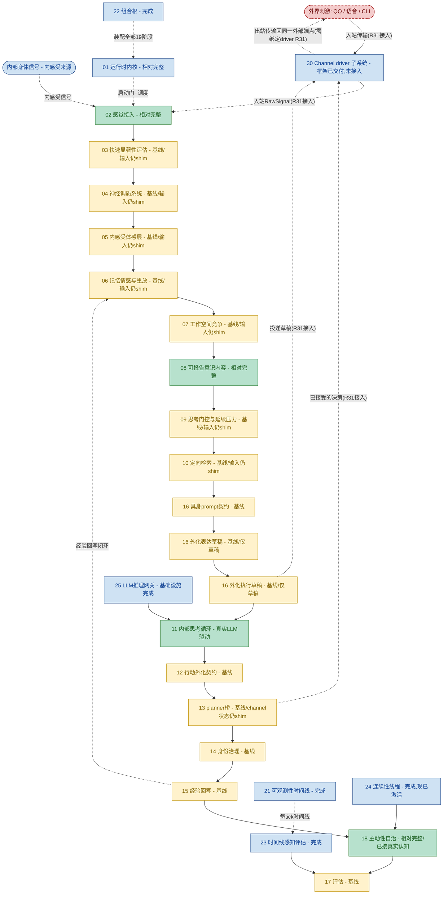

# Helios v2 模块进度流程图（中文）

> 状态：活文档（进度地图）。任何实质改变 owner 成熟度、运行时阶段链或 owner 边界的 requirement，
> 必须在同一次变更里同步更新本文件。
> 最近同步：R30（channel driver 子系统框架）。测试基线：372 passed。版本：R30。
> 配套：英文版 `PROGRESS_FLOW.en.md` 必须与本文件一起更新。

## 1. 目的

本文件是 Helios v2 的模块级进度地图。它展示规范运行时阶段链（每个 tick 执行的
`CANONICAL_STAGE_ORDER`）加支撑性的基础设施 owner，按真实实现成熟度着色，并标出唯一一个
剩余结构性留白（channel 子系统尚未接入运行时,因此外部端点——入站刺激与出站输出——尚未经由
具体绑定 driver 连通）。

它是面向实现的：颜色反映已落地代码和验证证据，而非规划意图，且必须与
`requirements/index.md` 的 `Maturity` 列保持一致。

## 2. 图例

- 深度真实（绿）：LLM 驱动认知，或 `relatively_complete` 的 owner 行为。
- 基线（黄）：owner 真实、含 fail-fast 契约与测试，但其**输入仍是 composition 注入的确定性 shim**。
- 基础设施完成（蓝）：支撑性 owner 已交付（内核、网关、可观测、组合根、评估底座、连续性线程）。
- 留白·尚无 owner（红·虚线）：一个被一致引用、但从未分配 owner 的一等概念。

## 3. 流程图

## 4. 状态小结

- 认知主链（02 到 17）端到端贯通；372 测试全绿、离线，外加真实 LLM 冒烟。
- 深度真实 owner：02 感觉接入、08 可报告意识、11 内部思考（真实 LLM 驱动的认知核心）、
  18 主动性（已接真实认知），加基础设施（01、21、22、23、24、25）。
- 基线 owner（占大头）：03-07、09-10、12-17（13 的 planner 判断本身是真实的）——owner 真实、
  含契约与测试，但**输入仍是 composition 注入的确定性 shim**；13 的 channel 描述符/状态快照也是
  shim 注入（绑定 driver 后由 `30` 的真实 channel-state 快照替换,见 R31）。
- 传输 owner 现已存在（30,蓝）：channel driver 子系统框架已交付（统一 driver 协议、NAPI 式有界入站
  drain 产出带 QoS 标记的 RawSignal、有界且尊重优先级的出站 dispatch、真实的每-driver channel 状态、
  fail-fast 就绪）外加确定性 fake driver。它是 additive 的,尚未接入运行时。
- 外界刺激即 channel 入站：外部端点（EXT：QQ / 语音 / CLI）是双向边界——入站传输经 channel 子系统
  进入,变成带 QoS 标记的 RawSignal,再由 02 sensory 归一化;出站传输经 channel 子系统回到同一端点。
  只有内感受的内部身体信号（BODY）不走外部 channel,直接喂给 02。
- 唯一剩余结构性留白：channel 子系统尚未接入运行时,因此外部边界（虚线 EXT ↔ CH）尚未连通——真实
  外界刺激进不来、真实主动提议也出不去,需等 CLI driver 及其 opt-in 接入（R31）落地。对应 brain.mmd
  的入站转导中继与 `M 外显输出` 阶段。
- 经验回写闭环（15 → 06）已实现，使每个 tick 在主观上与上一 tick 相连。

## 5. 更新约束

本文件与英文配套 `PROGRESS_FLOW.en.md` 必须在以下任一情况发生时、于**同一次变更**内同步更新：

1. 某 owner 的成熟度颜色发生变化；
2. 运行时阶段链的顺序或成员发生变化；
3. owner 边界发生变化（新增 owner、合并 owner、或填补留白）。

顶部"最近同步"行必须写明最后改动本文件的 requirement。若一次变更改变了 owner 成熟度却未更新
本地图，则该变更视为不完整——与 `requirements/index.md` 的成熟度规则一致。
