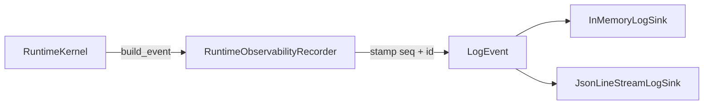

# Requirement 21 - Unified runtime observability and logging design

## 1. Title

Requirement 21 - Unified runtime observability and logging

## 2. Design Overview

This design introduces a single observability owner, `helios_v2.observability`, and a kernel-level emission seam that produces structured, severity-tagged, sequence-correlated log events for the whole `01 -> 18` runtime path.

The design follows the same boundary discipline already used by the `17` evaluation owner: observability is read-only infrastructure that consumes already-public runtime artifacts and publishes structured records. It does not reinterpret owner state, and it is not a transport for authoritative state between owners.

The emission point for the cognitive chain is the runtime kernel, because the kernel is the one place that already iterates every registered stage in order. Wrapping stage dispatch there gives uniform, owner-agnostic coverage of `01 -> 18` without modifying any cognitive owner and without creating a log-based reach-through backdoor.

## 3. Current State and Gap

Current state:

1. `helios_v2/src` contains no logging at all. There is no `logging` import, no logger, and no structured event emission anywhere in the source tree.
2. `RuntimeKernel.startup` runs the dependency gate and returns nothing observable beyond raising on failure.
3. `RuntimeKernel.tick` executes stages in order and returns a `RuntimeTickResult` holding per-stage result objects, but produces no timestamped, sequenced, severity-tagged record of what happened.
4. Every owner design from `01` through `18` explicitly defers logging to a later diagnostics slice.

Gap:

1. There is no uniform, structured way to observe runtime execution of the `01 -> 18` chain.
2. There is no correlation surface tying stage outcomes and failures to `tick_id`, `stage_name`, ordering, and duration.
3. There is no single owner for this cross-cutting concern, so logging risks being reinvented inconsistently inside owners.

## 4. Target Architecture

### 4.1 Owner

`helios_v2.observability` is the sole owner of structured runtime log events, severity and event-kind taxonomies, sink dispatch, and the runtime observability recorder.

It owns:

1. the immutable structured `LogEvent` contract,
2. the `LogSeverity` and `LogEventKind` taxonomies,
3. the `LogSink` protocol and the first-version `InMemoryLogSink` and `JsonLineStreamLogSink`,
4. the `RuntimeObservabilityRecorder` that stamps sequence numbers and event ids and dispatches events to sinks.

It explicitly does not own:

1. any cognitive runtime decision or state,
2. planner authority, channel execution, or governance judgment,
3. authoritative inter-owner state transport,
4. storage or persistence policy beyond the sink dispatch boundary.

### 4.2 Runtime emission seam

`RuntimeKernel` gains one optional field, `recorder: RuntimeObservabilityRecorder | None`.

When the recorder is present:

1. `startup` emits a `runtime_startup` event after successful dependency validation, or a `runtime_startup_failed` event immediately before re-raising on missing dependencies.
2. `tick` emits, per stage and in order, a `stage_started` event, then runs the stage, then emits a `stage_completed` event carrying the measured duration, or a `stage_failed` event immediately before re-raising if the stage raises.
3. `tick` emits a `runtime_tick_completed` event after all stages complete.

When the recorder is absent, the kernel runs unchanged and emits nothing.

The kernel passes only the data it already holds into events: `tick_id`, `stage_name`, ordering index, duration, and bounded summary fields. It never introspects owner internals to build an event.

### 4.3 Data flow



The recorder is the only component that assigns sequence numbers and event ids. The kernel supplies event content; the recorder supplies ordering identity; the sinks receive finished immutable events.

## 5. Data Structures

### 5.1 LogSeverity
A fixed string taxonomy:
- `debug`
- `info`
- `notice`
- `warning`
- `error`
- `critical`

Each severity maps to a monotonic integer rank used for threshold comparison.

### 5.2 LogEventKind
A fixed string taxonomy:
- `runtime_startup`
- `runtime_startup_failed`
- `stage_started`
- `stage_completed`
- `stage_failed`
- `runtime_tick_completed`
- `owner_emission`

### 5.3 LogEvent
Immutable frozen dataclass:
- `event_id: str` - stable id stamped by the recorder, format `log-event:{sequence}`.
- `sequence: int` - strictly monotonic per recorder, starting at 1, never negative.
- `severity: LogSeverity`
- `event_kind: LogEventKind`
- `owner: str` - emitting owner name, non-empty.
- `message: str` - non-empty human-readable summary.
- `tick_id: int | None`
- `stage_name: str | None`
- `provenance_refs: tuple[str, ...]` - ids of formal artifacts this event mirrors, may be empty.
- `payload: Mapping[str, object]` - bounded structured fields, frozen to a read-only mapping.

Validation in `__post_init__`:
1. reject empty `owner` and empty `message`,
2. reject severity not in the taxonomy,
3. reject event kind not in the taxonomy,
4. reject negative `sequence`,
5. freeze `payload` into a `MappingProxyType` and reject empty payload keys.

`LogEvent` exposes `to_record() -> dict[str, object]` returning a JSON-serializable dict for stream sinks.

### 5.4 LogSink protocol
```python
class LogSink(Protocol):
    def emit(self, event: LogEvent) -> None: ...
```
Documented owner, purpose, inputs, raises. Implementations:
1. `InMemoryLogSink` - appends events to an internal list, exposes a read-only `events` view.
2. `JsonLineStreamLogSink` - writes `json.dumps(event.to_record())` plus a newline to an injected text stream.

### 5.5 RuntimeObservabilityRecorder
Public owner API:
- constructed with `sinks: tuple[LogSink, ...]` and `minimum_severity: LogSeverity = "info"`.
- raises `ObservabilityError` if `sinks` is empty.
- `record(self, *, severity, event_kind, owner, message, tick_id=None, stage_name=None, provenance_refs=(), payload=None) -> LogEvent`:
  1. increments an internal sequence counter,
  2. builds an immutable `LogEvent`,
  3. dispatches to all sinks only if severity rank is at or above the threshold,
  4. returns the built event regardless of threshold so callers can inspect it.
- sink dispatch failures propagate; the recorder does not swallow them.

### 5.6 Kernel changes
- `RuntimeKernel.recorder: RuntimeObservabilityRecorder | None = None`.
- Private helpers emit the specific event kinds with consistent owner name `runtime_kernel`.
- Stage duration measured with `time.perf_counter()` around `stage.run(frame)`.

## 6. Module Changes

1. New `helios_v2/src/helios_v2/observability/contracts.py`: severity and event-kind taxonomies, `LogEvent`, `LogSink`, ops-free read-only API surface, `ObservabilityError`.
2. New `helios_v2/src/helios_v2/observability/engine.py`: `InMemoryLogSink`, `JsonLineStreamLogSink`, `RuntimeObservabilityRecorder`.
3. New `helios_v2/src/helios_v2/observability/__init__.py`: public exports.
4. Edit `helios_v2/src/helios_v2/runtime/kernel.py`: add optional recorder field and emission seam in `startup` and `tick`.
5. Edit `helios_v2/src/helios_v2/runtime/__init__.py`: no new runtime stage, but keep exports consistent if any helper is surfaced.
6. Edit `helios_v2/src/helios_v2/__init__.py`: export the observability recorder and `LogEvent` for top-level discoverability, mirroring how owners are surfaced.

## 7. Migration Plan

1. The observability owner is additive. No existing module changes behavior unless a recorder is injected.
2. `RuntimeKernel.recorder` defaults to `None`. All existing kernel construction sites and tests remain valid.
3. Default rollout is off: instrumentation activates only when a recorder is explicitly injected.
4. No owner from `01` through `18` is modified, so no owner boundary moves in this slice.

## 8. Failure Modes and Constraints

1. Zero-sink recorder: raises `ObservabilityError` at construction. No degraded no-op recorder is allowed.
2. Sink emission failure: propagates out of `record`. The kernel does not catch observability errors, so a misconfigured sink fails loudly rather than corrupting silently.
3. Unknown severity or event kind: rejected at `LogEvent` construction.
4. Absent recorder: kernel emits nothing and behaves exactly as before. This is explicitly a non-instrumented runtime, not a degraded cognitive mode.
5. The observability owner must never be used to pass authoritative state. This is a documented prohibition consistent with the philosophy constraint that key state must live in formal contracts, not logs.

## 9. Observability and Logging

This requirement is itself the observability slice that earlier owners deferred. It keeps scope bounded:

1. The kernel emits a fixed, documented set of lifecycle event kinds.
2. Events are structured and JSON-serializable, not free-form strings.
3. Owner-level fine-grained logging is intentionally out of scope for this slice; only the kernel emission seam plus the owner package land now. Owner-level emission can be added later through the same owner without changing the contract.

## 10. Validation Strategy

1. Contract tests: `LogEvent` immutability and validation, severity and event-kind taxonomy rejection, payload freezing, `to_record` JSON-serializability.
2. Engine tests: zero-sink construction error, sequence monotonicity, severity threshold filtering, in-memory sink ordering, JSON-line stream sink output parses back to the event record, sink failure propagation.
3. Kernel integration tests: recorder-present startup event, startup-failure event on missing dependency, per-stage start/completion/failure events with `tick_id` and `stage_name`, tick-completion event, and a no-recorder run that emits nothing while preserving prior behavior.
4. Regression: full `helios_v2/tests` suite stays green.
