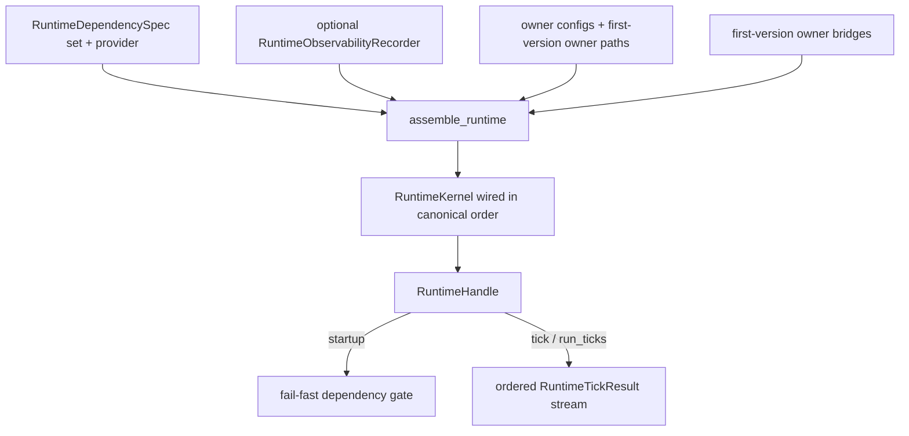

# Requirement 22 - Runtime composition root and runnable runtime design

## 1. Title

Requirement 22 - Runtime composition root and runnable runtime

## 2. Design Overview

This design introduces one composition owner, `helios_v2.composition`, that turns the existing owner chain into a runnable runtime. It assembles the critical-dependency gate, the eighteen cognitive owners plus the evaluation owner as nineteen ordered stages, the cross-owner bridge providers required by `runtime/stages.py`, and an optional `21` observability recorder into a single constructible runtime handle. It also adds a thin driver script and a repository guard test that enforces the `21` observability owner as the single logging mechanism.

The composition owner is assembly-only. It holds no cognitive policy. It mirrors the assembly already proven inside `tests/test_runtime_stage_chain.py`, but promotes the cross-owner bridges from test-only `Fixed*` doubles into shipped, owner-neutral, provenance-preserving first-version implementations.

This design follows the same boundary discipline as the existing owners: explicit contracts in, explicit contracts out, fail-fast on missing or inconsistent inputs, and no degraded mode.

## 3. Current State and Gap

Current state:

1. `runtime/kernel.py` provides `RuntimeKernel` with `register_stage`, `startup`, `tick`, and an optional `21` recorder.
2. `runtime/stages.py` provides nineteen stage adapters and the cross-owner bridge protocols, plus one shipped bridge, `WorkspaceConsciousContentMaterialBridge`.
3. `tests/test_runtime_stage_chain.py` proves the full chain runs in one tick, but it builds every owner config, every owner engine, and every cross-owner bridge as private `Fixed*` test doubles inside the test module.
4. There is no shipped composition root, no runnable runtime handle, and no driver entry point.

Gap:

1. The cross-owner bridges other than `WorkspaceConsciousContentMaterialBridge` do not exist in `src`. The chain cannot be assembled outside the test.
2. There is no single shipped function that returns a runnable runtime.
3. There is no driver to run several ticks and capture the `21` timeline.
4. There is no enforced guard that keeps the `21` observability owner as the only logging mechanism, so ad-hoc logging could still leak into owners later.

## 4. Target Architecture

### 4.1 Owner

`helios_v2.composition` is the sole owner of runtime assembly. It owns:

1. first-version owner-neutral cross-owner bridge implementations,
2. the runtime assembly function that wires the dependency gate, stages, bridges, and optional recorder,
3. a small runtime handle type exposing `startup`, `tick`, and `run_ticks`,
4. a canonical stage-order definition and a one-time assembly-validation check.

It explicitly does not own:

1. any cognitive runtime decision or owner-private state,
2. planner authority, channel execution, or governance judgment,
3. observability event taxonomy (owned by `21`),
4. owner-internal policy of any kind.

### 4.2 Composition data flow



The assembly function is the only place that knows the full wiring. The handle exposes lifecycle only and forwards to the kernel.

### 4.3 Canonical stage order

The composition owner defines the canonical order as the single source of wiring truth and validates it after registration:

1. `sensory_ingress`
2. `rapid_salience_appraisal`
3. `neuromodulator_system`
4. `interoceptive_feeling_layer`
5. `memory_affect_and_replay`
6. `workspace_competition_and_working_state`
7. `reportable_conscious_content`
8. `thought_gating`
9. `directed_retrieval`
10. `embodied_prompt`
11. `outward_expression`
12. `outward_expression_externalization`
13. `internal_thought`
14. `action_externalization`
15. `planner_bridge`
16. `identity_governance`
17. `experience_writeback`
18. `autonomy`
19. `evaluation`

This order is taken directly from the proven assembly in `tests/test_runtime_stage_chain.py` and the dependency directions in `ARCHITECTURE_BOUNDARIES.md`.

### 4.4 First-version bridges

For every bridge protocol in `runtime/stages.py`, the composition owner ships a first-version implementation. The bridges are owner-neutral glue: each consumes explicit upstream stage results and produces the next owner's request or context contract, preserving provenance ids and failing fast on inconsistency.

Bridges to ship (protocol -> implementation):

1. `MemoryBindingContextProvider` -> `FirstVersionMemoryBindingContextBridge`
2. `PredictionMismatchEvidenceProvider` -> `FirstVersionPredictionMismatchEvidenceBridge`
3. `ConsciousContentMaterialProvider` -> reuse existing `WorkspaceConsciousContentMaterialBridge`
4. `ThoughtGateSignalProvider` -> `FirstVersionThoughtGateSignalBridge`
5. `DirectedRetrievalRequestProvider` -> `FirstVersionDirectedRetrievalRequestBridge`
6. `EmbodiedPromptRequestProvider` -> `FirstVersionEmbodiedPromptRequestBridge`
7. `InternalThoughtRequestProvider` -> `FirstVersionInternalThoughtRequestBridge`
8. `ThoughtExternalizationRequestProvider` -> `FirstVersionThoughtExternalizationRequestBridge`
9. `PlannerBridgeRequestProvider` -> `FirstVersionPlannerBridgeRequestBridge`
10. `IdentityGovernanceRequestProvider` -> `FirstVersionIdentityGovernanceRequestBridge`
11. `ExperienceWritebackRequestProvider` -> `FirstVersionExperienceWritebackRequestBridge`
12. `AutonomyRequestProvider` -> `FirstVersionAutonomyRequestBridge`
13. `EvaluationRequestProvider` -> `FirstVersionEvaluationRequestBridge`

Some stages also need an owner-internal capability that is currently injected as a test double, for example the directed-retrieval memory candidate provider, the rapid-appraisal estimators, the neuromodulator update path, the feeling construction path, the memory formation path, and the workspace competition path. The composition owner supplies first-version implementations for these injected capabilities as well, so the runtime is assemblable from shipped code. These first-version capabilities remain deterministic and bounded and are explicitly not the final owner policy; they are the minimum shipped behavior needed to make the chain runnable, consistent with the project decision to keep `03-16` at baseline until the chain is closed.

Bridge constraints:

1. A bridge must preserve the upstream provenance id required by the downstream stage contract.
2. A bridge must raise the existing `RuntimeStageExecutionError` (or the relevant owner error) when an upstream artifact is missing or inconsistent.
3. A bridge must not compute a downstream owner's semantic decision. It forwards and shapes explicit upstream fields into the next request contract only.
4. A bridge must not embed a hardcoded runtime strategy branch that simulates owner judgment. Required-but-not-yet-produced values come from explicit bootstrap inputs passed into the assembly.

### 4.5 Single logging mechanism guard

A repository guard test scans every `.py` file under `helios_v2/src` and fails if it finds `import logging`, `logging.getLogger`, a `getLogger(` call, or a `print(` call. The observability owner's own source is allowed because it does not use `logging` or `print`; it only defines structured event emission. This makes "the `21` owner is the single logging mechanism" an enforceable invariant rather than a convention, which is the chosen plan C for unified logging.

## 5. Data Structures

### 5.1 CompositionConfig
A frozen dataclass bundling the per-owner first-version configs and bootstrap inputs needed to assemble the runtime. It carries:
- each owner config object already defined by the owners (for example `NeuromodulatorConfig`, `InteroceptiveFeelingConfig`, `MemoryAffectReplayConfig`, and so on),
- explicit bootstrap inputs that bridges need (for example the binding-context content packet template and the mismatch-evidence bootstrap fields), expressed as explicit fields rather than in-code constants.

A default factory `default_composition_config()` returns a valid first-version config so the driver and tests can assemble a runtime without restating every field. The defaults mirror the values already proven in the stage-chain test.

### 5.2 RuntimeHandle
A small class returned by the assembly:
- `startup() -> None` forwards to `RuntimeKernel.startup`.
- `tick() -> RuntimeTickResult` forwards to `RuntimeKernel.tick`.
- `run_ticks(n: int) -> tuple[RuntimeTickResult, ...]` runs `n` ticks in order and returns the results. `n` must be a positive integer; otherwise it raises `ValueError`.
- `ingress` exposes the sensory ingress owner so the driver can supply per-tick stimuli through the owner API only.

### 5.3 assemble_runtime
Public entry point:
```python
def assemble_runtime(
    *,
    dependency_specs: list[RuntimeDependencySpec],
    dependency_provider: RuntimeDependencyProvider,
    config: CompositionConfig | None = None,
    recorder: RuntimeObservabilityRecorder | None = None,
) -> RuntimeHandle: ...
```
Behavior:
1. resolve `config` to `default_composition_config()` when `None`,
2. construct every owner engine with its config and first-version path,
3. construct every first-version bridge,
4. construct a `RuntimeKernel` with the dependency specs, provider, and optional recorder,
5. register the nineteen stages in canonical order,
6. validate the registered stage names equal the canonical order exactly, raising `CompositionError` otherwise,
7. return a `RuntimeHandle` wrapping the kernel and the ingress owner.

### 5.4 CompositionError
A `RuntimeError` subclass raised on assembly-time invariant violations, for example wrong stage count, wrong stage order, or duplicate stage.

## 6. Module Changes

1. New `helios_v2/src/helios_v2/composition/__init__.py`: exports `assemble_runtime`, `RuntimeHandle`, `CompositionConfig`, `default_composition_config`, `CompositionError`, and the canonical stage-order constant.
2. New `helios_v2/src/helios_v2/composition/bridges.py`: the first-version owner-neutral bridge implementations and any first-version injected owner capabilities required to assemble the chain.
3. New `helios_v2/src/helios_v2/composition/dependencies.py`: a first-version `RuntimeDependencyProvider` plus a default critical-dependency spec set for the driver and tests. The provider reports availability for the declared first-version capabilities and reports unavailable for anything undeclared, preserving fail-fast semantics.
4. New `helios_v2/src/helios_v2/composition/runtime_assembly.py`: `CompositionConfig`, `default_composition_config`, `RuntimeHandle`, `assemble_runtime`, `CompositionError`, and the canonical stage-order constant.
5. Edit `helios_v2/src/helios_v2/__init__.py`: surface `assemble_runtime` and `RuntimeHandle` for top-level discoverability.
6. New `helios_v2/scripts/run_runtime_driver.py`: thin driver that assembles a runtime with a JSON-line sink, supplies a bounded stimulus batch per tick through ingress, runs a bounded number of ticks, and writes the event stream.
7. New `helios_v2/tests/test_runtime_composition.py`: assembly, ordering, fail-fast, single-tick equivalence, multi-tick, and recorder-timeline tests.
8. New `helios_v2/tests/test_no_adhoc_logging_guard.py`: the single-logging-mechanism guard.

## 7. Migration Plan

1. The composition owner is additive. No existing owner, stage adapter, or kernel behavior changes.
2. The existing stage-chain test remains valid and unmodified. The composition owner promotes equivalent bridges into `src` but does not require the test to change.
3. Default rollout: the runtime is uninstrumented unless a recorder is injected, matching the `21` default-off contract.
4. The first-version injected owner capabilities and bridges are explicitly baseline. Later owner-deepening waves replace these injected first-version capabilities through the owners themselves, without changing the composition owner's assembly contract.

### 7.1 Forward-compatibility intent

This composition owner is designed as an extensible foundation, not a final runtime host. The `assemble_runtime` signature, the `RuntimeHandle` lifecycle surface, and the canonical stage-order constant are the stable seams that later requirements extend. Anticipated future extensions (each via its own requirement package) include: a long-running tick host replacing the bounded driver; real external input/output and critical-dependency providers replacing the first-version provider and driver-supplied stimuli; deeper owner-owned policy replacing the first-version injected capabilities and bridges; named assembly profiles selected by explicit configuration; and owner-level observability emission opened later through the `21` owner. Each extension must preserve the assembly contract and the no-degraded-mode rule established here, so growth is additive rather than a rewrite.

## 8. Failure Modes and Constraints

1. Missing critical dependency: `assemble_runtime` returns a handle, but `handle.startup()` raises `RuntimeStartupError` through the existing gate. No reduced assembly is produced.
2. Wrong stage count or order at assembly time: `assemble_runtime` raises `CompositionError`.
3. Missing or inconsistent upstream artifact at tick time: the relevant bridge raises `RuntimeStageExecutionError`, surfaced through the kernel, and when a recorder is attached a `stage_failed` event is emitted before re-raising.
4. `run_ticks(n)` with non-positive `n`: raises `ValueError`.
5. No fallback or degraded assembly mode is provided anywhere in this owner.
6. The composition owner and driver never use `logging` or `print`; this is enforced by the guard test.

## 9. Observability and Logging

1. The runtime supports the `21` recorder as its single logging mechanism. The composition owner injects the recorder into the kernel and otherwise emits nothing itself.
2. The driver attaches a `JsonLineStreamLogSink` so a multi-tick run produces a durable, parseable per-tick stage timeline.
3. The guard test makes the single-logging-mechanism rule enforceable across `helios_v2/src`.
4. Owner-level fine-grained emission remains out of scope here and stays deferred to the later `17`-driven slice, consistent with plan C.

## 10. Validation Strategy

1. Assembly tests: `assemble_runtime` returns a handle with nineteen stages registered in canonical order; wrong order or count raises `CompositionError`.
2. Fail-fast tests: a dependency provider reporting a missing critical capability causes `handle.startup()` to raise `RuntimeStartupError`; no degraded handle runs.
3. Equivalence test: one tick through the assembled runtime yields stage results whose provenance ids match the canonical chain expectations, validating bridges by provenance rather than string contents.
4. Multi-tick test: `run_ticks(n)` returns `n` ordered results and advances `tick_id` monotonically.
5. Recorder-timeline test: with a recorder attached, the captured events reconstruct the per-tick stage timeline in canonical order with strictly monotonic sequence numbers and no missing stages.
6. No-recorder regression: an assembled runtime with no recorder emits nothing and matches bare-kernel behavior.
7. Guard test: introducing `import logging` or `print(` under `helios_v2/src` fails the guard; the current tree passes it.
8. Full suite: `pytest helios_v2/tests -q` stays green.
