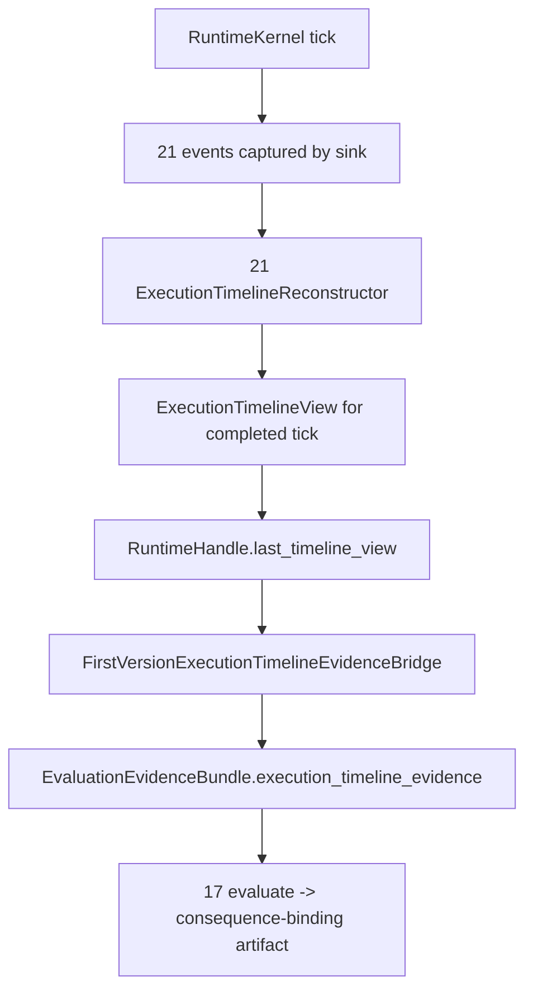

# Requirement 23 - Execution-timeline-aware evaluation and consequence binding design

## 1. Title

Requirement 23 - Execution-timeline-aware evaluation and consequence binding

## 2. Design Overview

This design closes the wave A behavioral-truth gap in two coordinated moves while keeping owner boundaries strict.

First, the observability owner (`21`) gains a formal, immutable execution-timeline view contract plus a read-only reconstructor that rebuilds one tick's stage timeline from already-captured kernel lifecycle events. This keeps the log-to-structured-fact transformation inside the observability owner, so no downstream owner parses raw log events.

Second, the evaluation owner (`17`) gains a new execution-timeline evidence category and upgrades its consequence-relevant scoring from binary presence to path-outcome scoring that distinguishes internally-activated, blocked, rejected, executed, and continuity-written outcomes. Evaluation reasons about the previous completed tick's timeline, because the current tick is not finished when the evaluation stage runs.

The composition owner (`22`) carries the previous tick's timeline view forward and supplies it to the evaluation evidence assembly through an owner-neutral bridge, staying assembly-only.

The hard rule from `21` is preserved: only kernel execution-timing facts (stage order, duration, lifecycle status) flow through the timeline view. Every owner's semantic decision still travels exclusively through formal owner result contracts. The log channel never becomes an authoritative decision transport.

## 3. Current State and Gap

Current state:

1. `21` emits `runtime_startup`, `stage_started`, `stage_completed` (with duration), `stage_failed`, and `runtime_tick_completed` events carrying `tick_id` and `stage_name`. There is no structured timeline view; the events are a flat captured list.
2. `17` consumes thought, action, planner, governance, writeback, prompt, outward-expression, outward-expression-externalization, and autonomy evidence, and scores each dimension as `1.0 if evidence else 0.0`.
3. `22` assembles the runtime and supplies a `FirstVersionEvaluationRequestBridge` that builds the request and evidence bundle from current-tick stage results only.

Gap:

1. No formal timeline view exists, so evaluation has no sanctioned way to consume execution-timing facts.
2. Evaluation scoring cannot distinguish internal activation from external consequence.
3. There is no cross-tick carry of execution evidence.

## 4. Target Architecture

### 4.1 Observability owner additions

New immutable contracts in `observability/contracts.py`:

1. `ExecutionTimelineStageEntry` - one stage's execution fact for a tick: `stage_name`, `stage_index`, `status` (`completed` or `failed`), `duration_ms`, and optional `error_type` for a failed stage.
2. `ExecutionTimelineView` - one tick's reconstructed timeline: `tick_id`, ordered `stages: tuple[ExecutionTimelineStageEntry, ...]`, `completed: bool` (whether a `runtime_tick_completed` event was observed for the tick), and `stage_count`.

New read-only reconstructor in `observability/engine.py`:

1. `ExecutionTimelineReconstructor.reconstruct(events, tick_id) -> ExecutionTimelineView`.
2. It scans the provided events for the given `tick_id`, pairs `stage_started`/`stage_completed`/`stage_failed` by `stage_name` and ordering, and assembles ordered stage entries.
3. It derives entries only from kernel timing/lifecycle facts. It must ignore event payload fields that are not timing facts and must never read an owner's semantic decision.
4. If the tick has no observed lifecycle events, it returns an explicitly incomplete view (`stages=()`, `completed=False`) rather than raising, so an uninstrumented or partial run is represented as explicit absence. A malformed pairing (for example a completed event with no matching started event) raises `ObservabilityError`.

The reconstructor consumes events from any source that exposes the captured event tuple (for example `InMemoryLogSink.events`). The observability owner does not gain any dependency on cognitive owners.

### 4.2 Evaluation owner additions

New evidence category on `EvaluationEvidenceBundle` in `evaluation/contracts.py`:

1. `execution_timeline_evidence: tuple[Mapping[str, object], ...]` - zero or one entry. Each entry is the structured projection of one `ExecutionTimelineView`, carrying `evidence_id`, `tick_id`, `completed`, `stage_count`, and a compact per-stage status list. Zero entries means no prior timeline was available.

Scoring upgrade in `evaluation/engine.py` (`FirstVersionEvaluationPath`):

1. Add a `consequence_binding` assessment to `gap_summary` and a dimension score `internal_to_visible_consequence` that maps the planner status to a path outcome:
   - planner `executed` plus a written writeback outcome -> `continuity_written`,
   - planner `executed` without writeback -> `executed`,
   - planner `policy_rejected` -> `rejected`,
   - planner `execution_consistency_failed` or `execution_failed` -> `blocked`,
   - thought present but no normalized action -> `internally_activated_only`,
   - no thought evidence -> `no_activation`.
2. Add a `shim_derived_dimensions` annotation to `long_range_diagnostics` listing which dimension scores are currently derived from deterministic first-version shim evidence, so fidelity is not overstated.
3. Add explicit timeline diagnostics to `long_range_diagnostics`: `execution_timeline_status` is one of `observed`, `no_prior_timeline`, or `absent_uninstrumented`, derived from the timeline evidence presence and content.
4. Add an incompleteness warning `warning:missing-execution-timeline` when timeline evidence is absent. This warning is informational about instrumentation, distinct from a fidelity failure.

The scoring uses only owner-published status fields already present in the evidence dicts (planner `status`, writeback `status`, action `status`). It does not re-derive status heuristically.

### 4.3 Composition owner additions

1. A new owner-neutral bridge `FirstVersionExecutionTimelineEvidenceBridge` (in `composition/bridges.py`) projects an `ExecutionTimelineView` into the timeline evidence entry consumed by the evaluation bundle. When no view is available it yields an empty tuple.
2. The composition layer carries the previous tick's timeline view forward. Because the evaluation stage runs inside the current tick, the timeline reconstructed for the current tick is not yet complete; the design therefore reconstructs the previous tick's timeline after each tick completes and stores it on the runtime handle for the next tick's evaluation evidence assembly.
3. This carry is implemented at the `RuntimeHandle` level: after each `tick()`/`run_ticks` iteration, when a recorder is present, the handle reconstructs the just-completed tick's timeline view and stores it as `last_timeline_view`. The evaluation bridge reads `last_timeline_view` when assembling the next tick's evidence. The carry is owner-neutral glue: it transports a formal observability contract, it does not interpret it.

### 4.4 Data flow

The previous tick's view feeds the next tick's evaluation. The first tick has no prior view, recorded explicitly.

## 5. Data Structures

### 5.1 ExecutionTimelineStageEntry (frozen)
- `stage_name: str`
- `stage_index: int`
- `status: Literal["completed", "failed"]`
- `duration_ms: float`
- `error_type: str | None = None`

Validation: non-empty `stage_name`, non-negative `stage_index`, non-negative `duration_ms`, `error_type` required iff `status == "failed"`.

### 5.2 ExecutionTimelineView (frozen)
- `tick_id: int`
- `stages: tuple[ExecutionTimelineStageEntry, ...]`
- `completed: bool`
- `stage_count: int`

Validation: `stage_count == len(stages)`; `tick_id` positive; stage indices strictly increasing from 0. Exposes `to_evidence(evidence_id: str) -> dict[str, object]` returning the compact projection for the evaluation bundle.

### 5.3 EvaluationEvidenceBundle extension
- add `execution_timeline_evidence: tuple[Mapping[str, object], ...] = ()`, frozen and validated like the other evidence categories (each entry, if present, must carry a non-empty `evidence_id`). Defaulting to empty keeps existing construction sites valid.

### 5.4 EvaluationArtifact additions (no shape change)
- `dimension_scores` gains `internal_to_visible_consequence`.
- `gap_summary` gains `consequence_binding` and `consequence_path_outcome`.
- `long_range_diagnostics` gains `execution_timeline_status` and `shim_derived_dimensions`.

These are additive map keys, not new top-level fields, so the artifact contract shape is unchanged.

## 6. Module Changes

1. `observability/contracts.py`: add `ExecutionTimelineStageEntry`, `ExecutionTimelineView`.
2. `observability/engine.py`: add `ExecutionTimelineReconstructor`.
3. `observability/__init__.py`: export the new contracts and reconstructor.
4. `evaluation/contracts.py`: add `execution_timeline_evidence` to `EvaluationEvidenceBundle`.
5. `evaluation/engine.py`: add consequence-binding scoring, timeline status diagnostics, shim annotation, and the missing-timeline warning.
6. `composition/bridges.py`: add `FirstVersionExecutionTimelineEvidenceBridge`; extend `FirstVersionEvaluationRequestBridge.build_evidence_bundle` to include timeline evidence from the carried view.
7. `composition/runtime_assembly.py`: extend `RuntimeHandle` to reconstruct and carry `last_timeline_view` across ticks when a recorder is present, and to make the carried view available to the evaluation bridge.

## 7. Migration Plan

1. All additions are additive. The new evidence category defaults to empty, so existing evaluation construction and tests remain valid.
2. The timeline view is only populated when a recorder is present. Uninstrumented runtimes keep working and produce explicit timeline-absence diagnostics.
3. Default rollout: consequence-binding scoring is always computed (it relies on already-present owner statuses); timeline-status diagnostics degrade to explicit absence without a recorder.
4. No cognitive owner is modified. No owner boundary moves; the observability owner gains a read-only reconstruction responsibility that is consistent with its existing read-only role.

### 7.1 Forward-compatibility intent

The timeline view and consequence-binding scoring are the stable measurement seams that later waves extend. When non-deterministic cognition lands, the same contracts begin scoring variable behavior without a contract change. Durable artifact persistence, richer long-horizon continuity scoring (wave B), and finer owner-level timeline detail are anticipated later extensions, each via its own requirement, and must preserve these owner boundaries.

## 8. Failure Modes and Constraints

1. Missing lifecycle events for a tick: reconstructor returns an explicitly incomplete view; evaluation records `absent_uninstrumented` or `no_prior_timeline` and warns. No fabricated timeline.
2. Malformed event pairing (completed/failed without started, or duplicate stage): reconstructor raises `ObservabilityError`.
3. Missing timeline evidence in the bundle: evaluation emits `warning:missing-execution-timeline`; it does not infer execution fidelity.
4. Evaluation remains read-only: no runtime, planner, channel, governance, or storage mutation.
5. The log channel is never an authoritative decision transport: only timing facts flow through the timeline view; owner decisions still arrive through owner result contracts.
6. No `logging` or `print` is introduced; the guard test stays green.

## 9. Observability and Logging

1. This requirement consumes the `21` event surface through an owner-internal reconstructor and does not add a second logging mechanism.
2. The reconstructor is read-only and derives only timing facts.
3. Owner-level fine-grained emission remains out of scope and deferred, consistent with plan C.

## 10. Validation Strategy

1. Timeline contract tests: `ExecutionTimelineStageEntry`/`ExecutionTimelineView` validation, `to_evidence` projection shape.
2. Reconstructor tests: a captured multi-stage tick reconstructs stages in canonical order with completed status and durations; a failed stage yields a `failed` entry with `error_type`; missing lifecycle yields an explicitly incomplete view; malformed pairing raises.
3. Evaluation tests: consequence-binding outcome mapping for executed+written, executed-only, policy_rejected, execution_failed, internally-activated-only, and no-activation; missing-timeline warning when timeline evidence is absent; shim-derived annotation present.
4. Composition tests: across two ticks with a recorder, the second tick's evaluation evidence carries the first tick's timeline view; the first tick records `no_prior_timeline`; an uninstrumented run records `absent_uninstrumented`.
5. Guard + regression: `test_no_adhoc_logging_guard.py` stays green and `pytest helios_v2/tests -q` stays green.
