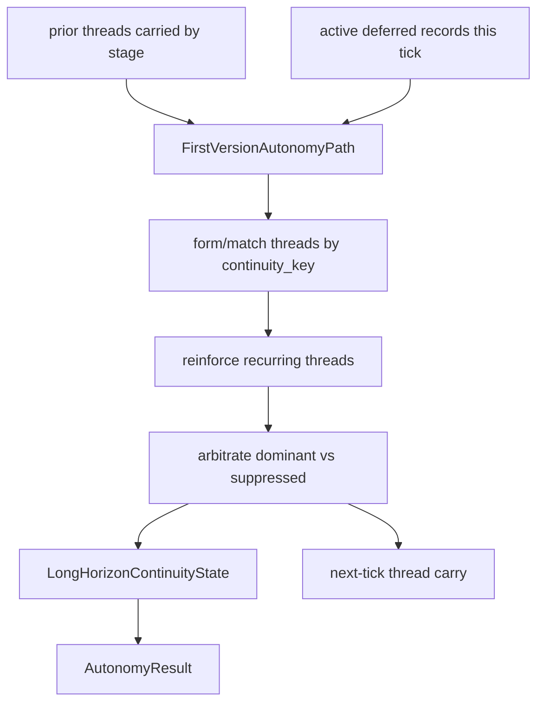

# Requirement 24 - Long-horizon continuity threads and reinforcement design

## 1. Title

Requirement 24 - Long-horizon continuity threads and reinforcement in autonomy

## 2. Design Overview

This design adds a thread layer on top of the autonomy owner's existing deferred-continuity record bookkeeping. Today the owner carries, decays, merges, and expires individual `DeferredContinuityRecord` objects keyed by continuity key. This design introduces a first-class `ContinuityThread` that aggregates the carry history of one continuity key across ticks, reinforces when the tendency recurs, and participates in deterministic conflict arbitration. The owner publishes an explicit owner-owned `LongHorizonContinuityState`, and the evaluation owner consumes it as formal read-only evidence.

The thread layer is strictly additive. The existing record-level decay, merge, expiry, and resolved/expired accounting are preserved unchanged; threads are computed from the same carried records plus a carried thread history that the runtime stage holds owner-privately, exactly as it already holds prior deferred records.

Scope honesty: this builds the skeleton. Threads reinforce on deterministic recurrence and arbitrate on strength/age. They do not yet carry substantive motive content; that arrives when real cognition populates them in a later requirement.

## 3. Current State and Gap

Current state:

1. `FirstVersionAutonomyPath` carries `prior_deferred_records`, decays each by `decay_factor`, merges records sharing a continuity key, expires records below `minimum_decayed_pressure` or out of tick budget, and publishes generated/merged/resolved/expired counts in `ProactiveDriveState.pressure_components`.
2. `AutonomyRuntimeStage` holds the prior deferred records owner-privately and re-injects them into each new `ProactiveDriveRequest`.
3. `AutonomyResult` publishes `drive_state` plus `deferred_records`. Evaluation consumes `autonomy_evidence` (dominant disposition, deferred_active, proactive_action_requested).

Gap:

1. No thread identity, no recurrence reinforcement, no explicit dominance/suppression, no explicit long-horizon state.
2. Evaluation cannot see thread age, reinforcement, or dominance.

## 4. Target Architecture

### 4.1 Owner

The autonomy owner (`18`) gains the thread layer. It owns:

1. the `ContinuityThread` contract,
2. the `LongHorizonContinuityState` contract,
3. thread formation, reinforcement, and conflict arbitration in the first-version path,
4. the carried thread history (held owner-privately by the runtime stage, like prior deferred records).

No other owner computes thread reinforcement or arbitration. Composition only carries the prior thread state forward (owner-neutral glue, identical pattern to prior-deferred-record carry). Evaluation only reads the published state.

### 4.2 Thread lifecycle

Thread-to-record correspondence: a thread exists for a continuity key iff that key has at least one active deferred record this tick. When the underlying records for a key all expire or resolve, the thread is retired explicitly (it does not appear in the next tick's carried threads). Threads are never dropped silently.

### 4.3 Reinforcement rule (deterministic, bounded)

1. A thread matched to a key that is present in both the prior carried threads and the current active records is reinforced: `reinforcement_count += 1`.
2. Aggregate `thread_strength` updates as a bounded accumulation: `thread_strength = min(1.0, thread_strength_prior + reinforcement_gain * current_record_pressure)`, where `reinforcement_gain` is an explicit config-level constant. A fresh thread starts at its first record's decayed pressure clamped to `[0, 1]`.
3. `age_ticks` increments each tick the thread persists. A fresh thread has `age_ticks = 1`.
4. Per-record decay is unchanged: the underlying records still decay independently. Reinforcement is a thread-level signal layered on top, so a recurring tendency can strengthen at the thread level even as any single record decays.

### 4.4 Conflict arbitration (deterministic)

1. Among active threads, the dominant thread is the one with the highest `(thread_strength, age_ticks, continuity_key)` lexicographic key (continuity_key as a final deterministic tiebreak).
2. All other active threads are suppressed for the current tick. Suppressed threads remain in the carried thread set for the next tick (suppression is not retirement).
3. With zero active threads, there is no dominant thread and the suppressed set is empty.

### 4.5 Long-horizon continuity state

The owner publishes one `LongHorizonContinuityState` per tick summarizing the active threads. It is attached to `AutonomyResult` as a formal field and projected into autonomy evidence for evaluation.

### 4.6 Evaluation visibility

Evaluation's autonomy evidence entry gains long-horizon fields (dominant thread id, dominant strength, dominant age, active thread count, aggregate reinforcement, whether a reinforced long-running thread is present). Evaluation publishes a `long_horizon_continuity` diagnostic in `long_range_diagnostics`, and an explicit `absent` value when the evidence lacks long-horizon fields. This reuses the existing autonomy evidence channel; no new evidence category is required.

## 5. Data Structures

### 5.1 ContinuityThread (frozen, autonomy owner)
- `thread_id: str`
- `continuity_key: str`
- `origin_ref: str`
- `age_ticks: int` (>= 1)
- `reinforcement_count: int` (>= 0)
- `thread_strength: float` (0..1)
- `thread_state: Literal["forming", "reinforced", "suppressed", "retiring"]`
- `last_carry_reason: str`

Validation: non-empty ids/keys; `age_ticks >= 1`; `reinforcement_count >= 0`; `0.0 <= thread_strength <= 1.0`; state in taxonomy.

### 5.2 LongHorizonContinuityState (frozen, autonomy owner)
- `state_id: str`
- `active_thread_count: int`
- `dominant_thread_id: str | None`
- `suppressed_thread_ids: tuple[str, ...]`
- `max_thread_age: int`
- `aggregate_reinforcement: int`
- `threads: tuple[ContinuityThread, ...]`

Validation: counts non-negative; `dominant_thread_id` present iff `threads` non-empty; `active_thread_count == len(threads)`; suppressed ids are a subset of thread ids and exclude the dominant id. Exposes `to_evidence()` returning a compact projection for autonomy evidence.

### 5.3 AutonomyResult extension
- add `long_horizon_state: LongHorizonContinuityState`. Defaulting is not appropriate because every result now publishes a state; the first-version path always builds one (empty state when no threads). Existing construction sites in tests that build `AutonomyResult` directly are updated.

### 5.4 ProactiveDriveRequest extension
- add `prior_continuity_threads: tuple[ContinuityThread, ...] = ()`, mirroring `prior_deferred_records`. The runtime stage carries prior threads forward into each request. Defaulting to empty keeps existing construction valid.

### 5.5 Autonomy evidence projection (composition bridge)
- the evaluation evidence bridge already builds `autonomy_evidence` from the autonomy stage result. It is extended to include the long-horizon projection fields from `long_horizon_state.to_evidence()`.

## 6. Module Changes

1. `autonomy/contracts.py`: add `ContinuityThread`, `LongHorizonContinuityState`, the thread-state taxonomy; extend `ProactiveDriveRequest` with `prior_continuity_threads`; extend `AutonomyResult` with `long_horizon_state`.
2. `autonomy/engine.py`: in `FirstVersionAutonomyPath`, form/match/reinforce threads from prior threads plus current active records, arbitrate dominance, build the long-horizon state, and attach it to the result. Add an explicit config-level `reinforcement_gain`.
3. `autonomy/__init__.py`: export the new contracts.
4. `runtime/stages.py`: `AutonomyRuntimeStage` carries prior continuity threads owner-privately across ticks (mirroring the prior-deferred-record carry) and injects them into each request; the stage result exposes the long-horizon state.
5. `evaluation/contracts.py`: no new category; the autonomy evidence dicts gain long-horizon keys (validated as before via `evidence_id`).
6. `evaluation/engine.py`: read long-horizon fields from autonomy evidence; publish a `long_horizon_continuity` diagnostic with explicit absence handling.
7. `composition/bridges.py`: extend the autonomy request bridge to carry prior threads and the evaluation evidence bridge to project the long-horizon state.

## 7. Migration Plan

1. All additions are additive. `prior_continuity_threads` defaults to empty; the long-horizon state is always built (possibly empty), so the chain keeps running.
2. The existing deferred-record carry, decay, merge, and expiry remain unchanged. Threads are computed alongside, not instead.
3. `AutonomyResult` gains a required `long_horizon_state`; the first-version path always supplies it, and direct test constructions are updated in the same change set.
4. Default rollout: thread computation is always on (it is deterministic and bounded), but it changes no outward behavior because autonomy still routes externalization through the existing path.

### 7.1 Forward-compatibility intent

`ContinuityThread` and `LongHorizonContinuityState` are the stable seams that later requirements extend. When real cognition lands, it populates threads with substantive motive content without changing these contracts. R14/R15 adjacency (identity self-evolution and writeback long-range carry) arrives as separate requirements that consume these threads without moving ownership out of `18`.

## 8. Failure Modes and Constraints

1. Missing or malformed continuity inputs: fail through the existing autonomy error semantics. No degraded thread mode.
2. Threads never dropped silently: retirement is explicit (underlying records expired or resolved); suppression preserves the thread for the next tick.
3. Reinforcement and dominance must follow the deterministic bounded rules; no fabricated reinforcement beyond carry history.
4. Autonomy still does not trigger channels; threads are internal continuity only.
5. No `logging`/`print`; guard test stays green.

## 9. Observability and Logging

1. Long-horizon continuity is expressed through the existing autonomy result and the `23` evaluation diagnostics; no second logging mechanism is added.
2. The kernel `21` timeline still records the autonomy stage execution; thread state itself travels through the formal owner result contract, not the log channel.

## 10. Validation Strategy

1. Contract tests: `ContinuityThread` and `LongHorizonContinuityState` validation (taxonomy, dominant-iff-nonempty, suppressed subset, strength bounds), `to_evidence` projection.
2. Engine tests: a recurring continuity key across ticks reinforces its thread (reinforcement_count and strength increase) while per-record decay still applies; two active threads produce an explicit dominant plus suppressed set; suppressed threads persist to the next tick; a fresh thread is distinguished from a reinforced one; existing decay/merge/expire/resolved accounting still holds.
3. Composition tests: across ticks with a recurring blocked tendency, the carried thread reinforces and the long-horizon state reports a dominant reinforced thread; a single-tick run reports a forming thread or empty state.
4. Evaluation tests: long-horizon continuity diagnostic present when evidence carries thread fields; explicit absence when it does not.
5. Guard + regression: `test_no_adhoc_logging_guard.py` stays green and `pytest helios_v2/tests -q` stays green.
