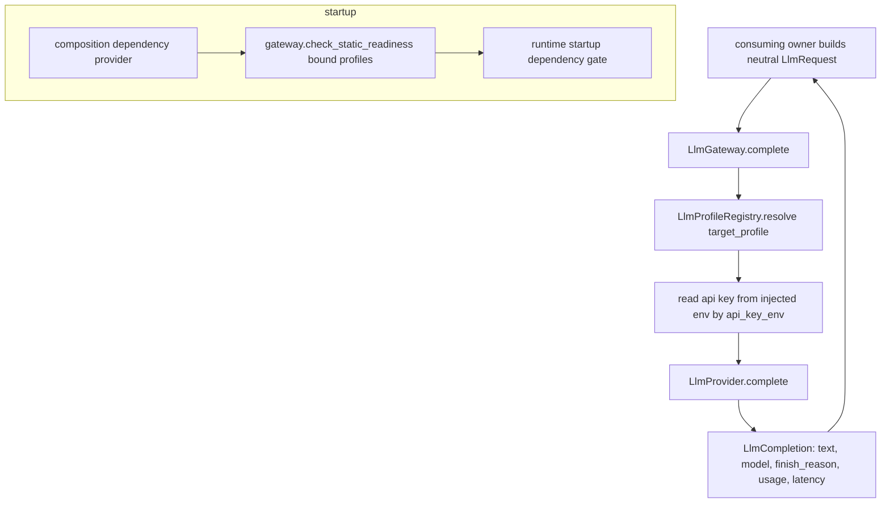

# Requirement 25 - LLM inference gateway design

## 1. Title

Requirement 25 - LLM inference gateway

## 2. Design Overview

This design adds one backend-neutral capability owner, `helios_v2.llm`, that converts a neutral inference request into a formal completion through a named profile. It mirrors the role discipline of the `21` observability owner: it is infrastructure that the runtime consumes, it owns its own narrow contracts, and it holds no cognitive policy.

The owner has three parts:

1. neutral contracts (`LlmMessage`, `LlmRequest`, `LlmCompletion`, `LlmUsage`, `LlmProfile`, `LlmReadinessReport`) plus an `LlmProvider` protocol and an `LlmError`,
2. an `LlmGateway` engine that resolves a request's profile from an injected `LlmProfileRegistry`, dispatches to the injected provider, and assembles the completion,
3. readiness reporting: a deterministic static check (profile exists and api-key env var is non-empty) and an explicit opt-in live probe.

The concrete first-version provider, `OpenAICompatibleProvider`, reuses the proven call shape from `scripts/run_llm_prompt_probe.py` but as shipped runtime code behind the provider protocol. The vendor SDK import is lazy inside the provider call path, so importing `helios_v2.llm` never requires the SDK to be installed; tests inject a deterministic fake provider and never touch the network.

Composition (`22`) is the only place that decides which consumer binds which profile, and it extends the existing dependency gate so a bound profile that is not statically ready fails startup fast. The gateway itself stays ignorant of consumer identity.

## 3. Current State and Gap

Current state:

1. `scripts/run_llm_prompt_probe.py` constructs an `openai.OpenAI` client directly, sends one system/user pair, and reports output. It is a standalone tool, not runtime code, and owns no contract.
2. `helios_v2.runtime.dependencies.validate_critical_dependencies` already gates startup on declared critical capabilities; `helios_v2.composition.dependencies` declares the single `runtime_cognition_baseline` capability and a provider that reports availability by membership in an explicit set.
3. No `helios_v2.llm` package exists. No runtime owner can obtain a real completion.

Gap:

1. There is no owner-bounded, backend-neutral inference contract.
2. There is no profile registry, so per-consumer model selection is impossible.
3. There is no fail-fast tie between LLM readiness and startup.

## 4. Target Architecture

### 4.1 Owner

`helios_v2.llm` is a capability owner. It owns the neutral request/completion contracts, the profile registry, provider dispatch, and readiness reporting. It does not own prompt assembly, completion interpretation, consumer identity, or cross-owner state transport.

### 4.2 Provider protocol and first-version provider

```
LlmProvider (Protocol)
    complete(profile: LlmProfile, request: LlmRequest, api_key: str) -> ProviderCompletion
```

`ProviderCompletion` is a small internal value (output text, finish reason, optional usage). The gateway wraps it into the public `LlmCompletion` with profile/model and latency. The provider protocol is the single seam vendors implement.

`OpenAICompatibleProvider` is the shipped first-version provider. It imports the `openai` SDK lazily inside `complete`, builds the chat-completion payload (messages, temperature, max tokens, timeout, optional `response_format=json_object`), calls the endpoint, and returns a `ProviderCompletion`. Any transport/SDK error is converted into `LlmError`.

### 4.3 Profile registry

```
LlmProfileRegistry
    __init__(profiles: tuple[LlmProfile, ...])   # non-empty, unique names
    resolve(profile_name: str) -> LlmProfile      # raises LlmError on unknown name
    names() -> tuple[str, ...]
```

The registry is constructed at composition time from explicit `LlmProfile` values. It supports multiple profiles. Profile-to-consumer binding is decided by composition, not the registry.

### 4.4 Gateway engine

```
LlmGateway(provider: LlmProvider, registry: LlmProfileRegistry, env: Mapping[str,str] | None)
    complete(request: LlmRequest) -> LlmCompletion
    check_static_readiness(profile_names: tuple[str, ...]) -> LlmReadinessReport
    probe_live_readiness(profile_names: tuple[str, ...]) -> LlmReadinessReport
```

`complete`:
1. resolves the profile by `request.target_profile` (unknown -> `LlmError`),
2. reads the api key from the injected env mapping by the profile's `api_key_env` (missing/empty -> `LlmError`),
3. measures latency around `provider.complete(...)`,
4. assembles and returns `LlmCompletion`, preserving `request.request_id` and the resolved profile name and model.

`check_static_readiness`:
1. for each requested name, reports profile existence and whether `api_key_env` resolves to a non-empty value in the injected env mapping,
2. performs no network call; deterministic given the env mapping.

`probe_live_readiness`:
1. for each requested name that is statically ready, issues a minimal real completion through the provider and records success or the captured failure,
2. is only ever called explicitly (driver or an ops tool), never by the startup gate.

The injected `env` mapping defaults to `os.environ` but is overridable, so tests drive readiness deterministically without touching the real environment.

### 4.5 Composition and startup integration

`helios_v2.composition.dependencies` gains an LLM-aware critical dependency. The design keeps composition assembly-only:

1. A new capability name `llm_profiles_ready` is added to the default critical-dependency specs only when the assembled runtime binds at least one LLM consumer (R26 introduces the first binding; R25 ships the mechanism and the spec/provider plumbing).
2. A dependency provider reports `llm_profiles_ready` available iff `gateway.check_static_readiness(bound_profile_names)` reports all-ready. This reuses the existing `RuntimeDependencyProvider` protocol, so the existing `validate_critical_dependencies` gate raises `RuntimeStartupError` with the missing capability when a bound profile is not ready.
3. No degraded assembly path is added. A runtime that binds no LLM consumer does not add the `llm_profiles_ready` spec and remains unchanged.

### 4.6 Data flow



The gateway never sees who the consumer is; it keys only on `target_profile`.

## 5. Data Structures

### 5.1 LlmMessage (frozen)
- `role: Literal["system", "user", "assistant"]`
- `content: str`

Validation: role in taxonomy; non-empty `content`.

### 5.2 LlmRequest (frozen)
- `request_id: str`
- `target_profile: str`
- `messages: tuple[LlmMessage, ...]`
- `response_format: Literal["text", "json_object"] = "text"`
- `metadata: Mapping[str, object] = {}`

Validation: non-empty `request_id`; non-empty `target_profile`; non-empty `messages`; frozen metadata mapping.

### 5.3 LlmUsage (frozen)
- `prompt_tokens: int | None`
- `completion_tokens: int | None`
- `total_tokens: int | None`

Validation: any present value must be a non-negative int.

### 5.4 LlmCompletion (frozen)
- `completion_id: str`
- `source_request_id: str`
- `profile_name: str`
- `model: str`
- `output_text: str`
- `finish_reason: str`
- `usage: LlmUsage | None`
- `latency_ms: float`

Validation: non-empty ids/profile/model; non-negative `latency_ms`. `output_text` may be empty only if `finish_reason` indicates a non-content stop; first version requires a non-empty `finish_reason`.

### 5.5 LlmProfile (frozen)
- `profile_name: str`
- `model: str`
- `api_key_env: str`
- `base_url: str`
- `temperature: float`
- `max_tokens: int`
- `timeout: float`
- `default_response_format: Literal["text", "json_object"] = "text"`

Validation: non-empty `profile_name`/`model`/`api_key_env`/`base_url`; `0.0 <= temperature`; `max_tokens > 0`; `timeout > 0`.

### 5.6 LlmReadinessReport (frozen)
- `report_id: str`
- `checked_live: bool`
- `entries: tuple[LlmProfileReadiness, ...]`

where `LlmProfileReadiness (frozen)`:
- `profile_name: str`
- `exists: bool`
- `static_ready: bool`
- `live_ready: bool | None`  (None when not live-checked)
- `detail: str`

Validation: non-empty `report_id`; `entries` keyed by unique profile names. Exposes `all_static_ready() -> bool`.

### 5.7 ProviderCompletion (frozen, gateway-internal)
- `output_text: str`
- `finish_reason: str`
- `usage: LlmUsage | None`

Internal provider return value; not part of the cross-owner public surface beyond the `LlmProvider` protocol.

## 6. Module Changes

1. `llm/contracts.py`: add the contracts in section 5, the `LlmProvider` protocol, the `LlmGatewayAPI` protocol, and `LlmError`.
2. `llm/engine.py`: add `LlmProfileRegistry`, `LlmGateway` (implementing `LlmGatewayAPI`), and `OpenAICompatibleProvider` (lazy SDK import).
3. `llm/__init__.py`: export the public contracts, protocols, registry, gateway, error, and the first-version provider.
4. `composition/dependencies.py`: add the `llm_profiles_ready` capability name, a `LlmReadinessDependencyProvider` that delegates to `gateway.check_static_readiness`, and a helper to extend the default spec set when LLM consumers are bound. R25 ships this plumbing; R26 supplies the first bound profile name and provider into the assembly.

## 7. Migration Plan

1. All additions are additive. The new package introduces no change to existing owners.
2. A runtime that binds no LLM consumer adds no `llm_profiles_ready` spec; existing assembly and tests are unaffected.
3. Default rollout: the gateway is constructed only when an LLM consumer is assembled (R26). R25 alone ships the package, contracts, registry, provider, and dependency plumbing with focused tests using a deterministic fake provider and an injected env mapping.
4. The probe script remains as a developer tool; it is not deleted, but it is no longer the only way to reach a model. A later cleanup may refactor it to use the shipped provider.

### 7.1 Forward-compatibility intent

`LlmProvider`, `LlmRequest`, and `LlmCompletion` are the stable seams later requirements extend. Retry/timeout policy, streaming, tool calling, embeddings, async invocation, and additional consumer bindings arrive as separate requirements without changing these contracts' core shape.

## 8. Failure Modes and Constraints

1. Unknown profile name: `complete` and readiness resolution raise `LlmError`. No fabricated completion.
2. Missing or empty api key at call time: `complete` raises `LlmError`; static readiness reports not-ready (it does not raise, because readiness reporting is a query).
3. Provider/transport failure: provider raises, gateway re-raises as `LlmError`. No silent retry, no substitute completion in the first version.
4. Empty messages or empty profile name: contract construction raises `LlmError`.
5. The gateway never interprets completion text, never assembles prompts, and never transports another owner's decision.
6. No degraded inference path exists. When a bound profile is unready, startup fails fast through the existing gate.
7. No `logging`/`print`; the guard test stays green.

## 9. Observability and Logging

1. The gateway adds no logging mechanism. Completion facts (model, usage, latency, finish reason) travel through `LlmCompletion`.
2. The consuming stage's execution is still observed by the kernel's `21` emission seam; the gateway itself emits nothing.
3. Live-probe results are returned as a structured `LlmReadinessReport`, not logged by the gateway.

## 10. Validation Strategy

1. Contract tests (`test_llm_contracts.py`): construction and validation for `LlmMessage`, `LlmRequest`, `LlmUsage`, `LlmCompletion`, `LlmProfile`, `LlmReadinessReport`; role taxonomy enforcement; empty-message and empty-profile rejection.
2. Engine tests (`test_llm_engine.py`):
   - registry resolve success and unknown-name `LlmError`,
   - `complete` with a deterministic fake provider returns a completion preserving request id and resolved profile/model and the fake output/usage,
   - `complete` raises `LlmError` on missing api key (injected empty env) and on a provider that raises,
   - `check_static_readiness` reports ready/not-ready deterministically from an injected env mapping and performs no network call,
   - `probe_live_readiness` issues the fake provider call only when invoked and produces a report with `checked_live=True`.
3. Composition tests: the dependency provider reports `llm_profiles_ready` unavailable when a bound profile's env key is empty, and the existing startup gate raises `RuntimeStartupError`; available when the env key is set.
4. Guard + regression: `test_no_adhoc_logging_guard.py` stays green and `pytest helios_v2/tests -q` stays green and network-free.
