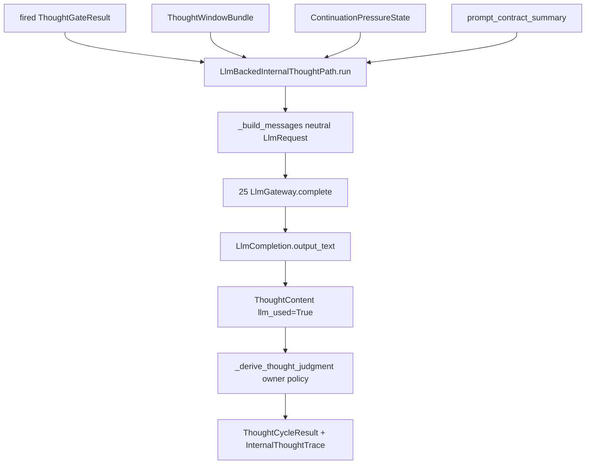

# Requirement 26 - LLM-backed internal thought design

## 1. Title

Requirement 26 - LLM-backed internal thought

## 2. Design Overview

This design adds a second `InternalThoughtPath` implementation, `LlmBackedInternalThoughtPath`, to the `11` owner. It obtains thought content from the `25` `LlmGateway` through a neutral `LlmRequest`, then runs the same owner-held first-version judgment used today to decide sufficiency, continuation, recall intent, memory handoff, and proposal emission. The model fills content; the owner keeps judgment.

The judgment logic is refactored out of `FirstVersionInternalThoughtPath` into a shared owner-private helper so both paths produce identical, reproducible decisions for a given thought content and retrieval window. The only difference between the two paths is the source of `ThoughtContent.content` and the `llm_used` / `source_path` markers.

Composition swaps the default thought path to the LLM-backed one, binds it to a named profile, and registers that profile through the `25` readiness plumbing as a critical dependency. The deterministic path remains exported and is used by explicit test assembly and by the existing internal-thought unit tests.

No `11` result contract changes. The change is purely an added path plus a composition binding.

## 3. Current State and Gap

Current state:

1. `FirstVersionInternalThoughtPath.run` computes `total_hits`, a `sufficiency_level`, a `continuation_requested` flag, a `recall_intent`, a `ThoughtContent` (via `_render_content`, `llm_used=False`), an optional `MemoryHandoffDirective`, an optional `ThoughtActionProposalCarrier`, and an optional `SelfRevisionProposalCarrier`, then returns a `ThoughtCycleResult` plus an `InternalThoughtTrace`.
2. `InternalThoughtEngine` validates the fired gate, request provenance, retrieval-bundle id, and continuation alignment before delegating to the injected path, and re-validates source-request-id and trace/status agreement afterward.
3. Composition wires `InternalThoughtEngine(thought_path=FirstVersionInternalThoughtPath())`.
4. `25` provides `LlmGateway.complete(LlmRequest) -> LlmCompletion`, a profile registry, and static-readiness dependency plumbing.

Gap:

1. No path turns a real completion into thought content.
2. The judgment logic is embedded inside the deterministic path and is not reused by a second path.
3. Composition does not bind a thought profile or gate startup on it.

## 4. Target Architecture

### 4.1 Owner-private judgment helper

Extract the deterministic decision logic into an owner-private helper inside `internal_thought/engine.py`:

```
_derive_thought_judgment(
    retrieval_bundle, continuation_state, request, thought_content
) -> _ThoughtJudgment
```

`_ThoughtJudgment` (frozen, owner-private) carries: `sufficiency_level`, `continuation_requested`, `continuation_reason`, `recall_intent`, `continuation_pressure_delta`, `memory_handoff`, `action_proposal`, `self_revision_proposal`. It is computed from the retrieval window and continuation state exactly as today, plus the produced `thought_content` (the proposal `outbound_text` uses the thought content, as it does today). This helper is the single source of judgment for both paths.

`FirstVersionInternalThoughtPath` is refactored to: build deterministic content via `_render_content`, call `_derive_thought_judgment`, and assemble the result/trace. Behavior is unchanged, so existing tests stay green.

### 4.2 LlmBackedInternalThoughtPath

```
@dataclass
class LlmBackedInternalThoughtPath(InternalThoughtPath):
    gateway: LlmGatewayAPI
    profile_name: str
    thought_source_path: str = "llm_backed_v1"

    def run(self, gate_result, retrieval_bundle, continuation_state, request, config):
        messages = self._build_messages(request, retrieval_bundle, continuation_state)
        llm_request = LlmRequest(
            request_id=f"llm-thought:{request.request_id}",
            target_profile=self.profile_name,
            messages=messages,
            response_format="text",
            metadata={"consumer": "internal_thought", "tick_id": request.tick_id},
        )
        completion = self.gateway.complete(llm_request)   # LlmError propagates as hard stop
        content_text = completion.output_text.strip()
        if not content_text:
            return self._insufficient_result(request, gate_result)  # explicit non-completed
        thought = ThoughtContent(
            thought_id=f"thought:{request.request_id}",
            thought_type="llm_reflective_synthesis",
            content=content_text,
            source_path=self.thought_source_path,
            llm_used=True,
            fallback_used=False,
        )
        judgment = _derive_thought_judgment(retrieval_bundle, continuation_state, request, thought)
        result = _assemble_completed_result(request, gate_result, thought, judgment)
        trace = _assemble_trace(result, llm_used=True)
        return result, trace
```

Key points:
1. `self.gateway.complete` failure is an `LlmError` hard stop; it is not caught and not converted to deterministic content.
2. An empty completion produces an explicit `insufficient_generation` result (no `ThoughtContent`, no proposals) via the existing taxonomy, not fabricated content.
3. Message assembly (`_build_messages`) is owned here: it renders a system message from the prompt-contract summary fields already passed in the request (layer names, action-boundary flags, anti-theatrical intent) and a user message from the retrieval window summaries and internal-state summary. The gateway never sees cognitive structure.

### 4.3 Composition binding

In `runtime_assembly.py`:
1. Construct an `LlmGateway` from a profile registry built from `CompositionConfig` (a new `llm` config section: the registry profiles plus the thought profile name binding). Default config supplies one profile (for example `thought-default`) reading the existing `.env` `OPENAI_API_KEY` / `OPENAI_BASE_URL` / `HELIOS_LLM_MODEL`.
2. Wire `InternalThoughtEngine(config=..., thought_path=LlmBackedInternalThoughtPath(gateway=gateway, profile_name=thought_profile_name))`.
3. Register the bound thought profile name as a critical dependency through the `25` `LlmReadinessDependencyProvider`, extending the default spec set with `llm_profiles_ready`.
4. The deterministic path is no longer the default, but remains importable for explicit test assembly. A composition test helper assembles a runtime with the deterministic path and no LLM dependency for the existing network-free integration tests.

### 4.4 Default-on vs default-off

1. The LLM-backed path is default-on in the production assembly (`assemble_runtime` with default config) and brings the `llm_profiles_ready` critical dependency with it.
2. To keep the suite network-free and deterministic, composition tests either inject a deterministic fake gateway into the LLM-backed path or assemble with the explicit deterministic path. The existing multi-tick composition tests use one of these two seams; they do not call a real model.

### 4.5 Data flow



## 5. Data Structures

1. `_ThoughtJudgment` (frozen, owner-private): the eight judgment fields listed in 4.1. Not exported; internal to `internal_thought/engine.py`.
2. `LlmBackedInternalThoughtPath` (dataclass): `gateway: LlmGatewayAPI`, `profile_name: str`, `thought_source_path: str`.
3. `CompositionConfig` gains an `llm` section: a tuple of `LlmProfile` for the registry and a `thought_profile_name: str`. `default_composition_config()` supplies one profile bound to the `.env` vars and `thought_profile_name="thought-default"`.
4. No change to `ThoughtContent`, `ThoughtCycleResult`, `InternalThoughtTrace`, or any other `11` contract.

## 6. Module Changes

1. `internal_thought/engine.py`: extract `_derive_thought_judgment` and shared assembly helpers; refactor `FirstVersionInternalThoughtPath` to use them; add `LlmBackedInternalThoughtPath`.
2. `internal_thought/__init__.py`: export `LlmBackedInternalThoughtPath`.
3. `composition/runtime_assembly.py`: build the gateway and registry from config, wire the LLM-backed path as default, register the LLM critical dependency, and provide an explicit deterministic-path assembly seam for tests.
4. `composition/dependencies.py`: use the `25` readiness provider for the bound thought profile.

## 7. Migration Plan

1. The judgment refactor is behavior-preserving for the deterministic path; existing `test_internal_thought_engine.py` cases stay green without change.
2. The LLM-backed path is additive; no `11` contract changes.
3. Default rollout: production assembly is LLM-backed and gains the `llm_profiles_ready` critical dependency. Test assembly uses a deterministic fake gateway or the explicit deterministic path, so the suite stays network-free.
4. Rollback is trivial: composition can wire the deterministic path again; no contract or downstream owner changes are required.

### 7.1 Forward-compatibility intent

The neutral `LlmRequest`/`LlmCompletion` seam and the owner-private judgment helper are the stable points later work extends. Structured JSON thought envelopes, richer owner judgment, and additional LLM-backed owners build on these without changing `11` result contracts.

## 8. Failure Modes and Constraints

1. Gateway/provider failure: `LlmError` propagates as a hard stop from `run`; no fabricated content, no deterministic fallback.
2. Empty/unusable completion: explicit `insufficient_generation` result with no `ThoughtContent` and no proposals.
3. Invalid fired-path request: the engine's existing validation raises before any inference call.
4. Unready bound profile: composition startup fails fast through the `25` readiness dependency and the existing gate.
5. The model never owns judgment; the gateway never interprets content; composition holds no cognitive policy.
6. No `logging`/`print`; the guard test stays green.

## 9. Observability and Logging

1. No new logging mechanism. The kernel `21` seam observes the internal-thought stage execution and timing.
2. LLM facts (model, usage, latency, finish reason) are available on the `LlmCompletion` returned to the path; the path may carry bounded markers into the existing `InternalThoughtTrace` (`llm_used=True`) but adds no new log channel.

## 10. Validation Strategy

1. Internal-thought engine tests (`test_internal_thought_engine.py`):
   - a deterministic fake gateway returning fixed text yields a `completed` result with `llm_used=True`, `fallback_used=False`, LLM-distinct `source_path`, and content derived from the completion,
   - owner judgment (sufficiency, continuation, recall intent, proposal/handoff emission) matches the deterministic path's judgment for an equivalent thought window, proving judgment stayed in the owner and is reproducible,
   - a fake gateway that raises makes `run` raise the hard-stop error with no published content,
   - an empty completion yields an explicit `insufficient_generation` result with no `ThoughtContent`,
   - existing deterministic-path cases remain unchanged and green.
2. Composition tests (`test_runtime_composition.py`):
   - default assembly with an injected fake gateway runs multi-tick and produces `llm_used=True` thought results,
   - the LLM critical dependency is registered; an unready bound profile (empty env key) fails startup fast; a ready profile passes,
   - an explicit deterministic-path assembly remains available and network-free.
3. Guard + regression: `test_no_adhoc_logging_guard.py` stays green and `pytest helios_v2/tests -q` stays green and network-free.
