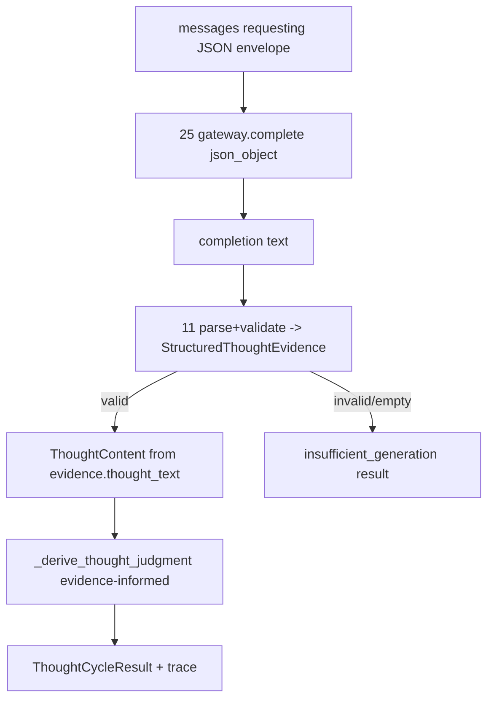

# Requirement 27 - Structured thought output driving owner judgment design

## 1. Title

Requirement 27 - Structured thought output driving owner judgment

## 2. Design Overview

This design makes the model's reasoning behaviorally consequential at the `11` internal-thought owner without moving judgment ownership to the model.

The `LlmBackedInternalThoughtPath` switches from a free-text completion to a `json_object` completion carrying a small structured thought envelope. The owner parses and validates that envelope into an owner-private `StructuredThoughtEvidence` value, then feeds it into an upgraded judgment helper `_derive_thought_judgment` that blends the model's structured signals with the existing retrieval/continuation context under explicit, bounded, deterministic rules. The owner still produces every final decision field; the model only supplies evidence.

The deterministic `FirstVersionInternalThoughtPath` is unchanged in behavior: it calls the same judgment helper with no structured evidence (the helper treats absent evidence as the existing retrieval-only baseline), so existing tests stay green.

The driver gains an explicit `--deterministic` assembly path and documents the LLM requirement. The deterministic path is opt-in and never a hidden fallback.

No `11` result contract field changes. The change is an added input source for judgment plus the structured-evidence parsing, all owned by `11`.

## 3. Current State and Gap

Current state:

1. `LlmBackedInternalThoughtPath.run` builds neutral messages, calls `gateway.complete` with `response_format="text"`, and uses the stripped completion text as `ThoughtContent.content`.
2. `_derive_thought_judgment(retrieval_bundle, continuation_state, request, thought)` computes sufficiency from retrieval hit counts (`0.35 + 0.20*short + 0.15*mid + 0.10*auto`), continuation from `continuation_state.active or total_hits <= 1`, and emits an action proposal only when not continuing, a self-revision proposal when autobiographical hits exist and sufficiency >= 0.75. It never reads `thought.content`.
3. The smoke run showed the model saying "no action required" while the owner externalized anyway, confirming zero behavioral influence from the model.
4. `scripts/run_runtime_driver.py` assembles the default LLM-backed runtime and has no deterministic path and no LLM-requirement documentation.

Gap:

1. Model reasoning does not influence owner judgment.
2. There is no structured channel for the model to express sufficiency/continuation/action/self-revision intent.
3. The driver cannot run offline and does not document the LLM requirement.

## 4. Target Architecture

### 4.1 Structured thought envelope (model-facing schema)

The LLM is asked to return a JSON object with this first-version schema:

```json
{
  "thought": "string, the internal thought content",
  "sufficiency": 0.0,
  "wants_to_continue": false,
  "continue_reason": "string, optional, required when wants_to_continue is true",
  "proposed_action": {
    "intends_action": false,
    "summary": "string, optional"
  },
  "self_revision": {
    "intends_revision": false,
    "summary": "string, optional"
  }
}
```

The schema is intentionally small. It expresses intent and self-assessment only; it carries no channel names, no intensities, no op names, and no governance decisions. Those remain owner-owned.

### 4.2 Owner-private parsed evidence

```
@dataclass(frozen=True)
class StructuredThoughtEvidence:
    thought_text: str
    model_sufficiency: float          # clamped to [0, 1] by the owner
    wants_to_continue: bool
    continue_reason: str              # "" when not continuing
    intends_action: bool
    action_summary: str               # "" when no action intent
    intends_self_revision: bool
    self_revision_summary: str        # "" when no revision intent
```

Parsing rules (owner-owned, in `11`):
1. The completion text must parse as a JSON object. A parse error is a validation failure.
2. `thought` must be a non-empty string after strip; empty -> explicit non-`completed` (as today).
3. `sufficiency` must be a number; the owner clamps it to `[0, 1]`. A missing or non-numeric value is a validation failure (not a silent default).
4. `wants_to_continue`, `intends_action`, `intends_self_revision` must be booleans; missing or wrong-typed is a validation failure.
5. `continue_reason`/`action_summary`/`self_revision_summary` are optional strings defaulting to `""`; when `wants_to_continue` is true, `continue_reason` must be non-empty.
6. Validation failure -> explicit `insufficient_generation` result, no fabricated content, no proposals.

### 4.3 Evidence-informed judgment rule (deterministic, bounded)

`_derive_thought_judgment` gains an optional `evidence: StructuredThoughtEvidence | None` parameter. When `evidence is None` (deterministic path), behavior is exactly as today. When evidence is present:

1. Retrieval-derived sufficiency `s_ret` is computed as today. Final sufficiency is a bounded blend:
   `sufficiency_level = round(min(1.0, max(0.0, blend_weight * evidence.model_sufficiency + (1 - blend_weight) * s_ret)), 4)`
   with an explicit owner constant `model_signal_weight` (first version: 0.6). The model signal measurably moves the result while staying owner-bounded.
2. Continuation: the owner still forces continuation when `continuation_state.active` (a runtime-truth carry the model cannot override). Otherwise the final `continuation_requested` follows the model's `wants_to_continue`, with the existing low-context guard retained as a floor (`total_hits <= 1` still forces continue). So the model can keep a cycle open or let it close, but it cannot suppress a runtime-carried continuation or claim sufficiency on an empty window.
3. `continuation_reason`: `evidence.continue_reason` when continuing by model intent; the existing `need_more_context` when forced by the low-context floor or runtime carry; `sufficient_for_current_cycle` otherwise.
4. Action proposal: emitted only when `continuation_requested is False` AND `evidence.intends_action is True`. The owner still sets scope/behavior/op/channels/intensity/governance hints; `outbound_text` remains the thought content. If the owner decides not to continue but the model expressed no action intent, no action proposal is emitted (a valid "thought complete, no action" outcome, which the current code cannot represent).
5. Self-revision proposal: emitted only when `evidence.intends_self_revision is True` AND the existing constraint (autobiographical hit present) holds. The model's intent is necessary but not sufficient; the owner constraint still gates it.
6. Memory handoff: unchanged shape, emitted when continuing, preserving the thought id.

All constants (`model_signal_weight`) are explicit owner-level values, not hidden magic. The rule is deterministic given evidence + context.

### 4.4 LlmBackedInternalThoughtPath changes

1. Build messages instructing the model to return the JSON envelope (the system message documents the schema and the anti-theatrical constraint; the user message carries internal state + retrieval window as today).
2. Call `gateway.complete` with `response_format="json_object"`.
3. Parse + validate into `StructuredThoughtEvidence` (owner-owned). On any validation failure, return the explicit `insufficient_generation` result.
4. Build `ThoughtContent` from `evidence.thought_text` (`llm_used=True`, `source_path="llm_backed_v1"`).
5. Call `_derive_thought_judgment(..., evidence=evidence)` and assemble the completed result + trace.

### 4.5 Deterministic path unchanged

`FirstVersionInternalThoughtPath` calls `_derive_thought_judgment(..., evidence=None)`. The helper's `evidence is None` branch is the current logic verbatim, so existing behavior and tests are preserved.

### 4.6 Driver

`run_runtime_driver.py`:
1. Add a `--deterministic` flag. When set, assemble with the deterministic thought path and without the LLM critical dependency, via an explicit composition seam.
2. Without the flag, assemble the default LLM-backed runtime (unchanged) and document in `--help`/module docstring that a statically-ready LLM profile is required or startup fails fast.

To support the deterministic seam cleanly, `assemble_runtime` gains an explicit `thought_path_mode` or accepts an injected thought path. The chosen mechanism (see 5.4) keeps composition assembly-only and adds no hidden fallback.

### 4.7 Data flow



## 5. Data Structures

### 5.1 StructuredThoughtEvidence (frozen, owner-private)
Fields per 4.2. Owner-private to `internal_thought/engine.py`; not exported as a cross-owner contract in this slice.

### 5.2 _ThoughtJudgment (unchanged shape)
The existing owner-private judgment structure is reused unchanged; only the helper's inputs and internal rule change.

### 5.3 No `11` public contract change
`ThoughtContent`, `ThoughtCycleResult`, `InternalThoughtTrace`, `InternalThoughtRequest` are unchanged. `llm_used`/`source_path` already exist.

### 5.4 Composition thought-path seam
`assemble_runtime` gains an explicit optional parameter `deterministic_thought: bool = False` (default keeps LLM-backed wiring). When True, it wires `FirstVersionInternalThoughtPath` and omits the `llm_profiles_ready` critical dependency and gateway construction. This is an explicit assembly choice, not a runtime fallback. The injected-`gateway` test seam from `26` is retained.

## 6. Module Changes

1. `internal_thought/engine.py`: add `StructuredThoughtEvidence` and an owner-private `_parse_structured_thought` validator; extend `_derive_thought_judgment` with an optional `evidence` parameter and the evidence-informed rule; update `LlmBackedInternalThoughtPath.run` to request and parse JSON; add the `model_signal_weight` constant.
2. `internal_thought/contracts.py`: no public contract change (structured evidence is owner-private). If a shared error message is needed it reuses `InternalThoughtError`.
3. `internal_thought/__init__.py`: no new public export required (evidence stays private); unchanged unless a helper is surfaced for tests.
4. `composition/runtime_assembly.py`: add `deterministic_thought` assembly parameter and the deterministic seam (no LLM dependency when set).
5. `scripts/run_runtime_driver.py`: add `--deterministic`, document the LLM requirement.

## 7. Migration Plan

1. Additive and behavior-preserving for the deterministic path: `_derive_thought_judgment(evidence=None)` is the current logic, so existing tests pass unchanged.
2. The LLM-backed path changes its request format to `json_object` and now parses structured output; its tests are updated to feed structured JSON through the fake gateway.
3. Default rollout: production assembly stays LLM-backed and now consumes structured output. The driver default is unchanged except for documentation; `--deterministic` is the new opt-in offline path.
4. Rollback: composition can wire the deterministic path; no downstream owner or contract changes are needed.

### 7.1 Forward-compatibility intent

The structured envelope and the evidence-informed judgment rule are the seams later waves extend. wave_C (execution closure) consumes the now-meaningful externalize/defer decision; wave_B (`14`/`15`/`24`) consumes the now-real defer decision to populate continuity threads with motive content. Both build on this slice without changing `11` contracts.

## 8. Failure Modes and Constraints

1. Non-JSON / missing-required / out-of-range / wrong-typed structured output -> explicit `insufficient_generation`, no fabricated content, no proposals, no retrieval-only fallback.
2. Empty `thought` field -> explicit `insufficient_generation` (as in `26`).
3. Gateway/provider failure -> `LlmError` hard stop (as in `26`); no deterministic fallback.
4. The model never owns the final decision; the owner validates and bounds every field and owns the mapping rule.
5. `continuation_state.active` runtime carry cannot be overridden by the model; the low-context floor still forces continuation on an empty window.
6. The deterministic driver path is explicit and opt-in, never a hidden fallback.
7. No `logging`/`print`; the guard test stays green.

## 9. Observability and Logging

1. No new logging mechanism. The structured-evidence influence is observable through existing result fields (`sufficiency_level`, `continuation_requested`, proposal presence) and the existing `17`/`23`/`24` diagnostics.
2. The kernel `21` seam still observes the internal-thought stage. Structured-output facts travel through owner result/trace fields, not the log channel.

## 10. Validation Strategy

1. Engine tests (`test_internal_thought_engine.py`):
   - a fake gateway returning a "sufficient + no continue + intends_action" envelope yields a completed result that externalizes (action proposal present, `continuation_requested=False`),
   - a fake gateway returning an "insufficient + wants_to_continue" envelope yields `continuation_requested=True`, a memory handoff, and no action proposal, with the same retrieval window,
   - the model sufficiency signal measurably moves `sufficiency_level` versus the retrieval-only baseline (assert a specific blended value),
   - malformed JSON, missing required field, out-of-range sufficiency, and wrong-typed boolean each yield `insufficient_generation` with no content/proposals,
   - empty `thought` yields `insufficient_generation`,
   - gateway failure raises `LlmError`,
   - `continuation_state.active` still forces continuation regardless of model intent,
   - the deterministic path (evidence=None) reproduces existing behavior (existing cases unchanged).
2. Composition tests (`test_runtime_composition.py`):
   - default LLM-backed assembly with a fake gateway returning a structured envelope runs multi-tick and the decision reflects the envelope,
   - `assemble_runtime(deterministic_thought=True)` assembles without the LLM critical dependency and runs offline,
   - the LLM critical-dependency fail-fast/pass cases from `26` still hold for the default path.
3. Driver: a focused check (or manual note) that `--deterministic` runs offline and the default documents the LLM requirement.
4. Guard + regression: `test_no_adhoc_logging_guard.py` stays green and `pytest helios_v2/tests -q` stays green and network-free.
