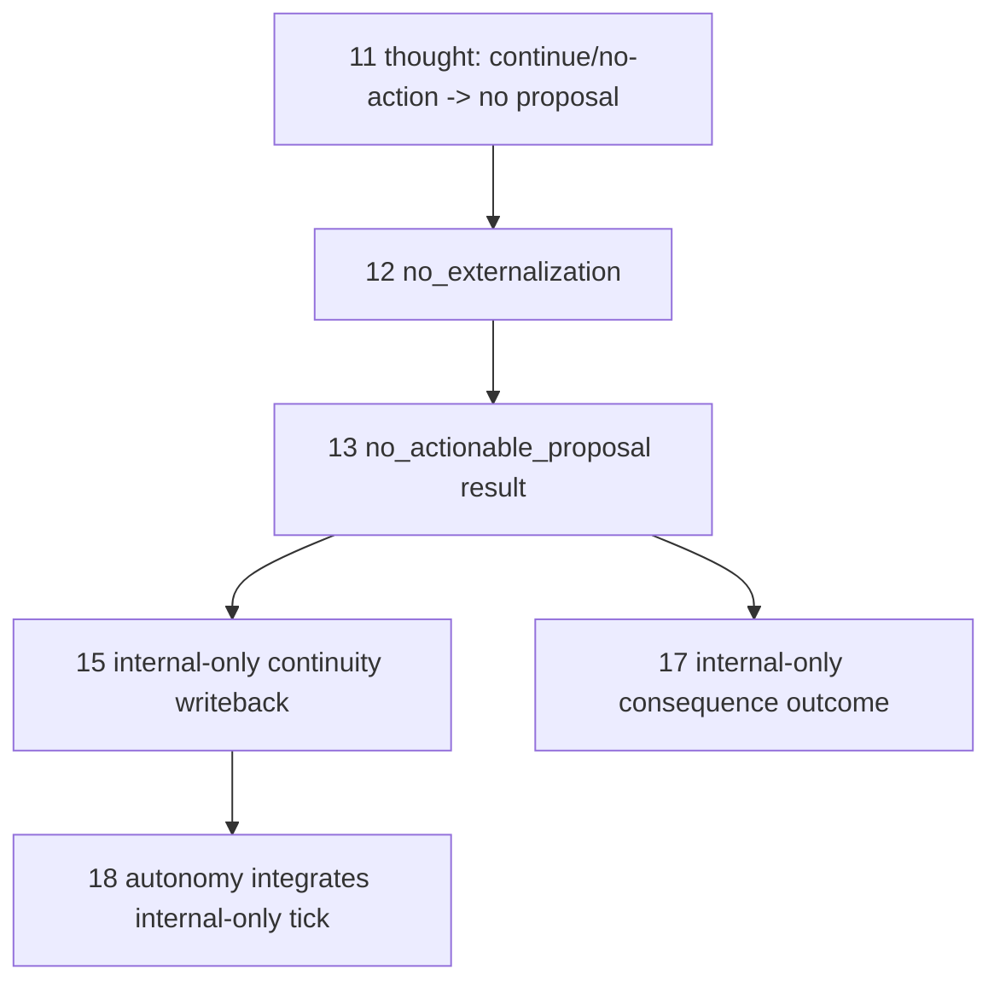

# Requirement 28 - Internal-only tick closure design

## 1. Title

Requirement 28 - Internal-only tick closure (wave_C opener)

## 2. Design Overview

This design lets a fired tick with no normalized action proposal complete through the chain as an explicit internal-only outcome, instead of crashing. It adds an internal-only result to the `13` planner-bridge owner, an internal-only continuity writeback to the `15` owner, autonomy tolerance for an internal-only tick in `18`, and an internal-only consequence label in `17`/`23`. The composition bridges and runtime stage adapters are updated to route the no-proposal case into these owner outcomes; they hold no cognitive policy.

The externalizing path is unchanged. The deterministic offline assembly (`27`'s `deterministic_thought`) always proposes an action, so it never exercises the internal-only path; the LLM-backed path exercises it whenever the model decides to continue or not act.

This design is a skeleton plan authored at `27` close. It is refined before implementation begins.

## 3. Current State and Gap

Current state:

1. `13` `PlannerBridgeError` is raised when the externalization result is not normalized. There is no internal-only bridge status.
2. `15` writeback bridge emits a request only for a world-changed (planner executed) or self-changed (identity applied) outcome. A no-proposal, no-revision tick yields zero writebacks.
3. `18` `ProactiveDriveRequest` requires non-empty planner and writeback provenance ids.
4. `17`/`23` consequence-binding maps statuses but has no explicit internal-only label distinct from `internally_activated_only` derived from a missing action.

Gap: a continue/no-action tick cannot complete.

## 4. Target Architecture

### 4.1 Planner-bridge `no_actionable_proposal` status
Add `no_actionable_proposal` to `BridgeStatus`. A `PlannerBridgeResult` with this status publishes no action decision, no rejection, no consistency failure. The owner produces it when the request indicates no normalized proposal is present. The runtime planner stage builds the request and lets the owner produce the internal-only result rather than skipping the owner.

### 4.2 Experience-writeback internal-only continuity
Add an explicit internal-only continuity outcome (for example an `internal_only` outcome class, or a dedicated `source_outcome_kind="internal_thought_cycle"`). The writeback bridge emits one internal-only continuity request when the planner outcome is `no_actionable_proposal`, carrying provenance to the thought-cycle result and the planner result. This guarantees at least one writeback exists for the tick.

### 4.3 Autonomy tolerance
With an internal-only writeback always present, `source_writeback_result_ids` is non-empty and `source_planner_bridge_result_id` references the real internal-only planner result. The autonomy owner needs no contract relaxation if the internal-only planner result has a real `result_id`; this is the preferred approach (no fabricated ids). The autonomy request bridge forwards the internal-only provenance unchanged.

### 4.4 Evaluation label
`17`/`23` consequence-binding adds an explicit internal-only outcome label distinguishing "the system fired a thought and chose not to act" from "internal activation failed to normalize an action". This becomes a non-failure consequence-binding outcome.

### 4.5 Data flow (no-proposal tick)

## 5. Data Structures

1. `BridgeStatus` gains `no_actionable_proposal`; `PlannerBridgeResult` validation allows it with all-None payloads.
2. Writeback gains an internal-only outcome class/kind (exact shape decided at implementation).
3. No autonomy contract change is the target; confirmed during implementation.
4. Evaluation consequence-binding labels/scores gain an internal-only entry.

## 6. Module Changes

Per section 6 of the requirement. Exact owner-by-owner edits are finalized at implementation start, preserving the externalizing path.

## 7. Migration Plan

1. Additive statuses/outcome classes; externalizing path unchanged.
2. Deterministic offline assembly never hits the internal-only path; LLM-backed path does.
3. Existing tests stay green; new tests cover the internal-only tick end to end.

## 8. Failure Modes and Constraints

1. Internal-only is the explicit absence of an action; never a fabricated action, channel, or decision.
2. Missing/malformed inputs still fail fast through existing owner errors.
3. No outward channel execution authority is added in this slice.
4. No `logging`/`print`; guard test stays green.

## 9. Observability and Logging

Internal-only outcomes travel through formal owner result contracts and the existing `21` timeline. No new logging mechanism.

## 10. Validation Strategy

1. `13` owner test: a no-proposal request yields a `no_actionable_proposal` result with no decision.
2. `15` owner test: an internal-only planner outcome yields an internal-only continuity writeback with provenance.
3. `18` owner test: an internal-only tick integrates without fabricated provenance.
4. `17` test: an internal-only tick is classified as an explicit non-failure consequence outcome.
5. Composition test: the default LLM-backed runtime completes a tick for both an externalizing envelope and a continue/no-action envelope, network-free.
6. Guard + regression: `test_no_adhoc_logging_guard.py` green and `pytest helios_v2/tests -q` green.
