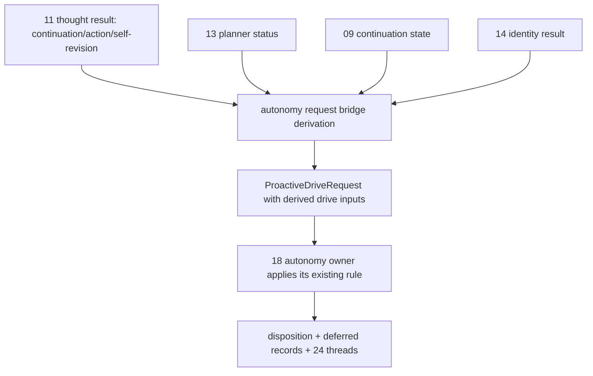

# Requirement 29 - Cognition-derived autonomy drive inputs design

## 1. Title

Requirement 29 - Cognition-derived autonomy drive inputs

## 2. Design Overview

This design replaces the hardcoded drive-input constants in the composition autonomy request bridge (`FirstVersionAutonomyRequestBridge`) with values derived from explicit upstream owner results that the bridge already receives. The autonomy owner engine and its request/result contracts are unchanged: this requirement changes only what the bridge puts into the `ProactiveDriveRequest`, so the proactive disposition becomes a faithful downstream consequence of the thought owner's real decision.

The bridge stays owner-neutral: it translates already-public upstream fields (thought-cycle result, planner-bridge status, continuation state, identity-governance result) into the bounded numeric/boolean drive inputs the autonomy owner expects. It does not select the disposition; the autonomy owner still does that under its existing rule.

The derivation is calibrated against the autonomy engine's existing thresholds so the intended dispositions are actually reachable:

- `proactive_action_requested = outward_drive >= 1.6`, where `outward_drive = continuation_pressure + temporal_pressure + identity_unresolved_pressure`
- `reflective_drive = continuation_pressure + temporal_pressure`, reflect when `>= 0.8`
- `exploratory_drive = retrieval_pull + 0.5*temporal_pressure`, explore when `> reflective_drive and >= 1.0`
- `combined_pressure = continuation_pressure + retrieval_pull + temporal_pressure + identity_unresolved_pressure`, carry-forward deferral when `>= 0.8`

## 3. Current State and Gap

Current state (`FirstVersionAutonomyRequestBridge.build_request`):

```python
continuation_summary={"continuation_pressure": 0.8}
retrieval_pull_summary={"retrieval_pull": retrieval_pull}   # already derived from the bundle
temporal_pressure_summary={"temporal_pressure": 0.7}
identity_unresolved_summary={"identity_unresolved_pressure": 0.6}
outward_readiness_summary={"outward_ready": True, "externalization_blocked": False}
```

With these constants: `outward_drive = 0.8+0.7+0.6 = 2.1 >= 1.6` and `outward_ready=True` always hold, so the autonomy owner takes the `outward_ready and proactive_action_requested -> externalize` branch every tick and clears deferred records, so `24` threads never form.

Available-but-unused upstream results already passed into the bridge:

1. `internal_thought_result.result.continuation_requested: bool`
2. `internal_thought_result.result.action_proposal: ThoughtActionProposalCarrier | None`
3. `internal_thought_result.result.sufficiency_level: float`
4. `internal_thought_result.result.self_revision_proposal: SelfRevisionProposalCarrier | None`
5. `internal_thought_result.result.execution_status: str`
6. `planner_bridge_result.result.status: BridgeStatus` (`executed`, `accepted`, `policy_rejected`, `execution_consistency_failed`, `execution_failed`, `no_actionable_proposal`)
7. `thought_gating_result.continuation_state.active: bool` and `.level: float`
8. `identity_governance_result.result` (revision decision / applied identity state)

No new stage plumbing is required; the bridge already receives all of these.

## 4. Target Architecture

### 4.1 Derivation rules (owner-neutral, deterministic, bounded)

All derived numerics are clamped to `[0.0, 1.0]` (autonomy already treats them as bounded pressures). Constants below are explicit bridge-level derivation constants, documented in code.

Let:
- `thought = internal_thought_result.result`
- `planner_status = planner_bridge_result.result.status`
- `continuation_active = thought_gating_result.continuation_state.active`

1. `continuation_pressure`:
   - base on the thought owner's continuation decision and the runtime continuation carry.
   - `continuation_pressure = 0.8 if (thought.continuation_requested or continuation_active) else 0.2`.
   - Rationale: a cycle the thought owner wants to keep open (or a runtime-carried continuation) raises continuation pressure; a concluded cycle lowers it.

2. `temporal_pressure`:
   - keep a modest fixed baseline `0.3` (temporal pressure is a clock/time-since signal the thought owner does not currently produce; deriving it from real time is out of scope and would be a separate signal). Documented explicitly as a baseline, not a behavioral switch. With the other derived inputs this baseline does not force externalization.
   - Note: `0.3` is chosen so it cannot, by itself, push `outward_drive` over `1.6`.

3. `identity_unresolved_pressure`:
   - `0.6 if thought.self_revision_proposal is not None else 0.2`.
   - Rationale: an unresolved self-revision intent raises identity pressure; otherwise it is low.

4. `retrieval_pull`: unchanged (already derived from the retrieval bundle).

5. outward-readiness pair (the key fix):
   - `has_action = thought.action_proposal is not None`
   - `planner_blocked = planner_status in {"policy_rejected", "execution_consistency_failed", "execution_failed"}`
   - `planner_executed = planner_status in {"executed", "accepted"}`
   - `outward_ready = has_action and planner_executed`
   - `externalization_blocked = has_action and planner_blocked`
   - When `not has_action` (internal-only / continue / no proposal), both are False: the tick is not outward-ready and not blocked, so the autonomy owner cannot take the externalize branch and falls through to reflect/explore/defer.

### 4.2 Resulting dispositions (verified empirically against the autonomy engine)

The dispositions below were confirmed by running the assembled runtime with a deterministic
fake gateway. `retrieval_pull` in the default runtime is `(mid+auto)/4 = 2/4 = 0.5`.

| Thought decision | planner_status | continuation_pressure | temporal | identity | outward_ready | externalization_blocked | resulting disposition |
| --- | --- | --- | --- | --- | --- | --- | --- |
| sufficient + action | executed | 0.9 | 0.4 | 0.4 | True | False | `externalize` (`outward_drive=1.7>=1.6`, outward_ready) |
| action but blocked | policy_rejected | 0.9 | 0.4 | 0.4 | False | True | `defer` + blocked-outward deferred record (`outward_drive=1.7>=1.6`, blocked branch) |
| continue / no-action | no_actionable_proposal | 0.8 | 0.3 | 0.2 | False | False | `reflect` (`reflective_drive=1.1>=0.8`; no deferral) |
| concluded / no-action | no_actionable_proposal | 0.3 | 0.3 | 0.2 | False | False | `defer` + carry-forward deferred record (`reflective_drive=0.6<0.8`, `exploratory_drive=0.65<1.0`, falls to `combined_pressure=1.3>=0.8` -> defer) |

The critical correctness point: before this requirement, the autonomy owner took the
`outward_ready and proactive_action_requested -> externalize` branch every tick (constants
forced it) and cleared all deferred records, so `active_thread_count` was always 0 and the
`24` thread layer could never form. After this requirement, real no-action ticks reach the
defer branch and produce deferred-continuity records, so `24` threads form (active thread
count becomes positive) and accumulate age across repeated deferrals.

Note on reinforcement: the existing `18` continuity-key derivation embeds the originating
result id (which includes the tick id) for some carry reasons, so cross-tick reinforcement
of the same key is partial under the current key scheme. R29 does not change the `18`
key-derivation rule; it only makes deferrals occur on real cognition so threads form at all.
Sharpening cross-tick key stability for stronger reinforcement is left to a later `18`/`24`
refinement and is explicitly out of scope here.

### 4.4 Owner boundary

The bridge computes drive inputs only; the autonomy owner computes the disposition. The mapping is a translation table from cognition outcome to bounded pressure inputs, not a disposition decision. The thought owner gains no authority over autonomy; it only supplies the results the bridge reads.

### 4.5 Data flow



## 5. Data Structures

No contract changes. The `ProactiveDriveRequest` shape is unchanged; only the values the bridge places into `continuation_summary`, `temporal_pressure_summary`, `identity_unresolved_summary`, and `outward_readiness_summary` change. Explicit module-level derivation constants are added to the bridge.

## 6. Module Changes

1. `composition/bridges.py`: rewrite `FirstVersionAutonomyRequestBridge.build_request` to derive the drive inputs from `internal_thought_result`, `planner_bridge_result`, and `thought_gating_result` (and `identity_governance_result` for identity pressure), with documented derivation constants. No new parameters are needed; all results are already passed in.
2. `runtime/stages.py`: no change expected (the autonomy stage already passes every required result to the bridge). Confirmed during implementation.

## 7. Migration Plan

1. Additive at the value level; the autonomy owner and contracts are unchanged.
2. Composition tests that previously assumed always-externalize are updated to assert cognition-derived dispositions (externalize for executed-action ticks, non-externalize for continue/no-action ticks, defer for blocked-action ticks).
3. Owner-level autonomy tests are unchanged (the owner rule is unchanged); optionally a focused test asserts that a blocked-action input set yields a deferral and that repeated continue ticks form a `24` thread.
4. Default rollout: the derivation is always on; it changes the disposition distribution but introduces no new outward behavior (no transport).

### 7.1 Forward-compatibility intent

Grounding autonomy drive in cognition is the prerequisite for meaningful wave_C outward closure (real transport of an externalize decision) and for `24` threads carrying real motive content. Both build on this slice without changing the autonomy owner's rule or contracts.

## 8. Failure Modes and Constraints

1. Missing required upstream result: fail fast through the existing stage/owner errors; never substitute a constant.
2. The derivation is deterministic given the upstream results.
3. Derived numerics are clamped to `[0,1]`; no out-of-range drive input.
4. The bridge never selects the disposition; the autonomy owner does.
5. No outward channel execution authority is added.
6. No `logging`/`print`; the guard test stays green.

## 9. Observability and Logging

No new logging mechanism. Derived inputs travel through the autonomy request contract; the resulting disposition and any deferred records / `24` threads remain visible through the autonomy result and the `17`/`23`/`24` diagnostics. The kernel `21` timeline still records the autonomy stage execution.

## 10. Validation Strategy

1. Composition tests (`test_runtime_composition.py`), all with a deterministic fake gateway:
   - "sufficient + intends_action" envelope -> planner executes -> autonomy disposition `externalize`.
   - "continue / no-action" envelope -> internal-only chain -> autonomy disposition is `reflect` (not `externalize`) and the internal-only closure from `28` still holds.
   - "concluded / no-action" envelope -> internal-only chain -> autonomy disposition `defer` with a deferred-continuity record and a formed `24` thread (`active_thread_count >= 1`), versus the pre-R29 behavior where `active_thread_count` was always 0.
   - across repeated concluded/no-action ticks, the `24` long-horizon thread persists and accumulates age (`max_thread_age` grows), proving the thread layer now runs on real cognition rather than being permanently inert.
2. Autonomy owner tests: unchanged rule; the owner-level thread/decay/merge tests remain valid.
3. Guard + regression: `test_no_adhoc_logging_guard.py` green and `pytest helios_v2/tests -q` green and network-free.
