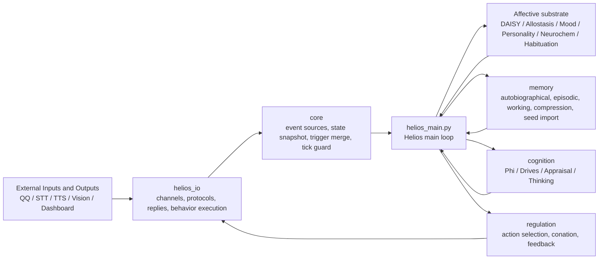

# Helios Detailed Design

> Status: Active
> Audience: maintainers, feature authors, and research-oriented contributors
> Scope: current implementation design, runtime collaboration model, and guiding principles
> Note: this file keeps its historical name, but now serves as the English detailed design companion to the active architecture docs

## 1. Document Role

Helios is not designed as a single-turn chatbot. It is designed as a continuously running agent with affective momentum, memory accumulation, endogenous cognition, and behavioral regulation. After the recent architectural cleanup, the codebase now has stable ownership boundaries:

- the repository root keeps entrypoints and substrate modules
- `helios_io/` owns all external interface concerns
- `core/` is limited to transport-agnostic runtime infrastructure
- `memory/`, `cognition/`, and `regulation/` evolve as internal capability layers

This document explains how those layers cooperate at runtime, which objects move across them, and which constraints should stay stable. For a shorter boundary map, read `ARCHITECTURE.en.md` and `current_structure.md`. For the visual version, open `architecture_overview.html`.

## 2. Design Goals and Non-Goals

### 2.1 Goals

1. Preserve a continuously evolving internal process even when no external messages arrive.
2. Keep affect, memory, cognition, regulation, and execution in a real loop rather than a loose feature stack.
3. Prevent protocols and channels from redefining internal architecture.
4. Make recent migration work explicit: `helios_io` ownership, limb execution bridging, and memory consolidation plus compression.
5. Let future extensions fit into clear module boundaries instead of reopening structural ambiguity.

### 2.2 Non-goals

1. This document is not a function-by-function API reference.
2. It does not replace the foundational research notes.
3. It does not guarantee every implementation detail stays unchanged, but it does define the intended boundaries and control flow.

## 2.3 Where Theories Enter The Runtime

This document is not a literature review, but the runtime design does directly absorb several research traditions:

- the affective substrate stages draw mainly from Panksepp, allostasis, ALMA, and neuromodulator models
- the cognition stages draw mainly from IIT, GNW, predictive processing, FEP, SEC appraisal, and DMN work
- the memory stages draw mainly from multi-store memory, autobiographical continuity, and low-phi consolidation plus compression
- the regulation and execution stages draw mainly from the idea that behavior is one route toward emotional regulation

For module, class, and key-method granularity, continue into `IMPLEMENTATION_REFERENCE.en.md`.

## 3. Layered Architecture Overview

### 3.1 Repository root

The root now contains two kinds of code:

- runtime and deployment surfaces such as `helios_main.py`, `dashboard.py`, `dashboard.html`, and service or shell assets
- foundational affective substrate modules such as `daisy_emotion.py`, `allostasis.py`, `mood_tracker.py`, `personality.py`, `neurochem.py`, and `habituation.py`

It no longer owns protocol clients, channel abstractions, or temporary migration wrappers.

### 3.2 `helios_io/`

`helios_io/` is the single owner of external boundary code. It includes:

- `protocols/qq.py`: protocol client and message model
- `channel.py`: `ChannelMessage`, input channels, output channels
- `channel_gateway.py`: channel registration, polling, evaluation, and outbound routing
- `channels/`: concrete QQ, STT, TTS, and vision adapters
- `response_pipeline.py`: passive reply decision and exchange recording
- `llm_sec_evaluator.py`: LLM-based SEC evaluation
- `icri_temperature.py`: mapping from internal consciousness intensity to LLM temperature and style
- `limb.py` and `limb_decision_bridge.py`: execution queue and bridge from regulation output to external action execution

The practical rule is simple: if a module receives, sends, adapts, routes, serializes, or executes across an external boundary, it belongs in `helios_io/`.

### 3.3 `core/`

`core/` is intentionally narrow and infrastructure-focused:

- `event_source.py`
- `helios_state.py`
- `tick_guard.py`
- `trigger_merge.py`
- `separation_source.py`
- `drive_source.py`

`core` may still re-export some symbols for compatibility, but ownership remains in the actual implementation modules.

### 3.4 Internal capability layers

- `memory/`: autobiographical recording, working memory, episodic memory, semantic accumulation, seed import, consolidation, compression
- `cognition/`: phi or ICRI, cognitive impact, drives, appraisal, endogenous thinking
- `regulation/`: action pressure, conation, behavior scoring, outcome feedback

## 4. Runtime Assembly

`Helios` performs one stable runtime assembly pass during initialization:

1. Build the affective substrate: DAISY, allostasis, mood, personality.
2. Build persistence, stability monitoring, autobiographical storage, `MemoryCompressor`, `SeedMemoryImporter`, and `MemorySystem`.
3. Conditionally attach `NeurochemState` and `UnifiedPhi`.
4. Build `RegulationEngine`, `DriveOracle`, `ThinkingManager`, and `ThinkingEngineIntegration`.
5. Start the QQ client when configured and wire it into channel handling.
6. Register pluggable `EventSource` instances, including separation and channel-driven sources.
7. Build passive reply, SEC evaluation, behavior execution, and limb bridging.

The crucial design point is that `Helios` owns orchestration, not feature ownership. Each subsystem keeps its own implementation boundary while the main loop determines execution order.

## 5. Tick Lifecycle Design

`Helios._tick_once()` is the authoritative runtime sequence. Each tick creates a fresh `HeliosState` and progressively populates it.

### 5.1 Stage 0: state snapshot initialization

At the start of the tick, `HeliosState` is seeded with:

- tick id and timestamp
- separation duration
- current mood and allostatic status
- personality traits
- latest drive dominant and urgency
- TTS, STT, and vision availability flags
- RSS and uptime metrics
- current neurochemical values when the module is enabled

This ensures that downstream modules cooperate around one shared state object instead of reading each other through implicit side channels.

### 5.2 Stage 1: event collection and trigger merge

`_collect_events()` polls all registered `EventSource` instances and returns:

- `merged_triggers`: a Panksepp trigger vector for affective processing
- `messages`: pending inbound messages gathered from channels or other sources

Overlapping triggers are merged with max-value semantics instead of raw addition, keeping multiple sources from artificially over-amplifying the same system.

### 5.3 Stage 2: habituation

Each trigger is discounted by a novelty factor produced by the habituation tracker. Repeated stimuli weaken over time, while sufficiently strong events are registered as fresh exposures for future novelty decay.

Theory anchor: this stage shapes the repeated-exposure side of the loop and prepares the input surface later consumed by DAISY chronometry and opponent dynamics.

### 5.4 Stage 3: DAISY affective cycle

The affective substrate consumes triggers and optional neurochemical context to produce:

- seven-system activation
- valence and arousal
- dominant system

The main loop then syncs mood and allostatic information back into `HeliosState`. This stage forms the emotional base that later cognition and regulation depend on.

Theory anchor: this stage combines Panksepp primary affect systems, Russell valence-arousal framing, Davidson affective chronometry, Kuppens emotional inertia, and allostatic load regulation.

### 5.5 Stage 4: ICRI or Phi aggregation

When `UnifiedPhi` is available, the loop feeds it with message impact, sensory signal, emotional activation, self-model information, and thinking mode. The aggregate result updates:

- `state.icri`
- `state.consciousness_label`
- `state.llm_temperature`
- `state.speech_style`

This is the main bridge from internal process intensity to outward language style.

Theory anchor: IIT, global neuronal workspace, and predictive processing are gathered here into one runtime aggregation surface instead of being split across separate scoring systems.

### 5.6 Stage 5: neurochemistry and personality drift

If neurochemical simulation is enabled, `NeurochemState.tick()` runs and updates dopamine, opioids, oxytocin, and cortisol in the state snapshot. Personality then adapts from the dominant affective signal and its intensity. Personality is therefore modeled as a slow-running drift inside the tick loop rather than a separate subsystem clock.

Theory anchor: this stage combines a fast neuromodulatory background with a much slower Big Five style trait layer, keeping short-term and long-term modulation on the same runtime axis.

### 5.7 Stage 6: drive estimation and endogenous thinking

`DriveOracle` consumes the current `HeliosSnapshot` and optional neurochemical context to compute drive dominance and urgency. Then `ThinkingEngineIntegration` may generate an endogenous thought. If a thought is produced and phi is enabled, that thought feeds back into the phi engine so that internal thought activity can reshape consciousness intensity and outward style.

This creates an explicit loop: affect and environment shape drives, drives influence thought pressure, and thinking feeds back into ICRI.

Theory anchor: `DriveOracle` operationalizes a free-energy-style deficit narrative, while `ThinkingEngineIntegration` feeds DMN or replay-like activity back into consciousness intensity.

### 5.8 Stage 7: memory writes

The current implementation writes memory along three main paths:

1. autobiographical recording every ten ticks when thresholds are met
2. episodic recording for significant events when `icri > 0.3` or $|valence| > 0.5$
3. working-memory retention of inbound messages plus SEC analysis for immediate conversational context

In addition, startup seed material is imported by `SeedMemoryImporter`, and older autobiographical traces are summarized later by `MemoryCompressor` after consolidation work.

Theory anchor: the implementation follows a multi-store memory compromise where salient events and internal thoughts are selectively retained rather than treating memory as a flat log.

### 5.9 Stage 8: passive reply pipeline

When inbound messages exist, the passive reply pipeline performs the following steps per message:

1. retrieve recent conversation history for that user
2. evaluate the message through `LLMSECEvaluator`
3. place the message and SEC result into working memory
4. decide whether the system should reply
5. generate a reply using the current LLM temperature if needed
6. route the outbound message through `ChannelGateway.route_outbound()`
7. record the exchange in conversation history regardless of reply outcome

This is deliberately an I/O boundary workflow rather than a responsibility of the affective or cognitive substrate.

Theory anchor: appraisal variables concretely enter interaction gating here, while ICRI continues forward as a modulation signal for generation temperature and style.

### 5.10 Stage 9: regulation and behavior execution

`RegulationEngine.tick()` consumes current affect, valence, time-of-day, and drive status, then returns an action label. If an action is chosen:

1. the loop stores it in `state.last_action`
2. `LimbDecisionBridge` converts the regulation score into execution priority
3. `BehaviorExecutor` enqueues the command
4. `_drain_behavior_executor()` invokes `_handle_action()`
5. `_handle_action()` either generates outward speech and sends it, or resolves internal-intent actions such as browse, search, learn, or reflect
6. the result flows back into both the executor and `regulation.on_behavior_result()`

This is one of the most important recent refactors: regulation decides what to do, while I/O and execution decide how the action is carried out.

Theory anchor: this stage turns the hypothesis “behavior is a regulation tool” into a feedback-bearing runtime chain rather than a static emotion-to-action lookup table.

### 5.11 Stage 10: maintenance tasks

The tail of the tick handles maintenance work:

- RSS stability checks
- scheduled consolidation after sustained low phi
- pressure-triggered consolidation when memory size crosses thresholds
- periodic persistence

These tasks intentionally sit after the main affect-cognition-regulation path so they do not interfere with the core moment-to-moment loop.

Theory anchor: sustained low-phi windows are treated as better opportunities for consolidation and later compression.

## 6. Core Object Model

### 6.1 `HeliosState`

`HeliosState` is the per-tick single source of truth. It aggregates affect, ICRI, LLM modulation, thinking state, mood, neurochemistry, allostasis, personality, drives, behavior, hardware availability, and stability metrics.

Design constraints:

1. shared tick-scoped data should enter `HeliosState` first
2. `phi` remains only as a compatibility alias for `icri`
3. fields such as `pending_reply` and `last_action` describe current tick outcome, not durable history

### 6.2 `ChannelMessage`

`ChannelMessage` is the standard external-boundary transport object. It carries `channel_id`, `user_id`, `text`, `timestamp`, `metadata`, and `direction`, allowing the rest of the system to work against one message shape rather than protocol-specific message classes.

### 6.3 `CognitiveImpactProfile`

`CognitiveImpactProfile` normalizes sensory, cognitive, self-related, and novelty dimensions into one structure that can be reused by phi aggregation and higher-level reasoning. It becomes increasingly important as more multimodal channels join the system.

### 6.4 Behavior commands

Regulation outputs action labels, while the execution layer manages prioritized commands with queue semantics and runtime lifecycle. `LimbDecisionBridge` exists specifically to keep these two levels decoupled.

## 7. Subsystem Design

### 7.1 Affective substrate

The affective substrate is not one module but a coordinated set of timescales:

- DAISY: immediate affective reaction
- Habituation: repeated-stimulus attenuation
- Allostasis: load and deviation accumulation
- Mood: short- to mid-range smoothing of affective state
- Personality: long-range trait drift
- Neurochemistry: modulatory background state

### 7.2 Memory layer

The memory layer exists to preserve narrative continuity rather than act as a log sink. The current structure includes:

- `AutobiographicalStore`
- `MemorySystem`
- `SeedMemoryImporter`
- `MemoryCompressor`

Consolidation and compression are intentionally separate phases: first extract and reorganize memory under low-phi or pressure conditions, then compress older autobiographical traces into summaries.

### 7.3 Cognition layer

The cognition layer translates raw internal numbers into interpretable internal meaning. Its key components are:

- `UnifiedPhi`
- `DriveOracle`
- `ThinkingManager` and `ThinkingEngineIntegration`
- `Appraisal` and `CognitiveImpactProfile`

It does not own transport behavior. Its outputs return to the main loop as state, scores, or intermediate objects.

### 7.4 Regulation layer

The regulation layer transforms affect and drives into action pressure, records outcome feedback, and adjusts future behavior selection. It does not own protocol sending, speech transport, or channel connection logic.

### 7.5 I/O boundary

The I/O rule is intentionally strict: if code receives, sends, adapts, routes, serializes, or generates content across an external boundary, it belongs in `helios_io/`.

### 7.6 Dashboard

`dashboard.py` and `dashboard.html` are runtime observability surfaces. They expose Panksepp activation, ICRI, neurochemistry, allostasis, and personality evolution, but they do not define internal structure or behavior policy.

## 8. Extension Rules and Invariants

### 8.1 Ownership rules

1. New protocol implementations go under `helios_io/protocols/`.
2. New channel adapters go under `helios_io/channels/`.
3. New model-backed external generation belongs under `helios_io/llm/`.
4. New runtime infrastructure belongs under `core/` only when it remains transport-agnostic.
5. New internal psychological capabilities belong under `memory/`, `cognition/`, `regulation/`, or a future equivalent internal package.

### 8.2 Runtime invariants

1. Every tick creates a new `HeliosState` and fills it in a stable order.
2. `ChannelGateway` owns channel intake and outbound routing, not high-level behavior choice.
3. Regulation chooses actions; execution and I/O carry them out.
4. Consolidation and pressure handling remain tail-phase maintenance logic rather than early-tick affective logic.
5. Compatibility exports do not redefine implementation ownership.

### 8.3 Failure-handling strategy

- `EventSource` polling failure degrades at the source level rather than crashing the entire tick
- outbound send failure is logged at message level without rolling back internal state
- `TickGuard` safe mode may skip non-essential modules to preserve loop survival

## 9. Tests and Verification Mapping

The following tests guard the main architectural invariants:

| Test | Main invariant |
| --- | --- |
| `tests/test_lifecycle_integration.py` | lifecycle orchestration and subsystem cooperation |
| `tests/test_helios_state_pipeline_pbt.py` | `HeliosState` consistency through the pipeline |
| `tests/test_channel_gateway.py` | channel registration, polling, normalization, outbound routing |
| `tests/test_memory_compression.py` / `tests/test_memory_compression_pbt.py` | autobiographical compression thresholds and summary replacement |
| `tests/test_memory_in_llm_context.py` | memory context entering LLM response generation |
| `tests/test_drive_integration.py` / `tests/test_drive_regulation_scoring.py` | drive and regulation coupling |
| `tests/test_icri_temperature_pbt.py` | ICRI to temperature and style mapping |
| `tests/test_consolidation_scheduling.py` | low-phi and pressure-triggered consolidation scheduling |
| `tests/test_import_compatibility.py` | import-surface compatibility after migration |

These tests do not replace documentation, but they make key design claims executable.

## 10. Principle Summary

### 10.1 Helios is a process, not a function

The main loop approximates a continuous inner process rather than a request handler.

### 10.2 Ownership over convenience

Module placement follows responsibility ownership, not short-term import convenience.

### 10.3 Code is authoritative, docs explain intent

Code defines the facts; documentation explains boundaries, rationale, and evolution direction.

### 10.4 Prefer removal over indefinite compatibility

Compatibility layers are migration tools, not permanent structure.

### 10.5 Keep `core` boring and the root legible

`core` should stay narrow and stable, while the repository root should remain readable as entrypoints plus substrate.

## 11. Evolution Direction

1. The remaining root substrate modules may eventually move into a dedicated package if readability is preserved.
2. `helios_io/` can adopt a clearer provider or plugin assembly model.
3. Behavior execution results may evolve into a richer structured model than action string plus success flag.
4. Consolidation thresholds may be lifted into explicit configuration rather than remaining inlined in the main loop.
5. If broader external sharing is needed, a concise English summary page may complement this file and the HTML architecture view.

## 12. Companion Visualization

The HTML architecture and flow view lives in `architecture_overview.html`. It provides a static visual map of layer ownership, tick lifecycle, and key object flow, and complements the runtime dashboard rather than replacing it.