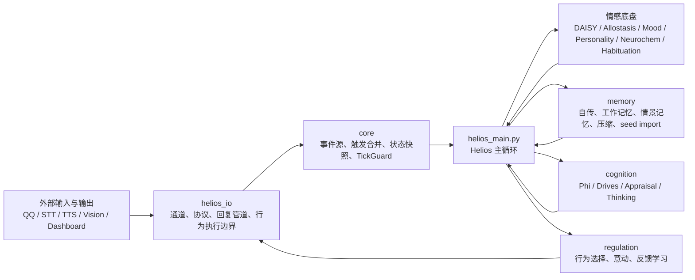

# Helios 新版详细设计

> Status: Active
> Audience: 架构维护者、功能扩展者、研究型开发者
> Scope: 当前实现的详细设计、运行时协作关系与设计原则
> Note: 本文件沿用既有文件名，但内容已从“设计思想”升级为“详细设计说明 + 原则说明”

## 1. 文档定位

Helios 的目标不是拼装一个围绕单轮消息收发运作的机器人，而是维持一个持续运行、具备情感动力、记忆沉积、认知解释与行为调节能力的代理。新版架构调整完成后，当前代码库已经形成稳定的拥有权边界：

- 根目录保留入口与情感底盘
- `helios_io/` 统一承接所有外部接口与通道适配
- `core/` 只保留传输无关的运行基础设施
- `memory/`、`cognition/`、`regulation/` 作为内部能力层独立演化

本文件的职责是把这些边界、主循环阶段、关键对象流和扩展约束说明清楚。若只需要分层速查，优先看 `ARCHITECTURE.zh-CN.md` 与 `current_structure.md`；若需要完整设计解释，则以本文件为主。

## 2. 设计目标与非目标

### 2.1 设计目标

1. 让代理在无外部输入时仍可保持内部状态演化。
2. 让情感、记忆、认知、调节和执行形成闭环，而不是松散拼接。
3. 让外部协议与内部心理模型解耦，避免 I/O 反向定义核心结构。
4. 让最近完成的 I/O 迁移、行为执行桥和记忆压缩流程有清晰、可验证的所有权说明。
5. 让未来扩展新通道、新评估器或新内部能力时，不必重新打破既有分层。

### 2.2 非目标

1. 本文件不是逐函数 API 手册。
2. 本文件不替代理论研究文档，不负责论证全部认知科学来源。
3. 本文件不承诺所有实现细节长期不变，但要求边界与主流程保持一致。

## 2.3 理论落点说明

本文件不是论文综述，但当前运行设计确实直接吸收了若干研究传统：

- 情感底盘阶段主要承接 Panksepp、Allostasis、ALMA、神经调质模型。
- 认知阶段主要承接 IIT、GNW、Predictive Processing、FEP、SEC appraisal 与 DMN。
- 记忆阶段主要承接多存储记忆、自传连续性、低 Phi 巩固与压缩。
- 调节与执行阶段主要承接“行为是情感调节手段”的组织逻辑。

如果需要看到模块、类和关键函数级别的引用对应关系，请继续阅读 `IMPLEMENTATION_REFERENCE.zh-CN.md`。

## 3. 分层架构总览

### 3.1 仓库根目录

根目录只保留两类内容：

- 运行入口与部署资产：`helios_main.py`、`dashboard.py`、`dashboard.html`、service/shell/logrotate 文件
- 情感与生理底盘：`daisy_emotion.py`、`allostasis.py`、`mood_tracker.py`、`personality.py`、`neurochem.py`、`habituation.py`

这意味着根目录不再拥有协议客户端、通道抽象、语音生成器或迁移兼容包装层。

### 3.2 `helios_io/`

`helios_io/` 是系统与外界接触的唯一正式边界，负责接收、发送、适配、路由以及把内部意图落实为外部动作。关键组成包括：

- `protocols/qq.py`: 协议客户端与消息模型
- `channel.py`: `ChannelMessage`、输入通道、输出通道抽象
- `channel_gateway.py`: 通道注册、消息轮询、评估器接入、outbound 路由
- `channels/`: QQ、TTS、STT、Vision 等具体通道适配器
- `response_pipeline.py`: 被动回复决策与上下文记录
- `llm_sec_evaluator.py`: 基于 LLM 的 SEC 评估
- `icri_temperature.py`: ICRI 到 LLM 温度与风格映射
- `limb.py`、`limb_decision_bridge.py`: 行为执行队列与调节层到执行层的桥接

### 3.3 `core/`

`core/` 仅承载运行基础设施，不拥有具体传输实现：

- `event_source.py`: 统一事件源抽象
- `helios_state.py`: 每个 tick 的共享状态快照
- `tick_guard.py`: tick 级异常保护与 safe mode
- `trigger_merge.py`: 触发合并逻辑
- `separation_source.py`、`drive_source.py`: 内部事件源

`core` 的原则是“稳定但无聊”。它应当足够薄，使得主循环可以依赖它，但业务能力不反向堆积进来。

### 3.4 内部能力层

- `memory/`: 负责自传记录、工作记忆、情景记忆、语义记忆、巩固与压缩
- `cognition/`: 负责 ICRI/Phi、驱动估计、认知影响整合与内生思维
- `regulation/`: 负责基于情感与驱动的行动选择、行为反馈回写与调节策略

## 4. 运行时装配

`Helios` 在初始化时完成一次固定装配，形成后续所有 tick 都依赖的运行图：

1. 初始化情感底盘：DAISY、Allostasis、Mood、Personality。
2. 装配持久化、稳定性监控、自传记忆、MemoryCompressor、SeedMemoryImporter、MemorySystem。
3. 按可用性装配 NeurochemState 与 UnifiedPhi。
4. 装配 RegulationEngine、DriveOracle、ThinkingManager、ThinkingEngineIntegration。
5. 根据环境配置启动 QQ 协议客户端，并将其事件接入 `ChannelGateway`。
6. 注册 EventSource，包括分离焦虑源、内部驱动源和通道网关。
7. 装配被动回复管道、SEC 评估器、行为执行器与 limb bridge。

这里最重要的设计点是：`Helios` 作为编排者拥有对象引用，但能力实现分别归属于各自包；主循环负责时序，模块负责计算。

## 5. Tick 生命周期设计

`Helios._tick_once()` 是当前系统的权威运行时顺序定义。每个 tick 都创建一个新的 `HeliosState`，再沿着固定阶段逐步填充。

下图先给出“一个 tick 内部的数据闭环细化版”。它刻意按当前实现的真实顺序组织：先统一入站，再做情感与认知更新，然后分叉到被动回复与主动行为，最后才进入维护性任务。

单独查看图：`research/diagrams/tick_runtime_flow.zh-CN.md`

读这张图时有三个实现约束需要明确：

1. `HeliosState` 是每个 tick 新建的快照，不是跨 tick 共享的长期状态对象。
2. `_collect_events()` 的结果天然分成两股流：给 DAISY 的 `merged_triggers`，以及给回复逻辑使用的 `pending_messages`。
3. 被动回复和主动行为是两条不同的决策路径，但它们最终共用 `ChannelGateway.route_outbound()` 作为正式出站口。

### 5.1 阶段 0: 快照初始化

tick 开始时先建立 `HeliosState`，预填入：

- tick 序号与 timestamp
- 当前 separation hours
- mood、allostatic load、fatigue 状态
- personality traits
- 最近 drive dominant / urgency
- TTS、STT、Vision 可用性
- RSS 和 uptime 等稳定性指标
- 如果启用 neurochem，则同步当前 dopamine、opioids、oxytocin、cortisol

这一设计保证后续所有模块都围绕同一个状态对象协作，而不是各自读写零散字段。

### 5.2 阶段 1: 事件采集与触发合并

`_collect_events()` 轮询所有已注册 `EventSource`，生成两类结果：

- `merged_triggers`: 面向 DAISY 的 Panksepp 触发向量
- `messages`: 来自通道或其他事件源的待处理消息列表

合并策略采用逐 key 的 max-value 语义，确保多个来源同时刺激同一系统时，不被简单相加放大到不合理水平。若收到外部消息，还会同步刷新主人最后接触时间，并驱动分离焦虑状态回落。

### 5.3 阶段 2: 习惯化

对事件触发做 habituation 修正：重复刺激的强度会乘以 novelty factor，降低长期重复输入对情感系统的影响。高于阈值的刺激会被登记曝光次数，作为未来 novelty 衰减依据。

理论落点：这里对应重复刺激衰减与对向过程的前置条件，为 DAISY 的 opponent-process 和慢变量调节提供输入整形。

### 5.4 阶段 3: DAISY 情感引擎

情感底盘以触发向量和可选神经化学状态为输入，生成：

- 7 系统激活度
- valence / arousal
- dominant system

随后主循环把 MoodTracker 和 AllostaticRegulator 的最新结果同步回 `HeliosState`。这一步是整个系统的“情感地基”，后续 Phi、驱动和调节都以其产出为起点。

理论落点：该阶段综合了 Panksepp 7 系统、Russell 二维效价-唤醒空间、Davidson 时序动力学、Kuppens emotional inertia 与 Allostasis 负荷调节。

### 5.5 阶段 4: ICRI / Phi 意识度量

如果启用了 `UnifiedPhi`，主循环会将消息认知影响、感官输入、情感激活、自我模型和思维状态依次喂入 phi engine，再聚合出 `icri`。随后使用 `ICRITemperatureMapper` 生成：

- `state.icri`
- `state.consciousness_label`
- `state.llm_temperature`
- `state.speech_style`

这一步把内部状态直接映射到 LLM 输出风格，是“认知状态影响外部表达”的主要接口之一。

理论落点：IIT、Global Neuronal Workspace 与 Predictive Processing 在这里被收束为统一聚合接口，而不是分散在独立子系统里各自为政。

### 5.6 阶段 5: 神经化学与人格进化

如果 `NeurochemState` 可用，则执行一次 `tick()`，并将四种主要调质同步到 `HeliosState`。随后依据 dominant affect 和当前强度驱动人格微调。人格不是单独一条异步流程，而是每个 tick 的缓慢长期漂移。

理论落点：这一阶段把 neuromodulator 背景、Big Five trait layer 与原始情感系统耦合在同一时间轴上，体现“快反应 + 慢塑形”的双时间尺度。

### 5.7 阶段 6: 驱动估计与内生思维

`DriveOracle` 读取当前 `HeliosSnapshot` 与神经化学背景，生成 drive dominant 与 urgency。接着 `ThinkingEngineIntegration` 决定是否产生内生思维；如果生成 thought 且启用了 Phi，引擎会再次把 DMN thinking 信号反馈进 ICRI 聚合，从而让“想了什么”影响“此刻多清醒”。

这里体现的是一个闭环：情感和环境影响驱动，驱动又影响内生思维倾向，而思维反过来调制意识强度与表达风格。

理论落点：DriveOracle 的五维缺口实现自由能最小化叙事，ThinkingEngineIntegration 则把 DMN / replay / emotion-biased thought 接回 ICRI。

### 5.8 阶段 7: 记忆写入

当前实现存在三条主要记忆路径：

1. 每 10 tick 且达到阈值时写入自传记忆。
2. 当 `icri > 0.3` 或 `$|valence| > 0.5$` 时，把重要事件写入情景记忆。
3. 在收到消息时，把消息与 SEC 结果写入工作记忆，以支持即时回复与上下文承接。

此外，启动时还会通过 `SeedMemoryImporter` 将种子记忆导入自传存储，长期运行中则由 `MemoryCompressor` 在巩固后处理老旧记忆摘要化。

理论落点：这里采用的是多存储记忆与“高显著性事件优先沉淀”的折中实现，而不是单一日志式记录。

### 5.9 阶段 8: 被动回复管道

当 tick 中存在入站消息时，`ResponsePipeline` 会为每条消息执行：

1. 拉取该用户最近会话历史
2. 使用 `LLMSECEvaluator` 生成 SEC 特征
3. 将消息和评估结果压入工作记忆
4. 判断是否应该回复
5. 如果应回复，则按当前 `llm_temperature` 生成文本
6. 通过 `ChannelGateway.route_outbound()` 发回相应通道
7. 无论是否回复，都把交换记录写入 conversation history

这一流程故意放在显式的 I/O 边界层与主循环之间，而不是塞回情感底盘或认知模块内部。

理论落点：SEC appraisal 结果在这里真正进入交互行为门控，ICRI 则继续作为语言温度和风格的调制参数。

### 5.10 阶段 9: 调节决策与行为执行

`RegulationEngine.tick()` 接收当前 Panksepp 激活、valence、小时信息以及 drive dominant / urgency，输出动作类型。若有动作：

1. 主循环记录 `state.last_action`
2. `LimbDecisionBridge` 依据 regulation score 转换为执行优先级
3. `BehaviorExecutor` 入队行为命令
4. `_drain_behavior_executor()` 取出当前行为并调用 `_handle_action()`
5. `_handle_action()` 对 `speak_*` 类动作执行文本生成与 outbound 发送，对 browse/search/learn/reflect 等动作返回意图级成功
6. 执行结果回流到 `BehaviorExecutor.complete_current()` 和 `regulation.on_behavior_result()`

这条链路是近期重构的关键成果：调节层只负责选择动作，不直接拥有通道或协议实现。

理论落点：该阶段把“行为是调节手段”的假设落实为可学习、可反馈、可执行的链路，而不是静态情感到动作映射表。

### 5.11 阶段 10: 维护任务

tick 尾部执行若干维护性流程：

- RSS 内存阈值检查
- 低 Phi 连续区间触发的 scheduled consolidation
- 总记忆项超过阈值时触发 memory pressure consolidation
- 每 600 tick 执行一次持久化

主循环中的维护逻辑被放在末尾，避免干扰每个 tick 的核心感知-认知-调节闭环。

理论落点：低 Phi 区段触发 consolidation 与 compression，表示静息窗口被视作更适合记忆重组的阶段。

### 5.12 Tick 入站与出站时序图

下面这张时序图把前面的闭环再细化到“对象如何进入、怎样被变形、最终怎样出站”。它对齐当前实现中的三个关键事实：入站先被标准化为 `ChannelMessage`，消息在 gateway 内被拆成 trigger 流和 message 流，出站则分别来自被动回复路径和主动行为路径。

单独查看图：`research/diagrams/tick_ingress_egress_sequence.zh-CN.md`

这张时序图不把所有实现细节都展开到最底层，而是突出三个阅读重点：

1. 外部输入在 tick 之前就可能异步到达，但真正进入主闭环是在 tick 内通过 `poll()` 完成。
2. 被动回复在消息存在时才运行，主动行为则由调节层决定，两者并不是互相覆盖的同一路径。
3. 当前代码里真正稳定的出站主路径仍是 QQ；TTS 通道已经注册为能力层，但并未成为主循环默认文本输出终点。

## 6. 关键对象模型

### 6.1 `HeliosState`

`HeliosState` 是每个 tick 的单一事实源。它聚合 affect、ICRI、LLM 调制参数、thinking 状态、mood、neurochem、allostasis、personality、drives、behavior、硬件可用性和稳定性指标。设计约束如下：

1. tick 级共享信息优先进入 `HeliosState`，避免跨模块隐式读取对方私有字段。
2. `phi` 只保留为 `icri` 的兼容别名，新代码应以 `icri` 为主。
3. `pending_reply`、`last_action` 等字段只表达当前 tick 的运行结果，不作为长期状态容器。

### 6.2 `ChannelMessage`

`ChannelMessage` 是 `helios_io` 的基本传输对象，统一承载 `channel_id`、`user_id`、`text`、`timestamp`、`metadata` 与 `direction`。其设计意义在于：主循环和调节层不需要知道具体协议类型，只需围绕统一消息对象工作。

### 6.3 `CognitiveImpactProfile`

认知影响对象将感官、自我、认知与新颖性等维度聚合为标准化结构，供 phi engine 与上层推理复用。它在多模态通道接入后尤其重要，因为不同通道需要把影响投影到统一语义面。

### 6.4 行为命令

调节层产出的是动作字符串，执行层维护的是具有优先级、参数和生命周期的行为命令。两者之间通过 `LimbDecisionBridge` 解耦，避免 regulation 直接依赖执行器内部队列结构。

## 7. 子系统详细设计

### 7.1 情感底盘

情感底盘由 DAISY、Allostasis、Mood、Personality、Neurochem、Habituation 共同组成。它们的职责不是并列重复，而是各自负责不同时间尺度：

- DAISY: tick 级即时情感反应
- Habituation: 重复刺激衰减
- Allostasis: 偏离与负荷累积
- Mood: 中短期情感平滑结果
- Personality: 长期 trait 漂移
- Neurochem: 调质背景与调制信号

### 7.2 记忆层

记忆层的设计目标是保持“连续自我”，而不是简单日志化。当前结构分成：

- `AutobiographicalStore`: 叙事性长期经历记录
- `MemorySystem`: 工作记忆、情景记忆、语义事实和统计接口
- `SeedMemoryImporter`: 启动期种子记忆导入
- `MemoryCompressor`: 老旧自传条目的摘要压缩

当前实现中，巩固与压缩是分阶段发生的：先根据低 Phi 或内存压力触发 consolidation，再执行 post-consolidation compression 和相关收口任务。

### 7.3 认知层

认知层负责把当前状态从“情感数值”提升为“系统如何理解自己和环境”。其主要组成是：

- `UnifiedPhi`: ICRI / consciousness label
- `DriveOracle`: 内驱 dominant 与 urgency
- `ThinkingManager` 与 `ThinkingEngineIntegration`: 内生思维与 DMN 回放
- `Appraisal` 与 `CognitiveImpactProfile`: 事件解释与影响结构化

认知层不拥有外部协议，因此其输出总是以内部状态或中间对象的形式回流主循环，而不是直接发消息。

### 7.4 调节层

调节层负责把 affect 和 drives 组织为行为倾向，并通过反馈学习修正后续选择。它不负责文本生成、协议投递或通道连接。这样做的结果是：

- 动作选择逻辑可以独立演化
- 执行失败不会污染调节模块的通道实现
- 同一动作可以未来映射到不同输出载体

### 7.5 I/O 边界

I/O 层的判断标准很简单：凡是负责接收、发送、适配、路由、编码、协议交互或内容跨边界生成的模块，都属于 `helios_io/`。如果一个新模块更像“世界接口”，就不应塞回根目录或 `core/`。

### 7.6 Dashboard

`dashboard.py` 与 `dashboard.html` 不参与主代理的决策闭环，它们属于运行期可视化面，用来观测 Panksepp、ICRI、神经化学、异稳态和人格演化。这一层可以读取状态，但不定义内部结构。

## 8. 扩展规则与不变量

### 8.1 模块归属规则

1. 新协议实现放在 `helios_io/protocols/`。
2. 新通道适配器放在 `helios_io/channels/`。
3. 新模型驱动外部生成组件放在 `helios_io/llm/`。
4. 新的运行基础设施放在 `core/`，但必须保持传输无关。
5. 新的内部心理能力分别落在 `memory/`、`cognition/`、`regulation/` 或未来等价子包。

### 8.2 运行时不变量

1. 每个 tick 都创建新的 `HeliosState` 并按固定顺序填充。
2. `ChannelGateway` 只负责通道接入与消息归一化，不负责高层行为决策。
3. 调节层输出动作，执行层负责落地与反馈。
4. 低 Phi 与内存压力触发的巩固必须位于主循环维护阶段，不能随意插入情感计算前半段。
5. 兼容导出不代表实现所有权；代码定位应以实际实现文件为准。

### 8.3 失败处理策略

- EventSource 轮询失败按 source 维度降级，不中断整个 tick
- 通道发送失败按消息级记录 warning，不回滚内部状态
- TickGuard safe mode 会在必要时跳过非关键模块，优先保证主循环存活

## 9. 测试与验证映射

以下测试文件是当前架构不变量的主要验证面：

| 测试 | 验证重点 |
| --- | --- |
| `tests/test_lifecycle_integration.py` | 主循环生命周期与子系统协作 |
| `tests/test_helios_state_pipeline_pbt.py` | `HeliosState` 在流水线中的状态一致性 |
| `tests/test_channel_gateway.py` | 通道注册、轮询、outbound 路由与归一化 |
| `tests/test_memory_compression.py` / `tests/test_memory_compression_pbt.py` | 自传压缩阈值与摘要替换 |
| `tests/test_memory_in_llm_context.py` | 记忆上下文进入 LLM 回复链路 |
| `tests/test_drive_integration.py` / `tests/test_drive_regulation_scoring.py` | drive 与 regulation 的协同 |
| `tests/test_icri_temperature_pbt.py` | ICRI 到温度与风格映射 |
| `tests/test_consolidation_scheduling.py` | 低 Phi 和压力触发的记忆巩固调度 |
| `tests/test_import_compatibility.py` | 迁移后导入表面与兼容边界 |

这些测试并不替代文档，但它们决定了文档中的哪些说法可以被持续验证。

## 10. 设计原则摘要

### 10.1 Helios 是持续体，不是函数

主循环近似的是生命过程，而不是单次请求处理器。没有输入时，内部也仍在发生变化。

### 10.2 Ownership over convenience

模块放置以职责归属为准，不以短期 import 便利性为准。

### 10.3 Code is the truth, docs explain intent

代码决定事实，文档负责解释边界、顺序与演进理由。

### 10.4 Prefer removal over indefinite compatibility

兼容层只应服务于迁移，不应成为永久结构。

### 10.5 Keep `core` boring and keep the root readable

`core` 应当稳定、窄而无聊；根目录应让维护者一眼看出入口与底盘，而不是继续堆积杂项功能。

## 11. 后续演进建议

1. 可继续把根目录剩余底盘模块收编到更明确的子包，但前提是不会削弱可读性。
2. 可为 `helios_io/` 引入更标准化的 provider/plugin 装配方式。
3. 可把 behavior executor 的结果模型进一步结构化，而不是仅依赖动作字符串与 success 布尔值。
4. 可把 memory consolidation 的阈值抽出为显式配置，而不是散落在主循环中。
5. 如果需要对外共享，可补英文摘要版详细设计，而不是立即维护完整双语细节副本。

## 12. 配套可视化

HTML 版本的整体架构图和流程图位于 `architecture_overview.html`。该页面用于静态展示当前分层、tick 生命周期和关键数据对象流，不替代运行时 dashboard。