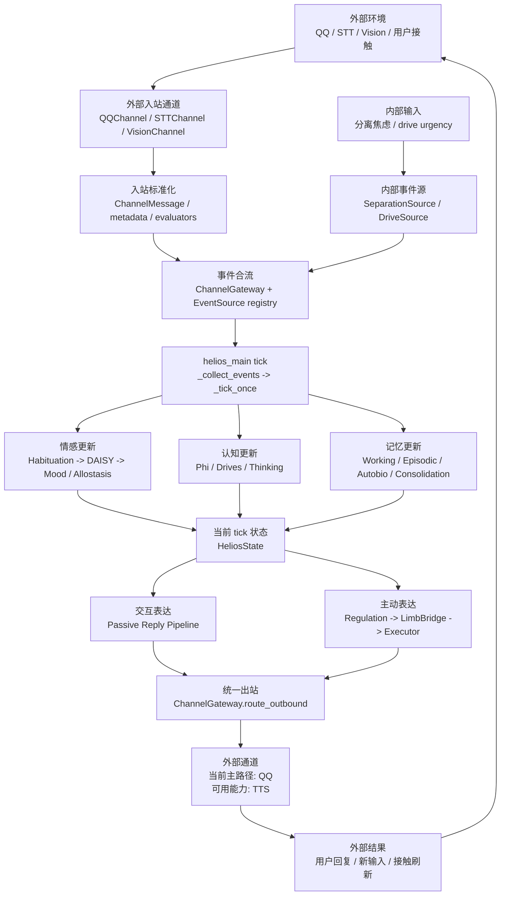

# Helios 运行闭环概览图

> Status: Active
> Role: 从整体层面展示当前实现中的持续运行闭环
> Source of truth: `helios_main.py` 与 `helios_io/` 当前实现

相关图：

- `research/diagrams/tick_runtime_flow.zh-CN.md`
- `research/diagrams/tick_ingress_egress_sequence.zh-CN.md`

这张图仍然是概览，但已经把当前代码里最关键的控制点显式画出来：外部入站路径、内部输入路径、事件合流、单 tick 内部状态更新、被动回复和主动行为两条分支、以及统一出站口。

这里的“内部输入”不是抽象概念，而是当前代码里已经落地的两条 EventSource 路径：`SeparationSource` 根据 separation hours 产出 `PANIC`，`DriveSource` 根据当前 dominant drive 产出 Panksepp trigger。若你要看对象级别的调用顺序，不要停在这张概览图，继续看 `tick_ingress_egress_sequence.zh-CN.md`。当前实现里，QQ 仍是主出站路径，TTS 是已接入但非默认主路径的能力面。
