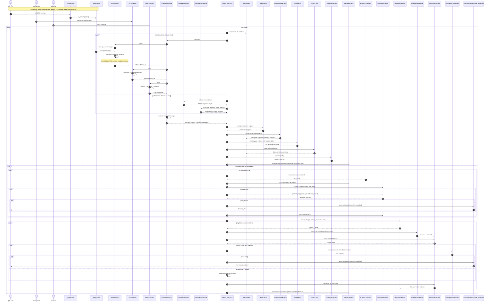

# Helios Tick Ingress and Egress Sequence

> Status: Active
> Role: show object-level ingress enrichment, main-loop handling, and egress paths
> Source of truth: `helios_main.py`, `channel_gateway.py`, `qq_channel.py`, `response_pipeline.py`, `regulation.py`, `limb.py`

Related diagrams:

- `research/diagrams/runtime_loop_overview.en.md`
- `research/diagrams/tick_runtime_flow.en.md`

Reading priority: external input is first standardized into `ChannelMessage`; passive replies and active behaviors are separate paths; the stable primary outbound path is still QQ.
