# Helios Single-Tick Refined Runtime Flow

> Status: Active
> Role: show the main data flow inside one tick from ingress to egress
> Source of truth: current `Helios._tick_once()` and `_collect_events()` implementation

Related diagrams:

- `research/diagrams/runtime_loop_overview.en.md`
- `research/diagrams/tick_ingress_egress_sequence.en.md`

```mermaid
flowchart TD
    subgraph ING[Ingress and event convergence]
        IN[External ingress\nQQ / STT / Vision]
        CH[Channel adapters\nQQChannel / STTChannel / VisionChannel]
        META[Message enrichment\nevent_triggers / sec_result / cognitive_impact]
        ISRC[Internal event sources\nSeparation / DriveSource]
        COL[_collect_events\nmerged_triggers + pending_messages]
        IN --> CH --> META --> COL
        ISRC --> COL
    end

    subgraph CORE[Per-tick internal state update]
        HAB[Habituation\nnovelty factor]
        DAISY[DAISY affect cycle\npanksepp / valence / arousal / dominant]
        PHI[Phi / ICRI aggregation\nimpact + affect + ignition + self-model + DMN]
        NEURO[Neurochem tick\noptional modulators]
        PERS[Personality drift\nadapt_from_snapshot]
        DRV[DriveOracle\nHeliosSnapshot -> drive vector]
        THINK[Thinking integration\noptional thought + DMN feedback]
        MEMAUTO[Autobio write\n10-tick + threshold gated]
        MEMEPI[Episodic write\nsignificant-event gated]

        COL --> HAB --> DAISY --> PHI
        PHI --> NEURO --> PERS --> DRV --> THINK
        THINK --> MEMAUTO
        THINK --> MEMEPI
    end

    subgraph IO1[Message handling and passive reply]
        WKM[Working-memory hold\nmessage + sec_result]
        SEC[LLM SEC evaluation]
        DECIDE[should_reply]
        GEN[generate_reply\nhistory + memory + autobio + temperature]
        OUTPASS[route_outbound\nreply -> QQ]
    end

    subgraph IO2[Regulation and active behavior]
        REG[RegulationEngine.tick]
        BRIDGE[LimbDecisionBridge\nscore -> priority]
        EXEC[BehaviorExecutor\nqueue / current / complete]
        ACTION[_handle_action\nspeak_* / request / internal intents]
        SPEECH[_generate_speech\nLLM or fallback template]
        OUTACT[route_outbound\nactive text -> QQ]
    end

    subgraph MA[Maintenance]
        STAB[RSS stability check]
        CONS[consolidate\nlow-phi / pressure triggered]
        COMP[post-consolidation compression]
        PERSIST[periodic persistence]
    end

    MEMAUTO --> MSGCHK{messages this tick?}
    MEMEPI --> MSGCHK
    MSGCHK -- yes --> SEC --> WKM --> DECIDE
    DECIDE -- reply --> GEN --> OUTPASS --> REG
    DECIDE -- skip --> REG
    MSGCHK -- no --> REG

    REG --> BRIDGE --> EXEC --> ACTION
    ACTION -- speech action --> SPEECH --> OUTACT
    ACTION -- internal intent --> STAB
    OUTPASS --> STAB
    OUTACT --> STAB
    STAB --> CONS --> COMP --> PERSIST
```

Implementation constraints: `HeliosState` is created fresh each tick; `_collect_events()` yields both trigger flow and message flow; autobio, episodic, and working-memory writes are condition-gated rather than unconditional; passive replies and active behaviors share the formal egress path but are not the same decision branch.

If you want to verify how this happens at the object-call level, continue into `tick_ingress_egress_sequence.en.md`.
